# BalanceManagement-SurePay-26_1_4 — Visual Flow Diagrams

#### Process: BalanceManagement-SurePay/BusinessServices/Billing/BalanceManagement/Common/GetPrimaryMSISDN.process {: #balancemanagementsurepaybusinessservicesbillingbalancemanagementcommongetprimarymsisdnprocess }

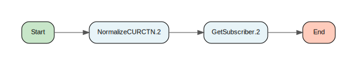

[↑ Back to Inventory](index.md)

#### Process: BalanceManagement-SurePay/BusinessServices/Billing/BalanceManagement/DebitCreditManagement/CancelReservedBalance/Interface/GetBusinessResources.process {: #balancemanagementsurepaybusinessservicesbillingbalancemanagementdebitcreditmanagementcancelreservedbalanceinterfacegetbusinessresourcesprocess }

[↑ Back to Inventory](index.md)

#### Process: BalanceManagement-SurePay/BusinessServices/Billing/BalanceManagement/DebitCreditManagement/CancelReservedBalance/Interface/JMSXMLServiceRequestReply.process {: #balancemanagementsurepaybusinessservicesbillingbalancemanagementdebitcreditmanagementcancelreservedbalanceinterfacejmsxmlservicerequestreplyprocess }

[↑ Back to Inventory](index.md)

#### Process: BalanceManagement-SurePay/BusinessServices/Billing/BalanceManagement/DebitCreditManagement/CancelReservedBalance/Interface/SOAPService.process {: #balancemanagementsurepaybusinessservicesbillingbalancemanagementdebitcreditmanagementcancelreservedbalanceinterfacesoapserviceprocess }

[↑ Back to Inventory](index.md)

#### Process: BalanceManagement-SurePay/BusinessServices/Billing/BalanceManagement/DebitCreditManagement/CancelReservedBalance/Sub/ExceptionCatcher.process {: #balancemanagementsurepaybusinessservicesbillingbalancemanagementdebitcreditmanagementcancelreservedbalancesubexceptioncatcherprocess }

[↑ Back to Inventory](index.md)

#### Process: BalanceManagement-SurePay/BusinessServices/Billing/BalanceManagement/DebitCreditManagement/CancelReservedBalance/Sub/MainProcess.process {: #balancemanagementsurepaybusinessservicesbillingbalancemanagementdebitcreditmanagementcancelreservedbalancesubmainprocessprocess }

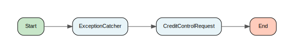

[↑ Back to Inventory](index.md)

#### Process: BalanceManagement-SurePay/BusinessServices/Billing/BalanceManagement/DebitCreditManagement/Common/LoadAdjustmentReasonCodesDebitBalance.process {: #balancemanagementsurepaybusinessservicesbillingbalancemanagementdebitcreditmanagementcommonloadadjustmentreasoncodesdebitbalanceprocess }

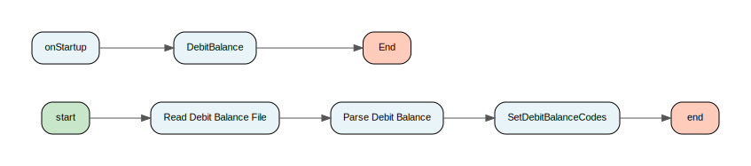

[↑ Back to Inventory](index.md)

#### Process: BalanceManagement-SurePay/BusinessServices/Billing/BalanceManagement/DebitCreditManagement/DebitBalance/Interface/GetBusinessResources.process {: #balancemanagementsurepaybusinessservicesbillingbalancemanagementdebitcreditmanagementdebitbalanceinterfacegetbusinessresourcesprocess }

[↑ Back to Inventory](index.md)

#### Process: BalanceManagement-SurePay/BusinessServices/Billing/BalanceManagement/DebitCreditManagement/DebitBalance/Interface/JMSXMLServiceRequestReply.process {: #balancemanagementsurepaybusinessservicesbillingbalancemanagementdebitcreditmanagementdebitbalanceinterfacejmsxmlservicerequestreplyprocess }

[↑ Back to Inventory](index.md)

#### Process: BalanceManagement-SurePay/BusinessServices/Billing/BalanceManagement/DebitCreditManagement/DebitBalance/Interface/SOAPService.process {: #balancemanagementsurepaybusinessservicesbillingbalancemanagementdebitcreditmanagementdebitbalanceinterfacesoapserviceprocess }

[↑ Back to Inventory](index.md)

#### Process: BalanceManagement-SurePay/BusinessServices/Billing/BalanceManagement/DebitCreditManagement/DebitBalance/Sub/ExceptionCatcher.process {: #balancemanagementsurepaybusinessservicesbillingbalancemanagementdebitcreditmanagementdebitbalancesubexceptioncatcherprocess }

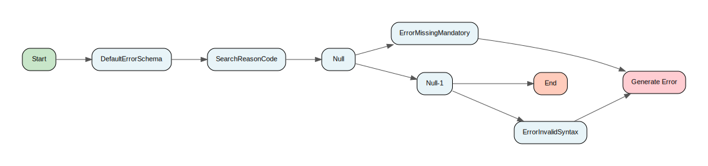

[↑ Back to Inventory](index.md)

#### Process: BalanceManagement-SurePay/BusinessServices/Billing/BalanceManagement/DebitCreditManagement/DebitBalance/Sub/MainProcess.process {: #balancemanagementsurepaybusinessservicesbillingbalancemanagementdebitcreditmanagementdebitbalancesubmainprocessprocess }

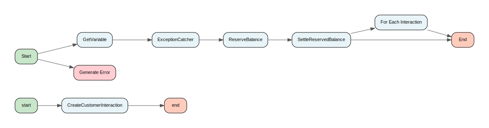

[↑ Back to Inventory](index.md)

#### Process: BalanceManagement-SurePay/BusinessServices/Billing/BalanceManagement/DebitCreditManagement/GetBalanceForBRM/Interface/JMSSOAPClient.process {: #balancemanagementsurepaybusinessservicesbillingbalancemanagementdebitcreditmanagementgetbalanceforbrminterfacejmssoapclientprocess }

[↑ Back to Inventory](index.md)

#### Process: BalanceManagement-SurePay/BusinessServices/Billing/BalanceManagement/DebitCreditManagement/GetBalanceForBRM/Interface/ParseSOAPResponse.process {: #balancemanagementsurepaybusinessservicesbillingbalancemanagementdebitcreditmanagementgetbalanceforbrminterfaceparsesoapresponseprocess }

[↑ Back to Inventory](index.md)

#### Process: BalanceManagement-SurePay/BusinessServices/Billing/BalanceManagement/DebitCreditManagement/GetBalance/Interface/COUK/JMSServiceRequestReply.2.process {: #balancemanagementsurepaybusinessservicesbillingbalancemanagementdebitcreditmanagementgetbalanceinterfacecoukjmsservicerequestreply2process }

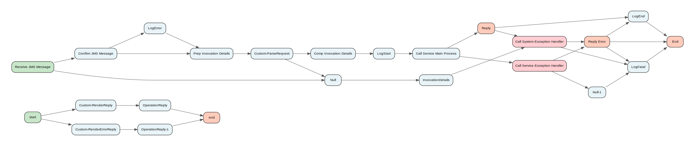

[↑ Back to Inventory](index.md)

#### Process: BalanceManagement-SurePay/BusinessServices/Billing/BalanceManagement/DebitCreditManagement/GetBalance/Interface/COUK/ParseRequest.2.process {: #balancemanagementsurepaybusinessservicesbillingbalancemanagementdebitcreditmanagementgetbalanceinterfacecoukparserequest2process }

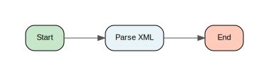

[↑ Back to Inventory](index.md)

#### Process: BalanceManagement-SurePay/BusinessServices/Billing/BalanceManagement/DebitCreditManagement/GetBalance/Interface/COUK/RenderErrorReply.2.process {: #balancemanagementsurepaybusinessservicesbillingbalancemanagementdebitcreditmanagementgetbalanceinterfacecoukrendererrorreply2process }

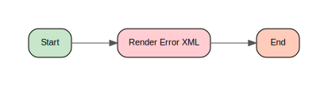

[↑ Back to Inventory](index.md)

#### Process: BalanceManagement-SurePay/BusinessServices/Billing/BalanceManagement/DebitCreditManagement/GetBalance/Interface/COUK/RenderReply.2.process {: #balancemanagementsurepaybusinessservicesbillingbalancemanagementdebitcreditmanagementgetbalanceinterfacecoukrenderreply2process }

[↑ Back to Inventory](index.md)

#### Process: BalanceManagement-SurePay/BusinessServices/Billing/BalanceManagement/DebitCreditManagement/GetBalance/Interface/GetBusinessResources.2.process {: #balancemanagementsurepaybusinessservicesbillingbalancemanagementdebitcreditmanagementgetbalanceinterfacegetbusinessresources2process }

[↑ Back to Inventory](index.md)

#### Process: BalanceManagement-SurePay/BusinessServices/Billing/BalanceManagement/DebitCreditManagement/GetBalance/Interface/GetBusinessResources.3.process {: #balancemanagementsurepaybusinessservicesbillingbalancemanagementdebitcreditmanagementgetbalanceinterfacegetbusinessresources3process }

[↑ Back to Inventory](index.md)

#### Process: BalanceManagement-SurePay/BusinessServices/Billing/BalanceManagement/DebitCreditManagement/GetBalance/Interface/JMSXMLServiceRequestReply.2.process {: #balancemanagementsurepaybusinessservicesbillingbalancemanagementdebitcreditmanagementgetbalanceinterfacejmsxmlservicerequestreply2process }

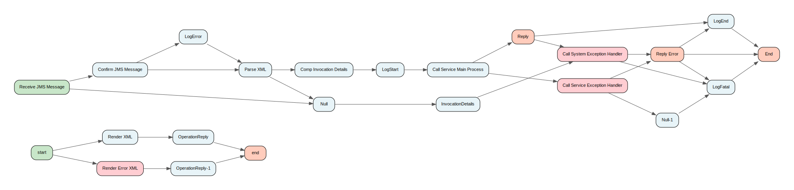

[↑ Back to Inventory](index.md)

#### Process: BalanceManagement-SurePay/BusinessServices/Billing/BalanceManagement/DebitCreditManagement/GetBalance/Interface/JSON/GetBusinessResources.3.process {: #balancemanagementsurepaybusinessservicesbillingbalancemanagementdebitcreditmanagementgetbalanceinterfacejsongetbusinessresources3process }

[↑ Back to Inventory](index.md)

#### Process: BalanceManagement-SurePay/BusinessServices/Billing/BalanceManagement/DebitCreditManagement/GetBalance/Interface/JSON/JMSServiceRequestReply.3.process {: #balancemanagementsurepaybusinessservicesbillingbalancemanagementdebitcreditmanagementgetbalanceinterfacejsonjmsservicerequestreply3process }

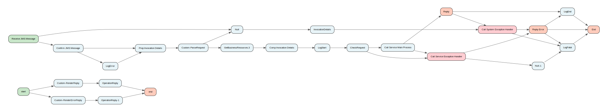

[↑ Back to Inventory](index.md)

#### Process: BalanceManagement-SurePay/BusinessServices/Billing/BalanceManagement/DebitCreditManagement/GetBalance/Interface/JSON/ParseRequest.3.process {: #balancemanagementsurepaybusinessservicesbillingbalancemanagementdebitcreditmanagementgetbalanceinterfacejsonparserequest3process }

[↑ Back to Inventory](index.md)

#### Process: BalanceManagement-SurePay/BusinessServices/Billing/BalanceManagement/DebitCreditManagement/GetBalance/Interface/JSON/RenderErrorReply.3.process {: #balancemanagementsurepaybusinessservicesbillingbalancemanagementdebitcreditmanagementgetbalanceinterfacejsonrendererrorreply3process }

[↑ Back to Inventory](index.md)

#### Process: BalanceManagement-SurePay/BusinessServices/Billing/BalanceManagement/DebitCreditManagement/GetBalance/Interface/JSON/RenderReply.3.process {: #balancemanagementsurepaybusinessservicesbillingbalancemanagementdebitcreditmanagementgetbalanceinterfacejsonrenderreply3process }

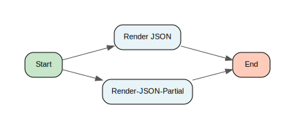

[↑ Back to Inventory](index.md)

#### Process: BalanceManagement-SurePay/BusinessServices/Billing/BalanceManagement/DebitCreditManagement/GetBalance/Interface/SOAPService.2.process {: #balancemanagementsurepaybusinessservicesbillingbalancemanagementdebitcreditmanagementgetbalanceinterfacesoapservice2process }

[↑ Back to Inventory](index.md)

#### Process: BalanceManagement-SurePay/BusinessServices/Billing/BalanceManagement/DebitCreditManagement/GetBalance/Interface/SOAPService.3.process {: #balancemanagementsurepaybusinessservicesbillingbalancemanagementdebitcreditmanagementgetbalanceinterfacesoapservice3process }

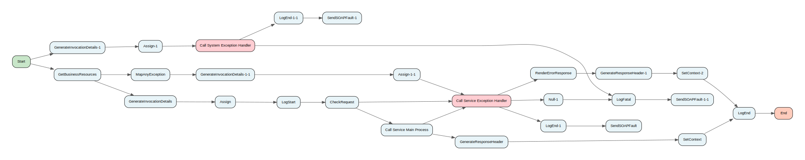

[↑ Back to Inventory](index.md)

#### Process: BalanceManagement-SurePay/BusinessServices/Billing/BalanceManagement/DebitCreditManagement/GetBalance/Sub/BusinessLogic.process {: #balancemanagementsurepaybusinessservicesbillingbalancemanagementdebitcreditmanagementgetbalancesubbusinesslogicprocess }

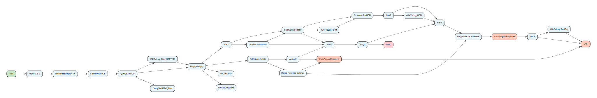

[↑ Back to Inventory](index.md)

#### Process: BalanceManagement-SurePay/BusinessServices/Billing/BalanceManagement/DebitCreditManagement/GetBalance/Sub/FLNBusinessLogic.process {: #balancemanagementsurepaybusinessservicesbillingbalancemanagementdebitcreditmanagementgetbalancesubflnbusinesslogicprocess }

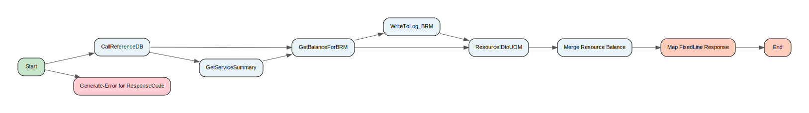

[↑ Back to Inventory](index.md)

#### Process: BalanceManagement-SurePay/BusinessServices/Billing/BalanceManagement/DebitCreditManagement/GetBalance/Sub/GetBalance.process {: #balancemanagementsurepaybusinessservicesbillingbalancemanagementdebitcreditmanagementgetbalancesubgetbalanceprocess }

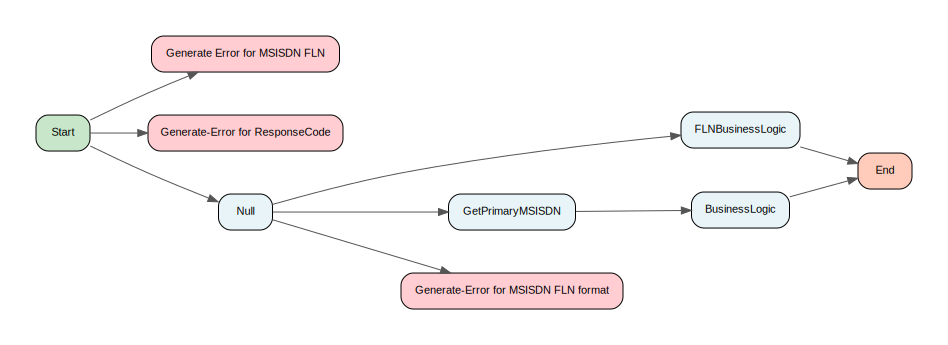

[↑ Back to Inventory](index.md)

#### Process: BalanceManagement-SurePay/BusinessServices/Billing/BalanceManagement/DebitCreditManagement/GetBalance/Sub/GetPrimaryMSISDN.process {: #balancemanagementsurepaybusinessservicesbillingbalancemanagementdebitcreditmanagementgetbalancesubgetprimarymsisdnprocess }

[↑ Back to Inventory](index.md)

#### Process: BalanceManagement-SurePay/BusinessServices/Billing/BalanceManagement/DebitCreditManagement/GetBalance/Sub/MainProcess.2.process {: #balancemanagementsurepaybusinessservicesbillingbalancemanagementdebitcreditmanagementgetbalancesubmainprocess2process }

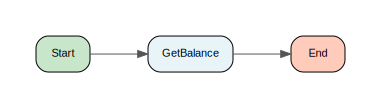

[↑ Back to Inventory](index.md)

#### Process: BalanceManagement-SurePay/BusinessServices/Billing/BalanceManagement/DebitCreditManagement/GetBalance/Sub/MainProcess.3.process {: #balancemanagementsurepaybusinessservicesbillingbalancemanagementdebitcreditmanagementgetbalancesubmainprocess3process }

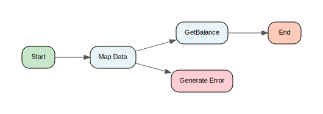

[↑ Back to Inventory](index.md)

#### Process: BalanceManagement-SurePay/BusinessServices/Billing/BalanceManagement/DebitCreditManagement/GetBalance/Sub/ResourceIDtoUOM.process {: #balancemanagementsurepaybusinessservicesbillingbalancemanagementdebitcreditmanagementgetbalancesubresourceidtouomprocess }

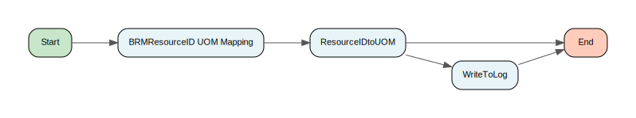

[↑ Back to Inventory](index.md)

#### Process: BalanceManagement-SurePay/BusinessServices/Billing/BalanceManagement/DebitCreditManagement/ReserveBalance/Interface/COUK/JMSServiceRequestReply.process {: #balancemanagementsurepaybusinessservicesbillingbalancemanagementdebitcreditmanagementreservebalanceinterfacecoukjmsservicerequestreplyprocess }

[↑ Back to Inventory](index.md)

#### Process: BalanceManagement-SurePay/BusinessServices/Billing/BalanceManagement/DebitCreditManagement/ReserveBalance/Interface/COUK/ParseRequest.process {: #balancemanagementsurepaybusinessservicesbillingbalancemanagementdebitcreditmanagementreservebalanceinterfacecoukparserequestprocess }

[↑ Back to Inventory](index.md)

#### Process: BalanceManagement-SurePay/BusinessServices/Billing/BalanceManagement/DebitCreditManagement/ReserveBalance/Interface/COUK/RenderErrorReply.process {: #balancemanagementsurepaybusinessservicesbillingbalancemanagementdebitcreditmanagementreservebalanceinterfacecoukrendererrorreplyprocess }

[↑ Back to Inventory](index.md)

#### Process: BalanceManagement-SurePay/BusinessServices/Billing/BalanceManagement/DebitCreditManagement/ReserveBalance/Interface/COUK/RenderReply.process {: #balancemanagementsurepaybusinessservicesbillingbalancemanagementdebitcreditmanagementreservebalanceinterfacecoukrenderreplyprocess }

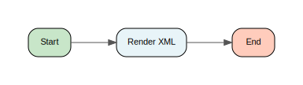

[↑ Back to Inventory](index.md)

#### Process: BalanceManagement-SurePay/BusinessServices/Billing/BalanceManagement/DebitCreditManagement/ReserveBalance/Interface/GetBusinessResources.process {: #balancemanagementsurepaybusinessservicesbillingbalancemanagementdebitcreditmanagementreservebalanceinterfacegetbusinessresourcesprocess }

[↑ Back to Inventory](index.md)

#### Process: BalanceManagement-SurePay/BusinessServices/Billing/BalanceManagement/DebitCreditManagement/ReserveBalance/Interface/JMSXMLServiceRequestReply.process {: #balancemanagementsurepaybusinessservicesbillingbalancemanagementdebitcreditmanagementreservebalanceinterfacejmsxmlservicerequestreplyprocess }

[↑ Back to Inventory](index.md)

#### Process: BalanceManagement-SurePay/BusinessServices/Billing/BalanceManagement/DebitCreditManagement/ReserveBalance/Interface/JSON/JMSServiceRequestReply-JSON.process {: #balancemanagementsurepaybusinessservicesbillingbalancemanagementdebitcreditmanagementreservebalanceinterfacejsonjmsservicerequestreplyjsonprocess }

[↑ Back to Inventory](index.md)

#### Process: BalanceManagement-SurePay/BusinessServices/Billing/BalanceManagement/DebitCreditManagement/ReserveBalance/Interface/JSON/ParseRequest.process {: #balancemanagementsurepaybusinessservicesbillingbalancemanagementdebitcreditmanagementreservebalanceinterfacejsonparserequestprocess }

[↑ Back to Inventory](index.md)

#### Process: BalanceManagement-SurePay/BusinessServices/Billing/BalanceManagement/DebitCreditManagement/ReserveBalance/Interface/JSON/RenderErrorReply.process {: #balancemanagementsurepaybusinessservicesbillingbalancemanagementdebitcreditmanagementreservebalanceinterfacejsonrendererrorreplyprocess }

[↑ Back to Inventory](index.md)

#### Process: BalanceManagement-SurePay/BusinessServices/Billing/BalanceManagement/DebitCreditManagement/ReserveBalance/Interface/JSON/RenderReply.process {: #balancemanagementsurepaybusinessservicesbillingbalancemanagementdebitcreditmanagementreservebalanceinterfacejsonrenderreplyprocess }

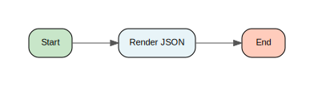

[↑ Back to Inventory](index.md)

#### Process: BalanceManagement-SurePay/BusinessServices/Billing/BalanceManagement/DebitCreditManagement/ReserveBalance/Interface/SOAPService.process {: #balancemanagementsurepaybusinessservicesbillingbalancemanagementdebitcreditmanagementreservebalanceinterfacesoapserviceprocess }

[↑ Back to Inventory](index.md)

#### Process: BalanceManagement-SurePay/BusinessServices/Billing/BalanceManagement/DebitCreditManagement/ReserveBalance/Sub/ExceptionCatcher.process {: #balancemanagementsurepaybusinessservicesbillingbalancemanagementdebitcreditmanagementreservebalancesubexceptioncatcherprocess }

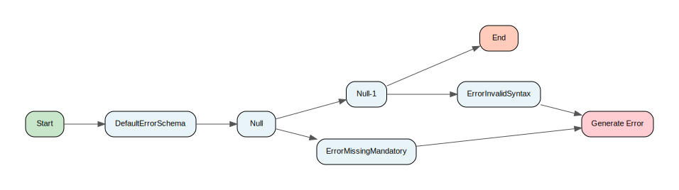

[↑ Back to Inventory](index.md)

#### Process: BalanceManagement-SurePay/BusinessServices/Billing/BalanceManagement/DebitCreditManagement/ReserveBalance/Sub/MainProcess.process {: #balancemanagementsurepaybusinessservicesbillingbalancemanagementdebitcreditmanagementreservebalancesubmainprocessprocess }

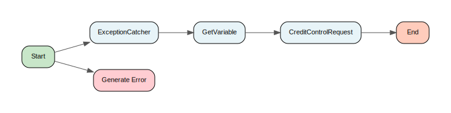

[↑ Back to Inventory](index.md)

#### Process: BalanceManagement-SurePay/BusinessServices/Billing/BalanceManagement/DebitCreditManagement/SettleReservedBalance/Interface/GetBusinessResources.process {: #balancemanagementsurepaybusinessservicesbillingbalancemanagementdebitcreditmanagementsettlereservedbalanceinterfacegetbusinessresourcesprocess }

[↑ Back to Inventory](index.md)

#### Process: BalanceManagement-SurePay/BusinessServices/Billing/BalanceManagement/DebitCreditManagement/SettleReservedBalance/Interface/JMSXMLServiceRequestReply.process {: #balancemanagementsurepaybusinessservicesbillingbalancemanagementdebitcreditmanagementsettlereservedbalanceinterfacejmsxmlservicerequestreplyprocess }

[↑ Back to Inventory](index.md)

#### Process: BalanceManagement-SurePay/BusinessServices/Billing/BalanceManagement/DebitCreditManagement/SettleReservedBalance/Interface/JSON/JMSServiceRequestReply-JSON.process {: #balancemanagementsurepaybusinessservicesbillingbalancemanagementdebitcreditmanagementsettlereservedbalanceinterfacejsonjmsservicerequestreplyjsonprocess }

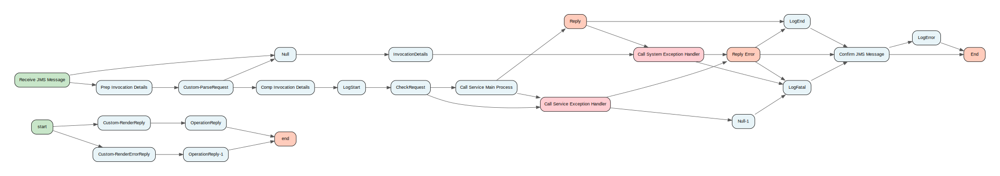

[↑ Back to Inventory](index.md)

#### Process: BalanceManagement-SurePay/BusinessServices/Billing/BalanceManagement/DebitCreditManagement/SettleReservedBalance/Interface/JSON/ParseRequest.process {: #balancemanagementsurepaybusinessservicesbillingbalancemanagementdebitcreditmanagementsettlereservedbalanceinterfacejsonparserequestprocess }

[↑ Back to Inventory](index.md)

#### Process: BalanceManagement-SurePay/BusinessServices/Billing/BalanceManagement/DebitCreditManagement/SettleReservedBalance/Interface/JSON/RenderErrorReply.process {: #balancemanagementsurepaybusinessservicesbillingbalancemanagementdebitcreditmanagementsettlereservedbalanceinterfacejsonrendererrorreplyprocess }

[↑ Back to Inventory](index.md)

#### Process: BalanceManagement-SurePay/BusinessServices/Billing/BalanceManagement/DebitCreditManagement/SettleReservedBalance/Interface/JSON/RenderReply.process {: #balancemanagementsurepaybusinessservicesbillingbalancemanagementdebitcreditmanagementsettlereservedbalanceinterfacejsonrenderreplyprocess }

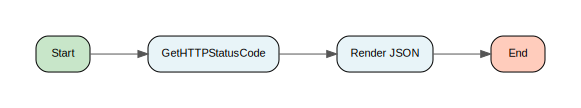

[↑ Back to Inventory](index.md)

#### Process: BalanceManagement-SurePay/BusinessServices/Billing/BalanceManagement/DebitCreditManagement/SettleReservedBalance/Interface/SOAPService.process {: #balancemanagementsurepaybusinessservicesbillingbalancemanagementdebitcreditmanagementsettlereservedbalanceinterfacesoapserviceprocess }

[↑ Back to Inventory](index.md)

#### Process: BalanceManagement-SurePay/BusinessServices/Billing/BalanceManagement/DebitCreditManagement/SettleReservedBalance/Sub/ExceptionCatcher.process {: #balancemanagementsurepaybusinessservicesbillingbalancemanagementdebitcreditmanagementsettlereservedbalancesubexceptioncatcherprocess }

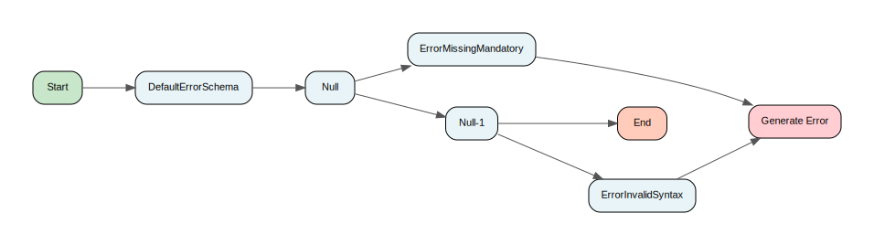

[↑ Back to Inventory](index.md)

#### Process: BalanceManagement-SurePay/BusinessServices/Billing/BalanceManagement/DebitCreditManagement/SettleReservedBalance/Sub/MainProcess.process {: #balancemanagementsurepaybusinessservicesbillingbalancemanagementdebitcreditmanagementsettlereservedbalancesubmainprocessprocess }

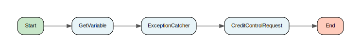

[↑ Back to Inventory](index.md)

#### Process: BalanceManagement-SurePay/BusinessServices/Billing/BalanceManagement/ThresholdsManagement/GetOutOfBundleCharges/Interface/GetBusinessResources.process {: #balancemanagementsurepaybusinessservicesbillingbalancemanagementthresholdsmanagementgetoutofbundlechargesinterfacegetbusinessresourcesprocess }

[↑ Back to Inventory](index.md)

#### Process: BalanceManagement-SurePay/BusinessServices/Billing/BalanceManagement/ThresholdsManagement/GetOutOfBundleCharges/Interface/JSON/JMSServiceRequestReply.process {: #balancemanagementsurepaybusinessservicesbillingbalancemanagementthresholdsmanagementgetoutofbundlechargesinterfacejsonjmsservicerequestreplyprocess }

[↑ Back to Inventory](index.md)

#### Process: BalanceManagement-SurePay/BusinessServices/Billing/BalanceManagement/ThresholdsManagement/GetOutOfBundleCharges/Interface/JSON/ParseRequest.process {: #balancemanagementsurepaybusinessservicesbillingbalancemanagementthresholdsmanagementgetoutofbundlechargesinterfacejsonparserequestprocess }

[↑ Back to Inventory](index.md)

#### Process: BalanceManagement-SurePay/BusinessServices/Billing/BalanceManagement/ThresholdsManagement/GetOutOfBundleCharges/Interface/JSON/RenderErrorReply.process {: #balancemanagementsurepaybusinessservicesbillingbalancemanagementthresholdsmanagementgetoutofbundlechargesinterfacejsonrendererrorreplyprocess }

[↑ Back to Inventory](index.md)

#### Process: BalanceManagement-SurePay/BusinessServices/Billing/BalanceManagement/ThresholdsManagement/GetOutOfBundleCharges/Interface/JSON/RenderReply.process {: #balancemanagementsurepaybusinessservicesbillingbalancemanagementthresholdsmanagementgetoutofbundlechargesinterfacejsonrenderreplyprocess }

[↑ Back to Inventory](index.md)

#### Process: BalanceManagement-SurePay/BusinessServices/Billing/BalanceManagement/ThresholdsManagement/GetOutOfBundleCharges/Interface/SOAPService.process {: #balancemanagementsurepaybusinessservicesbillingbalancemanagementthresholdsmanagementgetoutofbundlechargesinterfacesoapserviceprocess }

[↑ Back to Inventory](index.md)

#### Process: BalanceManagement-SurePay/BusinessServices/Billing/BalanceManagement/ThresholdsManagement/GetOutOfBundleCharges/Sub/GetFilteredProductDetails.process {: #balancemanagementsurepaybusinessservicesbillingbalancemanagementthresholdsmanagementgetoutofbundlechargessubgetfilteredproductdetailsprocess }

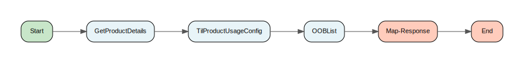

[↑ Back to Inventory](index.md)

#### Process: BalanceManagement-SurePay/BusinessServices/Billing/BalanceManagement/ThresholdsManagement/GetOutOfBundleCharges/Sub/GetOutOfBundleCharges.process {: #balancemanagementsurepaybusinessservicesbillingbalancemanagementthresholdsmanagementgetoutofbundlechargessubgetoutofbundlechargesprocess }

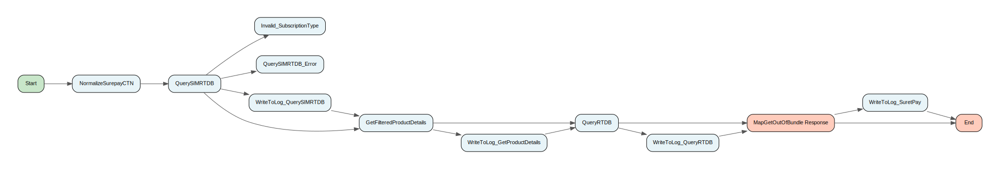

[↑ Back to Inventory](index.md)

#### Process: BalanceManagement-SurePay/BusinessServices/Billing/BalanceManagement/ThresholdsManagement/GetOutOfBundleCharges/Sub/MainProcess.process {: #balancemanagementsurepaybusinessservicesbillingbalancemanagementthresholdsmanagementgetoutofbundlechargessubmainprocessprocess }

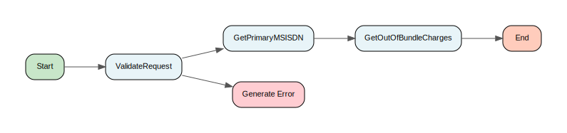

[↑ Back to Inventory](index.md)

#### Process: BalanceManagement-SurePay/BusinessServices/Common/Encryption/Algorithms/Blowfish.process {: #balancemanagementsurepaybusinessservicescommonencryptionalgorithmsblowfishprocess }

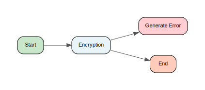

[↑ Back to Inventory](index.md)

#### Process: BalanceManagement-SurePay/BusinessServices/Common/Encryption/DecryptField_Blowfish.process {: #balancemanagementsurepaybusinessservicescommonencryptiondecryptfieldblowfishprocess }

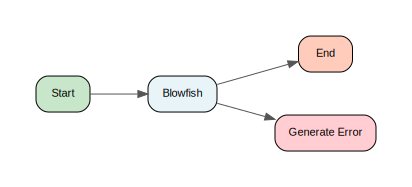

[↑ Back to Inventory](index.md)

#### Process: BalanceManagement-SurePay/BusinessServices/Common/Encryption/DecryptFields_Blowfish.process {: #balancemanagementsurepaybusinessservicescommonencryptiondecryptfieldsblowfishprocess }

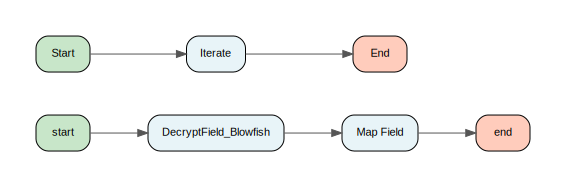

[↑ Back to Inventory](index.md)

#### Process: BalanceManagement-SurePay/BusinessServices/Common/ReferenceData/GetProductClassLoad.process {: #balancemanagementsurepaybusinessservicescommonreferencedatagetproductclassloadprocess }

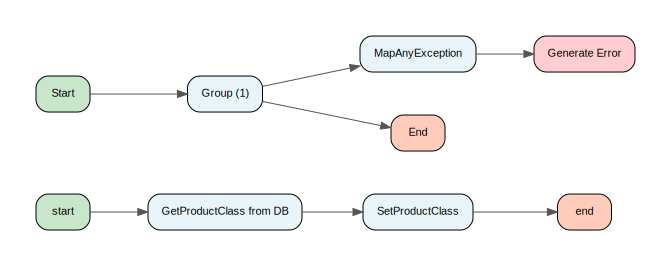

[↑ Back to Inventory](index.md)

#### Process: BalanceManagement-SurePay/BusinessServices/Common/ReferenceData/GetTilProductUsageConfig.process {: #balancemanagementsurepaybusinessservicescommonreferencedatagettilproductusageconfigprocess }

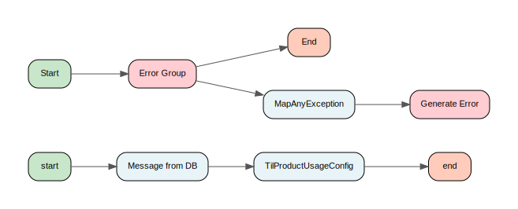

[↑ Back to Inventory](index.md)

#### Process: BalanceManagement-SurePay/BusinessServices/Common/ReferenceData/LoadProductClass.process {: #balancemanagementsurepaybusinessservicescommonreferencedataloadproductclassprocess }

[↑ Back to Inventory](index.md)

#### Process: BalanceManagement-SurePay/BusinessServices/Common/ReferenceData/LoadTilProductUsageConfig.process {: #balancemanagementsurepaybusinessservicescommonreferencedataloadtilproductusageconfigprocess }

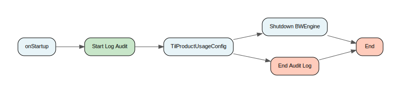

[↑ Back to Inventory](index.md)

#### Process: BalanceManagement-SurePay/BusinessServices/Common/ReferenceData/Private/LoadProductCatalouge.process {: #balancemanagementsurepaybusinessservicescommonreferencedataprivateloadproductcatalougeprocess }

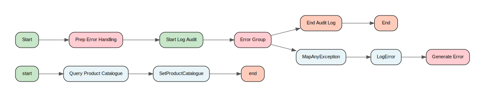

[↑ Back to Inventory](index.md)

#### Process: BalanceManagement-SurePay/BusinessServices/Common/ReferenceData/Private/LoadUOMCodesForResourceIds.process {: #balancemanagementsurepaybusinessservicescommonreferencedataprivateloaduomcodesforresourceidsprocess }

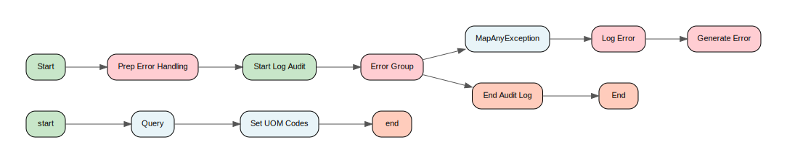

[↑ Back to Inventory](index.md)

#### Process: BalanceManagement-SurePay/BusinessServices/Common/ReferenceData/Public/GetProductCatalouge.process {: #balancemanagementsurepaybusinessservicescommonreferencedatapublicgetproductcatalougeprocess }

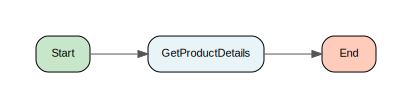

[↑ Back to Inventory](index.md)

#### Process: BalanceManagement-SurePay/BusinessServices/Common/ReferenceData/Public/JMSXMLProductCatalogueTopic.process {: #balancemanagementsurepaybusinessservicescommonreferencedatapublicjmsxmlproductcataloguetopicprocess }

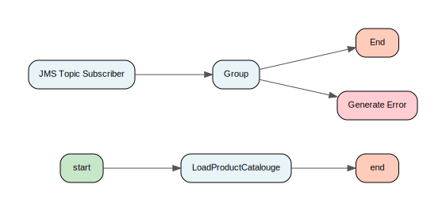

[↑ Back to Inventory](index.md)

#### Process: BalanceManagement-SurePay/BusinessServices/Common/ReferenceData/Public/LoadProductCatalouge.process {: #balancemanagementsurepaybusinessservicescommonreferencedatapublicloadproductcatalougeprocess }

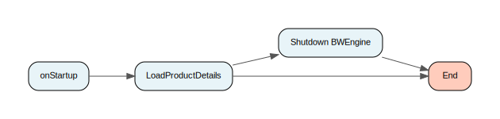

[↑ Back to Inventory](index.md)

#### Process: BalanceManagement-SurePay/BusinessServices/Common/ReferenceData/Public/LoadUOMCodesForResourceIds.process {: #balancemanagementsurepaybusinessservicescommonreferencedatapublicloaduomcodesforresourceidsprocess }

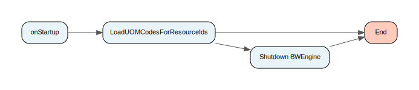

[↑ Back to Inventory](index.md)

#### Process: BalanceManagement-SurePay/BusinessServices/Common/ReferenceData/Public/ProductCatalogueTimer.process {: #balancemanagementsurepaybusinessservicescommonreferencedatapublicproductcataloguetimerprocess }

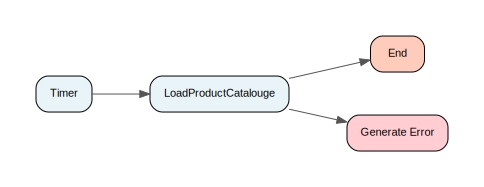

[↑ Back to Inventory](index.md)

#### Process: BalanceManagement-SurePay/BusinessServices/CustomerManagement/CustomerProfileManagement/CustomerPersonalInformationManagement/CreateCustomerInteraction/Interface/JMSSOAPClient.process {: #balancemanagementsurepaybusinessservicescustomermanagementcustomerprofilemanagementcustomerpersonalinformationmanagementcreatecustomerinteractioninterfacejmssoapclientprocess }

[↑ Back to Inventory](index.md)

#### Process: BalanceManagement-SurePay/BusinessServices/CustomerManagement/CustomerProfileManagement/CustomerPersonalInformationManagement/CreateCustomerInteraction/Interface/ParseSOAPResponse.process {: #balancemanagementsurepaybusinessservicescustomermanagementcustomerprofilemanagementcustomerpersonalinformationmanagementcreatecustomerinteractioninterfaceparsesoapresponseprocess }

[↑ Back to Inventory](index.md)

#### Process: BalanceManagement-SurePay/BusinessServices/EnterpriseManagement/SecurityManagement/ValidateResource/Interface/JMSSOAPClient.process {: #balancemanagementsurepaybusinessservicesenterprisemanagementsecuritymanagementvalidateresourceinterfacejmssoapclientprocess }

[↑ Back to Inventory](index.md)

#### Process: BalanceManagement-SurePay/BusinessServices/EnterpriseManagement/SecurityManagement/ValidateResource/Interface/ParseSOAPResponse.process {: #balancemanagementsurepaybusinessservicesenterprisemanagementsecuritymanagementvalidateresourceinterfaceparsesoapresponseprocess }

[↑ Back to Inventory](index.md)

#### Process: BalanceManagement-SurePay/BusinessServices/ProvisioningAndFulfilment/SubscriptionManagement/SubscriptionLifecycleManagement/GetServiceSummary/Interface/JMSSOAPClient.process {: #balancemanagementsurepaybusinessservicesprovisioningandfulfilmentsubscriptionmanagementsubscriptionlifecyclemanagementgetservicesummaryinterfacejmssoapclientprocess }

[↑ Back to Inventory](index.md)

#### Process: BalanceManagement-SurePay/BusinessServices/ProvisioningAndFulfilment/SubscriptionManagement/SubscriptionLifecycleManagement/GetServiceSummary/Interface/ParseSOAPResponse.process {: #balancemanagementsurepaybusinessservicesprovisioningandfulfilmentsubscriptionmanagementsubscriptionlifecyclemanagementgetservicesummaryinterfaceparsesoapresponseprocess }

[↑ Back to Inventory](index.md)

#### Process: BalanceManagement-SurePay/ConnectivityServices/Common/Private/RenderBackEndError.process {: #balancemanagementsurepayconnectivityservicescommonprivaterenderbackenderrorprocess }

[↑ Back to Inventory](index.md)

#### Process: BalanceManagement-SurePay/ConnectivityServices/CUR/ErrorHandling/Private/GenerateCURError.process {: #balancemanagementsurepayconnectivityservicescurerrorhandlingprivategeneratecurerrorprocess }

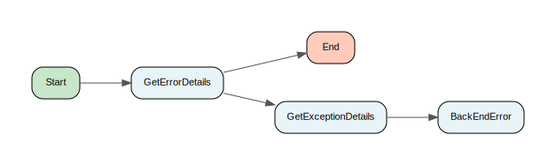

[↑ Back to Inventory](index.md)

#### Process: BalanceManagement-SurePay/ConnectivityServices/CUR/ErrorHandling/Private/ProcessCURError.process {: #balancemanagementsurepayconnectivityservicescurerrorhandlingprivateprocesscurerrorprocess }

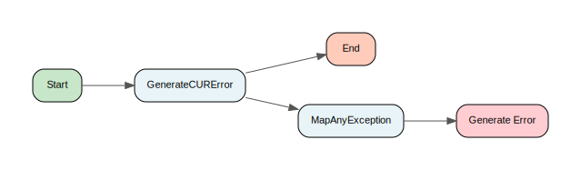

[↑ Back to Inventory](index.md)

#### Process: BalanceManagement-SurePay/ConnectivityServices/CUR/Private/ParseResponse.process {: #balancemanagementsurepayconnectivityservicescurprivateparseresponseprocess }

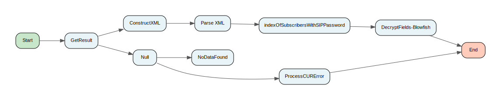

[↑ Back to Inventory](index.md)

#### Process: BalanceManagement-SurePay/ConnectivityServices/CUR/Public/GetSubscriber.2.process {: #balancemanagementsurepayconnectivityservicescurpublicgetsubscriber2process }

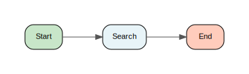

[↑ Back to Inventory](index.md)

#### Process: BalanceManagement-SurePay/ConnectivityServices/CUR/Public/NormalizeCURCTN.2.process {: #balancemanagementsurepayconnectivityservicescurpublicnormalizecurctn2process }

[↑ Back to Inventory](index.md)

#### Process: BalanceManagement-SurePay/ConnectivityServices/CUR/Public/Search.process {: #balancemanagementsurepayconnectivityservicescurpublicsearchprocess }

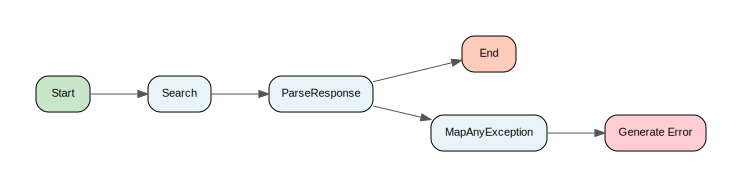

[↑ Back to Inventory](index.md)

#### Process: BalanceManagement-SurePay/ConnectivityServices/Diameter/Private/LoadErrorCodes.process {: #balancemanagementsurepayconnectivityservicesdiameterprivateloaderrorcodesprocess }

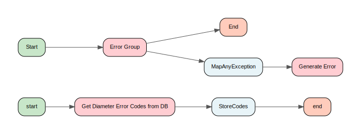

[↑ Back to Inventory](index.md)

#### Process: BalanceManagement-SurePay/ConnectivityServices/Diameter/Private/SendRequestOneGroup.process {: #balancemanagementsurepayconnectivityservicesdiameterprivatesendrequestonegroupprocess }

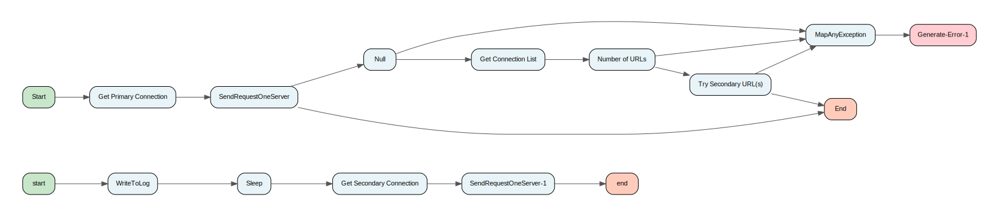

[↑ Back to Inventory](index.md)

#### Process: BalanceManagement-SurePay/ConnectivityServices/Diameter/Private/SendRequestOneServer.process {: #balancemanagementsurepayconnectivityservicesdiameterprivatesendrequestoneserverprocess }

[↑ Back to Inventory](index.md)

#### Process: BalanceManagement-SurePay/ConnectivityServices/Diameter/Private/SendRequest.process {: #balancemanagementsurepayconnectivityservicesdiameterprivatesendrequestprocess }

[↑ Back to Inventory](index.md)

#### Process: BalanceManagement-SurePay/ConnectivityServices/Surepay/Private/LoadAllSurepayErrorCodes.process {: #balancemanagementsurepayconnectivityservicessurepayprivateloadallsurepayerrorcodesprocess }

[↑ Back to Inventory](index.md)

#### Process: BalanceManagement-SurePay/ConnectivityServices/Surepay/Private/NormalizeSurepayCTNs.process {: #balancemanagementsurepayconnectivityservicessurepayprivatenormalizesurepayctnsprocess }

[↑ Back to Inventory](index.md)

#### Process: BalanceManagement-SurePay/ConnectivityServices/Surepay/Private/SendRequestOneGroup.process {: #balancemanagementsurepayconnectivityservicessurepayprivatesendrequestonegroupprocess }

[↑ Back to Inventory](index.md)

#### Process: BalanceManagement-SurePay/ConnectivityServices/Surepay/Private/SendRequestOneServer.process {: #balancemanagementsurepayconnectivityservicessurepayprivatesendrequestoneserverprocess }

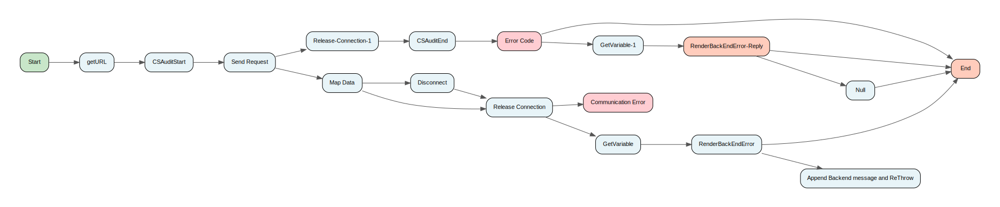

[↑ Back to Inventory](index.md)

#### Process: BalanceManagement-SurePay/ConnectivityServices/Surepay/Private/SendRequest.process {: #balancemanagementsurepayconnectivityservicessurepayprivatesendrequestprocess }

[↑ Back to Inventory](index.md)

#### Process: BalanceManagement-SurePay/ConnectivityServices/Surepay/Public/CreditControlRequest.process {: #balancemanagementsurepayconnectivityservicessurepaypubliccreditcontrolrequestprocess }

[↑ Back to Inventory](index.md)

#### Process: BalanceManagement-SurePay/ConnectivityServices/Surepay/Public/GetBalanceDetails/CombineList.process {: #balancemanagementsurepayconnectivityservicessurepaypublicgetbalancedetailscombinelistprocess }

[↑ Back to Inventory](index.md)

#### Process: BalanceManagement-SurePay/ConnectivityServices/Surepay/Public/GetBalanceDetails/GetAllowedUOMCodes.process {: #balancemanagementsurepayconnectivityservicessurepaypublicgetbalancedetailsgetalloweduomcodesprocess }

[↑ Back to Inventory](index.md)

#### Process: BalanceManagement-SurePay/ConnectivityServices/Surepay/Public/GetBalanceDetails/GetBalanceDetails.process {: #balancemanagementsurepayconnectivityservicessurepaypublicgetbalancedetailsgetbalancedetailsprocess }

[↑ Back to Inventory](index.md)

#### Process: BalanceManagement-SurePay/ConnectivityServices/Surepay/Public/GetBalanceDetails/QueryRTDB.process {: #balancemanagementsurepayconnectivityservicessurepaypublicgetbalancedetailsqueryrtdbprocess }

[↑ Back to Inventory](index.md)

#### Process: BalanceManagement-SurePay/ConnectivityServices/Surepay/Public/GetBalanceDetails/RefreshBalance.process {: #balancemanagementsurepayconnectivityservicessurepaypublicgetbalancedetailsrefreshbalanceprocess }

[↑ Back to Inventory](index.md)

#### Process: BalanceManagement-SurePay/ConnectivityServices/Surepay/Public/GetBalanceDetails/Sharer_Subprocess.process {: #balancemanagementsurepayconnectivityservicessurepaypublicgetbalancedetailssharersubprocessprocess }

[↑ Back to Inventory](index.md)

#### Process: BalanceManagement-SurePay/ConnectivityServices/Surepay/Public/LoadAllSurepayErrorCodes.process {: #balancemanagementsurepayconnectivityservicessurepaypublicloadallsurepayerrorcodesprocess }

[↑ Back to Inventory](index.md)

#### Process: BalanceManagement-SurePay/ConnectivityServices/Surepay/Public/NormalizeSurepayCTN.process {: #balancemanagementsurepayconnectivityservicessurepaypublicnormalizesurepayctnprocess }

[↑ Back to Inventory](index.md)

#### Process: BalanceManagement-SurePay/ConnectivityServices/Surepay/Public/QueryRTDB.process {: #balancemanagementsurepayconnectivityservicessurepaypublicqueryrtdbprocess }

[↑ Back to Inventory](index.md)

#### Process: BalanceManagement-SurePay/ConnectivityServices/Surepay/Public/QuerySIMRTDB.process {: #balancemanagementsurepayconnectivityservicessurepaypublicquerysimrtdbprocess }

[↑ Back to Inventory](index.md)

#### Process: BalanceManagement-SurePay/ConnectivityServices/Surepay/Public/ReloadAllSurepayErrorCodes.process {: #balancemanagementsurepayconnectivityservicessurepaypublicreloadallsurepayerrorcodesprocess }

[↑ Back to Inventory](index.md)

#### Process: BalanceManagement-SurePay/ConnectivityServices/Surepay/Public/RequestBalance.process {: #balancemanagementsurepayconnectivityservicessurepaypublicrequestbalanceprocess }

[↑ Back to Inventory](index.md)

#### Process: BalanceManagement-SurePay/ConnectivityServices/Surepay/Public/RequestGroupInfo.process {: #balancemanagementsurepayconnectivityservicessurepaypublicrequestgroupinfoprocess }

[↑ Back to Inventory](index.md)

#### Process: BalanceManagement-SurePay/UtilityServices/ExceptionHandling/Filtering/CVV2Filter.process {: #balancemanagementsurepayutilityservicesexceptionhandlingfilteringcvv2filterprocess }

[↑ Back to Inventory](index.md)

#### Process: BalanceManagement-SurePay/UtilityServices/ExceptionHandling/Filtering/ExceptionSchemaFilter.process {: #balancemanagementsurepayutilityservicesexceptionhandlingfilteringexceptionschemafilterprocess }

[↑ Back to Inventory](index.md)

#### Process: BalanceManagement-SurePay/UtilityServices/ExceptionHandling/Filtering/Security/CVV2Filter.process {: #balancemanagementsurepayutilityservicesexceptionhandlingfilteringsecuritycvv2filterprocess }

[↑ Back to Inventory](index.md)

#### Process: BalanceManagement-SurePay/UtilityServices/ExceptionHandling/Filtering/ServiceExceptionFilter.process {: #balancemanagementsurepayutilityservicesexceptionhandlingfilteringserviceexceptionfilterprocess }

[↑ Back to Inventory](index.md)

#### Process: BalanceManagement-SurePay/UtilityServices/ExceptionHandling/Filtering/SpecialExceptions/GetSpecialExceptionList.process {: #balancemanagementsurepayutilityservicesexceptionhandlingfilteringspecialexceptionsgetspecialexceptionlistprocess }

[↑ Back to Inventory](index.md)

#### Process: BalanceManagement-SurePay/UtilityServices/ExceptionHandling/Filtering/SpecialExceptions/TraceSpecialException.process {: #balancemanagementsurepayutilityservicesexceptionhandlingfilteringspecialexceptionstracespecialexceptionprocess }

[↑ Back to Inventory](index.md)

#### Process: BalanceManagement-SurePay/UtilityServices/ExceptionHandling/Filtering/SystemExceptionFilter.process {: #balancemanagementsurepayutilityservicesexceptionhandlingfilteringsystemexceptionfilterprocess }

[↑ Back to Inventory](index.md)

#### Process: BalanceManagement-SurePay/UtilityServices/ExceptionHandling/Interface/ServiceExceptionHandler.process {: #balancemanagementsurepayutilityservicesexceptionhandlinginterfaceserviceexceptionhandlerprocess }

[↑ Back to Inventory](index.md)

#### Process: BalanceManagement-SurePay/UtilityServices/ExceptionHandling/Interface/SystemExceptionHandler.process {: #balancemanagementsurepayutilityservicesexceptionhandlinginterfacesystemexceptionhandlerprocess }

[↑ Back to Inventory](index.md)

#### Process: BalanceManagement-SurePay/UtilityServices/ExceptionHandling/Private/GetHTTPStatusCode.process {: #balancemanagementsurepayutilityservicesexceptionhandlingprivategethttpstatuscodeprocess }

[↑ Back to Inventory](index.md)

#### Process: BalanceManagement-SurePay/UtilityServices/ExceptionHandling/Private/GetHTTPStatusCodes.process {: #balancemanagementsurepayutilityservicesexceptionhandlingprivategethttpstatuscodesprocess }

[↑ Back to Inventory](index.md)

#### Process: BalanceManagement-SurePay/UtilityServices/ExceptionHandling/Private/MapException.process {: #balancemanagementsurepayutilityservicesexceptionhandlingprivatemapexceptionprocess }

[↑ Back to Inventory](index.md)

#### Process: BalanceManagement-SurePay/UtilityServices/ExceptionHandling/Private/MapResultStatus.process {: #balancemanagementsurepayutilityservicesexceptionhandlingprivatemapresultstatusprocess }

[↑ Back to Inventory](index.md)

#### Process: BalanceManagement-SurePay/UtilityServices/ExceptionHandling/Public/LoadAllHTTPStatusCodes.process {: #balancemanagementsurepayutilityservicesexceptionhandlingpublicloadallhttpstatuscodesprocess }

[↑ Back to Inventory](index.md)

#### Process: BalanceManagement-SurePay/UtilityServices/ExceptionHandling/Public/MapAnyException.process {: #balancemanagementsurepayutilityservicesexceptionhandlingpublicmapanyexceptionprocess }

[↑ Back to Inventory](index.md)

#### Process: BalanceManagement-SurePay/UtilityServices/ExceptionHandling/ServiceExceptionHandler.process {: #balancemanagementsurepayutilityservicesexceptionhandlingserviceexceptionhandlerprocess }

[↑ Back to Inventory](index.md)

#### Process: BalanceManagement-SurePay/UtilityServices/ExceptionHandling/Shutdown BWEngine.process {: #balancemanagementsurepayutilityservicesexceptionhandlingshutdownbwengineprocess }

[↑ Back to Inventory](index.md)

#### Process: BalanceManagement-SurePay/UtilityServices/Interface/OperationReply.process {: #balancemanagementsurepayutilityservicesinterfaceoperationreplyprocess }

[↑ Back to Inventory](index.md)

#### Process: BalanceManagement-SurePay/UtilityServices/Interface/Private/JSON/CheckRequest.process {: #balancemanagementsurepayutilityservicesinterfaceprivatejsoncheckrequestprocess }

[↑ Back to Inventory](index.md)

#### Process: BalanceManagement-SurePay/UtilityServices/Interface/Private/PublishToRetryQueue.process {: #balancemanagementsurepayutilityservicesinterfaceprivatepublishtoretryqueueprocess }

[↑ Back to Inventory](index.md)

#### Process: BalanceManagement-SurePay/UtilityServices/Interface/Private/SOAP/CheckRequest.process {: #balancemanagementsurepayutilityservicesinterfaceprivatesoapcheckrequestprocess }

[↑ Back to Inventory](index.md)

#### Process: BalanceManagement-SurePay/UtilityServices/Interface/Private/SOAP/GenerateInvocationDetails.process {: #balancemanagementsurepayutilityservicesinterfaceprivatesoapgenerateinvocationdetailsprocess }

[↑ Back to Inventory](index.md)

#### Process: BalanceManagement-SurePay/UtilityServices/Interface/Private/SOAP/GenerateResponseHeader.process {: #balancemanagementsurepayutilityservicesinterfaceprivatesoapgenerateresponseheaderprocess }

[↑ Back to Inventory](index.md)

#### Process: BalanceManagement-SurePay/UtilityServices/Logging/LogEnd.process {: #balancemanagementsurepayutilityserviceslogginglogendprocess }

[↑ Back to Inventory](index.md)

#### Process: BalanceManagement-SurePay/UtilityServices/Logging/LogError.process {: #balancemanagementsurepayutilityserviceslogginglogerrorprocess }

[↑ Back to Inventory](index.md)

#### Process: BalanceManagement-SurePay/UtilityServices/Logging/LogFatal.process {: #balancemanagementsurepayutilityserviceslogginglogfatalprocess }

[↑ Back to Inventory](index.md)

#### Process: BalanceManagement-SurePay/UtilityServices/Logging/LogStart.process {: #balancemanagementsurepayutilityserviceslogginglogstartprocess }

[↑ Back to Inventory](index.md)

#### Process: BalanceManagement-SurePay/UtilityServices/Logging/Private/WriteToLog.process {: #balancemanagementsurepayutilityservicesloggingprivatewritetologprocess }

[↑ Back to Inventory](index.md)

#### Process: BalanceManagement-SurePay/UtilityServices/Logging/Public/CSAuditEnd.process {: #balancemanagementsurepayutilityservicesloggingpubliccsauditendprocess }

[↑ Back to Inventory](index.md)

#### Process: BalanceManagement-SurePay/UtilityServices/Logging/Public/CSAuditStart.process {: #balancemanagementsurepayutilityservicesloggingpubliccsauditstartprocess }

[↑ Back to Inventory](index.md)

#### Process: BalanceManagement-SurePay/UtilityServices/Logging/Public/WriteToLog.process {: #balancemanagementsurepayutilityservicesloggingpublicwritetologprocess }

[↑ Back to Inventory](index.md)

#### Process: BalanceManagement-SurePay/UtilityServices/Security/Tokens/Private/CheckRequest.process {: #balancemanagementsurepayutilityservicessecuritytokensprivatecheckrequestprocess }

[↑ Back to Inventory](index.md)

#### Process: BalanceManagement-SurePay/UtilityServices/Security/Tokens/Private/ExtractToken.process {: #balancemanagementsurepayutilityservicessecuritytokensprivateextracttokenprocess }

[↑ Back to Inventory](index.md)

#### Process: BalanceManagement-SurePay/UtilityServices/Security/Tokens/Private/LoadExpiration.process {: #balancemanagementsurepayutilityservicessecuritytokensprivateloadexpirationprocess }

[↑ Back to Inventory](index.md)

#### Process: BalanceManagement-SurePay/UtilityServices/Security/Tokens/Private/LoadOperationValidation.process {: #balancemanagementsurepayutilityservicessecuritytokensprivateloadoperationvalidationprocess }

[↑ Back to Inventory](index.md)

#### Process: BalanceManagement-SurePay/UtilityServices/Security/Tokens/Private/LoadPartnerBIDMapping.process {: #balancemanagementsurepayutilityservicessecuritytokensprivateloadpartnerbidmappingprocess }

[↑ Back to Inventory](index.md)

#### Process: BalanceManagement-SurePay/UtilityServices/Security/Tokens/Private/LoadPartnerOperations.process {: #balancemanagementsurepayutilityservicessecuritytokensprivateloadpartneroperationsprocess }

[↑ Back to Inventory](index.md)

#### Process: BalanceManagement-SurePay/UtilityServices/Security/Tokens/Private/RequestRequiresToken.process {: #balancemanagementsurepayutilityservicessecuritytokensprivaterequestrequirestokenprocess }

[↑ Back to Inventory](index.md)

#### Process: BalanceManagement-SurePay/UtilityServices/Security/Tokens/Private/ValidateResource.process {: #balancemanagementsurepayutilityservicessecuritytokensprivatevalidateresourceprocess }

[↑ Back to Inventory](index.md)

#### Process: BalanceManagement-SurePay/UtilityServices/Security/Tokens/Public/LoadExpiration.process {: #balancemanagementsurepayutilityservicessecuritytokenspublicloadexpirationprocess }

[↑ Back to Inventory](index.md)

#### Process: BalanceManagement-SurePay/UtilityServices/Security/Tokens/Public/LoadOperationValidation.process {: #balancemanagementsurepayutilityservicessecuritytokenspublicloadoperationvalidationprocess }

[↑ Back to Inventory](index.md)

#### Process: BalanceManagement-SurePay/UtilityServices/Security/Tokens/Public/LoadPartnerBIDMapping.process {: #balancemanagementsurepayutilityservicessecuritytokenspublicloadpartnerbidmappingprocess }

[↑ Back to Inventory](index.md)

#### Process: BalanceManagement-SurePay/UtilityServices/Security/Tokens/Public/LoadPartnerOperations.process {: #balancemanagementsurepayutilityservicessecuritytokenspublicloadpartneroperationsprocess }

[↑ Back to Inventory](index.md)

#### Process: BalanceManagement-SurePay/UtilityServices/Security/Tokens/Public/ReloadExpiration.process {: #balancemanagementsurepayutilityservicessecuritytokenspublicreloadexpirationprocess }

[↑ Back to Inventory](index.md)

#### Process: BalanceManagement-SurePay/UtilityServices/Security/Tokens/Public/ReloadOperationValidation.process {: #balancemanagementsurepayutilityservicessecuritytokenspublicreloadoperationvalidationprocess }

[↑ Back to Inventory](index.md)

#### Process: BalanceManagement-SurePay/UtilityServices/Security/Tokens/Public/ReloadPartnerBIDMapping.process {: #balancemanagementsurepayutilityservicessecuritytokenspublicreloadpartnerbidmappingprocess }

[↑ Back to Inventory](index.md)

#### Process: BalanceManagement-SurePay/UtilityServices/Security/Tokens/Public/ReloadPartnerOperations.process {: #balancemanagementsurepayutilityservicessecuritytokenspublicreloadpartneroperationsprocess }

[↑ Back to Inventory](index.md)

#### Process: BalanceManagement-SurePay/UtilityServices/Security/Tokens/Public/ValidateResourceTemplate.process {: #balancemanagementsurepayutilityservicessecuritytokenspublicvalidateresourcetemplateprocess }

[↑ Back to Inventory](index.md)

#### Process: BalanceManagement-SurePay/UtilityServices/VFLE/Client/AuditEventCapture/AuditEvent.process {: #balancemanagementsurepayutilityservicesvfleclientauditeventcaptureauditeventprocess }

[↑ Back to Inventory](index.md)

#### Process: BalanceManagement-SurePay/UtilityServices/VFLE/Client/AuditEventCapture/EmptyAuditCache.process {: #balancemanagementsurepayutilityservicesvfleclientauditeventcaptureemptyauditcacheprocess }

[↑ Back to Inventory](index.md)

#### Process: BalanceManagement-SurePay/UtilityServices/VFLE/Client/AuditEventCapture/RemoveFromAuditCache.process {: #balancemanagementsurepayutilityservicesvfleclientauditeventcaptureremovefromauditcacheprocess }

[↑ Back to Inventory](index.md)

#### Process: BalanceManagement-SurePay/UtilityServices/VFLE/Client/AuditEventCapture/UpdateAuditCache.process {: #balancemanagementsurepayutilityservicesvfleclientauditeventcaptureupdateauditcacheprocess }

[↑ Back to Inventory](index.md)

#### Process: BalanceManagement-SurePay/UtilityServices/VFLE/Client/ExceptionCapture/CustomServiceExceptionHandlerInterface.process {: #balancemanagementsurepayutilityservicesvfleclientexceptioncapturecustomserviceexceptionhandlerinterfaceprocess }

[↑ Back to Inventory](index.md)

#### Process: BalanceManagement-SurePay/UtilityServices/VFLE/Client/ExceptionCapture/EmptyAuditErrorCache.process {: #balancemanagementsurepayutilityservicesvfleclientexceptioncaptureemptyauditerrorcacheprocess }

[↑ Back to Inventory](index.md)

#### Process: BalanceManagement-SurePay/UtilityServices/VFLE/Client/ExceptionCapture/RemoveFromAuditErrorCache.process {: #balancemanagementsurepayutilityservicesvfleclientexceptioncaptureremovefromauditerrorcacheprocess }

[↑ Back to Inventory](index.md)

#### Process: BalanceManagement-SurePay/UtilityServices/VFLE/Client/ExceptionCapture/ServiceExceptionClient.process {: #balancemanagementsurepayutilityservicesvfleclientexceptioncaptureserviceexceptionclientprocess }

[↑ Back to Inventory](index.md)

#### Process: BalanceManagement-SurePay/UtilityServices/VFLE/Client/ExceptionCapture/SystemExceptionClient.process {: #balancemanagementsurepayutilityservicesvfleclientexceptioncapturesystemexceptionclientprocess }

[↑ Back to Inventory](index.md)

#### Process: BalanceManagement-SurePay/UtilityServices/VFLE/Client/ExceptionCapture/UpdateAuditErrorCache.process {: #balancemanagementsurepayutilityservicesvfleclientexceptioncaptureupdateauditerrorcacheprocess }

[↑ Back to Inventory](index.md)

#### Process: BalanceManagement-SurePay/UtilityServices/VFLE/Client/Public/ShutdownCleanUp.process {: #balancemanagementsurepayutilityservicesvfleclientpublicshutdowncleanupprocess }

[↑ Back to Inventory](index.md)

#### Process: BalanceManagement-SurePay/UtilityServices/VFLE/Client/Public/StartupInitialisation.process {: #balancemanagementsurepayutilityservicesvfleclientpublicstartupinitialisationprocess }

[↑ Back to Inventory](index.md)

