# CustomerBillProduction-Gemini-24_5_2 Architecture

## Process Inventory
### Group: CustomerBillProduction-Gemini
| Path |
| :--- |
| [CustomerBillProduction-Gemini/BusinessServices/Billing/BalanceManagement/DebitCreditManagement/SendAdHocCardPayment/Interface/JMSXMLServiceRequestReply.process](#customerbillproductiongeminibusinessservicesbillingbalancemanagementdebitcreditmanagementsendadhoccardpaymentinterfacejmsxmlservicerequestreplyprocess) |
| [CustomerBillProduction-Gemini/BusinessServices/Billing/BalanceManagement/DebitCreditManagement/SendAdHocCardPayment/Sub/BillingCardDecryption.process](#customerbillproductiongeminibusinessservicesbillingbalancemanagementdebitcreditmanagementsendadhoccardpaymentsubbillingcarddecryptionprocess) |
| [CustomerBillProduction-Gemini/BusinessServices/Billing/BalanceManagement/DebitCreditManagement/SendAdHocCardPayment/Sub/BusinessLogic.process](#customerbillproductiongeminibusinessservicesbillingbalancemanagementdebitcreditmanagementsendadhoccardpaymentsubbusinesslogicprocess) |
| [CustomerBillProduction-Gemini/BusinessServices/Billing/BalanceManagement/DebitCreditManagement/SendAdHocCardPayment/Sub/MainProcess.process](#customerbillproductiongeminibusinessservicesbillingbalancemanagementdebitcreditmanagementsendadhoccardpaymentsubmainprocessprocess) |
| [CustomerBillProduction-Gemini/BusinessServices/Billing/CustomerBillProduction/BillFormatting/GetBalanceForBAN/Interface/JMSXMLServiceRequestReply.process](#customerbillproductiongeminibusinessservicesbillingcustomerbillproductionbillformattinggetbalanceforbaninterfacejmsxmlservicerequestreplyprocess) |
| [CustomerBillProduction-Gemini/BusinessServices/Billing/CustomerBillProduction/BillFormatting/GetBalanceForBAN/Sub/BusinessLogic.process](#customerbillproductiongeminibusinessservicesbillingcustomerbillproductionbillformattinggetbalanceforbansubbusinesslogicprocess) |
| [CustomerBillProduction-Gemini/BusinessServices/Billing/CustomerBillProduction/BillFormatting/GetBalanceForBAN/Sub/GetBillInformation.process](#customerbillproductiongeminibusinessservicesbillingcustomerbillproductionbillformattinggetbalanceforbansubgetbillinformationprocess) |
| [CustomerBillProduction-Gemini/BusinessServices/Billing/CustomerBillProduction/BillFormatting/GetBalanceForBAN/Sub/GetBillList.process](#customerbillproductiongeminibusinessservicesbillingcustomerbillproductionbillformattinggetbalanceforbansubgetbilllistprocess) |
| [CustomerBillProduction-Gemini/BusinessServices/Billing/CustomerBillProduction/BillFormatting/GetBalanceForBAN/Sub/MainProcess.process](#customerbillproductiongeminibusinessservicesbillingcustomerbillproductionbillformattinggetbalanceforbansubmainprocessprocess) |
| [CustomerBillProduction-Gemini/BusinessServices/Billing/CustomerBillProduction/BillFormatting/GetBillDates/Interface/JMSXMLServiceRequestReply.process](#customerbillproductiongeminibusinessservicesbillingcustomerbillproductionbillformattinggetbilldatesinterfacejmsxmlservicerequestreplyprocess) |
| [CustomerBillProduction-Gemini/BusinessServices/Billing/CustomerBillProduction/BillFormatting/GetBillDates/Sub/BusinessLogic.process](#customerbillproductiongeminibusinessservicesbillingcustomerbillproductionbillformattinggetbilldatessubbusinesslogicprocess) |
| [CustomerBillProduction-Gemini/BusinessServices/Billing/CustomerBillProduction/BillFormatting/GetBillDates/Sub/MainProcess.process](#customerbillproductiongeminibusinessservicesbillingcustomerbillproductionbillformattinggetbilldatessubmainprocessprocess) |
| [CustomerBillProduction-Gemini/BusinessServices/Billing/CustomerBillProduction/BillFormatting/SetBillFormat/Interface/JMSXMLServiceRequestReply.2.process](#customerbillproductiongeminibusinessservicesbillingcustomerbillproductionbillformattingsetbillformatinterfacejmsxmlservicerequestreply2process) |
| [CustomerBillProduction-Gemini/BusinessServices/Billing/CustomerBillProduction/BillFormatting/SetBillFormat/Sub/BusinessLogic.2.process](#customerbillproductiongeminibusinessservicesbillingcustomerbillproductionbillformattingsetbillformatsubbusinesslogic2process) |
| [CustomerBillProduction-Gemini/BusinessServices/Billing/CustomerBillProduction/BillFormatting/SetBillFormat/Sub/MainProcess.2.process](#customerbillproductiongeminibusinessservicesbillingcustomerbillproductionbillformattingsetbillformatsubmainprocess2process) |
| [CustomerBillProduction-Gemini/BusinessServices/Billing/CustomerBillProduction/BillFormatting/SetBillFormat/Sub/RemoveItemisedBillingSOC.2.process](#customerbillproductiongeminibusinessservicesbillingcustomerbillproductionbillformattingsetbillformatsubremoveitemisedbillingsoc2process) |
| [CustomerBillProduction-Gemini/BusinessServices/Billing/CustomerBillProduction/BillFormatting/SetBillFormat/Sub/TurnOnorOffPaperBill.2.process](#customerbillproductiongeminibusinessservicesbillingcustomerbillproductionbillformattingsetbillformatsubturnonoroffpaperbill2process) |
| [CustomerBillProduction-Gemini/BusinessServices/Billing/CustomerBillProduction/BillFormatting/SetBillFormat/Sub/UpdateItemisedBillingSOC.process](#customerbillproductiongeminibusinessservicesbillingcustomerbillproductionbillformattingsetbillformatsubupdateitemisedbillingsocprocess) |
| [CustomerBillProduction-Gemini/BusinessServices/Billing/CustomerBillProduction/BillFormatting/SetPrintCategory/Interface/JMSXMLServiceRequestReply.process](#customerbillproductiongeminibusinessservicesbillingcustomerbillproductionbillformattingsetprintcategoryinterfacejmsxmlservicerequestreplyprocess) |
| [CustomerBillProduction-Gemini/BusinessServices/Billing/CustomerBillProduction/BillFormatting/SetPrintCategory/Sub/BusinessLogic.process](#customerbillproductiongeminibusinessservicesbillingcustomerbillproductionbillformattingsetprintcategorysubbusinesslogicprocess) |
| [CustomerBillProduction-Gemini/BusinessServices/Billing/CustomerBillProduction/BillFormatting/SetPrintCategory/Sub/MainProcess.process](#customerbillproductiongeminibusinessservicesbillingcustomerbillproductionbillformattingsetprintcategorysubmainprocessprocess) |
| [CustomerBillProduction-Gemini/BusinessServices/Billing/CustomerBillProduction/BillingAccounting/ChangeBillingPattern/Interface/JMSXMLServiceRequestReply.process](#customerbillproductiongeminibusinessservicesbillingcustomerbillproductionbillingaccountingchangebillingpatterninterfacejmsxmlservicerequestreplyprocess) |
| [CustomerBillProduction-Gemini/BusinessServices/Billing/CustomerBillProduction/BillingAccounting/ChangeBillingPattern/Sub/BusinessLogic.process](#customerbillproductiongeminibusinessservicesbillingcustomerbillproductionbillingaccountingchangebillingpatternsubbusinesslogicprocess) |
| [CustomerBillProduction-Gemini/BusinessServices/Billing/CustomerBillProduction/BillingAccounting/ChangeBillingPattern/Sub/MainProcess.process](#customerbillproductiongeminibusinessservicesbillingcustomerbillproductionbillingaccountingchangebillingpatternsubmainprocessprocess) |
| [CustomerBillProduction-Gemini/BusinessServices/Billing/CustomerDiscountsAndPromotions/CustomerDiscountCalculation/GetDiscounts/Interface/JMSXMLServiceRequestReply.process](#customerbillproductiongeminibusinessservicesbillingcustomerdiscountsandpromotionscustomerdiscountcalculationgetdiscountsinterfacejmsxmlservicerequestreplyprocess) |
| [CustomerBillProduction-Gemini/BusinessServices/Billing/CustomerDiscountsAndPromotions/CustomerDiscountCalculation/GetDiscounts/Sub/BusinessLogic.process](#customerbillproductiongeminibusinessservicesbillingcustomerdiscountsandpromotionscustomerdiscountcalculationgetdiscountssubbusinesslogicprocess) |
| [CustomerBillProduction-Gemini/BusinessServices/Billing/CustomerDiscountsAndPromotions/CustomerDiscountCalculation/GetDiscounts/Sub/MainProcess.process](#customerbillproductiongeminibusinessservicesbillingcustomerdiscountsandpromotionscustomerdiscountcalculationgetdiscountssubmainprocessprocess) |
| [CustomerBillProduction-Gemini/BusinessServices/Billing/CustomerDiscountsAndPromotions/CustomerDiscountCalculation/SetAllocationCodes/Interface/JMSXMLServiceRequestReply.process](#customerbillproductiongeminibusinessservicesbillingcustomerdiscountsandpromotionscustomerdiscountcalculationsetallocationcodesinterfacejmsxmlservicerequestreplyprocess) |
| [CustomerBillProduction-Gemini/BusinessServices/Billing/CustomerDiscountsAndPromotions/CustomerDiscountCalculation/SetAllocationCodes/Sub/BusinessLogic.process](#customerbillproductiongeminibusinessservicesbillingcustomerdiscountsandpromotionscustomerdiscountcalculationsetallocationcodessubbusinesslogicprocess) |
| [CustomerBillProduction-Gemini/BusinessServices/Billing/CustomerDiscountsAndPromotions/CustomerDiscountCalculation/SetAllocationCodes/Sub/MainProcess.process](#customerbillproductiongeminibusinessservicesbillingcustomerdiscountsandpromotionscustomerdiscountcalculationsetallocationcodessubmainprocessprocess) |
| [CustomerBillProduction-Gemini/BusinessServices/Billing/CustomerDiscountsAndPromotions/CustomerDiscountCalculation/SetDiscount/Interface/JMSXMLServiceRequestReply.process](#customerbillproductiongeminibusinessservicesbillingcustomerdiscountsandpromotionscustomerdiscountcalculationsetdiscountinterfacejmsxmlservicerequestreplyprocess) |
| [CustomerBillProduction-Gemini/BusinessServices/Billing/CustomerDiscountsAndPromotions/CustomerDiscountCalculation/SetDiscount/Sub/BusinessLogic.process](#customerbillproductiongeminibusinessservicesbillingcustomerdiscountsandpromotionscustomerdiscountcalculationsetdiscountsubbusinesslogicprocess) |
| [CustomerBillProduction-Gemini/BusinessServices/Billing/CustomerDiscountsAndPromotions/CustomerDiscountCalculation/SetDiscount/Sub/MainProcess.process](#customerbillproductiongeminibusinessservicesbillingcustomerdiscountsandpromotionscustomerdiscountcalculationsetdiscountsubmainprocessprocess) |
| [CustomerBillProduction-Gemini/BusinessServices/Billing/PaymentMethodsManagement/PaymentMethodInformationManagement/GetPaymentInformation/Interface/JMSXMLServiceRequestReply.2.process](#customerbillproductiongeminibusinessservicesbillingpaymentmethodsmanagementpaymentmethodinformationmanagementgetpaymentinformationinterfacejmsxmlservicerequestreply2process) |
| [CustomerBillProduction-Gemini/BusinessServices/Billing/PaymentMethodsManagement/PaymentMethodInformationManagement/GetPaymentInformation/Interface/JMSXMLServiceRequestReply.process](#customerbillproductiongeminibusinessservicesbillingpaymentmethodsmanagementpaymentmethodinformationmanagementgetpaymentinformationinterfacejmsxmlservicerequestreplyprocess) |
| [CustomerBillProduction-Gemini/BusinessServices/Billing/PaymentMethodsManagement/PaymentMethodInformationManagement/GetPaymentInformation/Sub/BusinessLogic.2.process](#customerbillproductiongeminibusinessservicesbillingpaymentmethodsmanagementpaymentmethodinformationmanagementgetpaymentinformationsubbusinesslogic2process) |
| [CustomerBillProduction-Gemini/BusinessServices/Billing/PaymentMethodsManagement/PaymentMethodInformationManagement/GetPaymentInformation/Sub/BusinessLogic.process](#customerbillproductiongeminibusinessservicesbillingpaymentmethodsmanagementpaymentmethodinformationmanagementgetpaymentinformationsubbusinesslogicprocess) |
| [CustomerBillProduction-Gemini/BusinessServices/Billing/PaymentMethodsManagement/PaymentMethodInformationManagement/GetPaymentInformation/Sub/CheckOverDueAmount.process](#customerbillproductiongeminibusinessservicesbillingpaymentmethodsmanagementpaymentmethodinformationmanagementgetpaymentinformationsubcheckoverdueamountprocess) |
| [CustomerBillProduction-Gemini/BusinessServices/Billing/PaymentMethodsManagement/PaymentMethodInformationManagement/GetPaymentInformation/Sub/MainProcess.2.process](#customerbillproductiongeminibusinessservicesbillingpaymentmethodsmanagementpaymentmethodinformationmanagementgetpaymentinformationsubmainprocess2process) |
| [CustomerBillProduction-Gemini/BusinessServices/Billing/PaymentMethodsManagement/PaymentMethodInformationManagement/GetPaymentInformation/Sub/MainProcess.process](#customerbillproductiongeminibusinessservicesbillingpaymentmethodsmanagementpaymentmethodinformationmanagementgetpaymentinformationsubmainprocessprocess) |
| [CustomerBillProduction-Gemini/BusinessServices/Common/Encryption/Algorithms/DES3.process](#customerbillproductiongeminibusinessservicescommonencryptionalgorithmsdes3process) |
| [CustomerBillProduction-Gemini/BusinessServices/Common/Encryption/DecryptField.process](#customerbillproductiongeminibusinessservicescommonencryptiondecryptfieldprocess) |
| [CustomerBillProduction-Gemini/BusinessServices/Common/Encryption/EncryptField.process](#customerbillproductiongeminibusinessservicescommonencryptionencryptfieldprocess) |
| [CustomerBillProduction-Gemini/BusinessServices/Common/Encryption/EncryptFields.process](#customerbillproductiongeminibusinessservicescommonencryptionencryptfieldsprocess) |
| [CustomerBillProduction-Gemini/BusinessServices/Common/Encryption/GetKey.process](#customerbillproductiongeminibusinessservicescommonencryptiongetkeyprocess) |
| [CustomerBillProduction-Gemini/BusinessServices/Common/ReferenceData/GEMINI/GetCountryInfoLoad.process](#customerbillproductiongeminibusinessservicescommonreferencedatageminigetcountryinfoloadprocess) |
| [CustomerBillProduction-Gemini/BusinessServices/Common/ReferenceData/GEMINI/GetFeatureInfoLoad.process](#customerbillproductiongeminibusinessservicescommonreferencedatageminigetfeatureinfoloadprocess) |
| [CustomerBillProduction-Gemini/BusinessServices/Common/ReferenceData/GEMINI/GetGeminiSpecialInstructions.process](#customerbillproductiongeminibusinessservicescommonreferencedatageminigetgeminispecialinstructionsprocess) |
| [CustomerBillProduction-Gemini/BusinessServices/Common/ReferenceData/GEMINI/GetTariffServiceInfoLoad.process](#customerbillproductiongeminibusinessservicescommonreferencedatageminigettariffserviceinfoloadprocess) |
| [CustomerBillProduction-Gemini/BusinessServices/Common/ReferenceData/GEMINI/Load All GEMINI Reference Data.process](#customerbillproductiongeminibusinessservicescommonreferencedatageminiloadallgeminireferencedataprocess) |
| [CustomerBillProduction-Gemini/BusinessServices/Common/ReferenceData/GetAccountTypes.process](#customerbillproductiongeminibusinessservicescommonreferencedatagetaccounttypesprocess) |
| [CustomerBillProduction-Gemini/BusinessServices/Common/ReferenceData/GetActivityReason.process](#customerbillproductiongeminibusinessservicescommonreferencedatagetactivityreasonprocess) |
| [CustomerBillProduction-Gemini/BusinessServices/Common/ReferenceData/GetBANTrial.process](#customerbillproductiongeminibusinessservicescommonreferencedatagetbantrialprocess) |
| [CustomerBillProduction-Gemini/BusinessServices/Common/ReferenceData/GetCaseText.process](#customerbillproductiongeminibusinessservicescommonreferencedatagetcasetextprocess) |
| [CustomerBillProduction-Gemini/BusinessServices/Common/ReferenceData/GetCountryVatCodesLoad.process](#customerbillproductiongeminibusinessservicescommonreferencedatagetcountryvatcodesloadprocess) |
| [CustomerBillProduction-Gemini/BusinessServices/Common/ReferenceData/GetDestinationCodeLoad.process](#customerbillproductiongeminibusinessservicescommonreferencedatagetdestinationcodeloadprocess) |
| [CustomerBillProduction-Gemini/BusinessServices/Common/ReferenceData/GetNetworkNameLoad.process](#customerbillproductiongeminibusinessservicescommonreferencedatagetnetworknameloadprocess) |
| [CustomerBillProduction-Gemini/BusinessServices/Common/ReferenceData/GetOptionalExtrasLoad.process](#customerbillproductiongeminibusinessservicescommonreferencedatagetoptionalextrasloadprocess) |
| [CustomerBillProduction-Gemini/BusinessServices/Common/ReferenceData/GetServiceProvidersLoad.process](#customerbillproductiongeminibusinessservicescommonreferencedatagetserviceprovidersloadprocess) |
| [CustomerBillProduction-Gemini/BusinessServices/Common/ReferenceData/GetTariff.process](#customerbillproductiongeminibusinessservicescommonreferencedatagettariffprocess) |
| [CustomerBillProduction-Gemini/BusinessServices/Common/ReferenceData/GetTeamID.process](#customerbillproductiongeminibusinessservicescommonreferencedatagetteamidprocess) |
| [CustomerBillProduction-Gemini/BusinessServices/Common/ReferenceData/GetVatCode.process](#customerbillproductiongeminibusinessservicescommonreferencedatagetvatcodeprocess) |
| [CustomerBillProduction-Gemini/BusinessServices/Common/ReferenceData/Load All Reference Data.process](#customerbillproductiongeminibusinessservicescommonreferencedataloadallreferencedataprocess) |
| [CustomerBillProduction-Gemini/BusinessServices/Common/ReferenceData/NormaliseCardType.process](#customerbillproductiongeminibusinessservicescommonreferencedatanormalisecardtypeprocess) |
| [CustomerBillProduction-Gemini/BusinessServices/Common/Utility/IsObjectNull.process](#customerbillproductiongeminibusinessservicescommonutilityisobjectnullprocess) |
| [CustomerBillProduction-Gemini/BusinessServices/Common/VESTA/ChargeAccountValidate.process](#customerbillproductiongeminibusinessservicescommonvestachargeaccountvalidateprocess) |
| [CustomerBillProduction-Gemini/BusinessServices/Common/VESTA/GetTransactionID.process](#customerbillproductiongeminibusinessservicescommonvestagettransactionidprocess) |
| [CustomerBillProduction-Gemini/BusinessServices/ITIntegration/DataIntegration/DataCollection/IsGeminiAvailable/Interface/JMSXMLServiceRequestReply.process](#customerbillproductiongeminibusinessservicesitintegrationdataintegrationdatacollectionisgeminiavailableinterfacejmsxmlservicerequestreplyprocess) |
| [CustomerBillProduction-Gemini/BusinessServices/ITIntegration/DataIntegration/DataCollection/IsGeminiAvailable/Sub/Business_TimerProcess.process](#customerbillproductiongeminibusinessservicesitintegrationdataintegrationdatacollectionisgeminiavailablesubbusinesstimerprocessprocess) |
| [CustomerBillProduction-Gemini/BusinessServices/ITIntegration/DataIntegration/DataCollection/IsGeminiAvailable/Sub/MainProcess.process](#customerbillproductiongeminibusinessservicesitintegrationdataintegrationdatacollectionisgeminiavailablesubmainprocessprocess) |
| [CustomerBillProduction-Gemini/BusinessServices/ITIntegration/DataIntegration/DataCollection/IsGeminiAvailable/Sub/Main_TimerProcess.process](#customerbillproductiongeminibusinessservicesitintegrationdataintegrationdatacollectionisgeminiavailablesubmaintimerprocessprocess) |
| [CustomerBillProduction-Gemini/BusinessServices/ITIntegration/DataIntegration/DataCollection/IsGeminiAvailable/Sub/TimerProcess.process](#customerbillproductiongeminibusinessservicesitintegrationdataintegrationdatacollectionisgeminiavailablesubtimerprocessprocess) |
| [CustomerBillProduction-Gemini/BusinessServices/ProvisioningAndFulfilment/SubscriptionManagement/SubscriptionLifecycleManagement/UnreserveCTN/Interface/JMSXMLServiceRequestReply.process](#customerbillproductiongeminibusinessservicesprovisioningandfulfilmentsubscriptionmanagementsubscriptionlifecyclemanagementunreservectninterfacejmsxmlservicerequestreplyprocess) |
| [CustomerBillProduction-Gemini/BusinessServices/ProvisioningAndFulfilment/SubscriptionManagement/SubscriptionLifecycleManagement/UnreserveCTN/Sub/BusinessLogic.process](#customerbillproductiongeminibusinessservicesprovisioningandfulfilmentsubscriptionmanagementsubscriptionlifecyclemanagementunreservectnsubbusinesslogicprocess) |
| [CustomerBillProduction-Gemini/BusinessServices/ProvisioningAndFulfilment/SubscriptionManagement/SubscriptionLifecycleManagement/UnreserveCTN/Sub/MainProcess.process](#customerbillproductiongeminibusinessservicesprovisioningandfulfilmentsubscriptionmanagementsubscriptionlifecyclemanagementunreservectnsubmainprocessprocess) |
| [CustomerBillProduction-Gemini/ConnectivityServices/GEMINI/APILink/ErrorHandling/Public/MapGeminiException.process](#customerbillproductiongeminiconnectivityservicesgeminiapilinkerrorhandlingpublicmapgeminiexceptionprocess) |
| [CustomerBillProduction-Gemini/ConnectivityServices/GEMINI/APILink/FindGemini.process](#customerbillproductiongeminiconnectivityservicesgeminiapilinkfindgeminiprocess) |
| [CustomerBillProduction-Gemini/ConnectivityServices/GEMINI/APILink/GetAPIError.process](#customerbillproductiongeminiconnectivityservicesgeminiapilinkgetapierrorprocess) |
| [CustomerBillProduction-Gemini/ConnectivityServices/GEMINI/APILink/GetBenList.process](#customerbillproductiongeminiconnectivityservicesgeminiapilinkgetbenlistprocess) |
| [CustomerBillProduction-Gemini/ConnectivityServices/GEMINI/APILink/NormalizeCTN.process](#customerbillproductiongeminiconnectivityservicesgeminiapilinknormalizectnprocess) |
| [CustomerBillProduction-Gemini/ConnectivityServices/GEMINI/APILink/Public/NormalizeGeminiCTN.process](#customerbillproductiongeminiconnectivityservicesgeminiapilinkpublicnormalizegeminictnprocess) |
| [CustomerBillProduction-Gemini/ConnectivityServices/GEMINI/APILink/Public/NormalizeGeminiEffectiveDate.process](#customerbillproductiongeminiconnectivityservicesgeminiapilinkpublicnormalizegeminieffectivedateprocess) |
| [CustomerBillProduction-Gemini/ConnectivityServices/GEMINI/APILink/SearchByBAN.process](#customerbillproductiongeminiconnectivityservicesgeminiapilinksearchbybanprocess) |
| [CustomerBillProduction-Gemini/ConnectivityServices/GEMINI/APILink/SearchByCtn.process](#customerbillproductiongeminiconnectivityservicesgeminiapilinksearchbyctnprocess) |
| [CustomerBillProduction-Gemini/ConnectivityServices/GEMINI/Connection/ReconnectConnectionOnError.process](#customerbillproductiongeminiconnectivityservicesgeminiconnectionreconnectconnectiononerrorprocess) |
| [CustomerBillProduction-Gemini/ConnectivityServices/GEMINI/Connection/ReconnectConnectionOnTimeout.process](#customerbillproductiongeminiconnectivityservicesgeminiconnectionreconnectconnectionontimeoutprocess) |
| [CustomerBillProduction-Gemini/ConnectivityServices/GEMINI/Connection/ReleaseConnection.process](#customerbillproductiongeminiconnectivityservicesgeminiconnectionreleaseconnectionprocess) |
| [CustomerBillProduction-Gemini/ConnectivityServices/GEMINI/Corporate/GetConnection.process](#customerbillproductiongeminiconnectivityservicesgeminicorporategetconnectionprocess) |
| [CustomerBillProduction-Gemini/ConnectivityServices/GEMINI/Corporate/GetConnectionWithRetry.process](#customerbillproductiongeminiconnectivityservicesgeminicorporategetconnectionwithretryprocess) |
| [CustomerBillProduction-Gemini/ConnectivityServices/GEMINI/LibraRO/GetConnection.process](#customerbillproductiongeminiconnectivityservicesgeminilibrarogetconnectionprocess) |
| [CustomerBillProduction-Gemini/ConnectivityServices/GEMINI/LibraRO/GetConnectionWithRetry.process](#customerbillproductiongeminiconnectivityservicesgeminilibrarogetconnectionwithretryprocess) |
| [CustomerBillProduction-Gemini/ConnectivityServices/GEMINI/LibraRW/GetConnection.process](#customerbillproductiongeminiconnectivityservicesgeminilibrarwgetconnectionprocess) |
| [CustomerBillProduction-Gemini/ConnectivityServices/GEMINI/LibraRW/GetConnectionWithRetry.process](#customerbillproductiongeminiconnectivityservicesgeminilibrarwgetconnectionwithretryprocess) |
| [CustomerBillProduction-Gemini/UtilityServices/ExceptionHandling/Filtering/CVV2Filter.process](#customerbillproductiongeminiutilityservicesexceptionhandlingfilteringcvv2filterprocess) |
| [CustomerBillProduction-Gemini/UtilityServices/ExceptionHandling/Filtering/ExceptionSchemaFilter.process](#customerbillproductiongeminiutilityservicesexceptionhandlingfilteringexceptionschemafilterprocess) |
| [CustomerBillProduction-Gemini/UtilityServices/ExceptionHandling/Filtering/ServiceExceptionFilter.process](#customerbillproductiongeminiutilityservicesexceptionhandlingfilteringserviceexceptionfilterprocess) |
| [CustomerBillProduction-Gemini/UtilityServices/ExceptionHandling/Filtering/SpecialExceptions/GetSpecialExceptionList.process](#customerbillproductiongeminiutilityservicesexceptionhandlingfilteringspecialexceptionsgetspecialexceptionlistprocess) |
| [CustomerBillProduction-Gemini/UtilityServices/ExceptionHandling/Filtering/SpecialExceptions/TraceSpecialException.process](#customerbillproductiongeminiutilityservicesexceptionhandlingfilteringspecialexceptionstracespecialexceptionprocess) |
| [CustomerBillProduction-Gemini/UtilityServices/ExceptionHandling/Filtering/SystemExceptionFilter.process](#customerbillproductiongeminiutilityservicesexceptionhandlingfilteringsystemexceptionfilterprocess) |
| [CustomerBillProduction-Gemini/UtilityServices/ExceptionHandling/Interface/ServiceExceptionHandler.process](#customerbillproductiongeminiutilityservicesexceptionhandlinginterfaceserviceexceptionhandlerprocess) |
| [CustomerBillProduction-Gemini/UtilityServices/ExceptionHandling/Interface/SystemExceptionHandler.process](#customerbillproductiongeminiutilityservicesexceptionhandlinginterfacesystemexceptionhandlerprocess) |
| [CustomerBillProduction-Gemini/UtilityServices/ExceptionHandling/Private/MapException.process](#customerbillproductiongeminiutilityservicesexceptionhandlingprivatemapexceptionprocess) |
| [CustomerBillProduction-Gemini/UtilityServices/ExceptionHandling/Public/MapAnyException.process](#customerbillproductiongeminiutilityservicesexceptionhandlingpublicmapanyexceptionprocess) |
| [CustomerBillProduction-Gemini/UtilityServices/ExceptionHandling/ServiceExceptionHandler.process](#customerbillproductiongeminiutilityservicesexceptionhandlingserviceexceptionhandlerprocess) |
| [CustomerBillProduction-Gemini/UtilityServices/ExceptionHandling/Shutdown BWEngine.process](#customerbillproductiongeminiutilityservicesexceptionhandlingshutdownbwengineprocess) |
| [CustomerBillProduction-Gemini/UtilityServices/Interface/OperationReply.process](#customerbillproductiongeminiutilityservicesinterfaceoperationreplyprocess) |
| [CustomerBillProduction-Gemini/UtilityServices/Interface/Private/PostProcessReply.process](#customerbillproductiongeminiutilityservicesinterfaceprivatepostprocessreplyprocess) |
| [CustomerBillProduction-Gemini/UtilityServices/Interface/Private/PreProcessRequest.process](#customerbillproductiongeminiutilityservicesinterfaceprivatepreprocessrequestprocess) |
| [CustomerBillProduction-Gemini/UtilityServices/Interface/Private/PublishToRetryQueue.process](#customerbillproductiongeminiutilityservicesinterfaceprivatepublishtoretryqueueprocess) |
| [CustomerBillProduction-Gemini/UtilityServices/Logging/LogEnd.process](#customerbillproductiongeminiutilityserviceslogginglogendprocess) |
| [CustomerBillProduction-Gemini/UtilityServices/Logging/LogError.process](#customerbillproductiongeminiutilityserviceslogginglogerrorprocess) |
| [CustomerBillProduction-Gemini/UtilityServices/Logging/LogFatal.process](#customerbillproductiongeminiutilityserviceslogginglogfatalprocess) |
| [CustomerBillProduction-Gemini/UtilityServices/Logging/LogStart.process](#customerbillproductiongeminiutilityserviceslogginglogstartprocess) |
| [CustomerBillProduction-Gemini/UtilityServices/Logging/Private/WriteToLog.process](#customerbillproductiongeminiutilityservicesloggingprivatewritetologprocess) |
| [CustomerBillProduction-Gemini/UtilityServices/Logging/Public/WriteToLog.process](#customerbillproductiongeminiutilityservicesloggingpublicwritetologprocess) |
| [CustomerBillProduction-Gemini/UtilityServices/VFLE/Client/AuditEventCapture/AuditEvent.process](#customerbillproductiongeminiutilityservicesvfleclientauditeventcaptureauditeventprocess) |
| [CustomerBillProduction-Gemini/UtilityServices/VFLE/Client/AuditEventCapture/EmptyAuditCache.process](#customerbillproductiongeminiutilityservicesvfleclientauditeventcaptureemptyauditcacheprocess) |
| [CustomerBillProduction-Gemini/UtilityServices/VFLE/Client/AuditEventCapture/RemoveFromAuditCache.process](#customerbillproductiongeminiutilityservicesvfleclientauditeventcaptureremovefromauditcacheprocess) |
| [CustomerBillProduction-Gemini/UtilityServices/VFLE/Client/AuditEventCapture/UpdateAuditCache.process](#customerbillproductiongeminiutilityservicesvfleclientauditeventcaptureupdateauditcacheprocess) |
| [CustomerBillProduction-Gemini/UtilityServices/VFLE/Client/ExceptionCapture/CustomServiceExceptionHandlerInterface.process](#customerbillproductiongeminiutilityservicesvfleclientexceptioncapturecustomserviceexceptionhandlerinterfaceprocess) |
| [CustomerBillProduction-Gemini/UtilityServices/VFLE/Client/ExceptionCapture/EmptyAuditErrorCache.process](#customerbillproductiongeminiutilityservicesvfleclientexceptioncaptureemptyauditerrorcacheprocess) |
| [CustomerBillProduction-Gemini/UtilityServices/VFLE/Client/ExceptionCapture/RemoveFromAuditErrorCache.process](#customerbillproductiongeminiutilityservicesvfleclientexceptioncaptureremovefromauditerrorcacheprocess) |
| [CustomerBillProduction-Gemini/UtilityServices/VFLE/Client/ExceptionCapture/ServiceExceptionClient.process](#customerbillproductiongeminiutilityservicesvfleclientexceptioncaptureserviceexceptionclientprocess) |
| [CustomerBillProduction-Gemini/UtilityServices/VFLE/Client/ExceptionCapture/SystemExceptionClient.process](#customerbillproductiongeminiutilityservicesvfleclientexceptioncapturesystemexceptionclientprocess) |
| [CustomerBillProduction-Gemini/UtilityServices/VFLE/Client/ExceptionCapture/UpdateAuditErrorCache.process](#customerbillproductiongeminiutilityservicesvfleclientexceptioncaptureupdateauditerrorcacheprocess) |
| [CustomerBillProduction-Gemini/UtilityServices/VFLE/Client/Public/ShutdownCleanUp.process](#customerbillproductiongeminiutilityservicesvfleclientpublicshutdowncleanupprocess) |
| [CustomerBillProduction-Gemini/UtilityServices/VFLE/Client/Public/StartupInitialisation.process](#customerbillproductiongeminiutilityservicesvfleclientpublicstartupinitialisationprocess) |

## Visual Flow Diagrams

#### Process: CustomerBillProduction-Gemini/BusinessServices/Billing/BalanceManagement/DebitCreditManagement/SendAdHocCardPayment/Interface/JMSXMLServiceRequestReply.process {: #customerbillproductiongeminibusinessservicesbillingbalancemanagementdebitcreditmanagementsendadhoccardpaymentinterfacejmsxmlservicerequestreplyprocess }

[↑ Back to Inventory](#process-inventory)

#### Process: CustomerBillProduction-Gemini/BusinessServices/Billing/BalanceManagement/DebitCreditManagement/SendAdHocCardPayment/Sub/BillingCardDecryption.process {: #customerbillproductiongeminibusinessservicesbillingbalancemanagementdebitcreditmanagementsendadhoccardpaymentsubbillingcarddecryptionprocess }

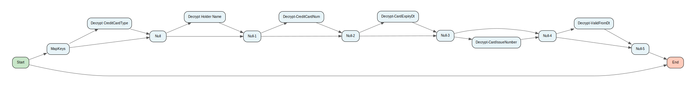

[↑ Back to Inventory](#process-inventory)

#### Process: CustomerBillProduction-Gemini/BusinessServices/Billing/BalanceManagement/DebitCreditManagement/SendAdHocCardPayment/Sub/BusinessLogic.process {: #customerbillproductiongeminibusinessservicesbillingbalancemanagementdebitcreditmanagementsendadhoccardpaymentsubbusinesslogicprocess }

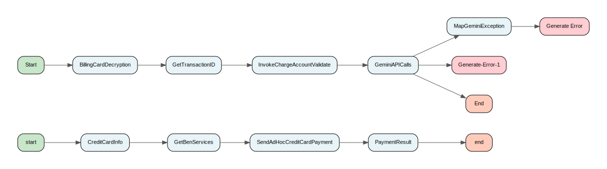

[↑ Back to Inventory](#process-inventory)

#### Process: CustomerBillProduction-Gemini/BusinessServices/Billing/BalanceManagement/DebitCreditManagement/SendAdHocCardPayment/Sub/MainProcess.process {: #customerbillproductiongeminibusinessservicesbillingbalancemanagementdebitcreditmanagementsendadhoccardpaymentsubmainprocessprocess }

[↑ Back to Inventory](#process-inventory)

#### Process: CustomerBillProduction-Gemini/BusinessServices/Billing/CustomerBillProduction/BillFormatting/GetBalanceForBAN/Interface/JMSXMLServiceRequestReply.process {: #customerbillproductiongeminibusinessservicesbillingcustomerbillproductionbillformattinggetbalanceforbaninterfacejmsxmlservicerequestreplyprocess }

[↑ Back to Inventory](#process-inventory)

#### Process: CustomerBillProduction-Gemini/BusinessServices/Billing/CustomerBillProduction/BillFormatting/GetBalanceForBAN/Sub/BusinessLogic.process {: #customerbillproductiongeminibusinessservicesbillingcustomerbillproductionbillformattinggetbalanceforbansubbusinesslogicprocess }

[↑ Back to Inventory](#process-inventory)

#### Process: CustomerBillProduction-Gemini/BusinessServices/Billing/CustomerBillProduction/BillFormatting/GetBalanceForBAN/Sub/GetBillInformation.process {: #customerbillproductiongeminibusinessservicesbillingcustomerbillproductionbillformattinggetbalanceforbansubgetbillinformationprocess }

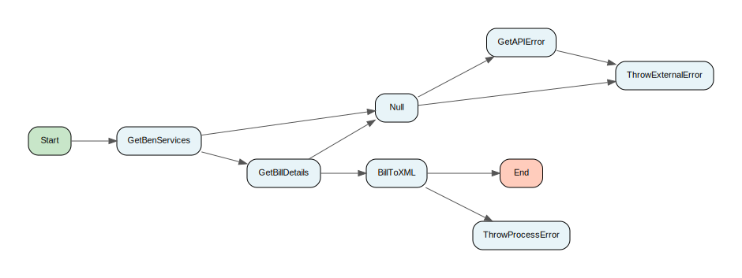

[↑ Back to Inventory](#process-inventory)

#### Process: CustomerBillProduction-Gemini/BusinessServices/Billing/CustomerBillProduction/BillFormatting/GetBalanceForBAN/Sub/GetBillList.process {: #customerbillproductiongeminibusinessservicesbillingcustomerbillproductionbillformattinggetbalanceforbansubgetbilllistprocess }

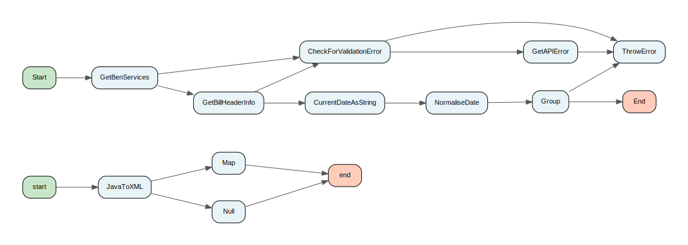

[↑ Back to Inventory](#process-inventory)

#### Process: CustomerBillProduction-Gemini/BusinessServices/Billing/CustomerBillProduction/BillFormatting/GetBalanceForBAN/Sub/MainProcess.process {: #customerbillproductiongeminibusinessservicesbillingcustomerbillproductionbillformattinggetbalanceforbansubmainprocessprocess }

[↑ Back to Inventory](#process-inventory)

#### Process: CustomerBillProduction-Gemini/BusinessServices/Billing/CustomerBillProduction/BillFormatting/GetBillDates/Interface/JMSXMLServiceRequestReply.process {: #customerbillproductiongeminibusinessservicesbillingcustomerbillproductionbillformattinggetbilldatesinterfacejmsxmlservicerequestreplyprocess }

[↑ Back to Inventory](#process-inventory)

#### Process: CustomerBillProduction-Gemini/BusinessServices/Billing/CustomerBillProduction/BillFormatting/GetBillDates/Sub/BusinessLogic.process {: #customerbillproductiongeminibusinessservicesbillingcustomerbillproductionbillformattinggetbilldatessubbusinesslogicprocess }

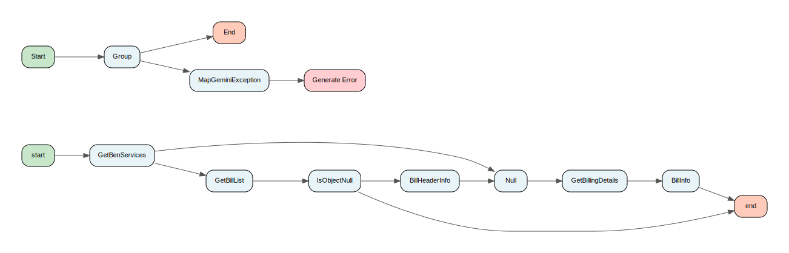

[↑ Back to Inventory](#process-inventory)

#### Process: CustomerBillProduction-Gemini/BusinessServices/Billing/CustomerBillProduction/BillFormatting/GetBillDates/Sub/MainProcess.process {: #customerbillproductiongeminibusinessservicesbillingcustomerbillproductionbillformattinggetbilldatessubmainprocessprocess }

[↑ Back to Inventory](#process-inventory)

#### Process: CustomerBillProduction-Gemini/BusinessServices/Billing/CustomerBillProduction/BillFormatting/SetBillFormat/Interface/JMSXMLServiceRequestReply.2.process {: #customerbillproductiongeminibusinessservicesbillingcustomerbillproductionbillformattingsetbillformatinterfacejmsxmlservicerequestreply2process }

[↑ Back to Inventory](#process-inventory)

#### Process: CustomerBillProduction-Gemini/BusinessServices/Billing/CustomerBillProduction/BillFormatting/SetBillFormat/Sub/BusinessLogic.2.process {: #customerbillproductiongeminibusinessservicesbillingcustomerbillproductionbillformattingsetbillformatsubbusinesslogic2process }

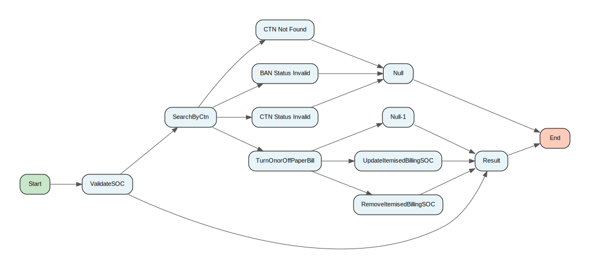

[↑ Back to Inventory](#process-inventory)

#### Process: CustomerBillProduction-Gemini/BusinessServices/Billing/CustomerBillProduction/BillFormatting/SetBillFormat/Sub/MainProcess.2.process {: #customerbillproductiongeminibusinessservicesbillingcustomerbillproductionbillformattingsetbillformatsubmainprocess2process }

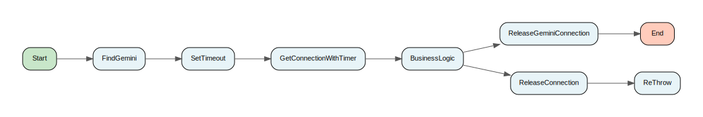

[↑ Back to Inventory](#process-inventory)

#### Process: CustomerBillProduction-Gemini/BusinessServices/Billing/CustomerBillProduction/BillFormatting/SetBillFormat/Sub/RemoveItemisedBillingSOC.2.process {: #customerbillproductiongeminibusinessservicesbillingcustomerbillproductionbillformattingsetbillformatsubremoveitemisedbillingsoc2process }

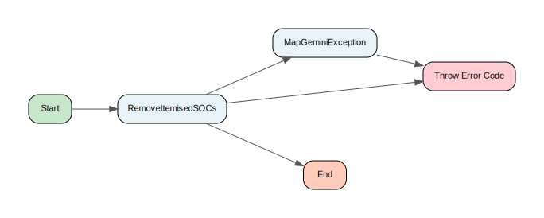

[↑ Back to Inventory](#process-inventory)

#### Process: CustomerBillProduction-Gemini/BusinessServices/Billing/CustomerBillProduction/BillFormatting/SetBillFormat/Sub/TurnOnorOffPaperBill.2.process {: #customerbillproductiongeminibusinessservicesbillingcustomerbillproductionbillformattingsetbillformatsubturnonoroffpaperbill2process }

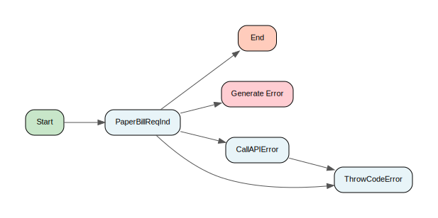

[↑ Back to Inventory](#process-inventory)

#### Process: CustomerBillProduction-Gemini/BusinessServices/Billing/CustomerBillProduction/BillFormatting/SetBillFormat/Sub/UpdateItemisedBillingSOC.process {: #customerbillproductiongeminibusinessservicesbillingcustomerbillproductionbillformattingsetbillformatsubupdateitemisedbillingsocprocess }

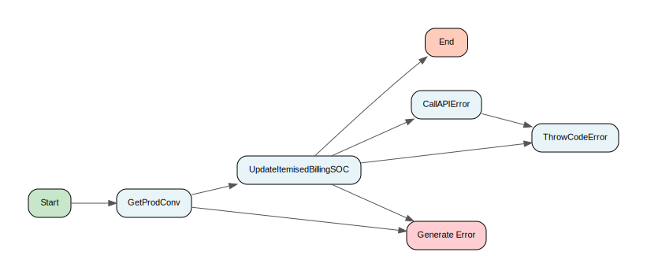

[↑ Back to Inventory](#process-inventory)

#### Process: CustomerBillProduction-Gemini/BusinessServices/Billing/CustomerBillProduction/BillFormatting/SetPrintCategory/Interface/JMSXMLServiceRequestReply.process {: #customerbillproductiongeminibusinessservicesbillingcustomerbillproductionbillformattingsetprintcategoryinterfacejmsxmlservicerequestreplyprocess }

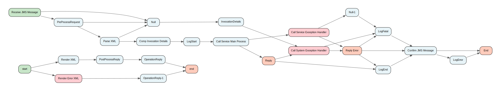

[↑ Back to Inventory](#process-inventory)

#### Process: CustomerBillProduction-Gemini/BusinessServices/Billing/CustomerBillProduction/BillFormatting/SetPrintCategory/Sub/BusinessLogic.process {: #customerbillproductiongeminibusinessservicesbillingcustomerbillproductionbillformattingsetprintcategorysubbusinesslogicprocess }

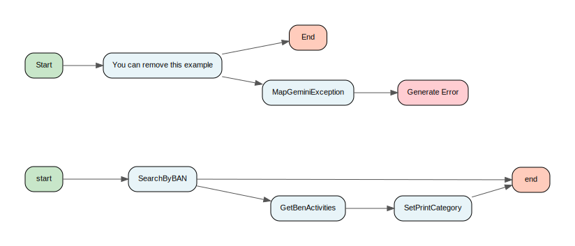

[↑ Back to Inventory](#process-inventory)

#### Process: CustomerBillProduction-Gemini/BusinessServices/Billing/CustomerBillProduction/BillFormatting/SetPrintCategory/Sub/MainProcess.process {: #customerbillproductiongeminibusinessservicesbillingcustomerbillproductionbillformattingsetprintcategorysubmainprocessprocess }

[↑ Back to Inventory](#process-inventory)

#### Process: CustomerBillProduction-Gemini/BusinessServices/Billing/CustomerBillProduction/BillingAccounting/ChangeBillingPattern/Interface/JMSXMLServiceRequestReply.process {: #customerbillproductiongeminibusinessservicesbillingcustomerbillproductionbillingaccountingchangebillingpatterninterfacejmsxmlservicerequestreplyprocess }

[↑ Back to Inventory](#process-inventory)

#### Process: CustomerBillProduction-Gemini/BusinessServices/Billing/CustomerBillProduction/BillingAccounting/ChangeBillingPattern/Sub/BusinessLogic.process {: #customerbillproductiongeminibusinessservicesbillingcustomerbillproductionbillingaccountingchangebillingpatternsubbusinesslogicprocess }

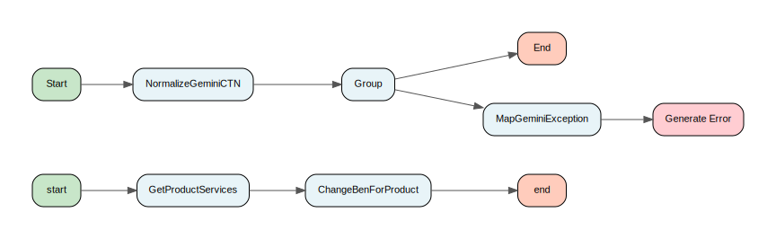

[↑ Back to Inventory](#process-inventory)

#### Process: CustomerBillProduction-Gemini/BusinessServices/Billing/CustomerBillProduction/BillingAccounting/ChangeBillingPattern/Sub/MainProcess.process {: #customerbillproductiongeminibusinessservicesbillingcustomerbillproductionbillingaccountingchangebillingpatternsubmainprocessprocess }

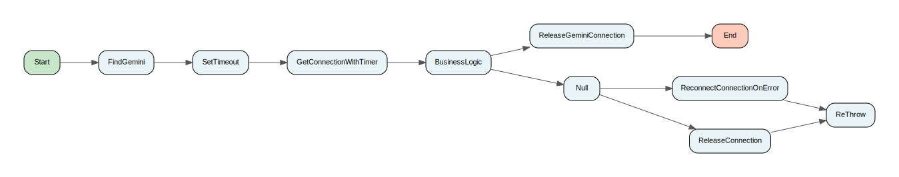

[↑ Back to Inventory](#process-inventory)

#### Process: CustomerBillProduction-Gemini/BusinessServices/Billing/CustomerDiscountsAndPromotions/CustomerDiscountCalculation/GetDiscounts/Interface/JMSXMLServiceRequestReply.process {: #customerbillproductiongeminibusinessservicesbillingcustomerdiscountsandpromotionscustomerdiscountcalculationgetdiscountsinterfacejmsxmlservicerequestreplyprocess }

[↑ Back to Inventory](#process-inventory)

#### Process: CustomerBillProduction-Gemini/BusinessServices/Billing/CustomerDiscountsAndPromotions/CustomerDiscountCalculation/GetDiscounts/Sub/BusinessLogic.process {: #customerbillproductiongeminibusinessservicesbillingcustomerdiscountsandpromotionscustomerdiscountcalculationgetdiscountssubbusinesslogicprocess }

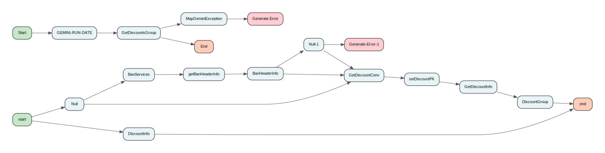

[↑ Back to Inventory](#process-inventory)

#### Process: CustomerBillProduction-Gemini/BusinessServices/Billing/CustomerDiscountsAndPromotions/CustomerDiscountCalculation/GetDiscounts/Sub/MainProcess.process {: #customerbillproductiongeminibusinessservicesbillingcustomerdiscountsandpromotionscustomerdiscountcalculationgetdiscountssubmainprocessprocess }

[↑ Back to Inventory](#process-inventory)

#### Process: CustomerBillProduction-Gemini/BusinessServices/Billing/CustomerDiscountsAndPromotions/CustomerDiscountCalculation/SetAllocationCodes/Interface/JMSXMLServiceRequestReply.process {: #customerbillproductiongeminibusinessservicesbillingcustomerdiscountsandpromotionscustomerdiscountcalculationsetallocationcodesinterfacejmsxmlservicerequestreplyprocess }

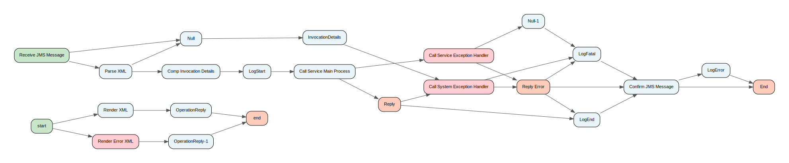

[↑ Back to Inventory](#process-inventory)

#### Process: CustomerBillProduction-Gemini/BusinessServices/Billing/CustomerDiscountsAndPromotions/CustomerDiscountCalculation/SetAllocationCodes/Sub/BusinessLogic.process {: #customerbillproductiongeminibusinessservicesbillingcustomerdiscountsandpromotionscustomerdiscountcalculationsetallocationcodessubbusinesslogicprocess }

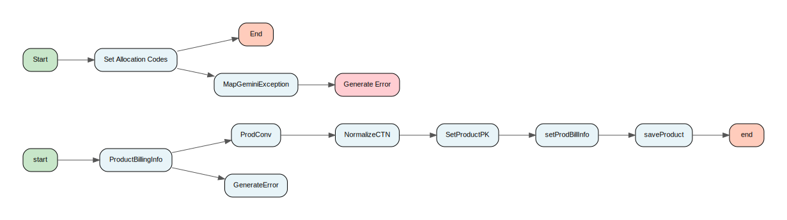

[↑ Back to Inventory](#process-inventory)

#### Process: CustomerBillProduction-Gemini/BusinessServices/Billing/CustomerDiscountsAndPromotions/CustomerDiscountCalculation/SetAllocationCodes/Sub/MainProcess.process {: #customerbillproductiongeminibusinessservicesbillingcustomerdiscountsandpromotionscustomerdiscountcalculationsetallocationcodessubmainprocessprocess }

[↑ Back to Inventory](#process-inventory)

#### Process: CustomerBillProduction-Gemini/BusinessServices/Billing/CustomerDiscountsAndPromotions/CustomerDiscountCalculation/SetDiscount/Interface/JMSXMLServiceRequestReply.process {: #customerbillproductiongeminibusinessservicesbillingcustomerdiscountsandpromotionscustomerdiscountcalculationsetdiscountinterfacejmsxmlservicerequestreplyprocess }

[↑ Back to Inventory](#process-inventory)

#### Process: CustomerBillProduction-Gemini/BusinessServices/Billing/CustomerDiscountsAndPromotions/CustomerDiscountCalculation/SetDiscount/Sub/BusinessLogic.process {: #customerbillproductiongeminibusinessservicesbillingcustomerdiscountsandpromotionscustomerdiscountcalculationsetdiscountsubbusinesslogicprocess }

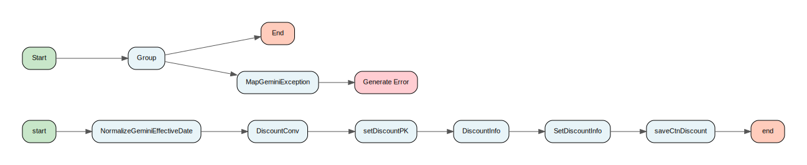

[↑ Back to Inventory](#process-inventory)

#### Process: CustomerBillProduction-Gemini/BusinessServices/Billing/CustomerDiscountsAndPromotions/CustomerDiscountCalculation/SetDiscount/Sub/MainProcess.process {: #customerbillproductiongeminibusinessservicesbillingcustomerdiscountsandpromotionscustomerdiscountcalculationsetdiscountsubmainprocessprocess }

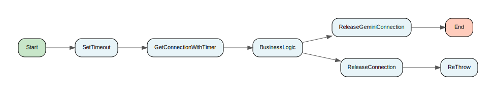

[↑ Back to Inventory](#process-inventory)

#### Process: CustomerBillProduction-Gemini/BusinessServices/Billing/PaymentMethodsManagement/PaymentMethodInformationManagement/GetPaymentInformation/Interface/JMSXMLServiceRequestReply.2.process {: #customerbillproductiongeminibusinessservicesbillingpaymentmethodsmanagementpaymentmethodinformationmanagementgetpaymentinformationinterfacejmsxmlservicerequestreply2process }

[↑ Back to Inventory](#process-inventory)

#### Process: CustomerBillProduction-Gemini/BusinessServices/Billing/PaymentMethodsManagement/PaymentMethodInformationManagement/GetPaymentInformation/Interface/JMSXMLServiceRequestReply.process {: #customerbillproductiongeminibusinessservicesbillingpaymentmethodsmanagementpaymentmethodinformationmanagementgetpaymentinformationinterfacejmsxmlservicerequestreplyprocess }

[↑ Back to Inventory](#process-inventory)

#### Process: CustomerBillProduction-Gemini/BusinessServices/Billing/PaymentMethodsManagement/PaymentMethodInformationManagement/GetPaymentInformation/Sub/BusinessLogic.2.process {: #customerbillproductiongeminibusinessservicesbillingpaymentmethodsmanagementpaymentmethodinformationmanagementgetpaymentinformationsubbusinesslogic2process }

[↑ Back to Inventory](#process-inventory)

#### Process: CustomerBillProduction-Gemini/BusinessServices/Billing/PaymentMethodsManagement/PaymentMethodInformationManagement/GetPaymentInformation/Sub/BusinessLogic.process {: #customerbillproductiongeminibusinessservicesbillingpaymentmethodsmanagementpaymentmethodinformationmanagementgetpaymentinformationsubbusinesslogicprocess }

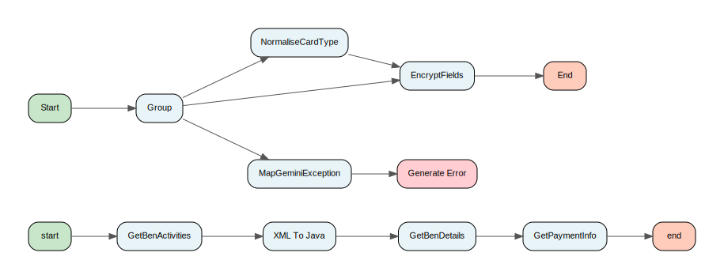

[↑ Back to Inventory](#process-inventory)

#### Process: CustomerBillProduction-Gemini/BusinessServices/Billing/PaymentMethodsManagement/PaymentMethodInformationManagement/GetPaymentInformation/Sub/CheckOverDueAmount.process {: #customerbillproductiongeminibusinessservicesbillingpaymentmethodsmanagementpaymentmethodinformationmanagementgetpaymentinformationsubcheckoverdueamountprocess }

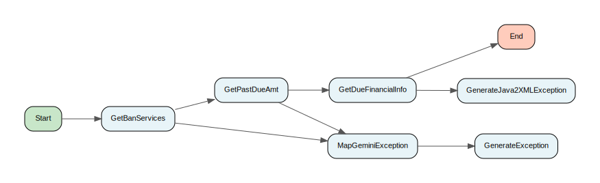

[↑ Back to Inventory](#process-inventory)

#### Process: CustomerBillProduction-Gemini/BusinessServices/Billing/PaymentMethodsManagement/PaymentMethodInformationManagement/GetPaymentInformation/Sub/MainProcess.2.process {: #customerbillproductiongeminibusinessservicesbillingpaymentmethodsmanagementpaymentmethodinformationmanagementgetpaymentinformationsubmainprocess2process }

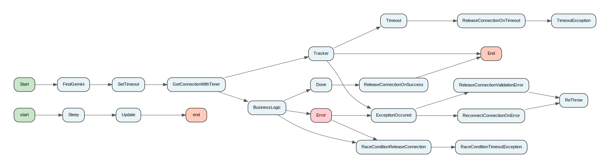

[↑ Back to Inventory](#process-inventory)

#### Process: CustomerBillProduction-Gemini/BusinessServices/Billing/PaymentMethodsManagement/PaymentMethodInformationManagement/GetPaymentInformation/Sub/MainProcess.process {: #customerbillproductiongeminibusinessservicesbillingpaymentmethodsmanagementpaymentmethodinformationmanagementgetpaymentinformationsubmainprocessprocess }

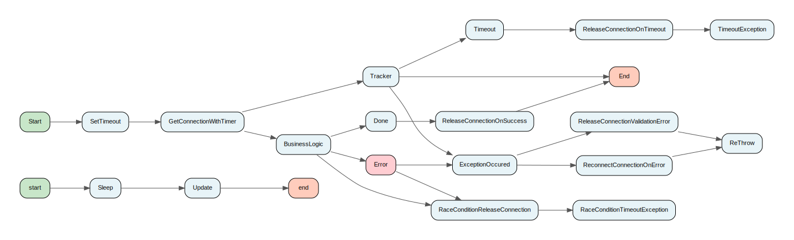

[↑ Back to Inventory](#process-inventory)

#### Process: CustomerBillProduction-Gemini/BusinessServices/Common/Encryption/Algorithms/DES3.process {: #customerbillproductiongeminibusinessservicescommonencryptionalgorithmsdes3process }

[↑ Back to Inventory](#process-inventory)

#### Process: CustomerBillProduction-Gemini/BusinessServices/Common/Encryption/DecryptField.process {: #customerbillproductiongeminibusinessservicescommonencryptiondecryptfieldprocess }

[↑ Back to Inventory](#process-inventory)

#### Process: CustomerBillProduction-Gemini/BusinessServices/Common/Encryption/EncryptField.process {: #customerbillproductiongeminibusinessservicescommonencryptionencryptfieldprocess }

[↑ Back to Inventory](#process-inventory)

#### Process: CustomerBillProduction-Gemini/BusinessServices/Common/Encryption/EncryptFields.process {: #customerbillproductiongeminibusinessservicescommonencryptionencryptfieldsprocess }

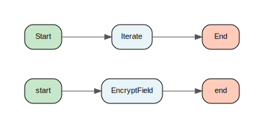

[↑ Back to Inventory](#process-inventory)

#### Process: CustomerBillProduction-Gemini/BusinessServices/Common/Encryption/GetKey.process {: #customerbillproductiongeminibusinessservicescommonencryptiongetkeyprocess }

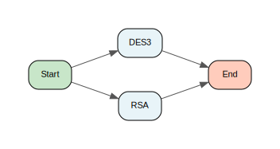

[↑ Back to Inventory](#process-inventory)

#### Process: CustomerBillProduction-Gemini/BusinessServices/Common/ReferenceData/GEMINI/GetCountryInfoLoad.process {: #customerbillproductiongeminibusinessservicescommonreferencedatageminigetcountryinfoloadprocess }

[↑ Back to Inventory](#process-inventory)

#### Process: CustomerBillProduction-Gemini/BusinessServices/Common/ReferenceData/GEMINI/GetFeatureInfoLoad.process {: #customerbillproductiongeminibusinessservicescommonreferencedatageminigetfeatureinfoloadprocess }

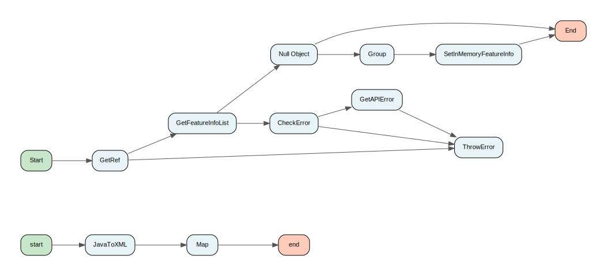

[↑ Back to Inventory](#process-inventory)

#### Process: CustomerBillProduction-Gemini/BusinessServices/Common/ReferenceData/GEMINI/GetGeminiSpecialInstructions.process {: #customerbillproductiongeminibusinessservicescommonreferencedatageminigetgeminispecialinstructionsprocess }

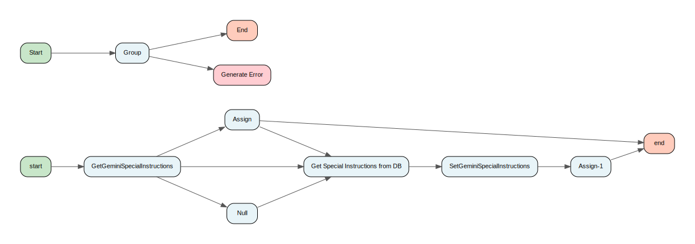

[↑ Back to Inventory](#process-inventory)

#### Process: CustomerBillProduction-Gemini/BusinessServices/Common/ReferenceData/GEMINI/GetTariffServiceInfoLoad.process {: #customerbillproductiongeminibusinessservicescommonreferencedatageminigettariffserviceinfoloadprocess }

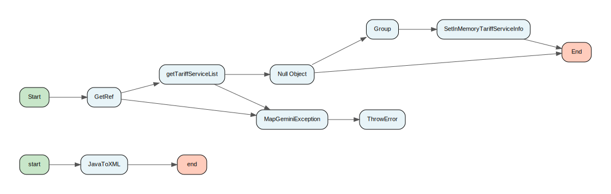

[↑ Back to Inventory](#process-inventory)

#### Process: CustomerBillProduction-Gemini/BusinessServices/Common/ReferenceData/GEMINI/Load All GEMINI Reference Data.process {: #customerbillproductiongeminibusinessservicescommonreferencedatageminiloadallgeminireferencedataprocess }

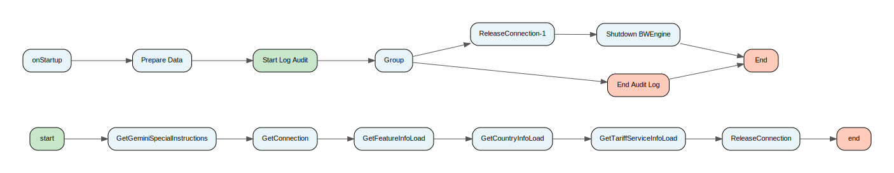

[↑ Back to Inventory](#process-inventory)

#### Process: CustomerBillProduction-Gemini/BusinessServices/Common/ReferenceData/GetAccountTypes.process {: #customerbillproductiongeminibusinessservicescommonreferencedatagetaccounttypesprocess }

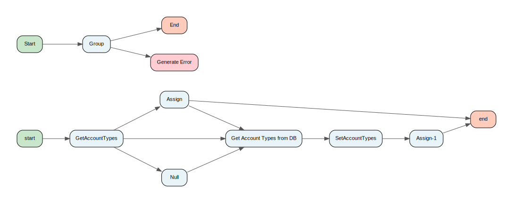

[↑ Back to Inventory](#process-inventory)

#### Process: CustomerBillProduction-Gemini/BusinessServices/Common/ReferenceData/GetActivityReason.process {: #customerbillproductiongeminibusinessservicescommonreferencedatagetactivityreasonprocess }

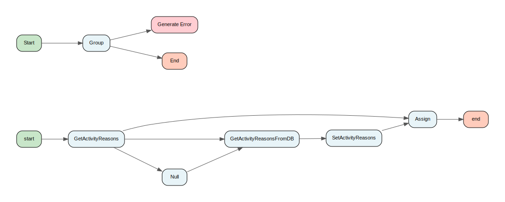

[↑ Back to Inventory](#process-inventory)

#### Process: CustomerBillProduction-Gemini/BusinessServices/Common/ReferenceData/GetBANTrial.process {: #customerbillproductiongeminibusinessservicescommonreferencedatagetbantrialprocess }

[↑ Back to Inventory](#process-inventory)

#### Process: CustomerBillProduction-Gemini/BusinessServices/Common/ReferenceData/GetCaseText.process {: #customerbillproductiongeminibusinessservicescommonreferencedatagetcasetextprocess }

[↑ Back to Inventory](#process-inventory)

#### Process: CustomerBillProduction-Gemini/BusinessServices/Common/ReferenceData/GetCountryVatCodesLoad.process {: #customerbillproductiongeminibusinessservicescommonreferencedatagetcountryvatcodesloadprocess }

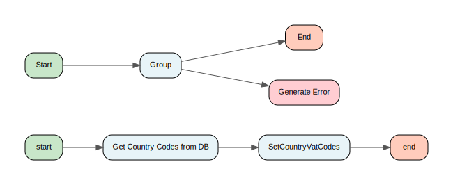

[↑ Back to Inventory](#process-inventory)

#### Process: CustomerBillProduction-Gemini/BusinessServices/Common/ReferenceData/GetDestinationCodeLoad.process {: #customerbillproductiongeminibusinessservicescommonreferencedatagetdestinationcodeloadprocess }

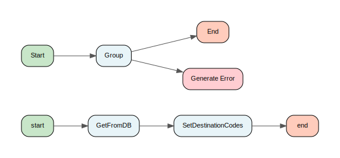

[↑ Back to Inventory](#process-inventory)

#### Process: CustomerBillProduction-Gemini/BusinessServices/Common/ReferenceData/GetNetworkNameLoad.process {: #customerbillproductiongeminibusinessservicescommonreferencedatagetnetworknameloadprocess }

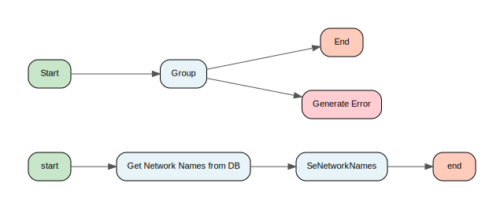

[↑ Back to Inventory](#process-inventory)

#### Process: CustomerBillProduction-Gemini/BusinessServices/Common/ReferenceData/GetOptionalExtrasLoad.process {: #customerbillproductiongeminibusinessservicescommonreferencedatagetoptionalextrasloadprocess }

[↑ Back to Inventory](#process-inventory)

#### Process: CustomerBillProduction-Gemini/BusinessServices/Common/ReferenceData/GetServiceProvidersLoad.process {: #customerbillproductiongeminibusinessservicescommonreferencedatagetserviceprovidersloadprocess }

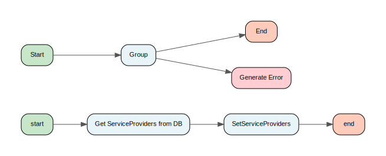

[↑ Back to Inventory](#process-inventory)

#### Process: CustomerBillProduction-Gemini/BusinessServices/Common/ReferenceData/GetTariff.process {: #customerbillproductiongeminibusinessservicescommonreferencedatagettariffprocess }

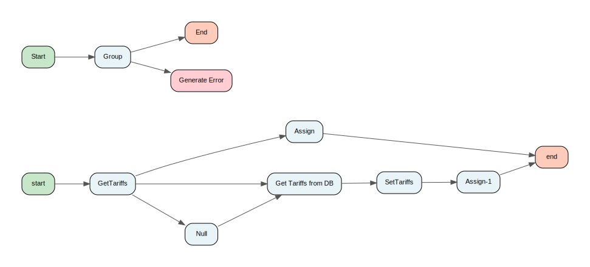

[↑ Back to Inventory](#process-inventory)

#### Process: CustomerBillProduction-Gemini/BusinessServices/Common/ReferenceData/GetTeamID.process {: #customerbillproductiongeminibusinessservicescommonreferencedatagetteamidprocess }

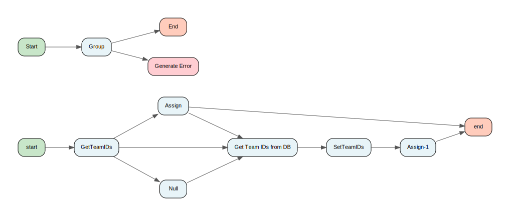

[↑ Back to Inventory](#process-inventory)

#### Process: CustomerBillProduction-Gemini/BusinessServices/Common/ReferenceData/GetVatCode.process {: #customerbillproductiongeminibusinessservicescommonreferencedatagetvatcodeprocess }

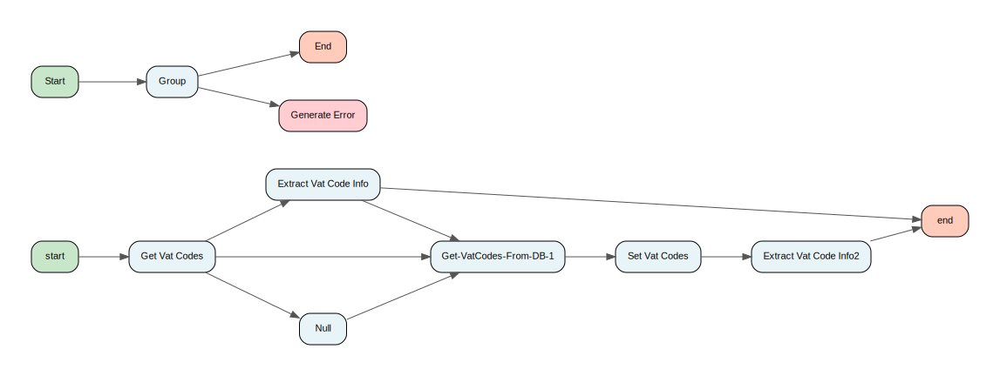

[↑ Back to Inventory](#process-inventory)

#### Process: CustomerBillProduction-Gemini/BusinessServices/Common/ReferenceData/Load All Reference Data.process {: #customerbillproductiongeminibusinessservicescommonreferencedataloadallreferencedataprocess }

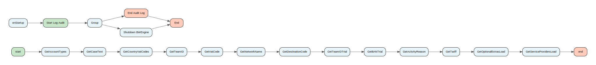

[↑ Back to Inventory](#process-inventory)

#### Process: CustomerBillProduction-Gemini/BusinessServices/Common/ReferenceData/NormaliseCardType.process {: #customerbillproductiongeminibusinessservicescommonreferencedatanormalisecardtypeprocess }

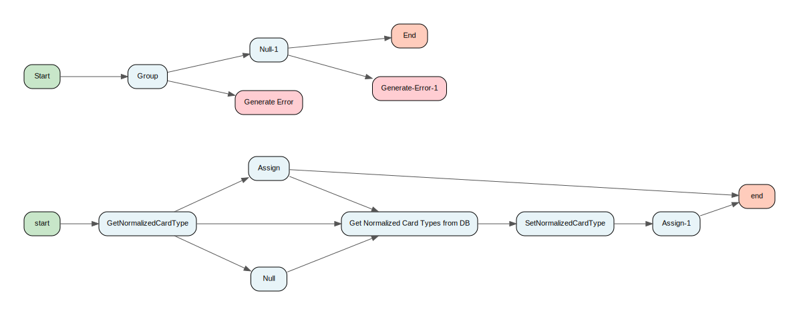

[↑ Back to Inventory](#process-inventory)

#### Process: CustomerBillProduction-Gemini/BusinessServices/Common/Utility/IsObjectNull.process {: #customerbillproductiongeminibusinessservicescommonutilityisobjectnullprocess }

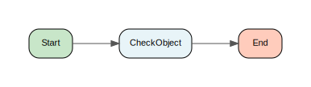

[↑ Back to Inventory](#process-inventory)

#### Process: CustomerBillProduction-Gemini/BusinessServices/Common/VESTA/ChargeAccountValidate.process {: #customerbillproductiongeminibusinessservicescommonvestachargeaccountvalidateprocess }

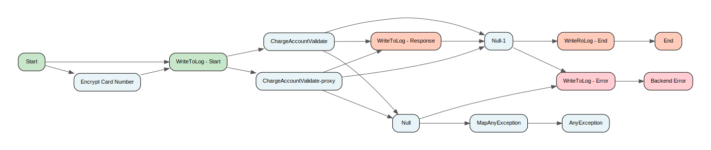

[↑ Back to Inventory](#process-inventory)

#### Process: CustomerBillProduction-Gemini/BusinessServices/Common/VESTA/GetTransactionID.process {: #customerbillproductiongeminibusinessservicescommonvestagettransactionidprocess }

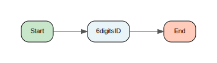

[↑ Back to Inventory](#process-inventory)

#### Process: CustomerBillProduction-Gemini/BusinessServices/ITIntegration/DataIntegration/DataCollection/IsGeminiAvailable/Interface/JMSXMLServiceRequestReply.process {: #customerbillproductiongeminibusinessservicesitintegrationdataintegrationdatacollectionisgeminiavailableinterfacejmsxmlservicerequestreplyprocess }

[↑ Back to Inventory](#process-inventory)

#### Process: CustomerBillProduction-Gemini/BusinessServices/ITIntegration/DataIntegration/DataCollection/IsGeminiAvailable/Sub/Business_TimerProcess.process {: #customerbillproductiongeminibusinessservicesitintegrationdataintegrationdatacollectionisgeminiavailablesubbusinesstimerprocessprocess }

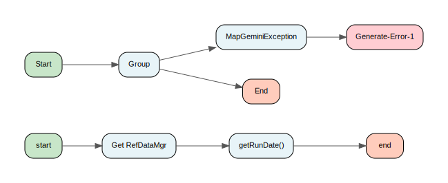

[↑ Back to Inventory](#process-inventory)

#### Process: CustomerBillProduction-Gemini/BusinessServices/ITIntegration/DataIntegration/DataCollection/IsGeminiAvailable/Sub/MainProcess.process {: #customerbillproductiongeminibusinessservicesitintegrationdataintegrationdatacollectionisgeminiavailablesubmainprocessprocess }

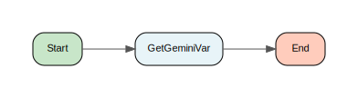

[↑ Back to Inventory](#process-inventory)

#### Process: CustomerBillProduction-Gemini/BusinessServices/ITIntegration/DataIntegration/DataCollection/IsGeminiAvailable/Sub/Main_TimerProcess.process {: #customerbillproductiongeminibusinessservicesitintegrationdataintegrationdatacollectionisgeminiavailablesubmaintimerprocessprocess }

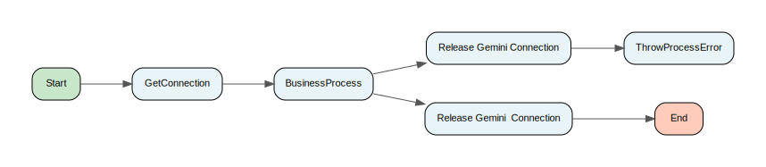

[↑ Back to Inventory](#process-inventory)

#### Process: CustomerBillProduction-Gemini/BusinessServices/ITIntegration/DataIntegration/DataCollection/IsGeminiAvailable/Sub/TimerProcess.process {: #customerbillproductiongeminibusinessservicesitintegrationdataintegrationdatacollectionisgeminiavailablesubtimerprocessprocess }

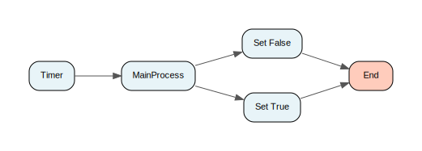

[↑ Back to Inventory](#process-inventory)

#### Process: CustomerBillProduction-Gemini/BusinessServices/ProvisioningAndFulfilment/SubscriptionManagement/SubscriptionLifecycleManagement/UnreserveCTN/Interface/JMSXMLServiceRequestReply.process {: #customerbillproductiongeminibusinessservicesprovisioningandfulfilmentsubscriptionmanagementsubscriptionlifecyclemanagementunreservectninterfacejmsxmlservicerequestreplyprocess }

[↑ Back to Inventory](#process-inventory)

#### Process: CustomerBillProduction-Gemini/BusinessServices/ProvisioningAndFulfilment/SubscriptionManagement/SubscriptionLifecycleManagement/UnreserveCTN/Sub/BusinessLogic.process {: #customerbillproductiongeminibusinessservicesprovisioningandfulfilmentsubscriptionmanagementsubscriptionlifecyclemanagementunreservectnsubbusinesslogicprocess }

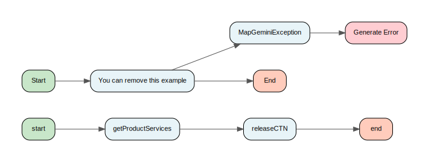

[↑ Back to Inventory](#process-inventory)

#### Process: CustomerBillProduction-Gemini/BusinessServices/ProvisioningAndFulfilment/SubscriptionManagement/SubscriptionLifecycleManagement/UnreserveCTN/Sub/MainProcess.process {: #customerbillproductiongeminibusinessservicesprovisioningandfulfilmentsubscriptionmanagementsubscriptionlifecyclemanagementunreservectnsubmainprocessprocess }

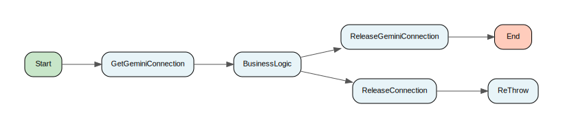

[↑ Back to Inventory](#process-inventory)

#### Process: CustomerBillProduction-Gemini/ConnectivityServices/GEMINI/APILink/ErrorHandling/Public/MapGeminiException.process {: #customerbillproductiongeminiconnectivityservicesgeminiapilinkerrorhandlingpublicmapgeminiexceptionprocess }

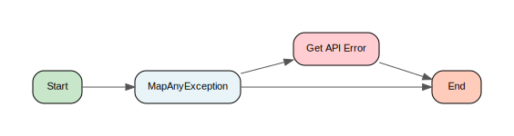

[↑ Back to Inventory](#process-inventory)

#### Process: CustomerBillProduction-Gemini/ConnectivityServices/GEMINI/APILink/FindGemini.process {: #customerbillproductiongeminiconnectivityservicesgeminiapilinkfindgeminiprocess }

[↑ Back to Inventory](#process-inventory)

#### Process: CustomerBillProduction-Gemini/ConnectivityServices/GEMINI/APILink/GetAPIError.process {: #customerbillproductiongeminiconnectivityservicesgeminiapilinkgetapierrorprocess }

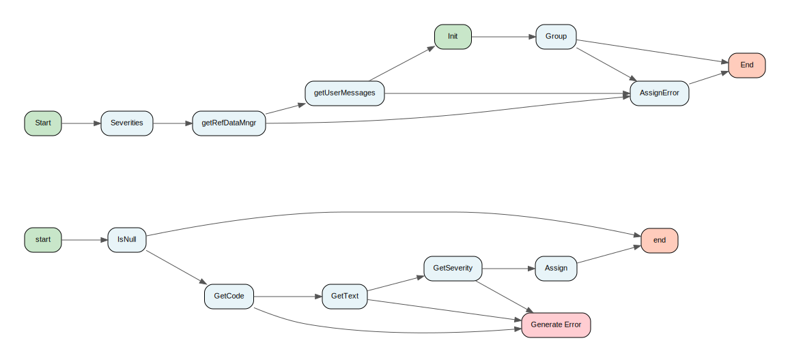

[↑ Back to Inventory](#process-inventory)

#### Process: CustomerBillProduction-Gemini/ConnectivityServices/GEMINI/APILink/GetBenList.process {: #customerbillproductiongeminiconnectivityservicesgeminiapilinkgetbenlistprocess }

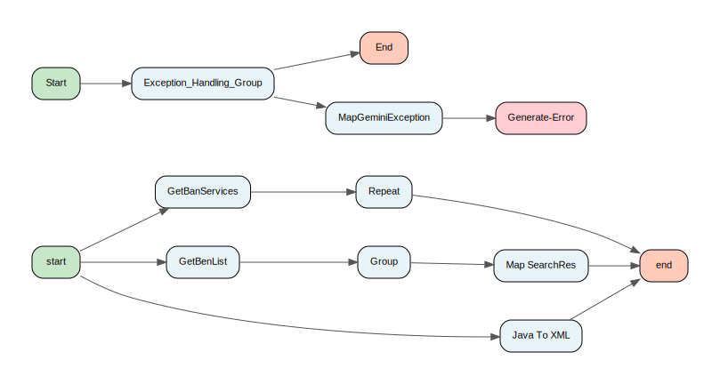

[↑ Back to Inventory](#process-inventory)

#### Process: CustomerBillProduction-Gemini/ConnectivityServices/GEMINI/APILink/NormalizeCTN.process {: #customerbillproductiongeminiconnectivityservicesgeminiapilinknormalizectnprocess }

[↑ Back to Inventory](#process-inventory)

#### Process: CustomerBillProduction-Gemini/ConnectivityServices/GEMINI/APILink/Public/NormalizeGeminiCTN.process {: #customerbillproductiongeminiconnectivityservicesgeminiapilinkpublicnormalizegeminictnprocess }

[↑ Back to Inventory](#process-inventory)

#### Process: CustomerBillProduction-Gemini/ConnectivityServices/GEMINI/APILink/Public/NormalizeGeminiEffectiveDate.process {: #customerbillproductiongeminiconnectivityservicesgeminiapilinkpublicnormalizegeminieffectivedateprocess }

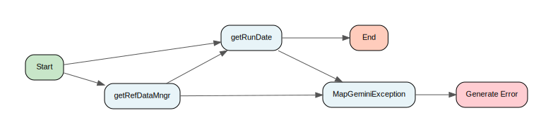

[↑ Back to Inventory](#process-inventory)

#### Process: CustomerBillProduction-Gemini/ConnectivityServices/GEMINI/APILink/SearchByBAN.process {: #customerbillproductiongeminiconnectivityservicesgeminiapilinksearchbybanprocess }

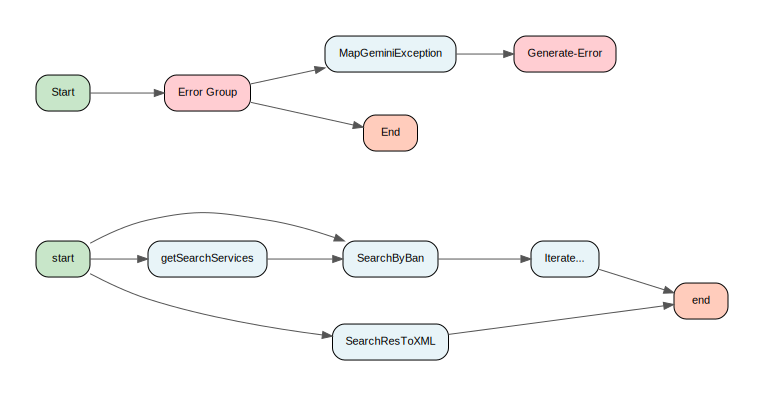

[↑ Back to Inventory](#process-inventory)

#### Process: CustomerBillProduction-Gemini/ConnectivityServices/GEMINI/APILink/SearchByCtn.process {: #customerbillproductiongeminiconnectivityservicesgeminiapilinksearchbyctnprocess }

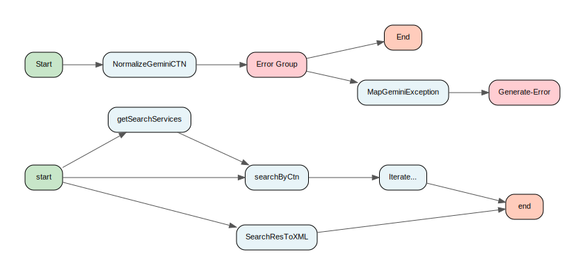

[↑ Back to Inventory](#process-inventory)

#### Process: CustomerBillProduction-Gemini/ConnectivityServices/GEMINI/Connection/ReconnectConnectionOnError.process {: #customerbillproductiongeminiconnectivityservicesgeminiconnectionreconnectconnectiononerrorprocess }

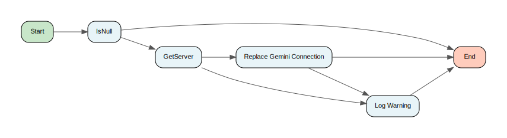

[↑ Back to Inventory](#process-inventory)

#### Process: CustomerBillProduction-Gemini/ConnectivityServices/GEMINI/Connection/ReconnectConnectionOnTimeout.process {: #customerbillproductiongeminiconnectivityservicesgeminiconnectionreconnectconnectionontimeoutprocess }

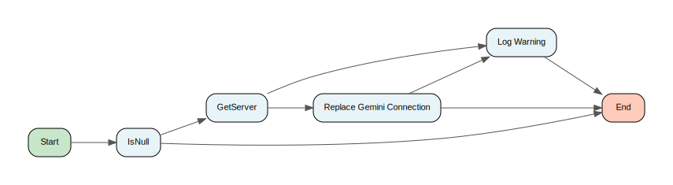

[↑ Back to Inventory](#process-inventory)

#### Process: CustomerBillProduction-Gemini/ConnectivityServices/GEMINI/Connection/ReleaseConnection.process {: #customerbillproductiongeminiconnectivityservicesgeminiconnectionreleaseconnectionprocess }

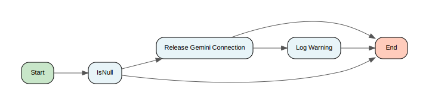

[↑ Back to Inventory](#process-inventory)

#### Process: CustomerBillProduction-Gemini/ConnectivityServices/GEMINI/Corporate/GetConnection.process {: #customerbillproductiongeminiconnectivityservicesgeminicorporategetconnectionprocess }

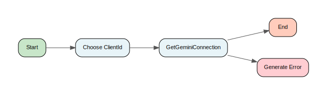

[↑ Back to Inventory](#process-inventory)

#### Process: CustomerBillProduction-Gemini/ConnectivityServices/GEMINI/Corporate/GetConnectionWithRetry.process {: #customerbillproductiongeminiconnectivityservicesgeminicorporategetconnectionwithretryprocess }

[↑ Back to Inventory](#process-inventory)

#### Process: CustomerBillProduction-Gemini/ConnectivityServices/GEMINI/LibraRO/GetConnection.process {: #customerbillproductiongeminiconnectivityservicesgeminilibrarogetconnectionprocess }

[↑ Back to Inventory](#process-inventory)

#### Process: CustomerBillProduction-Gemini/ConnectivityServices/GEMINI/LibraRO/GetConnectionWithRetry.process {: #customerbillproductiongeminiconnectivityservicesgeminilibrarogetconnectionwithretryprocess }

[↑ Back to Inventory](#process-inventory)

#### Process: CustomerBillProduction-Gemini/ConnectivityServices/GEMINI/LibraRW/GetConnection.process {: #customerbillproductiongeminiconnectivityservicesgeminilibrarwgetconnectionprocess }

[↑ Back to Inventory](#process-inventory)

#### Process: CustomerBillProduction-Gemini/ConnectivityServices/GEMINI/LibraRW/GetConnectionWithRetry.process {: #customerbillproductiongeminiconnectivityservicesgeminilibrarwgetconnectionwithretryprocess }

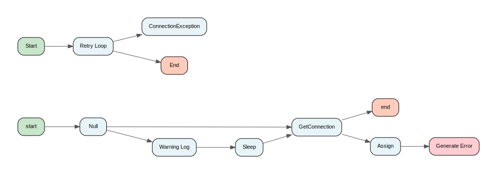

[↑ Back to Inventory](#process-inventory)

#### Process: CustomerBillProduction-Gemini/UtilityServices/ExceptionHandling/Filtering/CVV2Filter.process {: #customerbillproductiongeminiutilityservicesexceptionhandlingfilteringcvv2filterprocess }

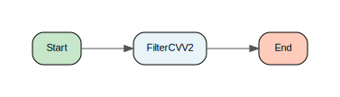

[↑ Back to Inventory](#process-inventory)

#### Process: CustomerBillProduction-Gemini/UtilityServices/ExceptionHandling/Filtering/ExceptionSchemaFilter.process {: #customerbillproductiongeminiutilityservicesexceptionhandlingfilteringexceptionschemafilterprocess }

[↑ Back to Inventory](#process-inventory)

#### Process: CustomerBillProduction-Gemini/UtilityServices/ExceptionHandling/Filtering/ServiceExceptionFilter.process {: #customerbillproductiongeminiutilityservicesexceptionhandlingfilteringserviceexceptionfilterprocess }

[↑ Back to Inventory](#process-inventory)

#### Process: CustomerBillProduction-Gemini/UtilityServices/ExceptionHandling/Filtering/SpecialExceptions/GetSpecialExceptionList.process {: #customerbillproductiongeminiutilityservicesexceptionhandlingfilteringspecialexceptionsgetspecialexceptionlistprocess }

[↑ Back to Inventory](#process-inventory)

#### Process: CustomerBillProduction-Gemini/UtilityServices/ExceptionHandling/Filtering/SpecialExceptions/TraceSpecialException.process {: #customerbillproductiongeminiutilityservicesexceptionhandlingfilteringspecialexceptionstracespecialexceptionprocess }

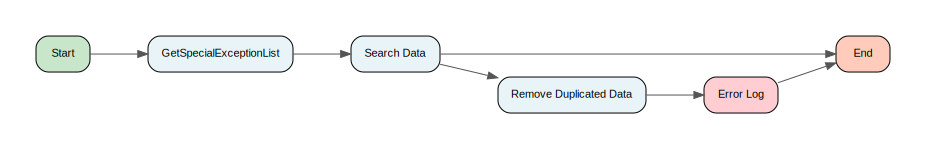

[↑ Back to Inventory](#process-inventory)

#### Process: CustomerBillProduction-Gemini/UtilityServices/ExceptionHandling/Filtering/SystemExceptionFilter.process {: #customerbillproductiongeminiutilityservicesexceptionhandlingfilteringsystemexceptionfilterprocess }

[↑ Back to Inventory](#process-inventory)

#### Process: CustomerBillProduction-Gemini/UtilityServices/ExceptionHandling/Interface/ServiceExceptionHandler.process {: #customerbillproductiongeminiutilityservicesexceptionhandlinginterfaceserviceexceptionhandlerprocess }

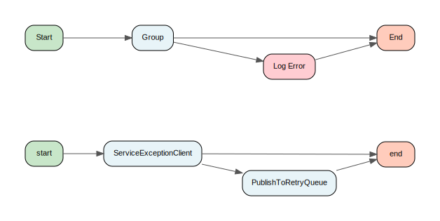

[↑ Back to Inventory](#process-inventory)

#### Process: CustomerBillProduction-Gemini/UtilityServices/ExceptionHandling/Interface/SystemExceptionHandler.process {: #customerbillproductiongeminiutilityservicesexceptionhandlinginterfacesystemexceptionhandlerprocess }

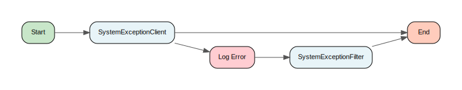

[↑ Back to Inventory](#process-inventory)

#### Process: CustomerBillProduction-Gemini/UtilityServices/ExceptionHandling/Private/MapException.process {: #customerbillproductiongeminiutilityservicesexceptionhandlingprivatemapexceptionprocess }

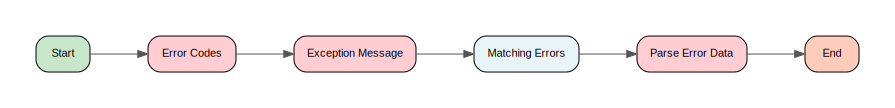

[↑ Back to Inventory](#process-inventory)

#### Process: CustomerBillProduction-Gemini/UtilityServices/ExceptionHandling/Public/MapAnyException.process {: #customerbillproductiongeminiutilityservicesexceptionhandlingpublicmapanyexceptionprocess }

[↑ Back to Inventory](#process-inventory)

#### Process: CustomerBillProduction-Gemini/UtilityServices/ExceptionHandling/ServiceExceptionHandler.process {: #customerbillproductiongeminiutilityservicesexceptionhandlingserviceexceptionhandlerprocess }

[↑ Back to Inventory](#process-inventory)

#### Process: CustomerBillProduction-Gemini/UtilityServices/ExceptionHandling/Shutdown BWEngine.process {: #customerbillproductiongeminiutilityservicesexceptionhandlingshutdownbwengineprocess }

[↑ Back to Inventory](#process-inventory)

#### Process: CustomerBillProduction-Gemini/UtilityServices/Interface/OperationReply.process {: #customerbillproductiongeminiutilityservicesinterfaceoperationreplyprocess }

[↑ Back to Inventory](#process-inventory)

#### Process: CustomerBillProduction-Gemini/UtilityServices/Interface/Private/PostProcessReply.process {: #customerbillproductiongeminiutilityservicesinterfaceprivatepostprocessreplyprocess }

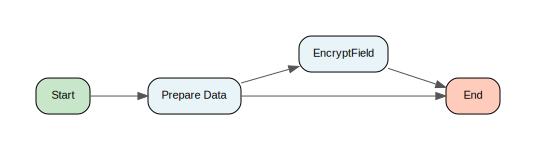

[↑ Back to Inventory](#process-inventory)

#### Process: CustomerBillProduction-Gemini/UtilityServices/Interface/Private/PreProcessRequest.process {: #customerbillproductiongeminiutilityservicesinterfaceprivatepreprocessrequestprocess }

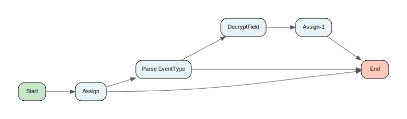

[↑ Back to Inventory](#process-inventory)

#### Process: CustomerBillProduction-Gemini/UtilityServices/Interface/Private/PublishToRetryQueue.process {: #customerbillproductiongeminiutilityservicesinterfaceprivatepublishtoretryqueueprocess }

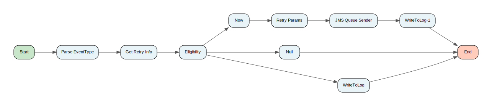

[↑ Back to Inventory](#process-inventory)

#### Process: CustomerBillProduction-Gemini/UtilityServices/Logging/LogEnd.process {: #customerbillproductiongeminiutilityserviceslogginglogendprocess }

[↑ Back to Inventory](#process-inventory)

#### Process: CustomerBillProduction-Gemini/UtilityServices/Logging/LogError.process {: #customerbillproductiongeminiutilityserviceslogginglogerrorprocess }

[↑ Back to Inventory](#process-inventory)

#### Process: CustomerBillProduction-Gemini/UtilityServices/Logging/LogFatal.process {: #customerbillproductiongeminiutilityserviceslogginglogfatalprocess }

[↑ Back to Inventory](#process-inventory)

#### Process: CustomerBillProduction-Gemini/UtilityServices/Logging/LogStart.process {: #customerbillproductiongeminiutilityserviceslogginglogstartprocess }

[↑ Back to Inventory](#process-inventory)

#### Process: CustomerBillProduction-Gemini/UtilityServices/Logging/Private/WriteToLog.process {: #customerbillproductiongeminiutilityservicesloggingprivatewritetologprocess }

[↑ Back to Inventory](#process-inventory)

#### Process: CustomerBillProduction-Gemini/UtilityServices/Logging/Public/WriteToLog.process {: #customerbillproductiongeminiutilityservicesloggingpublicwritetologprocess }

[↑ Back to Inventory](#process-inventory)

#### Process: CustomerBillProduction-Gemini/UtilityServices/VFLE/Client/AuditEventCapture/AuditEvent.process {: #customerbillproductiongeminiutilityservicesvfleclientauditeventcaptureauditeventprocess }

[↑ Back to Inventory](#process-inventory)

#### Process: CustomerBillProduction-Gemini/UtilityServices/VFLE/Client/AuditEventCapture/EmptyAuditCache.process {: #customerbillproductiongeminiutilityservicesvfleclientauditeventcaptureemptyauditcacheprocess }

[↑ Back to Inventory](#process-inventory)

#### Process: CustomerBillProduction-Gemini/UtilityServices/VFLE/Client/AuditEventCapture/RemoveFromAuditCache.process {: #customerbillproductiongeminiutilityservicesvfleclientauditeventcaptureremovefromauditcacheprocess }

[↑ Back to Inventory](#process-inventory)

#### Process: CustomerBillProduction-Gemini/UtilityServices/VFLE/Client/AuditEventCapture/UpdateAuditCache.process {: #customerbillproductiongeminiutilityservicesvfleclientauditeventcaptureupdateauditcacheprocess }

[↑ Back to Inventory](#process-inventory)

#### Process: CustomerBillProduction-Gemini/UtilityServices/VFLE/Client/ExceptionCapture/CustomServiceExceptionHandlerInterface.process {: #customerbillproductiongeminiutilityservicesvfleclientexceptioncapturecustomserviceexceptionhandlerinterfaceprocess }

[↑ Back to Inventory](#process-inventory)

#### Process: CustomerBillProduction-Gemini/UtilityServices/VFLE/Client/ExceptionCapture/EmptyAuditErrorCache.process {: #customerbillproductiongeminiutilityservicesvfleclientexceptioncaptureemptyauditerrorcacheprocess }

[↑ Back to Inventory](#process-inventory)

#### Process: CustomerBillProduction-Gemini/UtilityServices/VFLE/Client/ExceptionCapture/RemoveFromAuditErrorCache.process {: #customerbillproductiongeminiutilityservicesvfleclientexceptioncaptureremovefromauditerrorcacheprocess }

[↑ Back to Inventory](#process-inventory)

#### Process: CustomerBillProduction-Gemini/UtilityServices/VFLE/Client/ExceptionCapture/ServiceExceptionClient.process {: #customerbillproductiongeminiutilityservicesvfleclientexceptioncaptureserviceexceptionclientprocess }

[↑ Back to Inventory](#process-inventory)

#### Process: CustomerBillProduction-Gemini/UtilityServices/VFLE/Client/ExceptionCapture/SystemExceptionClient.process {: #customerbillproductiongeminiutilityservicesvfleclientexceptioncapturesystemexceptionclientprocess }

[↑ Back to Inventory](#process-inventory)

#### Process: CustomerBillProduction-Gemini/UtilityServices/VFLE/Client/ExceptionCapture/UpdateAuditErrorCache.process {: #customerbillproductiongeminiutilityservicesvfleclientexceptioncaptureupdateauditerrorcacheprocess }

[↑ Back to Inventory](#process-inventory)

#### Process: CustomerBillProduction-Gemini/UtilityServices/VFLE/Client/Public/ShutdownCleanUp.process {: #customerbillproductiongeminiutilityservicesvfleclientpublicshutdowncleanupprocess }

[↑ Back to Inventory](#process-inventory)

#### Process: CustomerBillProduction-Gemini/UtilityServices/VFLE/Client/Public/StartupInitialisation.process {: #customerbillproductiongeminiutilityservicesvfleclientpublicstartupinitialisationprocess }

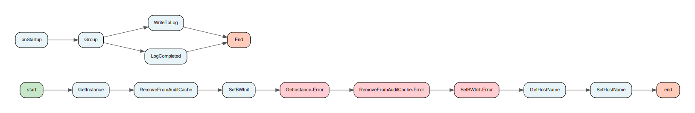

[↑ Back to Inventory](#process-inventory)

## Global Variables
| Name | Value | Status |
| :--- | :--- | :--- |
| BW_GLOBAL_TRUSTED_CA_STORE | `file:////opt/tibco/vodafo&#x200B;ne/certificates` | ✅ OK |
| DirLedger | `.` | ✅ OK |
| DirTrace | `.` | ✅ OK |
| Env/AuditEvents/AuditEventsToDB | `true` | ✅ OK |
| Env/AuditEvents/GLB_CachePublishIntervalInMS | `10000` | ✅ OK |
| Env/AuditEvents/GLB_MaxMessages | `2000` | ✅ OK |
| Env/Encryption/Blowfish/MIG_CustomPadding | `0808080808080808` | ✅ OK |
| Env/Encryption/Blowfish/MIG_EncoderType | `Blowfish/ECB/NoPadding` | ✅ OK |
| Env/Encryption/Blowfish/MIG_Key | `#!8Ru6r1465yBvISWFXn6yL80Khw/k...` | ✅ OK |
| Env/Encryption/DES3/MIG_Init_Vector | `#!3j/ew91SIOhFfyIKiZCWF3Z&#x200B;jc3cKOoJlhL8+rI4/UCZsW2hY&#x200B;IbXb0ZnHerPNEXZL` | ✅ OK |
| Env/Encryption/DES3/MIG_Key | `#!g8Nn66YakZR1BJnU6zfGoA718JqV...` | ✅ OK |
| Env/Encryption/GLB_KeyRefreshIntervalDays | `1...` | ✅ OK |
| Env/Encryption/GLB_KeyRefreshStartTime | `2009 AUG 31 06:31:00 GMT...` | ✅ OK |
| Env/Encryption/MIG_Roles | `ETU,RETAIL_DB` | ✅ OK |
| Env/Encryption/RSA/Keys/Composite/MIG_Modulus | `#!jH8ljLaTNhVFzLedJNf/JeDUp2rj...` | ✅ OK |
| Env/Encryption/RSA/Keys/Composite/MIG_PrivateExponent | `#!9ObmMlIE8LYViYxZFE+48K/b76d/...` | ✅ OK |
| Env/Encryption/RSA/Keys/Composite/MIG_PublicExponent | `#!KbI8WdnStbZQ7be6DS7KpHg3Zh9E...` | ✅ OK |
| Env/Encryption/RSA/Keys/Default/MIG_Private | `#!FgjM+51HZ2vNMhHDCVdumkRC2O59...` | ✅ OK |
| Env/Encryption/RSA/Keys/Default/MIG_Public | `#!hgroTVGIUPFBYX1/ssTWdkJNi0dM...` | ✅ OK |
| Env/Encryption/RSA/Keys/PEM/MIG_Private | `#!jAl3GQRh65XCdqk+bHssL54DouQy...` | ✅ OK |
| Env/Encryption/RSA/Keys/PEM/MIG_Public | `#!196ZiHMygi9+IFoM8QfyLS2Fp8hZ...` | ✅ OK |
| Env/Encryption/RSA/MIG_EncoderType | `RSA/ECB/PKCS1Padding` | ✅ OK |
| Env/Encryption/RSA/MIG_Modulus_Bits | `1024...` | ✅ OK |
| Env/Exceptions/MIG_CanShutdown | `true` | ✅ OK |
| Env/Exceptions/MIG_ExtendedResultStatus | `true` | ✅ OK |
| Env/Exceptions/SpecialExceptions/GLB_Filename | `/opt/tibco/vodafone/Speci&#x200B;alExceptions.xml` | ✅ OK |
| Env/Gemini/Corporate/MIG_Domain | `SUM` | ✅ OK |
| Env/Gemini/Corporate/MIG_LogPrefix | `../../tra/domain/` | ✅ OK |
| Env/Gemini/Corporate/MIG_LogSuffix | `/application/logs/gemini/&#x200B;` | ✅ OK |
| Env/Gemini/Corporate/MIG_MaxConnections | `10` | ✅ OK |
| Env/Gemini/Corporate/MIG_Password | `#!SG8VOlBXNzo588ap1pvJDlw&#x200B;VfDvhU0IM` | ✅ OK |
| Env/Gemini/Corporate/MIG_URL | `10.12.33.13:44330` | ✅ OK |
| Env/Gemini/Corporate/MIG_UserName | `6006` | ✅ OK |
| Env/Gemini/GLB_ConnectionRetry | `2` | ✅ OK |
| Env/Gemini/GLB_ConnectionSleepInMS | `2000` | ✅ OK |
| Env/Gemini/GLB_TimeoutSleepInMS | `500` | ✅ OK |
| Env/Gemini/LibraRO/MIG_Domain | `SUM` | ✅ OK |
| Env/Gemini/LibraRO/MIG_LogPrefix | `../../tra/domain/` | ✅ OK |
| Env/Gemini/LibraRO/MIG_LogSuffix | `/application/logs/gemini/&#x200B;` | ✅ OK |
| Env/Gemini/LibraRO/MIG_MaxConnections | `10` | ✅ OK |
| Env/Gemini/LibraRO/MIG_Password | `#!HAy+DxzfbLGsrUvc3I3xIgW&#x200B;w0OFLp2c+` | ✅ OK |
| Env/Gemini/LibraRO/MIG_URL | `10.12.33.13:44330` | ✅ OK |
| Env/Gemini/LibraRO/MIG_UserName | `6006` | ✅ OK |
| Env/Gemini/LibraRW/MIG_Domain | `SUM` | ✅ OK |
| Env/Gemini/LibraRW/MIG_LogPrefix | `../../tra/domain/` | ✅ OK |
| Env/Gemini/LibraRW/MIG_LogSuffix | `/application/logs/gemini/&#x200B;` | ✅ OK |
| Env/Gemini/LibraRW/MIG_MaxConnections | `10` | ✅ OK |
| Env/Gemini/LibraRW/MIG_Password | `#!jSbZTsnTWg0n1YdWuXmJO8G&#x200B;2DX0AhN9w` | ✅ OK |
| Env/Gemini/LibraRW/MIG_URL | `10.12.33.13:44330` | ✅ OK |
| Env/Gemini/LibraRW/MIG_UserName | `6006` | ✅ OK |
| Env/HTTP/SOAP/MIG_Host | `localhost` | ✅ OK |
| Env/HTTP/SOAP/MIG_Port | `8081` | ✅ OK |
| Env/HTTP/XML/MIG_DefaultEncoding | `ISO8859_1` | ✅ OK |
| Env/HTTP/XML/MIG_Host | `localhost` | ✅ OK |
| Env/HTTP/XML/MIG_Port | `8082` | ✅ OK |
| Env/JMS/AuditEvents/GLB_JMS_AuditEventsTopic | `AuditEvents` | ✅ OK |
| Env/JMS/Connections/Audit/GLB_QueueConnectionFactory | `MAPTILQueueConnectionFact&#x200B;ory` | ✅ OK |
| Env/JMS/Connections/Audit/GLB_TopicConnectionFactory | `MAPTILTopicConnectionFact&#x200B;ory` | ✅ OK |
| Env/JMS/Connections/Audit/MIG_JMSURL | `tcp://tibtest5:8222,tcp:/&#x200B;/tibtest5:8222` | ✅ OK |
| Env/JMS/Connections/Audit/MIG_Password | `#!vb7ixKlJvqj+WFfvmOur8gz&#x200B;nh4H2uqK8` | ✅ OK |
| Env/JMS/Connections/Audit/MIG_Username | `tilbw` | ✅ OK |
| Env/JMS/Connections/BW/GLB_QueueConnectionFactory | `MAPTILQueueConnectionFact&#x200B;ory` | ✅ OK |
| Env/JMS/Connections/BW/GLB_TopicConnectionFactory | `MAPTILTopicConnectionFact&#x200B;ory` | ✅ OK |
| Env/JMS/Connections/BW/MIG_JMSURL | `tcp://hscot07:8222,tcp://&#x200B;hscot07:8222` | ✅ OK |
| Env/JMS/Connections/BW/MIG_Password | `#!DiQlS5WK5/hJrWQiY2s6o/+&#x200B;cQazyYxDU` | ✅ OK |
| Env/JMS/Connections/BW/MIG_Username | `tilbw` | ✅ OK |
| Env/JMS/ErrorHandling/GLB_JMS_ExceptionNotifyTopic | `Exception.NOTIFY` | ✅ OK |
| Env/JMS/ErrorHandling/GLB_JMS_InvalidMessageQueue | `InvalidMessage` | ✅ OK |
| Env/JMS/ErrorHandling/GLB_JMS_ServiceExceptionQueue | `ServiceException` | ✅ OK |
| Env/JMS/ErrorHandling/JMS_TIBCO_COMPRESS | `false` | ✅ OK |
| Env/JMS/ErrorHandling/JMS_TIBCO_PRESERVE_UNDELIVERED | `false` | ✅ OK |
| Env/JMS/ErrorHandling/MIG_EnableExceptionQueues | `true` | ✅ OK |
| Env/JMS/ErrorHandling/MIG_Expiration | `0` | ✅ OK |
| Env/JMS/Invocation/MIG_Timeout | `30` | ✅ OK |
| Env/JMS/JNDI/MIG_Password | `#!hI1f27DGaBrdd9XiJaYJLfk&#x200B;mZMyL76qH` | ✅ OK |
| Env/JMS/JNDI/MIG_URL | `tibjmsnaming://hscot07:82&#x200B;22,tibjmsnaming://hscot07&#x200B;:8222` | ✅ OK |
| Env/JMS/JNDI/MIG_Username | `tilbw` | ✅ OK |
| Env/JMS/MIG_Jms_Dest_Prefix | `VOD.UK.DEV` | ✅ OK |
| Env/JMS/MIG_Jms_Dest_Prefix_IF | `VOD.UK.DEV.TILIF` | ✅ OK |
| Env/JMS/MIG_Jms_Dest_Prefix_Internal | `VOD.UK.DEV.TILINTERNAL` | ✅ OK |
| Env/JMS/MIG_ReplyToQueueByDefault | `true` | ✅ OK |
| Env/JMS/Properties/Publish/JMS_TIBCO_PRESERVE_UNDELIVERED | `true` | ✅ OK |
| Env/JMS/Properties/Publish/MIG_DeliveryMode | `PERSISTENT` | ✅ OK |
| Env/JMS/Properties/Publish/MIG_Expiration | `0` | ✅ OK |
| Env/LogRoles/MIG_EnableDebug | `false` | ✅ OK |
| Env/LogRoles/MIG_EnableErrorDebug | `false` | ✅ OK |
| Env/LogRoles/MIG_TraceHTTPRequests | `true` | ✅ OK |
| Env/RDBMS/BusinessWorks/MIG_JDBCDriver | `tibcosoftwareinc.jdbc.ora&#x200B;cle.OracleDriver` | ✅ OK |
| Env/RDBMS/BusinessWorks/MIG_JDBCURL | `jdbc:tibcosoftwareinc:ora&#x200B;cle://hscot08:1528;SID=ED&#x200B;X4TST` | ✅ OK |
| Env/RDBMS/BusinessWorks/MIG_LoginTimeout | `30` | ✅ OK |
| Env/RDBMS/BusinessWorks/MIG_MaxConnections | `8` | ✅ OK |
| Env/RDBMS/BusinessWorks/MIG_Password | `#!0LOJinUQ1PrcNMt9VTlU3PI&#x200B;q6aZAdAQRIuKj6tx2X30=` | ✅ OK |
| Env/RDBMS/BusinessWorks/MIG_Schema | `DEVBWCPT` | ✅ OK |
| Env/RDBMS/BusinessWorks/MIG_User | `DEVBWCPT` | ✅ OK |
| Env/RDBMS/Encryption/MIG_JDBCDriver | `tibcosoftwareinc.jdbc.ora&#x200B;cle.OracleDriver` | ✅ OK |
| Env/RDBMS/Encryption/MIG_JDBCURL | `jdbc:tibcosoftwareinc:ora&#x200B;cle://aukshocr.dc-dublin.&#x200B;de:33000;SID=TIBTST1` | ✅ OK |
| Env/RDBMS/Encryption/MIG_LoginTimeout | `30` | ✅ OK |
| Env/RDBMS/Encryption/MIG_MaxConnections | `8` | ✅ OK |
| Env/RDBMS/Encryption/MIG_MaxRows | `0` | ✅ OK |
| Env/RDBMS/Encryption/MIG_Password | `#!JUDstW6dXtghRy6izHaIUOV&#x200B;hy0EC1aczInATMVxUV2deSPE3&#x200B;AMc83zIm0JPDv1MN` | ✅ OK |
| Env/RDBMS/Encryption/MIG_Schema | `c4keys_usr_db01` | ✅ OK |
| Env/RDBMS/Encryption/MIG_Timeout | `30` | ✅ OK |
| Env/RDBMS/Encryption/MIG_User | `c4keys_usr_db01` | ✅ OK |
| Env/RDBMS/ReferenceData/MIG_JDBCDriver | `tibcosoftwareinc.jdbc.ora&#x200B;cle.OracleDriver` | ✅ OK |
| Env/RDBMS/ReferenceData/MIG_JDBCURL | `jdbc:tibcosoftwareinc:ora&#x200B;cle://hscot08:1528;SID=ED&#x200B;X4TST` | ✅ OK |
| Env/RDBMS/ReferenceData/MIG_LoginTimeout | `30` | ✅ OK |
| Env/RDBMS/ReferenceData/MIG_MaxConnections | `8` | ✅ OK |
| Env/RDBMS/ReferenceData/MIG_MaxRows | `0` | ✅ OK |
| Env/RDBMS/ReferenceData/MIG_Password | `#!eR8RcW/2RW8SPQuRuWHdKTy&#x200B;CtI14PR1LP1Msm7NiAhs=` | ✅ OK |
| Env/RDBMS/ReferenceData/MIG_Timeout | `30` | ✅ OK |
| Env/RDBMS/ReferenceData/MIG_User | `DEVTILBL` | ✅ OK |
| Env/RDBMS/ReferenceData/Ping/MIG_RepeatMS | `30000` | ✅ OK |
| Env/ReferenceData/Gemini/MIG_CountryInfoRefreshDays | `7` | ✅ OK |
| Env/ReferenceData/Gemini/MIG_FeatureInfoRefreshDays | `7` | ✅ OK |
| Env/ReferenceData/Gemini/MIG_SOCDetailsRefreshDays | `7` | ✅ OK |
| Env/ReferenceData/Gemini/MIG_SpecialInstructionRefreshDays | `7` | ✅ OK |
| Env/ReferenceData/Gemini/MIG_TariffServiceInfoRefreshDays | `7` | ✅ OK |
| Env/ReferenceData/MIG_AccountCategoryRefreshDays | `7` | ✅ OK |
| Env/ReferenceData/MIG_AccountTypesRefreshDays | `7` | ✅ OK |
| Env/ReferenceData/MIG_ActivityReasonsRefreshDays | `7` | ✅ OK |
| Env/ReferenceData/MIG_BANTrialRefreshDays | `7` | ✅ OK |
| Env/ReferenceData/MIG_CaseTextRefreshDays | `7` | ✅ OK |
| Env/ReferenceData/MIG_ContentPackRefreshDays | `7` | ✅ OK |
| Env/ReferenceData/MIG_CountryVatCodeRefreshDays | `7` | ✅ OK |
| Env/ReferenceData/MIG_DefaultRefreshDays | `1` | ✅ OK |
| Env/ReferenceData/MIG_DestinationCodesRefreshDays | `7` | ✅ OK |
| Env/ReferenceData/MIG_ExtrasPackValueRefreshDays | `7` | ✅ OK |
| Env/ReferenceData/MIG_NetworkNameRefreshDays | `7` | ✅ OK |
| Env/ReferenceData/MIG_ServiceProviderAuthRefreshDays | `7` | ✅ OK |
| Env/ReferenceData/MIG_TariffRefreshDays | `7` | ✅ OK |
| Env/ReferenceData/MIG_TariffType_International | `INTL` | ✅ OK |
| Env/ReferenceData/MIG_TeamIDRefreshDays | `7` | ✅ OK |
| Env/ReferenceData/MIG_TeamIDTrialRefreshDays | `7` | ✅ OK |
| Env/ReferenceData/MIG_VatCodeRefreshDays | `7` | ✅ OK |
| Env/TCP/MIG_Host | `localhost` | ✅ OK |
| Env/TCP/MIG_Port | `8110` | ✅ OK |
| Env/TCP/MIG_Timeout | `10` | ✅ OK |
| Env/VESTA/APIVersion | `v1.0` | ✅ OK |
| Env/VESTA/Encryption/AES/MIG_AliasInKeyStore | `vestakey...` | ✅ OK |
| Env/VESTA/Encryption/AES/MIG_KeyFile | `/opt/tibco/vodafone/vesta/heri...` | ✅ OK |
| Env/VESTA/Encryption/AES/MIG_KeyPassword | `#!rxY5Fclg9p+t04cgWoIfdw96hdx+...` | ✅ OK |
| Env/VESTA/Encryption/AES/MIG_KeyStorePassword | `#!pTWNc5RGnQTJpPINtxp0aakadt4E...` | ✅ OK |
| Env/VESTA/GLB_Debug | `false` | ✅ OK |
| Env/VESTA/HTTPProxy/GLB_UseProxy | `true` | ✅ OK |
| Env/VESTA/HTTPProxy/MIG_Host | `vfukukproxy.internal.voda&#x200B;fone.com` | ✅ OK |
| Env/VESTA/HTTPProxy/MIG_Port | `8080` | ✅ OK |
| Env/VESTA/MIG_Timeout | `30` | ✅ OK |
| Env/VESTA/SOAP/GLB_Scheme | `https` | ✅ OK |
| Env/VESTA/SOAP/MIG_Host | `185.84.253.145` | ✅ OK |
| Env/VESTA/SOAP/MIG_Port | `443` | ✅ OK |
| Env/VESTA/SOAP/MIG_URI | `/Proxy/Service` | ✅ OK |
| GLB_TILVersion | `TIL-Build24` | ✅ OK |
| HawkEnabled | `true` | ✅ OK |
| JmsProviderUrl | `DO_NOT_USE` | ✅ OK |
| JmsSslProviderUrl | `DO_NOT_USE` | ✅ OK |
| Processes/Billing/BalanceManagement/DebitCreditManagement/SendAdHocCardPayment/MIG_Init_Vector | `2063FE15DA9BD923` | ✅ OK |
| Processes/Billing/BalanceManagement/DebitCreditManagement/SendAdHocCardPayment/MIG_Key | `AE2A05D8ABEC46E345345345354345...` | ✅ OK |
| Processes/Billing/BalanceManagement/DebitCreditManagement/SendAdHocCardPayment/MIG_Timeout | `300` | ✅ OK |
| Processes/Billing/CustomerBillProduction/BillFormatting/GetBalanceForBAN/MIG_Timeout | `300` | ✅ OK |
| Processes/Billing/CustomerBillProduction/BillFormatting/GetBillDates/MIG_Timeout | `300` | ✅ OK |
| Processes/Billing/CustomerBillProduction/BillFormatting/SetBillFormat/GLB_Itemised_Bill_Soc_Prefixes | `ASD_IB,CPWIB,DXN_IB,FOCIB&#x200B;,FREEIB,GSAIB,GSMIB,GS_IB&#x200B;,IB,MPCIB,OZLDIB,PGIB,PIN&#x200B;_IB,STIB,TACIB,VRIB,VFRIB&#x200B;,VRVRIB,VAIB,VRFOC_IB,VRE&#x200B;IB,XIB,ZLDIB` | ✅ OK |
| Processes/Billing/CustomerBillProduction/BillFormatting/SetBillFormat/MIG_Timeout | `300` | ✅ OK |
| Processes/Billing/CustomerBillProduction/BillFormatting/SetPrintCategory/MIG_Timeout | `300` | ✅ OK |
| Processes/Billing/CustomerBillProduction/BillingAccounting/ChangeBillingPattern/MIG_ActivityReason | `RA` | ✅ OK |
| Processes/Billing/CustomerBillProduction/BillingAccounting/ChangeBillingPattern/MIG_Timeout | `300` | ✅ OK |
| Processes/Billing/CustomerDiscountsAndPromotions/CustomerDiscountCalculation/GetDiscounts/MIG_CheckBANstatus | `false` | ✅ OK |
| Processes/Billing/CustomerDiscountsAndPromotions/CustomerDiscountCalculation/GetDiscounts/MIG_Timeout | `300` | ✅ OK |
| Processes/Billing/CustomerDiscountsAndPromotions/CustomerDiscountCalculation/SetAllocationCodes/MIG_Timeout | `300` | ✅ OK |
| Processes/Billing/CustomerDiscountsAndPromotions/CustomerDiscountCalculation/SetDiscount/MIG_Timeout | `300` | ✅ OK |
| Processes/Billing/PaymentMethodsManagement/PaymentMethodInformationManagement/GetPaymentInformation/MIG_Timeout | `300` | ✅ OK |
| Processes/GITA1/GITA2/GITA3/Gemini/Read-Version3/MIG_Timeout | `300` | ✅ OK |
| Processes/GITA1/GITA2/GITA3/Gemini/Write-NoReply/MIG_Timeout | `300` | ✅ OK |
| Processes/GITA1/GITA2/GITA3/Gemini/Write-Version2/MIG_Timeout | `300` | ✅ OK |
| Processes/GITA1/GITA2/GITA3/Operation-HTTP/HTTPXML/MIG_Host | `localhost` | ✅ OK |
| Processes/GITA1/GITA2/GITA3/Operation-HTTP/HTTPXML/MIG_Port | `8081` | ✅ OK |
| Processes/GITA1/GITA2/GITA3/Operation-HTTPSOAP/HTTPSOAP/MIG_Host | `localhost` | ✅ OK |
| Processes/GITA1/GITA2/GITA3/Operation-HTTPSOAP/HTTPSOAP/MIG_Port | `8081` | ✅ OK |
| Processes/GITA1/GITA2/GITA3/Operation-NoReply/Scheduled/JMSRequest/MIG_RepeatMS | `60000` | ✅ OK |
| Processes/GITA1/GITA2/GITA3/Operation-NoReply/Scheduled/JMSRequest/MIG_Schedules | `08:00-18:00` | ✅ OK |
| Processes/GITA1/GITA2/GITA3/Operation-TIMER/TIMER/MIG_RepeatMS | `0` | ✅ OK |
| Processes/GITA1/GITA2/GITA3/Operation-TIMER/TIMER/MIG_StartUnixTime | `0` | ✅ OK |
| Processes/GITA1/GITA2/GITA3/Operation-Update/Retry/JMSRequest/MIG_BatchSize | `10` | ✅ OK |
| Processes/GITA1/GITA2/GITA3/Operation-Update/Retry/JMSRequest/MIG_ErrorCodes | `` | ✅ OK |
| Processes/GITA1/GITA2/GITA3/Operation-Update/Retry/JMSRequest/MIG_MaxRetries | `10` | ✅ OK |
| Processes/GITA1/GITA2/GITA3/Operation-Update/Retry/JMSRequest/MIG_NoReply | `true` | ✅ OK |
| Processes/GITA1/GITA2/GITA3/Operation-Update/Retry/JMSRequest/MIG_RepeatMS | `60000` | ✅ OK |
| Processes/GITA1/GITA2/GITA3/Operation-Update/Retry/JMSRequest/MIG_RetryDelayMS | `3600000` | ✅ OK |
| Processes/GITA1/GITA2/GITA3/Operation-Update/Retry/JMSRequest/MIG_Timeout | `10` | ✅ OK |
| Processes/GITA1/GITA2/GITA3/Operation-Update/Scheduled/JMSRequest/MIG_RepeatMS | `60000` | ✅ OK |
| Processes/GITA1/GITA2/GITA3/Operation-Update/Scheduled/JMSRequest/MIG_Schedules | `08:00-18:00` | ✅ OK |
| Processes/ITIntegration/DataIntegration/DataCollection/IsGeminiAvailable/GLB_RepeatIntervalMS | `60000` | ✅ OK |
| Processes/ITIntegration/DataIntegration/DataCollection/IsGeminiAvailable/MIG_Timeout | `300` | ✅ OK |
| Processes/MIG_Timeout | `300` | ✅ OK |
| Processes/Retry/JMSRequest/MIG_ErrorCodes | `400-499` | ✅ OK |
| RemoteRvDaemon | `` | ✅ OK |
| RvDaemon | `tcp:7500` | ✅ OK |
| RvNetwork | `` | ✅ OK |
| RvService | `7500` | ✅ OK |
| RvaHost | `localhost` | ✅ OK |
| RvaPort | `7600` | ✅ OK |
| TIBHawkDaemon | `tcp:7474` | ✅ OK |
| TIBHawkNetwork | `` | ✅ OK |
| TIBHawkService | `7474` | ✅ OK |
| Testing/MIG_DefaultSleepMS | `0` | ✅ OK |
| Testing/StubModeFlag | `Sub` | ✅ OK |
| Testing/StubXMLRoot | `c:\cvsdir\TIL\BusinessSer&#x200B;vices\` | ✅ OK |
| Trace.Task.* | `false` | ✅ OK |
| EnableMemorySavingMode | `false` | ✅ OK |
| bw.engine.enableJobRecovery | `false` | ✅ OK |
| bw.engine.autoCheckpointRestart | `true` | ✅ OK |
| bw.engine.jobstats.enable | `false` | ✅ OK |
| log.file.encoding | `` | ✅ OK |
| bw.engine.emaEnabled | `false` | ✅ OK |
| bw.container.service | `` | ✅ OK |
| bw.container.service.rmi.port | `9995` | ✅ OK |
| bw.platform.services.retreiveresources.Enabled | `false` | ✅ OK |
| bw.platform.services.retreiveresources.Hostname | `localhost` | ✅ OK |
| bw.platform.services.retreiveresources.Httpport | `8010` | ✅ OK |
| bw.platform.services.retreiveresources.defaultEncoding | `ISO8859_1` | ✅ OK |
| bw.platform.services.retreiveresources.enableLookups | `false` | ✅ OK |
| bw.platform.services.retreiveresources.isSecure | `false` | ✅ OK |
| bw.platform.services.retreiveresources.identity | `/Identity_HTTPConnection.&#x200B;id` | ✅ OK |
| bw.log4j.configuration | `` | ✅ OK |
