# CustomerIdentityManagement-IDAM-25_10_6 — Visual Flow Diagrams

#### Process: CustomerIdentityManagement-IDAM/BusinessServices/Common/Encryption/Algorithms/AES-128.process {: #customeridentitymanagementidambusinessservicescommonencryptionalgorithmsaes128process }

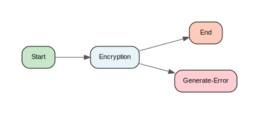

[↑ Back to Inventory](index.md)

#### Process: CustomerIdentityManagement-IDAM/BusinessServices/Common/Encryption/Algorithms/DES3.process {: #customeridentitymanagementidambusinessservicescommonencryptionalgorithmsdes3process }

[↑ Back to Inventory](index.md)

#### Process: CustomerIdentityManagement-IDAM/BusinessServices/Common/Encryption/DecryptField.process {: #customeridentitymanagementidambusinessservicescommonencryptiondecryptfieldprocess }

[↑ Back to Inventory](index.md)

#### Process: CustomerIdentityManagement-IDAM/BusinessServices/Common/Encryption/DecryptFields.process {: #customeridentitymanagementidambusinessservicescommonencryptiondecryptfieldsprocess }

[↑ Back to Inventory](index.md)

#### Process: CustomerIdentityManagement-IDAM/BusinessServices/Common/Encryption/DetermineKeyAndDecryptField_AES128.process {: #customeridentitymanagementidambusinessservicescommonencryptiondeterminekeyanddecryptfieldaes128process }

[↑ Back to Inventory](index.md)

#### Process: CustomerIdentityManagement-IDAM/BusinessServices/Common/Encryption/DetermineKeyAndDecryptFields_AES128.process {: #customeridentitymanagementidambusinessservicescommonencryptiondeterminekeyanddecryptfieldsaes128process }

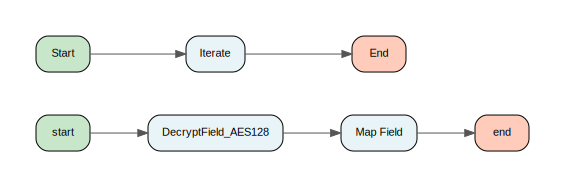

[↑ Back to Inventory](index.md)

#### Process: CustomerIdentityManagement-IDAM/BusinessServices/Common/Encryption/DetermineKeyAndEncryptField_AES128.process {: #customeridentitymanagementidambusinessservicescommonencryptiondeterminekeyandencryptfieldaes128process }

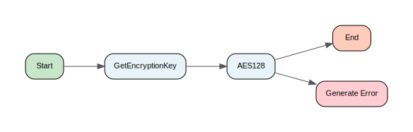

[↑ Back to Inventory](index.md)

#### Process: CustomerIdentityManagement-IDAM/BusinessServices/Common/Encryption/EncryptField.process {: #customeridentitymanagementidambusinessservicescommonencryptionencryptfieldprocess }

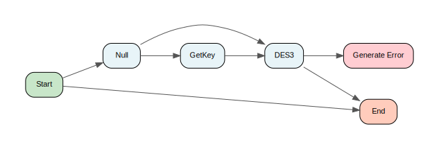

[↑ Back to Inventory](index.md)

#### Process: CustomerIdentityManagement-IDAM/BusinessServices/Common/Encryption/EncryptFields.process {: #customeridentitymanagementidambusinessservicescommonencryptionencryptfieldsprocess }

[↑ Back to Inventory](index.md)

#### Process: CustomerIdentityManagement-IDAM/BusinessServices/Common/Encryption/GetKey.process {: #customeridentitymanagementidambusinessservicescommonencryptiongetkeyprocess }

[↑ Back to Inventory](index.md)

#### Process: CustomerIdentityManagement-IDAM/BusinessServices/Common/ReferenceData/Encryption/GetEncryptionKeyIncludingType.process {: #customeridentitymanagementidambusinessservicescommonreferencedataencryptiongetencryptionkeyincludingtypeprocess }

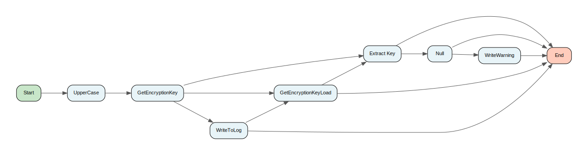

[↑ Back to Inventory](index.md)

#### Process: CustomerIdentityManagement-IDAM/BusinessServices/Common/ReferenceData/Encryption/GetEncryptionKeyLoad.process {: #customeridentitymanagementidambusinessservicescommonreferencedataencryptiongetencryptionkeyloadprocess }

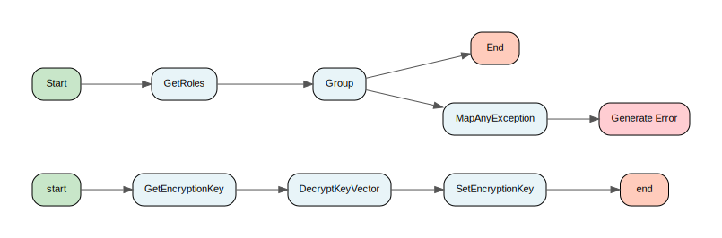

[↑ Back to Inventory](index.md)

#### Process: CustomerIdentityManagement-IDAM/BusinessServices/Common/ReferenceData/Encryption/LoadEncryptionKey.process {: #customeridentitymanagementidambusinessservicescommonreferencedataencryptionloadencryptionkeyprocess }

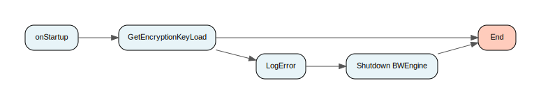

[↑ Back to Inventory](index.md)

#### Process: CustomerIdentityManagement-IDAM/BusinessServices/CustomerManagement/CustomerContactManagement/CustomerDataPresentation/GetContactDetails/Interface/JMSXMLClient.process {: #customeridentitymanagementidambusinessservicescustomermanagementcustomercontactmanagementcustomerdatapresentationgetcontactdetailsinterfacejmsxmlclientprocess }

[↑ Back to Inventory](index.md)

#### Process: CustomerIdentityManagement-IDAM/BusinessServices/CustomerManagement/CustomerContactManagement/CustomerDataPresentation/GetContactDetails/Interface/ParseResponse.process {: #customeridentitymanagementidambusinessservicescustomermanagementcustomercontactmanagementcustomerdatapresentationgetcontactdetailsinterfaceparseresponseprocess }

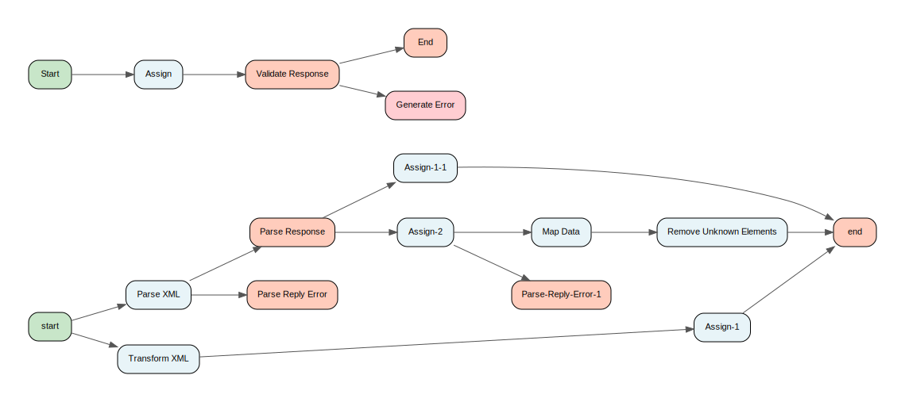

[↑ Back to Inventory](index.md)

#### Process: CustomerIdentityManagement-IDAM/BusinessServices/CustomerManagement/CustomerProfileManagement/CustomerIdentityManagement/AuthenticateIdentity/Interface/GetBusinessResources.2.process {: #customeridentitymanagementidambusinessservicescustomermanagementcustomerprofilemanagementcustomeridentitymanagementauthenticateidentityinterfacegetbusinessresources2process }

[↑ Back to Inventory](index.md)

#### Process: CustomerIdentityManagement-IDAM/BusinessServices/CustomerManagement/CustomerProfileManagement/CustomerIdentityManagement/AuthenticateIdentity/Interface/JSON/GenerateHTTPResponse.2.process {: #customeridentitymanagementidambusinessservicescustomermanagementcustomerprofilemanagementcustomeridentitymanagementauthenticateidentityinterfacejsongeneratehttpresponse2process }

[↑ Back to Inventory](index.md)

#### Process: CustomerIdentityManagement-IDAM/BusinessServices/CustomerManagement/CustomerProfileManagement/CustomerIdentityManagement/AuthenticateIdentity/Interface/JSON/GetBusinessResources2.process {: #customeridentitymanagementidambusinessservicescustomermanagementcustomerprofilemanagementcustomeridentitymanagementauthenticateidentityinterfacejsongetbusinessresources2process }

[↑ Back to Inventory](index.md)

#### Process: CustomerIdentityManagement-IDAM/BusinessServices/CustomerManagement/CustomerProfileManagement/CustomerIdentityManagement/AuthenticateIdentity/Interface/JSON/HTTPJSONServiceRequestReply.2.process {: #customeridentitymanagementidambusinessservicescustomermanagementcustomerprofilemanagementcustomeridentitymanagementauthenticateidentityinterfacejsonhttpjsonservicerequestreply2process }

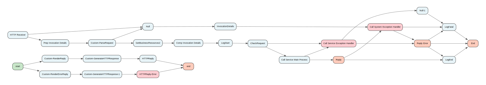

[↑ Back to Inventory](index.md)

#### Process: CustomerIdentityManagement-IDAM/BusinessServices/CustomerManagement/CustomerProfileManagement/CustomerIdentityManagement/AuthenticateIdentity/Interface/JSON/JMSServiceRequestReply.2.process {: #customeridentitymanagementidambusinessservicescustomermanagementcustomerprofilemanagementcustomeridentitymanagementauthenticateidentityinterfacejsonjmsservicerequestreply2process }

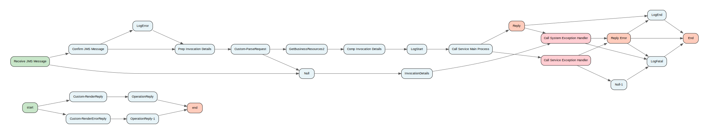

[↑ Back to Inventory](index.md)

#### Process: CustomerIdentityManagement-IDAM/BusinessServices/CustomerManagement/CustomerProfileManagement/CustomerIdentityManagement/AuthenticateIdentity/Interface/JSON/ParseRequest.2.process {: #customeridentitymanagementidambusinessservicescustomermanagementcustomerprofilemanagementcustomeridentitymanagementauthenticateidentityinterfacejsonparserequest2process }

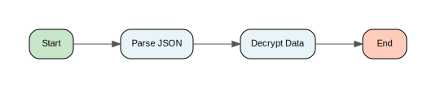

[↑ Back to Inventory](index.md)

#### Process: CustomerIdentityManagement-IDAM/BusinessServices/CustomerManagement/CustomerProfileManagement/CustomerIdentityManagement/AuthenticateIdentity/Interface/JSON/RenderErrorReply.2.process {: #customeridentitymanagementidambusinessservicescustomermanagementcustomerprofilemanagementcustomeridentitymanagementauthenticateidentityinterfacejsonrendererrorreply2process }

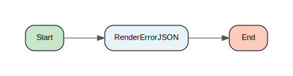

[↑ Back to Inventory](index.md)

#### Process: CustomerIdentityManagement-IDAM/BusinessServices/CustomerManagement/CustomerProfileManagement/CustomerIdentityManagement/AuthenticateIdentity/Interface/JSON/RenderReply.2.process {: #customeridentitymanagementidambusinessservicescustomermanagementcustomerprofilemanagementcustomeridentitymanagementauthenticateidentityinterfacejsonrenderreply2process }

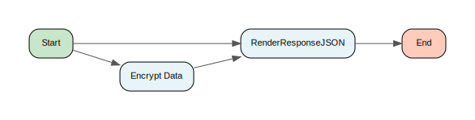

[↑ Back to Inventory](index.md)

#### Process: CustomerIdentityManagement-IDAM/BusinessServices/CustomerManagement/CustomerProfileManagement/CustomerIdentityManagement/AuthenticateIdentity/Interface/Service.2.process {: #customeridentitymanagementidambusinessservicescustomermanagementcustomerprofilemanagementcustomeridentitymanagementauthenticateidentityinterfaceservice2process }

[↑ Back to Inventory](index.md)

#### Process: CustomerIdentityManagement-IDAM/BusinessServices/CustomerManagement/CustomerProfileManagement/CustomerIdentityManagement/AuthenticateIdentity/Interface/SOAPService.2.process {: #customeridentitymanagementidambusinessservicescustomermanagementcustomerprofilemanagementcustomeridentitymanagementauthenticateidentityinterfacesoapservice2process }

[↑ Back to Inventory](index.md)

#### Process: CustomerIdentityManagement-IDAM/BusinessServices/CustomerManagement/CustomerProfileManagement/CustomerIdentityManagement/AuthenticateIdentity/Sub/AuthenticateFPin2.process {: #customeridentitymanagementidambusinessservicescustomermanagementcustomerprofilemanagementcustomeridentitymanagementauthenticateidentitysubauthenticatefpin2process }

[↑ Back to Inventory](index.md)

#### Process: CustomerIdentityManagement-IDAM/BusinessServices/CustomerManagement/CustomerProfileManagement/CustomerIdentityManagement/AuthenticateIdentity/Sub/AuthenticateFPinPersistent2.process {: #customeridentitymanagementidambusinessservicescustomermanagementcustomerprofilemanagementcustomeridentitymanagementauthenticateidentitysubauthenticatefpinpersistent2process }

[↑ Back to Inventory](index.md)

#### Process: CustomerIdentityManagement-IDAM/BusinessServices/CustomerManagement/CustomerProfileManagement/CustomerIdentityManagement/AuthenticateIdentity/Sub/MainProcess.2.process {: #customeridentitymanagementidambusinessservicescustomermanagementcustomerprofilemanagementcustomeridentitymanagementauthenticateidentitysubmainprocess2process }

[↑ Back to Inventory](index.md)

#### Process: CustomerIdentityManagement-IDAM/BusinessServices/CustomerManagement/CustomerProfileManagement/CustomerIdentityManagement/AuthenticateIdentity/Sub/TokenIntrospect.process {: #customeridentitymanagementidambusinessservicescustomermanagementcustomerprofilemanagementcustomeridentitymanagementauthenticateidentitysubtokenintrospectprocess }

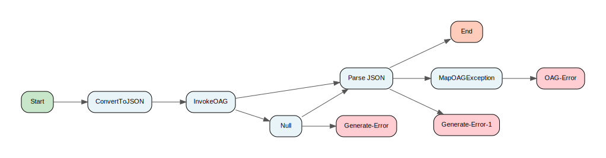

[↑ Back to Inventory](index.md)

#### Process: CustomerIdentityManagement-IDAM/BusinessServices/CustomerManagement/CustomerProfileManagement/CustomerIdentityManagement/GetIdentityList/Interface/GetBusinessResourcesLegacy.process {: #customeridentitymanagementidambusinessservicescustomermanagementcustomerprofilemanagementcustomeridentitymanagementgetidentitylistinterfacegetbusinessresourceslegacyprocess }

[↑ Back to Inventory](index.md)

#### Process: CustomerIdentityManagement-IDAM/BusinessServices/CustomerManagement/CustomerProfileManagement/CustomerIdentityManagement/GetIdentityList/Interface/GetBusinessResources.process {: #customeridentitymanagementidambusinessservicescustomermanagementcustomerprofilemanagementcustomeridentitymanagementgetidentitylistinterfacegetbusinessresourcesprocess }

[↑ Back to Inventory](index.md)

#### Process: CustomerIdentityManagement-IDAM/BusinessServices/CustomerManagement/CustomerProfileManagement/CustomerIdentityManagement/GetIdentityList/Interface/JSON/JMSServiceRequestReplyLegacy.process {: #customeridentitymanagementidambusinessservicescustomermanagementcustomerprofilemanagementcustomeridentitymanagementgetidentitylistinterfacejsonjmsservicerequestreplylegacyprocess }

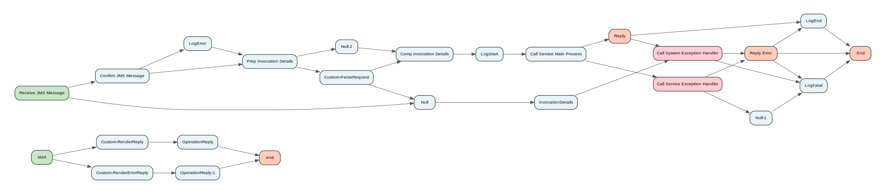

[↑ Back to Inventory](index.md)

#### Process: CustomerIdentityManagement-IDAM/BusinessServices/CustomerManagement/CustomerProfileManagement/CustomerIdentityManagement/GetIdentityList/Interface/JSON/JMSServiceRequestReply.process {: #customeridentitymanagementidambusinessservicescustomermanagementcustomerprofilemanagementcustomeridentitymanagementgetidentitylistinterfacejsonjmsservicerequestreplyprocess }

[↑ Back to Inventory](index.md)

#### Process: CustomerIdentityManagement-IDAM/BusinessServices/CustomerManagement/CustomerProfileManagement/CustomerIdentityManagement/GetIdentityList/Interface/JSON/ParseRequestLegacy.process {: #customeridentitymanagementidambusinessservicescustomermanagementcustomerprofilemanagementcustomeridentitymanagementgetidentitylistinterfacejsonparserequestlegacyprocess }

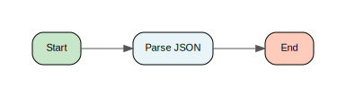

[↑ Back to Inventory](index.md)

#### Process: CustomerIdentityManagement-IDAM/BusinessServices/CustomerManagement/CustomerProfileManagement/CustomerIdentityManagement/GetIdentityList/Interface/JSON/ParseRequest.process {: #customeridentitymanagementidambusinessservicescustomermanagementcustomerprofilemanagementcustomeridentitymanagementgetidentitylistinterfacejsonparserequestprocess }

[↑ Back to Inventory](index.md)

#### Process: CustomerIdentityManagement-IDAM/BusinessServices/CustomerManagement/CustomerProfileManagement/CustomerIdentityManagement/GetIdentityList/Interface/JSON/RenderErrorReplyLegacy.process {: #customeridentitymanagementidambusinessservicescustomermanagementcustomerprofilemanagementcustomeridentitymanagementgetidentitylistinterfacejsonrendererrorreplylegacyprocess }

[↑ Back to Inventory](index.md)

#### Process: CustomerIdentityManagement-IDAM/BusinessServices/CustomerManagement/CustomerProfileManagement/CustomerIdentityManagement/GetIdentityList/Interface/JSON/RenderErrorReply.process {: #customeridentitymanagementidambusinessservicescustomermanagementcustomerprofilemanagementcustomeridentitymanagementgetidentitylistinterfacejsonrendererrorreplyprocess }

[↑ Back to Inventory](index.md)

#### Process: CustomerIdentityManagement-IDAM/BusinessServices/CustomerManagement/CustomerProfileManagement/CustomerIdentityManagement/GetIdentityList/Interface/JSON/RenderReplyLegacy.process {: #customeridentitymanagementidambusinessservicescustomermanagementcustomerprofilemanagementcustomeridentitymanagementgetidentitylistinterfacejsonrenderreplylegacyprocess }

[↑ Back to Inventory](index.md)

#### Process: CustomerIdentityManagement-IDAM/BusinessServices/CustomerManagement/CustomerProfileManagement/CustomerIdentityManagement/GetIdentityList/Interface/JSON/RenderReply.process {: #customeridentitymanagementidambusinessservicescustomermanagementcustomerprofilemanagementcustomeridentitymanagementgetidentitylistinterfacejsonrenderreplyprocess }

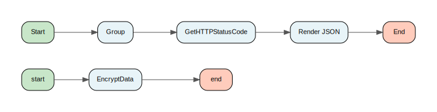

[↑ Back to Inventory](index.md)

#### Process: CustomerIdentityManagement-IDAM/BusinessServices/CustomerManagement/CustomerProfileManagement/CustomerIdentityManagement/GetIdentityList/Interface/ServiceLegacy.process {: #customeridentitymanagementidambusinessservicescustomermanagementcustomerprofilemanagementcustomeridentitymanagementgetidentitylistinterfaceservicelegacyprocess }

[↑ Back to Inventory](index.md)

#### Process: CustomerIdentityManagement-IDAM/BusinessServices/CustomerManagement/CustomerProfileManagement/CustomerIdentityManagement/GetIdentityList/Interface/Service.process {: #customeridentitymanagementidambusinessservicescustomermanagementcustomerprofilemanagementcustomeridentitymanagementgetidentitylistinterfaceserviceprocess }

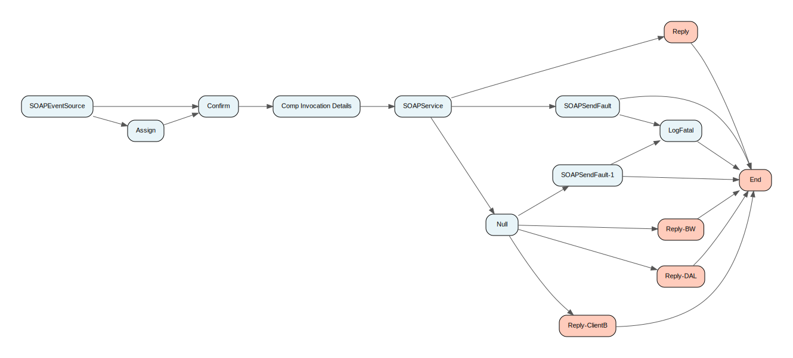

[↑ Back to Inventory](index.md)

#### Process: CustomerIdentityManagement-IDAM/BusinessServices/CustomerManagement/CustomerProfileManagement/CustomerIdentityManagement/GetIdentityList/Interface/SOAPServiceLegacy.process {: #customeridentitymanagementidambusinessservicescustomermanagementcustomerprofilemanagementcustomeridentitymanagementgetidentitylistinterfacesoapservicelegacyprocess }

[↑ Back to Inventory](index.md)

#### Process: CustomerIdentityManagement-IDAM/BusinessServices/CustomerManagement/CustomerProfileManagement/CustomerIdentityManagement/GetIdentityList/Interface/SOAPService.process {: #customeridentitymanagementidambusinessservicescustomermanagementcustomerprofilemanagementcustomeridentitymanagementgetidentitylistinterfacesoapserviceprocess }

[↑ Back to Inventory](index.md)

#### Process: CustomerIdentityManagement-IDAM/BusinessServices/CustomerManagement/CustomerProfileManagement/CustomerIdentityManagement/GetIdentityList/Sub/MainProcessLegacy.process {: #customeridentitymanagementidambusinessservicescustomermanagementcustomerprofilemanagementcustomeridentitymanagementgetidentitylistsubmainprocesslegacyprocess }

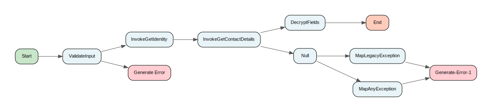

[↑ Back to Inventory](index.md)

#### Process: CustomerIdentityManagement-IDAM/BusinessServices/CustomerManagement/CustomerProfileManagement/CustomerIdentityManagement/GetIdentityList/Sub/MainProcess.process {: #customeridentitymanagementidambusinessservicescustomermanagementcustomerprofilemanagementcustomeridentitymanagementgetidentitylistsubmainprocessprocess }

[↑ Back to Inventory](index.md)

#### Process: CustomerIdentityManagement-IDAM/BusinessServices/CustomerManagement/CustomerProfileManagement/CustomerIdentityManagement/UpdateIdentity/Interface/GetBusinessResourcesLegacy.process {: #customeridentitymanagementidambusinessservicescustomermanagementcustomerprofilemanagementcustomeridentitymanagementupdateidentityinterfacegetbusinessresourceslegacyprocess }

[↑ Back to Inventory](index.md)

#### Process: CustomerIdentityManagement-IDAM/BusinessServices/CustomerManagement/CustomerProfileManagement/CustomerIdentityManagement/UpdateIdentity/Interface/JSON/JMSServiceRequestReplyLegacy.process {: #customeridentitymanagementidambusinessservicescustomermanagementcustomerprofilemanagementcustomeridentitymanagementupdateidentityinterfacejsonjmsservicerequestreplylegacyprocess }

[↑ Back to Inventory](index.md)

#### Process: CustomerIdentityManagement-IDAM/BusinessServices/CustomerManagement/CustomerProfileManagement/CustomerIdentityManagement/UpdateIdentity/Interface/JSON/ParseRequestLegacy.process {: #customeridentitymanagementidambusinessservicescustomermanagementcustomerprofilemanagementcustomeridentitymanagementupdateidentityinterfacejsonparserequestlegacyprocess }

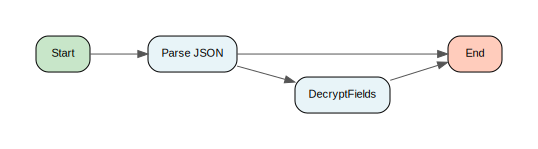

[↑ Back to Inventory](index.md)

#### Process: CustomerIdentityManagement-IDAM/BusinessServices/CustomerManagement/CustomerProfileManagement/CustomerIdentityManagement/UpdateIdentity/Interface/JSON/RenderErrorReplyLegacy.process {: #customeridentitymanagementidambusinessservicescustomermanagementcustomerprofilemanagementcustomeridentitymanagementupdateidentityinterfacejsonrendererrorreplylegacyprocess }

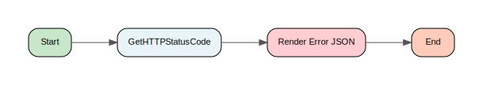

[↑ Back to Inventory](index.md)

#### Process: CustomerIdentityManagement-IDAM/BusinessServices/CustomerManagement/CustomerProfileManagement/CustomerIdentityManagement/UpdateIdentity/Interface/JSON/RenderReplyLegacy.process {: #customeridentitymanagementidambusinessservicescustomermanagementcustomerprofilemanagementcustomeridentitymanagementupdateidentityinterfacejsonrenderreplylegacyprocess }

[↑ Back to Inventory](index.md)

#### Process: CustomerIdentityManagement-IDAM/BusinessServices/CustomerManagement/CustomerProfileManagement/CustomerIdentityManagement/UpdateIdentity/Interface/SOAPServiceLegacy.process {: #customeridentitymanagementidambusinessservicescustomermanagementcustomerprofilemanagementcustomeridentitymanagementupdateidentityinterfacesoapservicelegacyprocess }

[↑ Back to Inventory](index.md)

#### Process: CustomerIdentityManagement-IDAM/BusinessServices/CustomerManagement/CustomerProfileManagement/CustomerIdentityManagement/UpdateIdentity/Sub/MainProcessLegacy.process {: #customeridentitymanagementidambusinessservicescustomermanagementcustomerprofilemanagementcustomeridentitymanagementupdateidentitysubmainprocesslegacyprocess }

[↑ Back to Inventory](index.md)

#### Process: CustomerIdentityManagement-IDAM/BusinessServices/CustomerManagement/CustomerProfileManagement/CustomerIdentityManagement/UpdatePassword/Interface/JMSSOAPClient.process {: #customeridentitymanagementidambusinessservicescustomermanagementcustomerprofilemanagementcustomeridentitymanagementupdatepasswordinterfacejmssoapclientprocess }

[↑ Back to Inventory](index.md)

#### Process: CustomerIdentityManagement-IDAM/BusinessServices/CustomerManagement/CustomerProfileManagement/CustomerIdentityManagement/UpdatePassword/Interface/ParseSOAPResponse.process {: #customeridentitymanagementidambusinessservicescustomermanagementcustomerprofilemanagementcustomeridentitymanagementupdatepasswordinterfaceparsesoapresponseprocess }

[↑ Back to Inventory](index.md)

#### Process: CustomerIdentityManagement-IDAM/BusinessServices/CustomerManagement/CustomerProfileManagement/CustomerPersonalInformationManagement/CustomerNotifications/Interface/JMSSOAPClient.process {: #customeridentitymanagementidambusinessservicescustomermanagementcustomerprofilemanagementcustomerpersonalinformationmanagementcustomernotificationsinterfacejmssoapclientprocess }

[↑ Back to Inventory](index.md)

#### Process: CustomerIdentityManagement-IDAM/BusinessServices/CustomerManagement/CustomerProfileManagement/CustomerPersonalInformationManagement/GetHLRSettings/Interface/JMSSOAPClient.2.process {: #customeridentitymanagementidambusinessservicescustomermanagementcustomerprofilemanagementcustomerpersonalinformationmanagementgethlrsettingsinterfacejmssoapclient2process }

[↑ Back to Inventory](index.md)

#### Process: CustomerIdentityManagement-IDAM/BusinessServices/CustomerManagement/CustomerProfileManagement/CustomerPersonalInformationManagement/GetHLRSettings/Interface/ParseSOAPResponse.2.process {: #customeridentitymanagementidambusinessservicescustomermanagementcustomerprofilemanagementcustomerpersonalinformationmanagementgethlrsettingsinterfaceparsesoapresponse2process }

[↑ Back to Inventory](index.md)

#### Process: CustomerIdentityManagement-IDAM/BusinessServices/CustomerManagement/CustomerProfileManagement/CustomerPersonalInformationManagement/UpdateContactDetails/Interface/JMSXMLClient.process {: #customeridentitymanagementidambusinessservicescustomermanagementcustomerprofilemanagementcustomerpersonalinformationmanagementupdatecontactdetailsinterfacejmsxmlclientprocess }

[↑ Back to Inventory](index.md)

#### Process: CustomerIdentityManagement-IDAM/BusinessServices/CustomerManagement/CustomerProfileManagement/CustomerPersonalInformationManagement/UpdateContactDetails/Interface/ParseResponse.process {: #customeridentitymanagementidambusinessservicescustomermanagementcustomerprofilemanagementcustomerpersonalinformationmanagementupdatecontactdetailsinterfaceparseresponseprocess }

[↑ Back to Inventory](index.md)

#### Process: CustomerIdentityManagement-IDAM/BusinessServices/CustomerManagement/CustomerProfileManagement/CustomerPersonalInformationManagement/UpdateRegisteredUserDetails/Interface/JMSXMLClient.2.process {: #customeridentitymanagementidambusinessservicescustomermanagementcustomerprofilemanagementcustomerpersonalinformationmanagementupdateregistereduserdetailsinterfacejmsxmlclient2process }

[↑ Back to Inventory](index.md)

#### Process: CustomerIdentityManagement-IDAM/BusinessServices/CustomerManagement/CustomerProfileManagement/CustomerPersonalInformationManagement/UpdateRegisteredUserDetails/Interface/ParseResponse.2.process {: #customeridentitymanagementidambusinessservicescustomermanagementcustomerprofilemanagementcustomerpersonalinformationmanagementupdateregistereduserdetailsinterfaceparseresponse2process }

[↑ Back to Inventory](index.md)

#### Process: CustomerIdentityManagement-IDAM/BusinessServices/EnterpriseManagement/SecurityManagement/ValidateResource/Interface/JMSSOAPClient.process {: #customeridentitymanagementidambusinessservicesenterprisemanagementsecuritymanagementvalidateresourceinterfacejmssoapclientprocess }

[↑ Back to Inventory](index.md)

#### Process: CustomerIdentityManagement-IDAM/BusinessServices/EnterpriseManagement/SecurityManagement/ValidateResource/Interface/ParseSOAPResponse.process {: #customeridentitymanagementidambusinessservicesenterprisemanagementsecuritymanagementvalidateresourceinterfaceparsesoapresponseprocess }

[↑ Back to Inventory](index.md)

#### Process: CustomerIdentityManagement-IDAM/ConnectivityServices/Coherence/Private/LoadAllCoherenceErrorCodes.process {: #customeridentitymanagementidamconnectivityservicescoherenceprivateloadallcoherenceerrorcodesprocess }

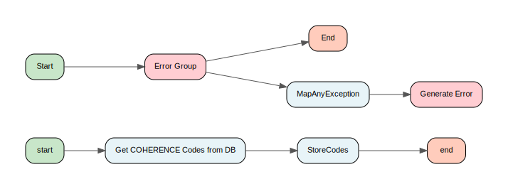

[↑ Back to Inventory](index.md)

#### Process: CustomerIdentityManagement-IDAM/ConnectivityServices/Coherence/Private/WriteServerConfigFile.process {: #customeridentitymanagementidamconnectivityservicescoherenceprivatewriteserverconfigfileprocess }

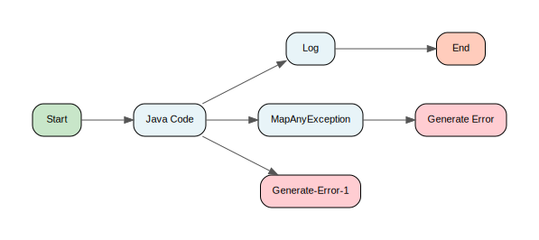

[↑ Back to Inventory](index.md)

#### Process: CustomerIdentityManagement-IDAM/ConnectivityServices/Coherence/Public/LoadAllCoherenceErrorCodes.process {: #customeridentitymanagementidamconnectivityservicescoherencepublicloadallcoherenceerrorcodesprocess }

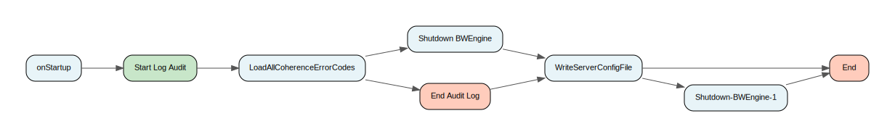

[↑ Back to Inventory](index.md)

#### Process: CustomerIdentityManagement-IDAM/ConnectivityServices/Common/Private/RenderBackEndError.process {: #customeridentitymanagementidamconnectivityservicescommonprivaterenderbackenderrorprocess }

[↑ Back to Inventory](index.md)

#### Process: CustomerIdentityManagement-IDAM/ConnectivityServices/JMS/Private/InvokeOnTopic.process {: #customeridentitymanagementidamconnectivityservicesjmsprivateinvokeontopicprocess }

[↑ Back to Inventory](index.md)

#### Process: CustomerIdentityManagement-IDAM/ConnectivityServices/JMS/Private/PrepareData.process {: #customeridentitymanagementidamconnectivityservicesjmsprivatepreparedataprocess }

[↑ Back to Inventory](index.md)

#### Process: CustomerIdentityManagement-IDAM/ConnectivityServices/JMS/Private/PublishToTopic-Object.process {: #customeridentitymanagementidamconnectivityservicesjmsprivatepublishtotopicobjectprocess }

[↑ Back to Inventory](index.md)

#### Process: CustomerIdentityManagement-IDAM/ConnectivityServices/JMS/Private/PublishToTopic.process {: #customeridentitymanagementidamconnectivityservicesjmsprivatepublishtotopicprocess }

[↑ Back to Inventory](index.md)

#### Process: CustomerIdentityManagement-IDAM/ConnectivityServices/JMS/Public/InvokeOnTopic.process {: #customeridentitymanagementidamconnectivityservicesjmspublicinvokeontopicprocess }

[↑ Back to Inventory](index.md)

#### Process: CustomerIdentityManagement-IDAM/ConnectivityServices/JMS/Public/PublishToTopic.process {: #customeridentitymanagementidamconnectivityservicesjmspublicpublishtotopicprocess }

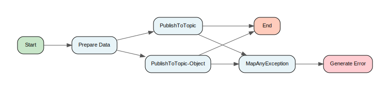

[↑ Back to Inventory](index.md)

#### Process: CustomerIdentityManagement-IDAM/ConnectivityServices/OAG/Private/LoadAllOAGErrorCodes.process {: #customeridentitymanagementidamconnectivityservicesoagprivateloadalloagerrorcodesprocess }

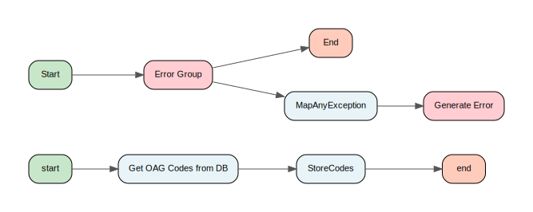

[↑ Back to Inventory](index.md)

#### Process: CustomerIdentityManagement-IDAM/ConnectivityServices/OAG/Public/InvokeOAGApi.process {: #customeridentitymanagementidamconnectivityservicesoagpublicinvokeoagapiprocess }

[↑ Back to Inventory](index.md)

#### Process: CustomerIdentityManagement-IDAM/ConnectivityServices/OAG/Public/LoadAllOAGErrorCodes.process {: #customeridentitymanagementidamconnectivityservicesoagpublicloadalloagerrorcodesprocess }

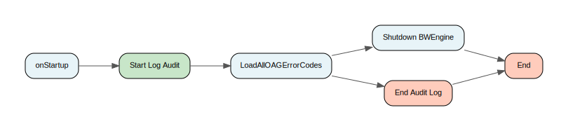

[↑ Back to Inventory](index.md)

#### Process: CustomerIdentityManagement-IDAM/ConnectivityServices/OAG/Public/MapOAGException.process {: #customeridentitymanagementidamconnectivityservicesoagpublicmapoagexceptionprocess }

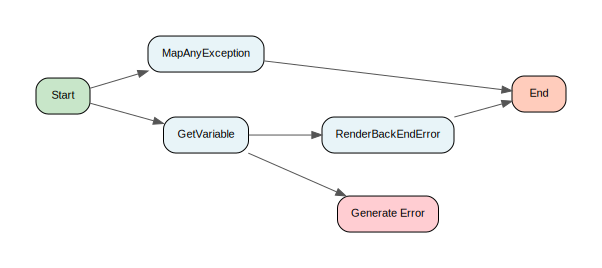

[↑ Back to Inventory](index.md)

#### Process: CustomerIdentityManagement-IDAM/ConnectivityServices/OAM/Private/LoadAllOAMErrorCodes.process {: #customeridentitymanagementidamconnectivityservicesoamprivateloadalloamerrorcodesprocess }

[↑ Back to Inventory](index.md)

#### Process: CustomerIdentityManagement-IDAM/ConnectivityServices/OAM/Private/MapOAMException.process {: #customeridentitymanagementidamconnectivityservicesoamprivatemapoamexceptionprocess }

[↑ Back to Inventory](index.md)

#### Process: CustomerIdentityManagement-IDAM/ConnectivityServices/OAM/Public/AuthenticateIdentity.process {: #customeridentitymanagementidamconnectivityservicesoampublicauthenticateidentityprocess }

[↑ Back to Inventory](index.md)

#### Process: CustomerIdentityManagement-IDAM/ConnectivityServices/OAM/Public/GenerateOnlineSessionToken.process {: #customeridentitymanagementidamconnectivityservicesoampublicgenerateonlinesessiontokenprocess }

[↑ Back to Inventory](index.md)

#### Process: CustomerIdentityManagement-IDAM/ConnectivityServices/OAM/Public/LoadAllOAMErrorCodes.process {: #customeridentitymanagementidamconnectivityservicesoampublicloadalloamerrorcodesprocess }

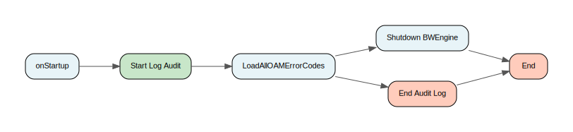

[↑ Back to Inventory](index.md)

#### Process: CustomerIdentityManagement-IDAM/ConnectivityServices/OIM/Private/LoadAllOIMErrorCodes.process {: #customeridentitymanagementidamconnectivityservicesoimprivateloadalloimerrorcodesprocess }

[↑ Back to Inventory](index.md)

#### Process: CustomerIdentityManagement-IDAM/ConnectivityServices/OIM/Public/GetIdentity.process {: #customeridentitymanagementidamconnectivityservicesoimpublicgetidentityprocess }

[↑ Back to Inventory](index.md)

#### Process: CustomerIdentityManagement-IDAM/ConnectivityServices/OIM/Public/LoadAllOIMErrorCodes.process {: #customeridentitymanagementidamconnectivityservicesoimpublicloadalloimerrorcodesprocess }

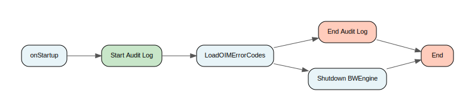

[↑ Back to Inventory](index.md)

#### Process: CustomerIdentityManagement-IDAM/ConnectivityServices/OIM/Public/MapOIMException.process {: #customeridentitymanagementidamconnectivityservicesoimpublicmapoimexceptionprocess }

[↑ Back to Inventory](index.md)

#### Process: CustomerIdentityManagement-IDAM/UtilityServices/ExceptionHandling/Filtering/CVV2Filter.process {: #customeridentitymanagementidamutilityservicesexceptionhandlingfilteringcvv2filterprocess }

[↑ Back to Inventory](index.md)

#### Process: CustomerIdentityManagement-IDAM/UtilityServices/ExceptionHandling/Filtering/ExceptionSchemaFilter.process {: #customeridentitymanagementidamutilityservicesexceptionhandlingfilteringexceptionschemafilterprocess }

[↑ Back to Inventory](index.md)

#### Process: CustomerIdentityManagement-IDAM/UtilityServices/ExceptionHandling/Filtering/Security/CVV2Filter.process {: #customeridentitymanagementidamutilityservicesexceptionhandlingfilteringsecuritycvv2filterprocess }

[↑ Back to Inventory](index.md)

#### Process: CustomerIdentityManagement-IDAM/UtilityServices/ExceptionHandling/Filtering/ServiceExceptionFilter.process {: #customeridentitymanagementidamutilityservicesexceptionhandlingfilteringserviceexceptionfilterprocess }

[↑ Back to Inventory](index.md)

#### Process: CustomerIdentityManagement-IDAM/UtilityServices/ExceptionHandling/Filtering/SpecialExceptions/GetSpecialExceptionList.process {: #customeridentitymanagementidamutilityservicesexceptionhandlingfilteringspecialexceptionsgetspecialexceptionlistprocess }

[↑ Back to Inventory](index.md)

#### Process: CustomerIdentityManagement-IDAM/UtilityServices/ExceptionHandling/Filtering/SpecialExceptions/TraceSpecialException.process {: #customeridentitymanagementidamutilityservicesexceptionhandlingfilteringspecialexceptionstracespecialexceptionprocess }

[↑ Back to Inventory](index.md)

#### Process: CustomerIdentityManagement-IDAM/UtilityServices/ExceptionHandling/Filtering/SystemExceptionFilter.process {: #customeridentitymanagementidamutilityservicesexceptionhandlingfilteringsystemexceptionfilterprocess }

[↑ Back to Inventory](index.md)

#### Process: CustomerIdentityManagement-IDAM/UtilityServices/ExceptionHandling/Interface/ServiceExceptionHandler.process {: #customeridentitymanagementidamutilityservicesexceptionhandlinginterfaceserviceexceptionhandlerprocess }

[↑ Back to Inventory](index.md)

#### Process: CustomerIdentityManagement-IDAM/UtilityServices/ExceptionHandling/Interface/SystemExceptionHandler.process {: #customeridentitymanagementidamutilityservicesexceptionhandlinginterfacesystemexceptionhandlerprocess }

[↑ Back to Inventory](index.md)

#### Process: CustomerIdentityManagement-IDAM/UtilityServices/ExceptionHandling/Private/GetHTTPStatusCode.process {: #customeridentitymanagementidamutilityservicesexceptionhandlingprivategethttpstatuscodeprocess }

[↑ Back to Inventory](index.md)

#### Process: CustomerIdentityManagement-IDAM/UtilityServices/ExceptionHandling/Private/GetHTTPStatusCodes.process {: #customeridentitymanagementidamutilityservicesexceptionhandlingprivategethttpstatuscodesprocess }

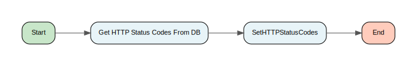

[↑ Back to Inventory](index.md)

#### Process: CustomerIdentityManagement-IDAM/UtilityServices/ExceptionHandling/Private/MapException.process {: #customeridentitymanagementidamutilityservicesexceptionhandlingprivatemapexceptionprocess }

[↑ Back to Inventory](index.md)

#### Process: CustomerIdentityManagement-IDAM/UtilityServices/ExceptionHandling/Private/MapResultStatus.process {: #customeridentitymanagementidamutilityservicesexceptionhandlingprivatemapresultstatusprocess }

[↑ Back to Inventory](index.md)

#### Process: CustomerIdentityManagement-IDAM/UtilityServices/ExceptionHandling/Public/LoadAllHTTPStatusCodes.process {: #customeridentitymanagementidamutilityservicesexceptionhandlingpublicloadallhttpstatuscodesprocess }

[↑ Back to Inventory](index.md)

#### Process: CustomerIdentityManagement-IDAM/UtilityServices/ExceptionHandling/Public/MapAnyException.process {: #customeridentitymanagementidamutilityservicesexceptionhandlingpublicmapanyexceptionprocess }

[↑ Back to Inventory](index.md)

#### Process: CustomerIdentityManagement-IDAM/UtilityServices/ExceptionHandling/Public/MapLegacyException.process {: #customeridentitymanagementidamutilityservicesexceptionhandlingpublicmaplegacyexceptionprocess }

[↑ Back to Inventory](index.md)

#### Process: CustomerIdentityManagement-IDAM/UtilityServices/ExceptionHandling/ServiceExceptionHandler.process {: #customeridentitymanagementidamutilityservicesexceptionhandlingserviceexceptionhandlerprocess }

[↑ Back to Inventory](index.md)

#### Process: CustomerIdentityManagement-IDAM/UtilityServices/ExceptionHandling/Shutdown BWEngine.process {: #customeridentitymanagementidamutilityservicesexceptionhandlingshutdownbwengineprocess }

[↑ Back to Inventory](index.md)

#### Process: CustomerIdentityManagement-IDAM/UtilityServices/Interface/OperationReply.process {: #customeridentitymanagementidamutilityservicesinterfaceoperationreplyprocess }

[↑ Back to Inventory](index.md)

#### Process: CustomerIdentityManagement-IDAM/UtilityServices/Interface/Private/JSON/CheckRequest.process {: #customeridentitymanagementidamutilityservicesinterfaceprivatejsoncheckrequestprocess }

[↑ Back to Inventory](index.md)

#### Process: CustomerIdentityManagement-IDAM/UtilityServices/Interface/Private/PublishToRetryQueue.process {: #customeridentitymanagementidamutilityservicesinterfaceprivatepublishtoretryqueueprocess }

[↑ Back to Inventory](index.md)

#### Process: CustomerIdentityManagement-IDAM/UtilityServices/Interface/Private/SOAP/CheckRequest.process {: #customeridentitymanagementidamutilityservicesinterfaceprivatesoapcheckrequestprocess }

[↑ Back to Inventory](index.md)

#### Process: CustomerIdentityManagement-IDAM/UtilityServices/Interface/Private/SOAP/GenerateInvocationDetails.process {: #customeridentitymanagementidamutilityservicesinterfaceprivatesoapgenerateinvocationdetailsprocess }

[↑ Back to Inventory](index.md)

#### Process: CustomerIdentityManagement-IDAM/UtilityServices/Interface/Private/SOAP/GenerateResponseHeader.process {: #customeridentitymanagementidamutilityservicesinterfaceprivatesoapgenerateresponseheaderprocess }

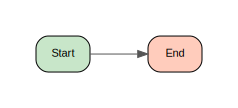

[↑ Back to Inventory](index.md)

#### Process: CustomerIdentityManagement-IDAM/UtilityServices/Logging/LogEnd.process {: #customeridentitymanagementidamutilityserviceslogginglogendprocess }

[↑ Back to Inventory](index.md)

#### Process: CustomerIdentityManagement-IDAM/UtilityServices/Logging/LogError.process {: #customeridentitymanagementidamutilityserviceslogginglogerrorprocess }

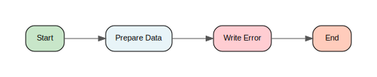

[↑ Back to Inventory](index.md)

#### Process: CustomerIdentityManagement-IDAM/UtilityServices/Logging/LogFatal.process {: #customeridentitymanagementidamutilityserviceslogginglogfatalprocess }

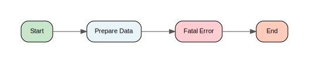

[↑ Back to Inventory](index.md)

#### Process: CustomerIdentityManagement-IDAM/UtilityServices/Logging/LogStart.process {: #customeridentitymanagementidamutilityserviceslogginglogstartprocess }

[↑ Back to Inventory](index.md)

#### Process: CustomerIdentityManagement-IDAM/UtilityServices/Logging/Private/WriteToLog.process {: #customeridentitymanagementidamutilityservicesloggingprivatewritetologprocess }

[↑ Back to Inventory](index.md)

#### Process: CustomerIdentityManagement-IDAM/UtilityServices/Logging/Public/CSAuditEnd.process {: #customeridentitymanagementidamutilityservicesloggingpubliccsauditendprocess }

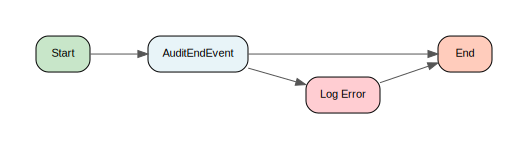

[↑ Back to Inventory](index.md)

#### Process: CustomerIdentityManagement-IDAM/UtilityServices/Logging/Public/CSAuditStart.process {: #customeridentitymanagementidamutilityservicesloggingpubliccsauditstartprocess }

[↑ Back to Inventory](index.md)

#### Process: CustomerIdentityManagement-IDAM/UtilityServices/Logging/Public/WriteToLog.process {: #customeridentitymanagementidamutilityservicesloggingpublicwritetologprocess }

[↑ Back to Inventory](index.md)

#### Process: CustomerIdentityManagement-IDAM/UtilityServices/Security/Tokens/Private/CheckRequest.process {: #customeridentitymanagementidamutilityservicessecuritytokensprivatecheckrequestprocess }

[↑ Back to Inventory](index.md)

#### Process: CustomerIdentityManagement-IDAM/UtilityServices/Security/Tokens/Private/ExtractOAuthToken.process {: #customeridentitymanagementidamutilityservicessecuritytokensprivateextractoauthtokenprocess }

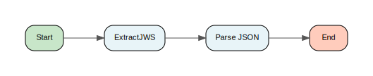

[↑ Back to Inventory](index.md)

#### Process: CustomerIdentityManagement-IDAM/UtilityServices/Security/Tokens/Private/ExtractSAMLToken.process {: #customeridentitymanagementidamutilityservicessecuritytokensprivateextractsamltokenprocess }

[↑ Back to Inventory](index.md)

#### Process: CustomerIdentityManagement-IDAM/UtilityServices/Security/Tokens/Private/ExtractToken.process {: #customeridentitymanagementidamutilityservicessecuritytokensprivateextracttokenprocess }

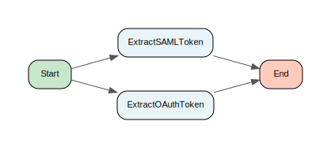

[↑ Back to Inventory](index.md)

#### Process: CustomerIdentityManagement-IDAM/UtilityServices/Security/Tokens/Private/GetAddlResourceValidation.process {: #customeridentitymanagementidamutilityservicessecuritytokensprivategetaddlresourcevalidationprocess }

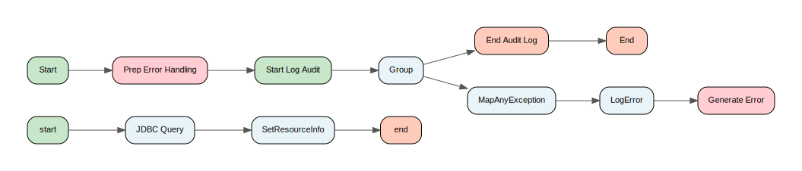

[↑ Back to Inventory](index.md)

#### Process: CustomerIdentityManagement-IDAM/UtilityServices/Security/Tokens/Private/LoadExpiration.process {: #customeridentitymanagementidamutilityservicessecuritytokensprivateloadexpirationprocess }

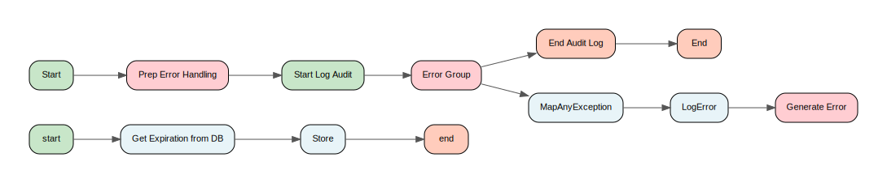

[↑ Back to Inventory](index.md)

#### Process: CustomerIdentityManagement-IDAM/UtilityServices/Security/Tokens/Private/LoadOperationValidation.process {: #customeridentitymanagementidamutilityservicessecuritytokensprivateloadoperationvalidationprocess }

[↑ Back to Inventory](index.md)

#### Process: CustomerIdentityManagement-IDAM/UtilityServices/Security/Tokens/Private/LoadPartnerBIDMapping.process {: #customeridentitymanagementidamutilityservicessecuritytokensprivateloadpartnerbidmappingprocess }

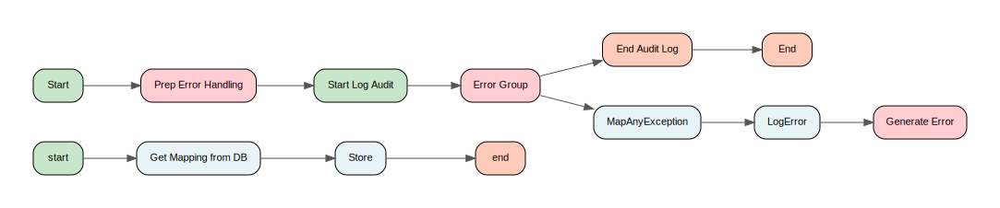

[↑ Back to Inventory](index.md)

#### Process: CustomerIdentityManagement-IDAM/UtilityServices/Security/Tokens/Private/LoadPartnerOperations.process {: #customeridentitymanagementidamutilityservicessecuritytokensprivateloadpartneroperationsprocess }

[↑ Back to Inventory](index.md)

#### Process: CustomerIdentityManagement-IDAM/UtilityServices/Security/Tokens/Private/RequestRequiresToken.process {: #customeridentitymanagementidamutilityservicessecuritytokensprivaterequestrequirestokenprocess }

[↑ Back to Inventory](index.md)

#### Process: CustomerIdentityManagement-IDAM/UtilityServices/Security/Tokens/Private/ValidateResource.process {: #customeridentitymanagementidamutilityservicessecuritytokensprivatevalidateresourceprocess }

[↑ Back to Inventory](index.md)

#### Process: CustomerIdentityManagement-IDAM/UtilityServices/Security/Tokens/Public/LoadAddlResourceValidation.process {: #customeridentitymanagementidamutilityservicessecuritytokenspublicloadaddlresourcevalidationprocess }

[↑ Back to Inventory](index.md)

#### Process: CustomerIdentityManagement-IDAM/UtilityServices/Security/Tokens/Public/LoadExpiration.process {: #customeridentitymanagementidamutilityservicessecuritytokenspublicloadexpirationprocess }

[↑ Back to Inventory](index.md)

#### Process: CustomerIdentityManagement-IDAM/UtilityServices/Security/Tokens/Public/LoadOperationValidation.process {: #customeridentitymanagementidamutilityservicessecuritytokenspublicloadoperationvalidationprocess }

[↑ Back to Inventory](index.md)

#### Process: CustomerIdentityManagement-IDAM/UtilityServices/Security/Tokens/Public/LoadPartnerBIDMapping.process {: #customeridentitymanagementidamutilityservicessecuritytokenspublicloadpartnerbidmappingprocess }

[↑ Back to Inventory](index.md)

#### Process: CustomerIdentityManagement-IDAM/UtilityServices/Security/Tokens/Public/LoadPartnerOperations.process {: #customeridentitymanagementidamutilityservicessecuritytokenspublicloadpartneroperationsprocess }

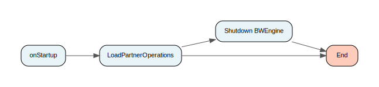

[↑ Back to Inventory](index.md)

#### Process: CustomerIdentityManagement-IDAM/UtilityServices/Security/Tokens/Public/ValidateResourceTemplate.process {: #customeridentitymanagementidamutilityservicessecuritytokenspublicvalidateresourcetemplateprocess }

[↑ Back to Inventory](index.md)

#### Process: CustomerIdentityManagement-IDAM/UtilityServices/VFLE/Client/AuditEventCapture/AuditEvent.process {: #customeridentitymanagementidamutilityservicesvfleclientauditeventcaptureauditeventprocess }

[↑ Back to Inventory](index.md)

#### Process: CustomerIdentityManagement-IDAM/UtilityServices/VFLE/Client/AuditEventCapture/EmptyAuditCache.process {: #customeridentitymanagementidamutilityservicesvfleclientauditeventcaptureemptyauditcacheprocess }

[↑ Back to Inventory](index.md)

#### Process: CustomerIdentityManagement-IDAM/UtilityServices/VFLE/Client/AuditEventCapture/RemoveFromAuditCache.process {: #customeridentitymanagementidamutilityservicesvfleclientauditeventcaptureremovefromauditcacheprocess }

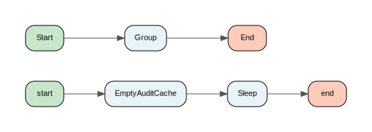

[↑ Back to Inventory](index.md)

#### Process: CustomerIdentityManagement-IDAM/UtilityServices/VFLE/Client/AuditEventCapture/UpdateAuditCache.process {: #customeridentitymanagementidamutilityservicesvfleclientauditeventcaptureupdateauditcacheprocess }

[↑ Back to Inventory](index.md)

#### Process: CustomerIdentityManagement-IDAM/UtilityServices/VFLE/Client/ExceptionCapture/CustomServiceExceptionHandlerInterface.process {: #customeridentitymanagementidamutilityservicesvfleclientexceptioncapturecustomserviceexceptionhandlerinterfaceprocess }

[↑ Back to Inventory](index.md)

#### Process: CustomerIdentityManagement-IDAM/UtilityServices/VFLE/Client/ExceptionCapture/EmptyAuditErrorCache.process {: #customeridentitymanagementidamutilityservicesvfleclientexceptioncaptureemptyauditerrorcacheprocess }

[↑ Back to Inventory](index.md)

#### Process: CustomerIdentityManagement-IDAM/UtilityServices/VFLE/Client/ExceptionCapture/RemoveFromAuditErrorCache.process {: #customeridentitymanagementidamutilityservicesvfleclientexceptioncaptureremovefromauditerrorcacheprocess }

[↑ Back to Inventory](index.md)

#### Process: CustomerIdentityManagement-IDAM/UtilityServices/VFLE/Client/ExceptionCapture/ServiceExceptionClient.process {: #customeridentitymanagementidamutilityservicesvfleclientexceptioncaptureserviceexceptionclientprocess }

[↑ Back to Inventory](index.md)

#### Process: CustomerIdentityManagement-IDAM/UtilityServices/VFLE/Client/ExceptionCapture/SystemExceptionClient.process {: #customeridentitymanagementidamutilityservicesvfleclientexceptioncapturesystemexceptionclientprocess }

[↑ Back to Inventory](index.md)

#### Process: CustomerIdentityManagement-IDAM/UtilityServices/VFLE/Client/ExceptionCapture/UpdateAuditErrorCache.process {: #customeridentitymanagementidamutilityservicesvfleclientexceptioncaptureupdateauditerrorcacheprocess }

[↑ Back to Inventory](index.md)

#### Process: CustomerIdentityManagement-IDAM/UtilityServices/VFLE/Client/Public/ShutdownCleanUp.process {: #customeridentitymanagementidamutilityservicesvfleclientpublicshutdowncleanupprocess }

[↑ Back to Inventory](index.md)

#### Process: CustomerIdentityManagement-IDAM/UtilityServices/VFLE/Client/Public/StartupInitialisation.process {: #customeridentitymanagementidamutilityservicesvfleclientpublicstartupinitialisationprocess }

[↑ Back to Inventory](index.md)

#### Process: Shared Archive/BusinessServices/Common/Encryption/Algorithms/DES3.process {: #sharedarchivebusinessservicescommonencryptionalgorithmsdes3process }

[↑ Back to Inventory](index.md)

#### Process: Shared Archive/BusinessServices/Common/Encryption/DecryptField.process {: #sharedarchivebusinessservicescommonencryptiondecryptfieldprocess }

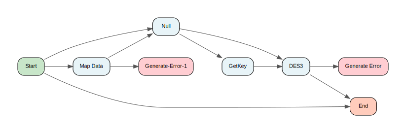

[↑ Back to Inventory](index.md)

#### Process: Shared Archive/BusinessServices/Common/Encryption/DecryptFields.process {: #sharedarchivebusinessservicescommonencryptiondecryptfieldsprocess }

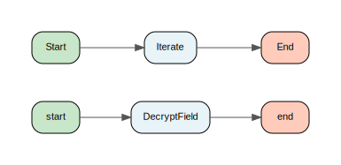

[↑ Back to Inventory](index.md)

#### Process: Shared Archive/BusinessServices/Common/Encryption/GetKey.process {: #sharedarchivebusinessservicescommonencryptiongetkeyprocess }

[↑ Back to Inventory](index.md)

#### Process: Shared Archive/BusinessServices/CustomerManagement/CustomerContactManagement/CustomerDataPresentation/GetContactDetails/Interface/JMSXMLClient.process {: #sharedarchivebusinessservicescustomermanagementcustomercontactmanagementcustomerdatapresentationgetcontactdetailsinterfacejmsxmlclientprocess }

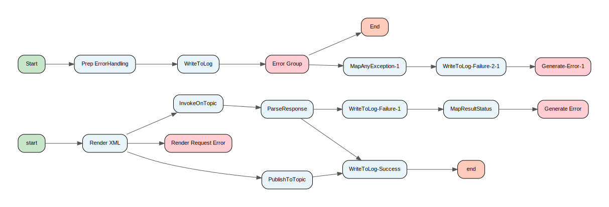

[↑ Back to Inventory](index.md)

#### Process: Shared Archive/BusinessServices/CustomerManagement/CustomerContactManagement/CustomerDataPresentation/GetContactDetails/Interface/ParseResponse.process {: #sharedarchivebusinessservicescustomermanagementcustomercontactmanagementcustomerdatapresentationgetcontactdetailsinterfaceparseresponseprocess }

[↑ Back to Inventory](index.md)

#### Process: Shared Archive/BusinessServices/CustomerManagement/CustomerProfileManagement/CustomerIdentityManagement/AuthenticateIdentity/Interface/GetBusinessResources.2.process {: #sharedarchivebusinessservicescustomermanagementcustomerprofilemanagementcustomeridentitymanagementauthenticateidentityinterfacegetbusinessresources2process }

[↑ Back to Inventory](index.md)

#### Process: Shared Archive/BusinessServices/CustomerManagement/CustomerProfileManagement/CustomerIdentityManagement/AuthenticateIdentity/Interface/Service.2.process {: #sharedarchivebusinessservicescustomermanagementcustomerprofilemanagementcustomeridentitymanagementauthenticateidentityinterfaceservice2process }

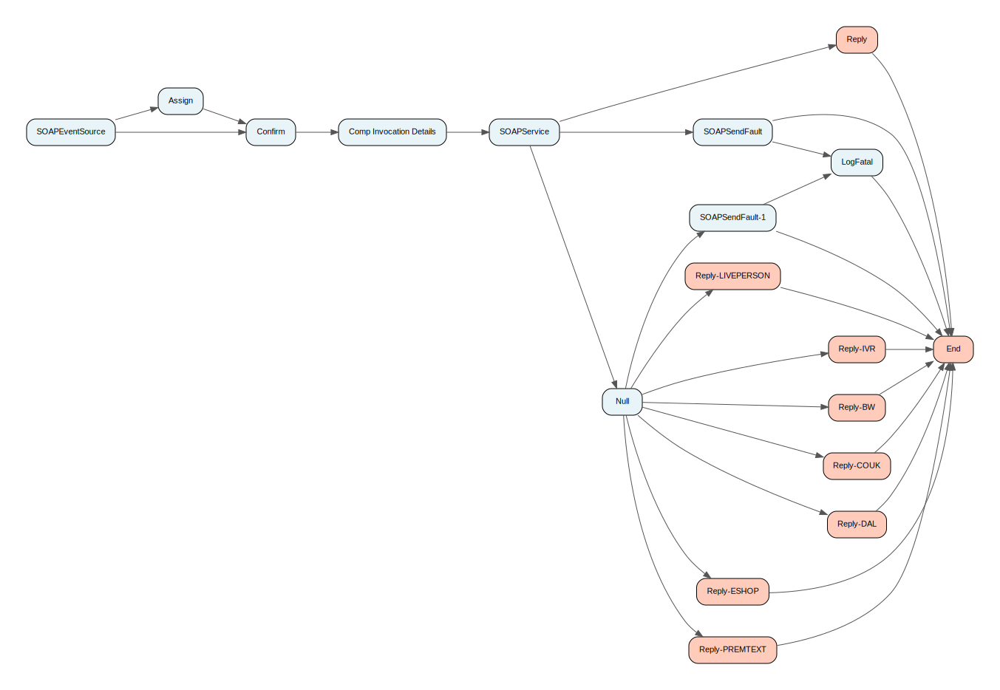

[↑ Back to Inventory](index.md)

#### Process: Shared Archive/BusinessServices/CustomerManagement/CustomerProfileManagement/CustomerIdentityManagement/AuthenticateIdentity/Interface/SOAPService.2.process {: #sharedarchivebusinessservicescustomermanagementcustomerprofilemanagementcustomeridentitymanagementauthenticateidentityinterfacesoapservice2process }

[↑ Back to Inventory](index.md)

#### Process: Shared Archive/BusinessServices/CustomerManagement/CustomerProfileManagement/CustomerIdentityManagement/AuthenticateIdentity/Sub/AuthenticateFPin2.process {: #sharedarchivebusinessservicescustomermanagementcustomerprofilemanagementcustomeridentitymanagementauthenticateidentitysubauthenticatefpin2process }

[↑ Back to Inventory](index.md)

#### Process: Shared Archive/BusinessServices/CustomerManagement/CustomerProfileManagement/CustomerIdentityManagement/AuthenticateIdentity/Sub/AuthenticateFPinPersistent2.process {: #sharedarchivebusinessservicescustomermanagementcustomerprofilemanagementcustomeridentitymanagementauthenticateidentitysubauthenticatefpinpersistent2process }

[↑ Back to Inventory](index.md)

#### Process: Shared Archive/BusinessServices/CustomerManagement/CustomerProfileManagement/CustomerIdentityManagement/AuthenticateIdentity/Sub/MainProcess.2.process {: #sharedarchivebusinessservicescustomermanagementcustomerprofilemanagementcustomeridentitymanagementauthenticateidentitysubmainprocess2process }

[↑ Back to Inventory](index.md)

#### Process: Shared Archive/BusinessServices/CustomerManagement/CustomerProfileManagement/CustomerIdentityManagement/AuthenticateIdentity/Sub/TokenIntrospect.process {: #sharedarchivebusinessservicescustomermanagementcustomerprofilemanagementcustomeridentitymanagementauthenticateidentitysubtokenintrospectprocess }

[↑ Back to Inventory](index.md)

#### Process: Shared Archive/BusinessServices/CustomerManagement/CustomerProfileManagement/CustomerIdentityManagement/GetIdentityList/Interface/GetBusinessResourcesLegacy.process {: #sharedarchivebusinessservicescustomermanagementcustomerprofilemanagementcustomeridentitymanagementgetidentitylistinterfacegetbusinessresourceslegacyprocess }

[↑ Back to Inventory](index.md)

#### Process: Shared Archive/BusinessServices/CustomerManagement/CustomerProfileManagement/CustomerIdentityManagement/GetIdentityList/Interface/GetBusinessResources.process {: #sharedarchivebusinessservicescustomermanagementcustomerprofilemanagementcustomeridentitymanagementgetidentitylistinterfacegetbusinessresourcesprocess }

[↑ Back to Inventory](index.md)

#### Process: Shared Archive/BusinessServices/CustomerManagement/CustomerProfileManagement/CustomerIdentityManagement/GetIdentityList/Interface/ServiceLegacy.process {: #sharedarchivebusinessservicescustomermanagementcustomerprofilemanagementcustomeridentitymanagementgetidentitylistinterfaceservicelegacyprocess }

[↑ Back to Inventory](index.md)

#### Process: Shared Archive/BusinessServices/CustomerManagement/CustomerProfileManagement/CustomerIdentityManagement/GetIdentityList/Interface/Service.process {: #sharedarchivebusinessservicescustomermanagementcustomerprofilemanagementcustomeridentitymanagementgetidentitylistinterfaceserviceprocess }

[↑ Back to Inventory](index.md)

#### Process: Shared Archive/BusinessServices/CustomerManagement/CustomerProfileManagement/CustomerIdentityManagement/GetIdentityList/Interface/SOAPServiceLegacy.process {: #sharedarchivebusinessservicescustomermanagementcustomerprofilemanagementcustomeridentitymanagementgetidentitylistinterfacesoapservicelegacyprocess }

[↑ Back to Inventory](index.md)

#### Process: Shared Archive/BusinessServices/CustomerManagement/CustomerProfileManagement/CustomerIdentityManagement/GetIdentityList/Interface/SOAPService.process {: #sharedarchivebusinessservicescustomermanagementcustomerprofilemanagementcustomeridentitymanagementgetidentitylistinterfacesoapserviceprocess }

[↑ Back to Inventory](index.md)

#### Process: Shared Archive/BusinessServices/CustomerManagement/CustomerProfileManagement/CustomerIdentityManagement/GetIdentityList/Sub/MainProcessLegacy.process {: #sharedarchivebusinessservicescustomermanagementcustomerprofilemanagementcustomeridentitymanagementgetidentitylistsubmainprocesslegacyprocess }

[↑ Back to Inventory](index.md)

#### Process: Shared Archive/BusinessServices/CustomerManagement/CustomerProfileManagement/CustomerIdentityManagement/GetIdentityList/Sub/MainProcess.process {: #sharedarchivebusinessservicescustomermanagementcustomerprofilemanagementcustomeridentitymanagementgetidentitylistsubmainprocessprocess }

[↑ Back to Inventory](index.md)

#### Process: Shared Archive/BusinessServices/CustomerManagement/CustomerProfileManagement/CustomerPersonalInformationManagement/GetHLRSettings/Interface/JMSSOAPClient.2.process {: #sharedarchivebusinessservicescustomermanagementcustomerprofilemanagementcustomerpersonalinformationmanagementgethlrsettingsinterfacejmssoapclient2process }

[↑ Back to Inventory](index.md)

#### Process: Shared Archive/BusinessServices/CustomerManagement/CustomerProfileManagement/CustomerPersonalInformationManagement/GetHLRSettings/Interface/ParseSOAPResponse.2.process {: #sharedarchivebusinessservicescustomermanagementcustomerprofilemanagementcustomerpersonalinformationmanagementgethlrsettingsinterfaceparsesoapresponse2process }

[↑ Back to Inventory](index.md)

#### Process: Shared Archive/BusinessServices/EnterpriseManagement/SecurityManagement/ValidateResource/Interface/JMSSOAPClient.process {: #sharedarchivebusinessservicesenterprisemanagementsecuritymanagementvalidateresourceinterfacejmssoapclientprocess }

[↑ Back to Inventory](index.md)

#### Process: Shared Archive/BusinessServices/EnterpriseManagement/SecurityManagement/ValidateResource/Interface/ParseSOAPResponse.process {: #sharedarchivebusinessservicesenterprisemanagementsecuritymanagementvalidateresourceinterfaceparsesoapresponseprocess }

[↑ Back to Inventory](index.md)

#### Process: Shared Archive/ConnectivityServices/Common/Private/RenderBackEndError.process {: #sharedarchiveconnectivityservicescommonprivaterenderbackenderrorprocess }

[↑ Back to Inventory](index.md)

#### Process: Shared Archive/ConnectivityServices/JMS/Private/InvokeOnTopic.process {: #sharedarchiveconnectivityservicesjmsprivateinvokeontopicprocess }

[↑ Back to Inventory](index.md)

#### Process: Shared Archive/ConnectivityServices/JMS/Private/PrepareData.process {: #sharedarchiveconnectivityservicesjmsprivatepreparedataprocess }

[↑ Back to Inventory](index.md)

#### Process: Shared Archive/ConnectivityServices/JMS/Private/PublishToTopic-Object.process {: #sharedarchiveconnectivityservicesjmsprivatepublishtotopicobjectprocess }

[↑ Back to Inventory](index.md)

#### Process: Shared Archive/ConnectivityServices/JMS/Private/PublishToTopic.process {: #sharedarchiveconnectivityservicesjmsprivatepublishtotopicprocess }

[↑ Back to Inventory](index.md)

#### Process: Shared Archive/ConnectivityServices/JMS/Public/InvokeOnTopic.process {: #sharedarchiveconnectivityservicesjmspublicinvokeontopicprocess }

[↑ Back to Inventory](index.md)

#### Process: Shared Archive/ConnectivityServices/JMS/Public/PublishToTopic.process {: #sharedarchiveconnectivityservicesjmspublicpublishtotopicprocess }

[↑ Back to Inventory](index.md)

#### Process: Shared Archive/ConnectivityServices/OAG/Public/InvokeOAGApi.process {: #sharedarchiveconnectivityservicesoagpublicinvokeoagapiprocess }

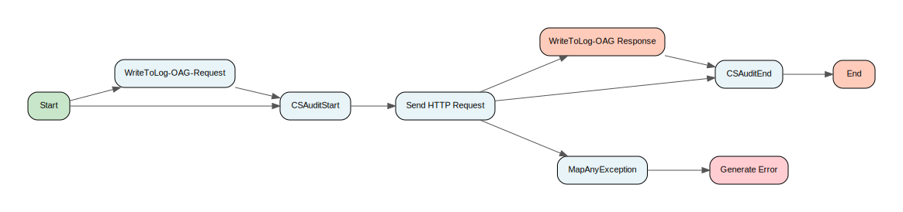

[↑ Back to Inventory](index.md)

#### Process: Shared Archive/ConnectivityServices/OAG/Public/MapOAGException.process {: #sharedarchiveconnectivityservicesoagpublicmapoagexceptionprocess }

[↑ Back to Inventory](index.md)

#### Process: Shared Archive/ConnectivityServices/OAM/Private/MapOAMException.process {: #sharedarchiveconnectivityservicesoamprivatemapoamexceptionprocess }

[↑ Back to Inventory](index.md)

#### Process: Shared Archive/ConnectivityServices/OAM/Public/AuthenticateIdentity.process {: #sharedarchiveconnectivityservicesoampublicauthenticateidentityprocess }

[↑ Back to Inventory](index.md)

#### Process: Shared Archive/ConnectivityServices/OAM/Public/GenerateOnlineSessionToken.process {: #sharedarchiveconnectivityservicesoampublicgenerateonlinesessiontokenprocess }

[↑ Back to Inventory](index.md)

#### Process: Shared Archive/ConnectivityServices/OIM/Public/GetIdentity.process {: #sharedarchiveconnectivityservicesoimpublicgetidentityprocess }

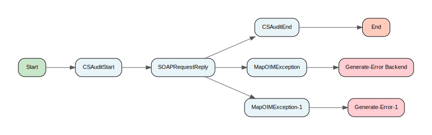

[↑ Back to Inventory](index.md)

#### Process: Shared Archive/ConnectivityServices/OIM/Public/MapOIMException.process {: #sharedarchiveconnectivityservicesoimpublicmapoimexceptionprocess }

[↑ Back to Inventory](index.md)

#### Process: Shared Archive/UtilityServices/ExceptionHandling/Filtering/CVV2Filter.process {: #sharedarchiveutilityservicesexceptionhandlingfilteringcvv2filterprocess }

[↑ Back to Inventory](index.md)

#### Process: Shared Archive/UtilityServices/ExceptionHandling/Filtering/ExceptionSchemaFilter.process {: #sharedarchiveutilityservicesexceptionhandlingfilteringexceptionschemafilterprocess }

[↑ Back to Inventory](index.md)

#### Process: Shared Archive/UtilityServices/ExceptionHandling/Filtering/Security/CVV2Filter.process {: #sharedarchiveutilityservicesexceptionhandlingfilteringsecuritycvv2filterprocess }

[↑ Back to Inventory](index.md)

#### Process: Shared Archive/UtilityServices/ExceptionHandling/Filtering/ServiceExceptionFilter.process {: #sharedarchiveutilityservicesexceptionhandlingfilteringserviceexceptionfilterprocess }

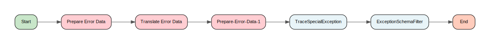

[↑ Back to Inventory](index.md)

#### Process: Shared Archive/UtilityServices/ExceptionHandling/Filtering/SpecialExceptions/GetSpecialExceptionList.process {: #sharedarchiveutilityservicesexceptionhandlingfilteringspecialexceptionsgetspecialexceptionlistprocess }

[↑ Back to Inventory](index.md)

#### Process: Shared Archive/UtilityServices/ExceptionHandling/Filtering/SpecialExceptions/TraceSpecialException.process {: #sharedarchiveutilityservicesexceptionhandlingfilteringspecialexceptionstracespecialexceptionprocess }

[↑ Back to Inventory](index.md)

#### Process: Shared Archive/UtilityServices/ExceptionHandling/Filtering/SystemExceptionFilter.process {: #sharedarchiveutilityservicesexceptionhandlingfilteringsystemexceptionfilterprocess }

[↑ Back to Inventory](index.md)

#### Process: Shared Archive/UtilityServices/ExceptionHandling/Interface/ServiceExceptionHandler.process {: #sharedarchiveutilityservicesexceptionhandlinginterfaceserviceexceptionhandlerprocess }

[↑ Back to Inventory](index.md)

#### Process: Shared Archive/UtilityServices/ExceptionHandling/Interface/SystemExceptionHandler.process {: #sharedarchiveutilityservicesexceptionhandlinginterfacesystemexceptionhandlerprocess }

[↑ Back to Inventory](index.md)

#### Process: Shared Archive/UtilityServices/ExceptionHandling/Private/MapException.process {: #sharedarchiveutilityservicesexceptionhandlingprivatemapexceptionprocess }

[↑ Back to Inventory](index.md)

#### Process: Shared Archive/UtilityServices/ExceptionHandling/Private/MapResultStatus.process {: #sharedarchiveutilityservicesexceptionhandlingprivatemapresultstatusprocess }

[↑ Back to Inventory](index.md)

#### Process: Shared Archive/UtilityServices/ExceptionHandling/Public/MapAnyException.process {: #sharedarchiveutilityservicesexceptionhandlingpublicmapanyexceptionprocess }

[↑ Back to Inventory](index.md)

#### Process: Shared Archive/UtilityServices/ExceptionHandling/Public/MapLegacyException.process {: #sharedarchiveutilityservicesexceptionhandlingpublicmaplegacyexceptionprocess }

[↑ Back to Inventory](index.md)

#### Process: Shared Archive/UtilityServices/Interface/Private/PublishToRetryQueue.process {: #sharedarchiveutilityservicesinterfaceprivatepublishtoretryqueueprocess }

[↑ Back to Inventory](index.md)

#### Process: Shared Archive/UtilityServices/Interface/Private/SOAP/CheckRequest.process {: #sharedarchiveutilityservicesinterfaceprivatesoapcheckrequestprocess }

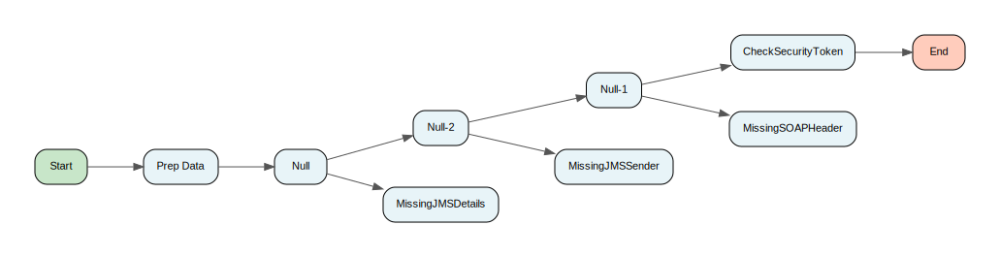

[↑ Back to Inventory](index.md)

#### Process: Shared Archive/UtilityServices/Interface/Private/SOAP/GenerateInvocationDetails.process {: #sharedarchiveutilityservicesinterfaceprivatesoapgenerateinvocationdetailsprocess }

[↑ Back to Inventory](index.md)

#### Process: Shared Archive/UtilityServices/Interface/Private/SOAP/GenerateResponseHeader.process {: #sharedarchiveutilityservicesinterfaceprivatesoapgenerateresponseheaderprocess }

[↑ Back to Inventory](index.md)

#### Process: Shared Archive/UtilityServices/Logging/LogEnd.process {: #sharedarchiveutilityserviceslogginglogendprocess }

[↑ Back to Inventory](index.md)

#### Process: Shared Archive/UtilityServices/Logging/LogFatal.process {: #sharedarchiveutilityserviceslogginglogfatalprocess }

[↑ Back to Inventory](index.md)

#### Process: Shared Archive/UtilityServices/Logging/LogStart.process {: #sharedarchiveutilityserviceslogginglogstartprocess }

[↑ Back to Inventory](index.md)

#### Process: Shared Archive/UtilityServices/Logging/Private/WriteToLog.process {: #sharedarchiveutilityservicesloggingprivatewritetologprocess }

[↑ Back to Inventory](index.md)

#### Process: Shared Archive/UtilityServices/Logging/Public/CSAuditEnd.process {: #sharedarchiveutilityservicesloggingpubliccsauditendprocess }

[↑ Back to Inventory](index.md)

#### Process: Shared Archive/UtilityServices/Logging/Public/CSAuditStart.process {: #sharedarchiveutilityservicesloggingpubliccsauditstartprocess }

[↑ Back to Inventory](index.md)

#### Process: Shared Archive/UtilityServices/Logging/Public/WriteToLog.process {: #sharedarchiveutilityservicesloggingpublicwritetologprocess }

[↑ Back to Inventory](index.md)

#### Process: Shared Archive/UtilityServices/Security/Tokens/Private/CheckRequest.process {: #sharedarchiveutilityservicessecuritytokensprivatecheckrequestprocess }

[↑ Back to Inventory](index.md)

#### Process: Shared Archive/UtilityServices/Security/Tokens/Private/ExtractOAuthToken.process {: #sharedarchiveutilityservicessecuritytokensprivateextractoauthtokenprocess }

[↑ Back to Inventory](index.md)

#### Process: Shared Archive/UtilityServices/Security/Tokens/Private/ExtractSAMLToken.process {: #sharedarchiveutilityservicessecuritytokensprivateextractsamltokenprocess }

[↑ Back to Inventory](index.md)

#### Process: Shared Archive/UtilityServices/Security/Tokens/Private/ExtractToken.process {: #sharedarchiveutilityservicessecuritytokensprivateextracttokenprocess }

[↑ Back to Inventory](index.md)

#### Process: Shared Archive/UtilityServices/Security/Tokens/Private/RequestRequiresToken.process {: #sharedarchiveutilityservicessecuritytokensprivaterequestrequirestokenprocess }

[↑ Back to Inventory](index.md)

#### Process: Shared Archive/UtilityServices/Security/Tokens/Private/ValidateResource.process {: #sharedarchiveutilityservicessecuritytokensprivatevalidateresourceprocess }

[↑ Back to Inventory](index.md)

#### Process: Shared Archive/UtilityServices/Security/Tokens/Public/ValidateResourceTemplate.process {: #sharedarchiveutilityservicessecuritytokenspublicvalidateresourcetemplateprocess }

[↑ Back to Inventory](index.md)

#### Process: Shared Archive/UtilityServices/VFLE/Client/AuditEventCapture/AuditEvent.process {: #sharedarchiveutilityservicesvfleclientauditeventcaptureauditeventprocess }

[↑ Back to Inventory](index.md)

#### Process: Shared Archive/UtilityServices/VFLE/Client/AuditEventCapture/UpdateAuditCache.process {: #sharedarchiveutilityservicesvfleclientauditeventcaptureupdateauditcacheprocess }

[↑ Back to Inventory](index.md)

#### Process: Shared Archive/UtilityServices/VFLE/Client/ExceptionCapture/CustomServiceExceptionHandlerInterface.process {: #sharedarchiveutilityservicesvfleclientexceptioncapturecustomserviceexceptionhandlerinterfaceprocess }

[↑ Back to Inventory](index.md)

#### Process: Shared Archive/UtilityServices/VFLE/Client/ExceptionCapture/ServiceExceptionClient.process {: #sharedarchiveutilityservicesvfleclientexceptioncaptureserviceexceptionclientprocess }

[↑ Back to Inventory](index.md)

#### Process: Shared Archive/UtilityServices/VFLE/Client/ExceptionCapture/SystemExceptionClient.process {: #sharedarchiveutilityservicesvfleclientexceptioncapturesystemexceptionclientprocess }

[↑ Back to Inventory](index.md)

#### Process: Shared Archive/UtilityServices/VFLE/Client/ExceptionCapture/UpdateAuditErrorCache.process {: #sharedarchiveutilityservicesvfleclientexceptioncaptureupdateauditerrorcacheprocess }

[↑ Back to Inventory](index.md)

