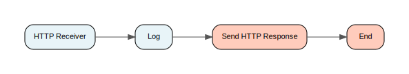

# greeting Architecture

## Process Inventory
### Group: Process Archive
| Path |
| :--- |
| [Process Archive/Processes/Greeting.process](#processarchiveprocessesgreetingprocess) |

## Visual Flow Diagrams

#### Process: Process Archive/Processes/Greeting.process {: #processarchiveprocessesgreetingprocess }

[↑ Back to Inventory](#process-inventory)

## Global Variables
| Name | Value | Status |
| :--- | :--- | :--- |
| DirLedger | `.` | ✅ OK |
| DirTrace | `.` | ✅ OK |
| HawkEnabled | `false` | ✅ OK |
| JmsProviderUrl | `tcp://localhost:7222` | ✅ OK |
| JmsSslProviderUrl | `ssl://localhost:7243` | ✅ OK |
| RemoteRvDaemon | `` | ✅ OK |
| RvDaemon | `tcp:7500` | ✅ OK |
| RvNetwork | `` | ✅ OK |
| RvService | `7500` | ✅ OK |
| RvaHost | `localhost` | ✅ OK |
| RvaPort | `7600` | ✅ OK |
| TIBHawkDaemon | `tcp:7474` | ✅ OK |
| TIBHawkNetwork | `` | ✅ OK |
| TIBHawkService | `7474` | ✅ OK |
| httpPort | `8282` | ✅ OK |
| Trace.Task.* | `false` | ✅ OK |
| EnableMemorySavingMode | `false` | ✅ OK |
| bw.engine.enableJobRecovery | `false` | ✅ OK |
| bw.engine.autoCheckpointRestart | `true` | ✅ OK |
| bw.engine.jobstats.enable | `false` | ✅ OK |
| log.file.encoding | `` | ✅ OK |
| bw.engine.emaEnabled | `false` | ✅ OK |
| bw.container.service | `` | ✅ OK |
| bw.container.service.rmi.port | `9995` | ✅ OK |
| bw.platform.services.retreiveresources.Enabled | `false` | ✅ OK |
| bw.platform.services.retreiveresources.Hostname | `localhost` | ✅ OK |
| bw.platform.services.retreiveresources.Httpport | `8010` | ✅ OK |
| bw.platform.services.retreiveresources.defaultEncoding | `ISO8859_1` | ✅ OK |
| bw.platform.services.retreiveresources.enableLookups | `false` | ✅ OK |
| bw.platform.services.retreiveresources.isSecure | `false` | ✅ OK |
| bw.platform.services.retreiveresources.identity | `/Identity_HTTPConnection.&#x200B;id` | ✅ OK |
| bw.log4j.configuration | `` | ✅ OK |
