# TIL_HSS_DiameterAdapter-25_11_1 — Visual Flow Diagrams

#### Process: TIL_HSS_DiameterAdapter/BusinessServices/CustomerManagement/CustomerProfileManagement/CustomerIdentityManagement/RetrieveHSSLocationDetails/Interface/JMSXMLServiceRequestReply.2.process {: #tilhssdiameteradapterbusinessservicescustomermanagementcustomerprofilemanagementcustomeridentitymanagementretrievehsslocationdetailsinterfacejmsxmlservicerequestreply2process }

[↑ Back to Inventory](index.md)

#### Process: TIL_HSS_DiameterAdapter/BusinessServices/CustomerManagement/CustomerProfileManagement/CustomerIdentityManagement/RetrieveHSSLocationDetails/Interface/JMSXMLServiceRequestReply.process {: #tilhssdiameteradapterbusinessservicescustomermanagementcustomerprofilemanagementcustomeridentitymanagementretrievehsslocationdetailsinterfacejmsxmlservicerequestreplyprocess }

[↑ Back to Inventory](index.md)

#### Process: TIL_HSS_DiameterAdapter/BusinessServices/CustomerManagement/CustomerProfileManagement/CustomerIdentityManagement/RetrieveHSSLocationDetails/Sub/MainProcess.2.process {: #tilhssdiameteradapterbusinessservicescustomermanagementcustomerprofilemanagementcustomeridentitymanagementretrievehsslocationdetailssubmainprocess2process }

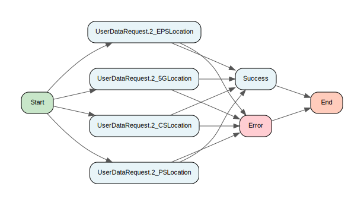

[↑ Back to Inventory](index.md)

#### Process: TIL_HSS_DiameterAdapter/BusinessServices/CustomerManagement/CustomerProfileManagement/CustomerIdentityManagement/RetrieveHSSLocationDetails/Sub/MainProcess.process {: #tilhssdiameteradapterbusinessservicescustomermanagementcustomerprofilemanagementcustomeridentitymanagementretrievehsslocationdetailssubmainprocessprocess }

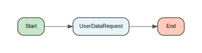

[↑ Back to Inventory](index.md)

#### Process: TIL_HSS_DiameterAdapter/ConnectivityServices/Common/Private/RenderBackEndError.process {: #tilhssdiameteradapterconnectivityservicescommonprivaterenderbackenderrorprocess }

[↑ Back to Inventory](index.md)

#### Process: TIL_HSS_DiameterAdapter/ConnectivityServices/Diameter/Private/LoadErrorCodes.process {: #tilhssdiameteradapterconnectivityservicesdiameterprivateloaderrorcodesprocess }

[↑ Back to Inventory](index.md)

#### Process: TIL_HSS_DiameterAdapter/ConnectivityServices/Diameter/Private/SendRequestOneGroup.process {: #tilhssdiameteradapterconnectivityservicesdiameterprivatesendrequestonegroupprocess }

[↑ Back to Inventory](index.md)

#### Process: TIL_HSS_DiameterAdapter/ConnectivityServices/Diameter/Private/SendRequestOneServer.process {: #tilhssdiameteradapterconnectivityservicesdiameterprivatesendrequestoneserverprocess }

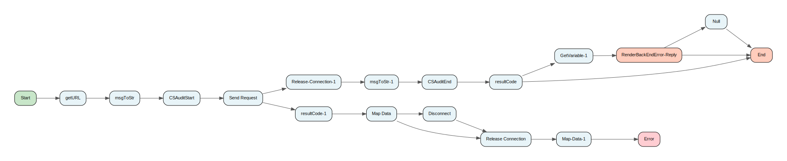

[↑ Back to Inventory](index.md)

#### Process: TIL_HSS_DiameterAdapter/ConnectivityServices/Diameter/Private/SendRequest.process {: #tilhssdiameteradapterconnectivityservicesdiameterprivatesendrequestprocess }

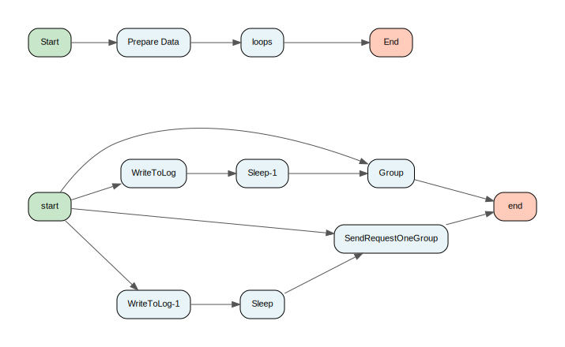

[↑ Back to Inventory](index.md)

#### Process: TIL_HSS_DiameterAdapter/ConnectivityServices/Diameter/Public/LoadAllDiameterErrorCodes.process {: #tilhssdiameteradapterconnectivityservicesdiameterpublicloadalldiametererrorcodesprocess }

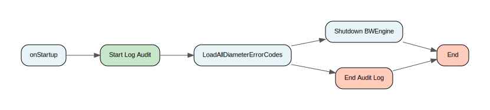

[↑ Back to Inventory](index.md)

#### Process: TIL_HSS_DiameterAdapter/ConnectivityServices/Diameter/Public/ReloadAllDiameterErrorCodes.process {: #tilhssdiameteradapterconnectivityservicesdiameterpublicreloadalldiametererrorcodesprocess }

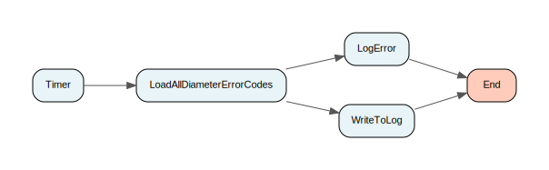

[↑ Back to Inventory](index.md)

#### Process: TIL_HSS_DiameterAdapter/ConnectivityServices/HSS/Public/InitializeConnection.process {: #tilhssdiameteradapterconnectivityserviceshsspublicinitializeconnectionprocess }

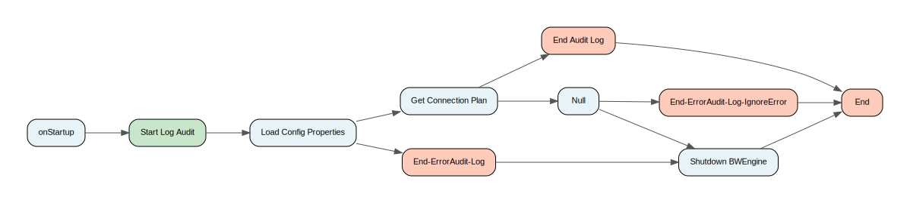

[↑ Back to Inventory](index.md)

#### Process: TIL_HSS_DiameterAdapter/ConnectivityServices/HSS/Public/NormalizeCTN.process {: #tilhssdiameteradapterconnectivityserviceshsspublicnormalizectnprocess }

[↑ Back to Inventory](index.md)

#### Process: TIL_HSS_DiameterAdapter/ConnectivityServices/HSS/Public/UserDataRequest.2.process {: #tilhssdiameteradapterconnectivityserviceshsspublicuserdatarequest2process }

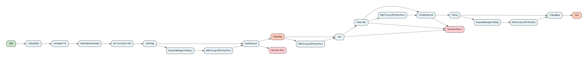

[↑ Back to Inventory](index.md)

#### Process: TIL_HSS_DiameterAdapter/ConnectivityServices/HSS/Public/UserDataRequest.process {: #tilhssdiameteradapterconnectivityserviceshsspublicuserdatarequestprocess }

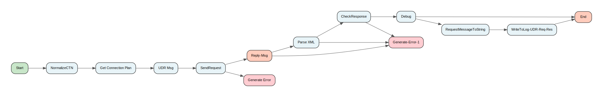

[↑ Back to Inventory](index.md)

#### Process: TIL_HSS_DiameterAdapter/UtilityServices/ExceptionHandling/Filtering/CVV2Filter.process {: #tilhssdiameteradapterutilityservicesexceptionhandlingfilteringcvv2filterprocess }

[↑ Back to Inventory](index.md)

#### Process: TIL_HSS_DiameterAdapter/UtilityServices/ExceptionHandling/Filtering/ExceptionSchemaFilter.process {: #tilhssdiameteradapterutilityservicesexceptionhandlingfilteringexceptionschemafilterprocess }

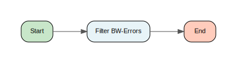

[↑ Back to Inventory](index.md)

#### Process: TIL_HSS_DiameterAdapter/UtilityServices/ExceptionHandling/Filtering/Security/CVV2Filter.process {: #tilhssdiameteradapterutilityservicesexceptionhandlingfilteringsecuritycvv2filterprocess }

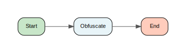

[↑ Back to Inventory](index.md)

#### Process: TIL_HSS_DiameterAdapter/UtilityServices/ExceptionHandling/Filtering/ServiceExceptionFilter.process {: #tilhssdiameteradapterutilityservicesexceptionhandlingfilteringserviceexceptionfilterprocess }

[↑ Back to Inventory](index.md)

#### Process: TIL_HSS_DiameterAdapter/UtilityServices/ExceptionHandling/Filtering/SpecialExceptions/GetSpecialExceptionList.process {: #tilhssdiameteradapterutilityservicesexceptionhandlingfilteringspecialexceptionsgetspecialexceptionlistprocess }

[↑ Back to Inventory](index.md)

#### Process: TIL_HSS_DiameterAdapter/UtilityServices/ExceptionHandling/Filtering/SpecialExceptions/TraceSpecialException.process {: #tilhssdiameteradapterutilityservicesexceptionhandlingfilteringspecialexceptionstracespecialexceptionprocess }

[↑ Back to Inventory](index.md)

#### Process: TIL_HSS_DiameterAdapter/UtilityServices/ExceptionHandling/Filtering/SystemExceptionFilter.process {: #tilhssdiameteradapterutilityservicesexceptionhandlingfilteringsystemexceptionfilterprocess }

[↑ Back to Inventory](index.md)

#### Process: TIL_HSS_DiameterAdapter/UtilityServices/ExceptionHandling/Interface/ServiceExceptionHandler.process {: #tilhssdiameteradapterutilityservicesexceptionhandlinginterfaceserviceexceptionhandlerprocess }

[↑ Back to Inventory](index.md)

#### Process: TIL_HSS_DiameterAdapter/UtilityServices/ExceptionHandling/Interface/SystemExceptionHandler.process {: #tilhssdiameteradapterutilityservicesexceptionhandlinginterfacesystemexceptionhandlerprocess }

[↑ Back to Inventory](index.md)

#### Process: TIL_HSS_DiameterAdapter/UtilityServices/ExceptionHandling/Private/MapException.process {: #tilhssdiameteradapterutilityservicesexceptionhandlingprivatemapexceptionprocess }

[↑ Back to Inventory](index.md)

#### Process: TIL_HSS_DiameterAdapter/UtilityServices/ExceptionHandling/Public/MapAnyException.process {: #tilhssdiameteradapterutilityservicesexceptionhandlingpublicmapanyexceptionprocess }

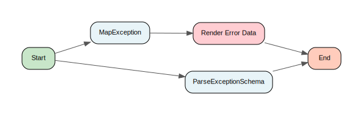

[↑ Back to Inventory](index.md)

#### Process: TIL_HSS_DiameterAdapter/UtilityServices/ExceptionHandling/ServiceExceptionHandler.process {: #tilhssdiameteradapterutilityservicesexceptionhandlingserviceexceptionhandlerprocess }

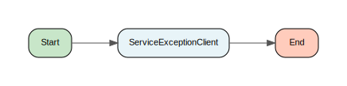

[↑ Back to Inventory](index.md)

#### Process: TIL_HSS_DiameterAdapter/UtilityServices/ExceptionHandling/Shutdown BWEngine.process {: #tilhssdiameteradapterutilityservicesexceptionhandlingshutdownbwengineprocess }

[↑ Back to Inventory](index.md)

#### Process: TIL_HSS_DiameterAdapter/UtilityServices/Interface/OperationReply.process {: #tilhssdiameteradapterutilityservicesinterfaceoperationreplyprocess }

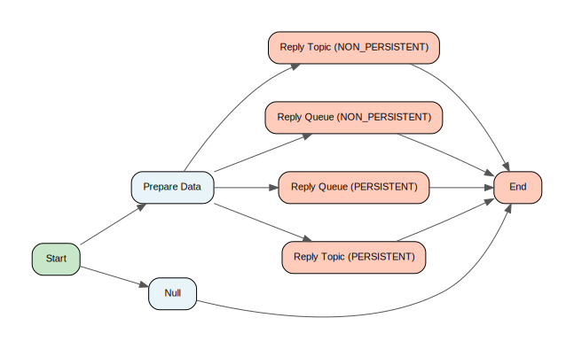

[↑ Back to Inventory](index.md)

#### Process: TIL_HSS_DiameterAdapter/UtilityServices/Interface/Private/PublishToRetryQueue.process {: #tilhssdiameteradapterutilityservicesinterfaceprivatepublishtoretryqueueprocess }

[↑ Back to Inventory](index.md)

#### Process: TIL_HSS_DiameterAdapter/UtilityServices/Logging/LogEnd.process {: #tilhssdiameteradapterutilityserviceslogginglogendprocess }

[↑ Back to Inventory](index.md)

#### Process: TIL_HSS_DiameterAdapter/UtilityServices/Logging/LogError.process {: #tilhssdiameteradapterutilityserviceslogginglogerrorprocess }

[↑ Back to Inventory](index.md)

#### Process: TIL_HSS_DiameterAdapter/UtilityServices/Logging/LogFatal.process {: #tilhssdiameteradapterutilityserviceslogginglogfatalprocess }

[↑ Back to Inventory](index.md)

#### Process: TIL_HSS_DiameterAdapter/UtilityServices/Logging/LogStart.process {: #tilhssdiameteradapterutilityserviceslogginglogstartprocess }

[↑ Back to Inventory](index.md)

#### Process: TIL_HSS_DiameterAdapter/UtilityServices/Logging/Private/WriteToLog.process {: #tilhssdiameteradapterutilityservicesloggingprivatewritetologprocess }

[↑ Back to Inventory](index.md)

#### Process: TIL_HSS_DiameterAdapter/UtilityServices/Logging/Public/CSAuditEnd.process {: #tilhssdiameteradapterutilityservicesloggingpubliccsauditendprocess }

[↑ Back to Inventory](index.md)

#### Process: TIL_HSS_DiameterAdapter/UtilityServices/Logging/Public/CSAuditStart.process {: #tilhssdiameteradapterutilityservicesloggingpubliccsauditstartprocess }

[↑ Back to Inventory](index.md)

#### Process: TIL_HSS_DiameterAdapter/UtilityServices/Logging/Public/WriteToLog.process {: #tilhssdiameteradapterutilityservicesloggingpublicwritetologprocess }

[↑ Back to Inventory](index.md)

#### Process: TIL_HSS_DiameterAdapter/UtilityServices/VFLE/Client/AuditEventCapture/AuditEvent.process {: #tilhssdiameteradapterutilityservicesvfleclientauditeventcaptureauditeventprocess }

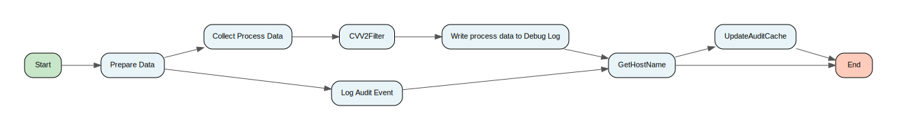

[↑ Back to Inventory](index.md)

#### Process: TIL_HSS_DiameterAdapter/UtilityServices/VFLE/Client/AuditEventCapture/EmptyAuditCache.process {: #tilhssdiameteradapterutilityservicesvfleclientauditeventcaptureemptyauditcacheprocess }

[↑ Back to Inventory](index.md)

#### Process: TIL_HSS_DiameterAdapter/UtilityServices/VFLE/Client/AuditEventCapture/RemoveFromAuditCache.process {: #tilhssdiameteradapterutilityservicesvfleclientauditeventcaptureremovefromauditcacheprocess }

[↑ Back to Inventory](index.md)

#### Process: TIL_HSS_DiameterAdapter/UtilityServices/VFLE/Client/AuditEventCapture/UpdateAuditCache.process {: #tilhssdiameteradapterutilityservicesvfleclientauditeventcaptureupdateauditcacheprocess }

[↑ Back to Inventory](index.md)

#### Process: TIL_HSS_DiameterAdapter/UtilityServices/VFLE/Client/ExceptionCapture/CustomServiceExceptionHandlerInterface.process {: #tilhssdiameteradapterutilityservicesvfleclientexceptioncapturecustomserviceexceptionhandlerinterfaceprocess }

[↑ Back to Inventory](index.md)

#### Process: TIL_HSS_DiameterAdapter/UtilityServices/VFLE/Client/ExceptionCapture/EmptyAuditErrorCache.process {: #tilhssdiameteradapterutilityservicesvfleclientexceptioncaptureemptyauditerrorcacheprocess }

[↑ Back to Inventory](index.md)

#### Process: TIL_HSS_DiameterAdapter/UtilityServices/VFLE/Client/ExceptionCapture/RemoveFromAuditErrorCache.process {: #tilhssdiameteradapterutilityservicesvfleclientexceptioncaptureremovefromauditerrorcacheprocess }

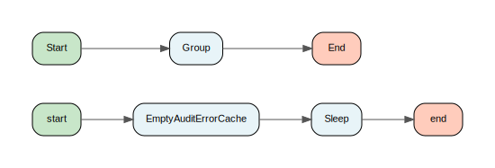

[↑ Back to Inventory](index.md)

#### Process: TIL_HSS_DiameterAdapter/UtilityServices/VFLE/Client/ExceptionCapture/ServiceExceptionClient.process {: #tilhssdiameteradapterutilityservicesvfleclientexceptioncaptureserviceexceptionclientprocess }

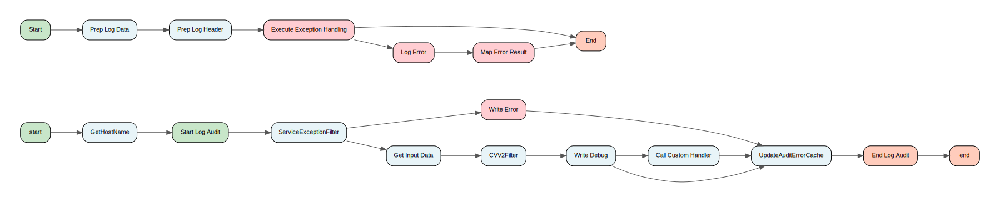

[↑ Back to Inventory](index.md)

#### Process: TIL_HSS_DiameterAdapter/UtilityServices/VFLE/Client/ExceptionCapture/SystemExceptionClient.process {: #tilhssdiameteradapterutilityservicesvfleclientexceptioncapturesystemexceptionclientprocess }

[↑ Back to Inventory](index.md)

#### Process: TIL_HSS_DiameterAdapter/UtilityServices/VFLE/Client/ExceptionCapture/UpdateAuditErrorCache.process {: #tilhssdiameteradapterutilityservicesvfleclientexceptioncaptureupdateauditerrorcacheprocess }

[↑ Back to Inventory](index.md)

#### Process: TIL_HSS_DiameterAdapter/UtilityServices/VFLE/Client/Public/ShutdownCleanUp.process {: #tilhssdiameteradapterutilityservicesvfleclientpublicshutdowncleanupprocess }

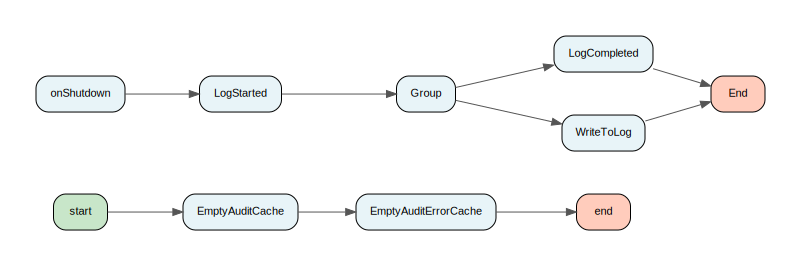

[↑ Back to Inventory](index.md)

#### Process: TIL_HSS_DiameterAdapter/UtilityServices/VFLE/Client/Public/StartupInitialisation.process {: #tilhssdiameteradapterutilityservicesvfleclientpublicstartupinitialisationprocess }

[↑ Back to Inventory](index.md)

