# TIL_OSM_Adapter-22_6_A_1 Architecture

## Process Inventory
### Group: TIL_OSM_Adapter
| Path |
| :--- |
| [TIL_OSM_Adapter/BusinessServices/ITIntegration/ApplicationIntegration/Routing/OSMRouter/Interface/JMSXMLServiceRequest.process](#tilosmadapterbusinessservicesitintegrationapplicationintegrationroutingosmrouterinterfacejmsxmlservicerequestprocess) |
| [TIL_OSM_Adapter/BusinessServices/ITIntegration/ApplicationIntegration/Routing/OSMRouter/Sub/BENMessageRouter.process](#tilosmadapterbusinessservicesitintegrationapplicationintegrationroutingosmroutersubbenmessagerouterprocess) |
| [TIL_OSM_Adapter/BusinessServices/ITIntegration/ApplicationIntegration/Routing/OSMRouter/Sub/MainProcess.process](#tilosmadapterbusinessservicesitintegrationapplicationintegrationroutingosmroutersubmainprocessprocess) |
| [TIL_OSM_Adapter/BusinessServices/ITIntegration/ApplicationIntegration/Routing/OSMtoTILRouter/Interface/OSM/CustomXML-ParseRequest.process](#tilosmadapterbusinessservicesitintegrationapplicationintegrationroutingosmtotilrouterinterfaceosmcustomxmlparserequestprocess) |
| [TIL_OSM_Adapter/BusinessServices/ITIntegration/ApplicationIntegration/Routing/OSMtoTILRouter/Interface/OSM/GetOperationDetails.process](#tilosmadapterbusinessservicesitintegrationapplicationintegrationroutingosmtotilrouterinterfaceosmgetoperationdetailsprocess) |
| [TIL_OSM_Adapter/BusinessServices/ITIntegration/ApplicationIntegration/Routing/OSMtoTILRouter/Interface/OSM/JMSXMLServiceRequestReply-Operation10.process](#tilosmadapterbusinessservicesitintegrationapplicationintegrationroutingosmtotilrouterinterfaceosmjmsxmlservicerequestreplyoperation10process) |
| [TIL_OSM_Adapter/BusinessServices/ITIntegration/ApplicationIntegration/Routing/OSMtoTILRouter/Interface/OSM/JMSXMLServiceRequestReply-Operation1.process](#tilosmadapterbusinessservicesitintegrationapplicationintegrationroutingosmtotilrouterinterfaceosmjmsxmlservicerequestreplyoperation1process) |
| [TIL_OSM_Adapter/BusinessServices/ITIntegration/ApplicationIntegration/Routing/OSMtoTILRouter/Interface/OSM/JMSXMLServiceRequestReply-Operation2.process](#tilosmadapterbusinessservicesitintegrationapplicationintegrationroutingosmtotilrouterinterfaceosmjmsxmlservicerequestreplyoperation2process) |
| [TIL_OSM_Adapter/BusinessServices/ITIntegration/ApplicationIntegration/Routing/OSMtoTILRouter/Interface/OSM/JMSXMLServiceRequestReply-Operation3.process](#tilosmadapterbusinessservicesitintegrationapplicationintegrationroutingosmtotilrouterinterfaceosmjmsxmlservicerequestreplyoperation3process) |
| [TIL_OSM_Adapter/BusinessServices/ITIntegration/ApplicationIntegration/Routing/OSMtoTILRouter/Interface/OSM/JMSXMLServiceRequestReply-Operation4.process](#tilosmadapterbusinessservicesitintegrationapplicationintegrationroutingosmtotilrouterinterfaceosmjmsxmlservicerequestreplyoperation4process) |
| [TIL_OSM_Adapter/BusinessServices/ITIntegration/ApplicationIntegration/Routing/OSMtoTILRouter/Interface/OSM/JMSXMLServiceRequestReply-Operation5.process](#tilosmadapterbusinessservicesitintegrationapplicationintegrationroutingosmtotilrouterinterfaceosmjmsxmlservicerequestreplyoperation5process) |
| [TIL_OSM_Adapter/BusinessServices/ITIntegration/ApplicationIntegration/Routing/OSMtoTILRouter/Interface/OSM/JMSXMLServiceRequestReply-Operation6.process](#tilosmadapterbusinessservicesitintegrationapplicationintegrationroutingosmtotilrouterinterfaceosmjmsxmlservicerequestreplyoperation6process) |
| [TIL_OSM_Adapter/BusinessServices/ITIntegration/ApplicationIntegration/Routing/OSMtoTILRouter/Interface/OSM/JMSXMLServiceRequestReply-Operation7.process](#tilosmadapterbusinessservicesitintegrationapplicationintegrationroutingosmtotilrouterinterfaceosmjmsxmlservicerequestreplyoperation7process) |
| [TIL_OSM_Adapter/BusinessServices/ITIntegration/ApplicationIntegration/Routing/OSMtoTILRouter/Interface/OSM/JMSXMLServiceRequestReply-Operation8.process](#tilosmadapterbusinessservicesitintegrationapplicationintegrationroutingosmtotilrouterinterfaceosmjmsxmlservicerequestreplyoperation8process) |
| [TIL_OSM_Adapter/BusinessServices/ITIntegration/ApplicationIntegration/Routing/OSMtoTILRouter/Interface/OSM/JMSXMLServiceRequestReply-Operation9.process](#tilosmadapterbusinessservicesitintegrationapplicationintegrationroutingosmtotilrouterinterfaceosmjmsxmlservicerequestreplyoperation9process) |
| [TIL_OSM_Adapter/BusinessServices/ITIntegration/ApplicationIntegration/Routing/OSMtoTILRouter/Interface/OSM/JMSXMLServiceRetry-Operation10.process](#tilosmadapterbusinessservicesitintegrationapplicationintegrationroutingosmtotilrouterinterfaceosmjmsxmlserviceretryoperation10process) |
| [TIL_OSM_Adapter/BusinessServices/ITIntegration/ApplicationIntegration/Routing/OSMtoTILRouter/Interface/OSM/JMSXMLServiceRetry-Operation1.process](#tilosmadapterbusinessservicesitintegrationapplicationintegrationroutingosmtotilrouterinterfaceosmjmsxmlserviceretryoperation1process) |
| [TIL_OSM_Adapter/BusinessServices/ITIntegration/ApplicationIntegration/Routing/OSMtoTILRouter/Interface/OSM/JMSXMLServiceRetry-Operation2.process](#tilosmadapterbusinessservicesitintegrationapplicationintegrationroutingosmtotilrouterinterfaceosmjmsxmlserviceretryoperation2process) |
| [TIL_OSM_Adapter/BusinessServices/ITIntegration/ApplicationIntegration/Routing/OSMtoTILRouter/Interface/OSM/JMSXMLServiceRetry-Operation3.process](#tilosmadapterbusinessservicesitintegrationapplicationintegrationroutingosmtotilrouterinterfaceosmjmsxmlserviceretryoperation3process) |
| [TIL_OSM_Adapter/BusinessServices/ITIntegration/ApplicationIntegration/Routing/OSMtoTILRouter/Interface/OSM/JMSXMLServiceRetry-Operation4.process](#tilosmadapterbusinessservicesitintegrationapplicationintegrationroutingosmtotilrouterinterfaceosmjmsxmlserviceretryoperation4process) |
| [TIL_OSM_Adapter/BusinessServices/ITIntegration/ApplicationIntegration/Routing/OSMtoTILRouter/Interface/OSM/JMSXMLServiceRetry-Operation5.process](#tilosmadapterbusinessservicesitintegrationapplicationintegrationroutingosmtotilrouterinterfaceosmjmsxmlserviceretryoperation5process) |
| [TIL_OSM_Adapter/BusinessServices/ITIntegration/ApplicationIntegration/Routing/OSMtoTILRouter/Interface/OSM/JMSXMLServiceRetry-Operation6.process](#tilosmadapterbusinessservicesitintegrationapplicationintegrationroutingosmtotilrouterinterfaceosmjmsxmlserviceretryoperation6process) |
| [TIL_OSM_Adapter/BusinessServices/ITIntegration/ApplicationIntegration/Routing/OSMtoTILRouter/Interface/OSM/JMSXMLServiceRetry-Operation7.process](#tilosmadapterbusinessservicesitintegrationapplicationintegrationroutingosmtotilrouterinterfaceosmjmsxmlserviceretryoperation7process) |
| [TIL_OSM_Adapter/BusinessServices/ITIntegration/ApplicationIntegration/Routing/OSMtoTILRouter/Interface/OSM/JMSXMLServiceRetry-Operation8.process](#tilosmadapterbusinessservicesitintegrationapplicationintegrationroutingosmtotilrouterinterfaceosmjmsxmlserviceretryoperation8process) |
| [TIL_OSM_Adapter/BusinessServices/ITIntegration/ApplicationIntegration/Routing/OSMtoTILRouter/Interface/OSM/JMSXMLServiceRetry-Operation9.process](#tilosmadapterbusinessservicesitintegrationapplicationintegrationroutingosmtotilrouterinterfaceosmjmsxmlserviceretryoperation9process) |
| [TIL_OSM_Adapter/BusinessServices/ITIntegration/ApplicationIntegration/Routing/OSMtoTILRouter/Interface/OSM/RenderErrorReply.process](#tilosmadapterbusinessservicesitintegrationapplicationintegrationroutingosmtotilrouterinterfaceosmrendererrorreplyprocess) |
| [TIL_OSM_Adapter/BusinessServices/ITIntegration/ApplicationIntegration/Routing/OSMtoTILRouter/Interface/OSM/RenderReply.process](#tilosmadapterbusinessservicesitintegrationapplicationintegrationroutingosmtotilrouterinterfaceosmrenderreplyprocess) |
| [TIL_OSM_Adapter/BusinessServices/ITIntegration/ApplicationIntegration/Routing/OSMtoTILRouter/Interface/OSM/TransformUsingXSLT.process](#tilosmadapterbusinessservicesitintegrationapplicationintegrationroutingosmtotilrouterinterfaceosmtransformusingxsltprocess) |
| [TIL_OSM_Adapter/BusinessServices/ITIntegration/ApplicationIntegration/Routing/OSMtoTILRouter/Sub/GetRoutingDetails.process](#tilosmadapterbusinessservicesitintegrationapplicationintegrationroutingosmtotilroutersubgetroutingdetailsprocess) |
| [TIL_OSM_Adapter/BusinessServices/ITIntegration/ApplicationIntegration/Routing/OSMtoTILRouter/Sub/MainProcess.process](#tilosmadapterbusinessservicesitintegrationapplicationintegrationroutingosmtotilroutersubmainprocessprocess) |
| [TIL_OSM_Adapter/BusinessServices/ITIntegration/ApplicationIntegration/Routing/OSMtoTILRouter/Sub/OSMReplyClient.process](#tilosmadapterbusinessservicesitintegrationapplicationintegrationroutingosmtotilroutersubosmreplyclientprocess) |
| [TIL_OSM_Adapter/BusinessServices/ITIntegration/ApplicationIntegration/Routing/OSMtoTILRouter/Sub/TILServiceClient.process](#tilosmadapterbusinessservicesitintegrationapplicationintegrationroutingosmtotilroutersubtilserviceclientprocess) |
| [TIL_OSM_Adapter/BusinessServices/ITIntegration/ApplicationIntegration/Routing/TILtoOSMRouter/Interface/TIL/CustomXML-ParseRequest.process](#tilosmadapterbusinessservicesitintegrationapplicationintegrationroutingtiltoosmrouterinterfacetilcustomxmlparserequestprocess) |
| [TIL_OSM_Adapter/BusinessServices/ITIntegration/ApplicationIntegration/Routing/TILtoOSMRouter/Interface/TIL/GetOperationName.process](#tilosmadapterbusinessservicesitintegrationapplicationintegrationroutingtiltoosmrouterinterfacetilgetoperationnameprocess) |
| [TIL_OSM_Adapter/BusinessServices/ITIntegration/ApplicationIntegration/Routing/TILtoOSMRouter/Interface/TIL/JMSServiceRequestReply-Operation10.process](#tilosmadapterbusinessservicesitintegrationapplicationintegrationroutingtiltoosmrouterinterfacetiljmsservicerequestreplyoperation10process) |
| [TIL_OSM_Adapter/BusinessServices/ITIntegration/ApplicationIntegration/Routing/TILtoOSMRouter/Interface/TIL/JMSServiceRequestReply-Operation1.process](#tilosmadapterbusinessservicesitintegrationapplicationintegrationroutingtiltoosmrouterinterfacetiljmsservicerequestreplyoperation1process) |
| [TIL_OSM_Adapter/BusinessServices/ITIntegration/ApplicationIntegration/Routing/TILtoOSMRouter/Interface/TIL/JMSServiceRequestReply-Operation2.process](#tilosmadapterbusinessservicesitintegrationapplicationintegrationroutingtiltoosmrouterinterfacetiljmsservicerequestreplyoperation2process) |
| [TIL_OSM_Adapter/BusinessServices/ITIntegration/ApplicationIntegration/Routing/TILtoOSMRouter/Interface/TIL/JMSServiceRequestReply-Operation3.process](#tilosmadapterbusinessservicesitintegrationapplicationintegrationroutingtiltoosmrouterinterfacetiljmsservicerequestreplyoperation3process) |
| [TIL_OSM_Adapter/BusinessServices/ITIntegration/ApplicationIntegration/Routing/TILtoOSMRouter/Interface/TIL/JMSServiceRequestReply-Operation4.process](#tilosmadapterbusinessservicesitintegrationapplicationintegrationroutingtiltoosmrouterinterfacetiljmsservicerequestreplyoperation4process) |
| [TIL_OSM_Adapter/BusinessServices/ITIntegration/ApplicationIntegration/Routing/TILtoOSMRouter/Interface/TIL/JMSServiceRequestReply-Operation5.process](#tilosmadapterbusinessservicesitintegrationapplicationintegrationroutingtiltoosmrouterinterfacetiljmsservicerequestreplyoperation5process) |
| [TIL_OSM_Adapter/BusinessServices/ITIntegration/ApplicationIntegration/Routing/TILtoOSMRouter/Interface/TIL/JMSServiceRequestReply-Operation6.process](#tilosmadapterbusinessservicesitintegrationapplicationintegrationroutingtiltoosmrouterinterfacetiljmsservicerequestreplyoperation6process) |
| [TIL_OSM_Adapter/BusinessServices/ITIntegration/ApplicationIntegration/Routing/TILtoOSMRouter/Interface/TIL/JMSServiceRequestReply-Operation7.process](#tilosmadapterbusinessservicesitintegrationapplicationintegrationroutingtiltoosmrouterinterfacetiljmsservicerequestreplyoperation7process) |
| [TIL_OSM_Adapter/BusinessServices/ITIntegration/ApplicationIntegration/Routing/TILtoOSMRouter/Interface/TIL/JMSServiceRequestReply-Operation8.process](#tilosmadapterbusinessservicesitintegrationapplicationintegrationroutingtiltoosmrouterinterfacetiljmsservicerequestreplyoperation8process) |
| [TIL_OSM_Adapter/BusinessServices/ITIntegration/ApplicationIntegration/Routing/TILtoOSMRouter/Interface/TIL/JMSServiceRequestReply-Operation9.process](#tilosmadapterbusinessservicesitintegrationapplicationintegrationroutingtiltoosmrouterinterfacetiljmsservicerequestreplyoperation9process) |
| [TIL_OSM_Adapter/BusinessServices/ITIntegration/ApplicationIntegration/Routing/TILtoOSMRouter/Interface/TIL/JMSXMLServiceRetry-Operation10.process](#tilosmadapterbusinessservicesitintegrationapplicationintegrationroutingtiltoosmrouterinterfacetiljmsxmlserviceretryoperation10process) |
| [TIL_OSM_Adapter/BusinessServices/ITIntegration/ApplicationIntegration/Routing/TILtoOSMRouter/Interface/TIL/JMSXMLServiceRetry-Operation1.process](#tilosmadapterbusinessservicesitintegrationapplicationintegrationroutingtiltoosmrouterinterfacetiljmsxmlserviceretryoperation1process) |
| [TIL_OSM_Adapter/BusinessServices/ITIntegration/ApplicationIntegration/Routing/TILtoOSMRouter/Interface/TIL/JMSXMLServiceRetry-Operation2.process](#tilosmadapterbusinessservicesitintegrationapplicationintegrationroutingtiltoosmrouterinterfacetiljmsxmlserviceretryoperation2process) |
| [TIL_OSM_Adapter/BusinessServices/ITIntegration/ApplicationIntegration/Routing/TILtoOSMRouter/Interface/TIL/JMSXMLServiceRetry-Operation3.process](#tilosmadapterbusinessservicesitintegrationapplicationintegrationroutingtiltoosmrouterinterfacetiljmsxmlserviceretryoperation3process) |
| [TIL_OSM_Adapter/BusinessServices/ITIntegration/ApplicationIntegration/Routing/TILtoOSMRouter/Interface/TIL/JMSXMLServiceRetry-Operation4.process](#tilosmadapterbusinessservicesitintegrationapplicationintegrationroutingtiltoosmrouterinterfacetiljmsxmlserviceretryoperation4process) |
| [TIL_OSM_Adapter/BusinessServices/ITIntegration/ApplicationIntegration/Routing/TILtoOSMRouter/Interface/TIL/JMSXMLServiceRetry-Operation5.process](#tilosmadapterbusinessservicesitintegrationapplicationintegrationroutingtiltoosmrouterinterfacetiljmsxmlserviceretryoperation5process) |
| [TIL_OSM_Adapter/BusinessServices/ITIntegration/ApplicationIntegration/Routing/TILtoOSMRouter/Interface/TIL/JMSXMLServiceRetry-Operation6.process](#tilosmadapterbusinessservicesitintegrationapplicationintegrationroutingtiltoosmrouterinterfacetiljmsxmlserviceretryoperation6process) |
| [TIL_OSM_Adapter/BusinessServices/ITIntegration/ApplicationIntegration/Routing/TILtoOSMRouter/Interface/TIL/JMSXMLServiceRetry-Operation7.process](#tilosmadapterbusinessservicesitintegrationapplicationintegrationroutingtiltoosmrouterinterfacetiljmsxmlserviceretryoperation7process) |
| [TIL_OSM_Adapter/BusinessServices/ITIntegration/ApplicationIntegration/Routing/TILtoOSMRouter/Interface/TIL/JMSXMLServiceRetry-Operation8.process](#tilosmadapterbusinessservicesitintegrationapplicationintegrationroutingtiltoosmrouterinterfacetiljmsxmlserviceretryoperation8process) |
| [TIL_OSM_Adapter/BusinessServices/ITIntegration/ApplicationIntegration/Routing/TILtoOSMRouter/Interface/TIL/JMSXMLServiceRetry-Operation9.process](#tilosmadapterbusinessservicesitintegrationapplicationintegrationroutingtiltoosmrouterinterfacetiljmsxmlserviceretryoperation9process) |
| [TIL_OSM_Adapter/BusinessServices/ITIntegration/ApplicationIntegration/Routing/TILtoOSMRouter/Interface/TIL/RenderErrorReply.process](#tilosmadapterbusinessservicesitintegrationapplicationintegrationroutingtiltoosmrouterinterfacetilrendererrorreplyprocess) |
| [TIL_OSM_Adapter/BusinessServices/ITIntegration/ApplicationIntegration/Routing/TILtoOSMRouter/Interface/TIL/RenderReply.process](#tilosmadapterbusinessservicesitintegrationapplicationintegrationroutingtiltoosmrouterinterfacetilrenderreplyprocess) |
| [TIL_OSM_Adapter/BusinessServices/ITIntegration/ApplicationIntegration/Routing/TILtoOSMRouter/Sub/GetRoutingDetails.process](#tilosmadapterbusinessservicesitintegrationapplicationintegrationroutingtiltoosmroutersubgetroutingdetailsprocess) |
| [TIL_OSM_Adapter/BusinessServices/ITIntegration/ApplicationIntegration/Routing/TILtoOSMRouter/Sub/MainProcess.process](#tilosmadapterbusinessservicesitintegrationapplicationintegrationroutingtiltoosmroutersubmainprocessprocess) |
| [TIL_OSM_Adapter/ConnectivityServices/Common/Private/RenderBackEndError.process](#tilosmadapterconnectivityservicescommonprivaterenderbackenderrorprocess) |
| [TIL_OSM_Adapter/ConnectivityServices/JMS/Private/InvokeOnTopic.process](#tilosmadapterconnectivityservicesjmsprivateinvokeontopicprocess) |
| [TIL_OSM_Adapter/ConnectivityServices/JMS/Private/PrepareData.process](#tilosmadapterconnectivityservicesjmsprivatepreparedataprocess) |
| [TIL_OSM_Adapter/ConnectivityServices/JMS/Private/PublishToTopic-Object.process](#tilosmadapterconnectivityservicesjmsprivatepublishtotopicobjectprocess) |
| [TIL_OSM_Adapter/ConnectivityServices/JMS/Private/PublishToTopic.process](#tilosmadapterconnectivityservicesjmsprivatepublishtotopicprocess) |
| [TIL_OSM_Adapter/ConnectivityServices/JMS/Public/InvokeOnTopic.process](#tilosmadapterconnectivityservicesjmspublicinvokeontopicprocess) |
| [TIL_OSM_Adapter/ConnectivityServices/JMS/Public/PublishToTopic.process](#tilosmadapterconnectivityservicesjmspublicpublishtotopicprocess) |
| [TIL_OSM_Adapter/ConnectivityServices/OSM/JMS/Private/PrepareData.process](#tilosmadapterconnectivityservicesosmjmsprivatepreparedataprocess) |
| [TIL_OSM_Adapter/ConnectivityServices/OSM/JMS/Private/PublishToQueue-Object.process](#tilosmadapterconnectivityservicesosmjmsprivatepublishtoqueueobjectprocess) |
| [TIL_OSM_Adapter/ConnectivityServices/OSM/JMS/Private/PublishToQueue.process](#tilosmadapterconnectivityservicesosmjmsprivatepublishtoqueueprocess) |
| [TIL_OSM_Adapter/ConnectivityServices/OSM/JMS/Public/GetJMSQueueMessage.process](#tilosmadapterconnectivityservicesosmjmspublicgetjmsqueuemessageprocess) |
| [TIL_OSM_Adapter/ConnectivityServices/OSM/JMS/Public/PublishToQueue.process](#tilosmadapterconnectivityservicesosmjmspublicpublishtoqueueprocess) |
| [TIL_OSM_Adapter/ConnectivityServices/OSM/Private/LoadAllOSMErrorCodes.process](#tilosmadapterconnectivityservicesosmprivateloadallosmerrorcodesprocess) |
| [TIL_OSM_Adapter/ConnectivityServices/OSM/Private/LoadOSMTILRoutingDetails.process](#tilosmadapterconnectivityservicesosmprivateloadosmtilroutingdetailsprocess) |
| [TIL_OSM_Adapter/ConnectivityServices/OSM/Public/LoadAllOSMErrorCodes.process](#tilosmadapterconnectivityservicesosmpublicloadallosmerrorcodesprocess) |
| [TIL_OSM_Adapter/ConnectivityServices/OSM/Public/LoadAllOSMTILRoutingDetails.process](#tilosmadapterconnectivityservicesosmpublicloadallosmtilroutingdetailsprocess) |
| [TIL_OSM_Adapter/ConnectivityServices/OSM/Public/MapOSMException.process](#tilosmadapterconnectivityservicesosmpublicmaposmexceptionprocess) |
| [TIL_OSM_Adapter/UtilityServices/ExceptionHandling/Filtering/CVV2Filter.process](#tilosmadapterutilityservicesexceptionhandlingfilteringcvv2filterprocess) |
| [TIL_OSM_Adapter/UtilityServices/ExceptionHandling/Filtering/ExceptionSchemaFilter.process](#tilosmadapterutilityservicesexceptionhandlingfilteringexceptionschemafilterprocess) |
| [TIL_OSM_Adapter/UtilityServices/ExceptionHandling/Filtering/Security/CVV2Filter.process](#tilosmadapterutilityservicesexceptionhandlingfilteringsecuritycvv2filterprocess) |
| [TIL_OSM_Adapter/UtilityServices/ExceptionHandling/Filtering/ServiceExceptionFilter.process](#tilosmadapterutilityservicesexceptionhandlingfilteringserviceexceptionfilterprocess) |
| [TIL_OSM_Adapter/UtilityServices/ExceptionHandling/Filtering/SpecialExceptions/GetSpecialExceptionList.process](#tilosmadapterutilityservicesexceptionhandlingfilteringspecialexceptionsgetspecialexceptionlistprocess) |
| [TIL_OSM_Adapter/UtilityServices/ExceptionHandling/Filtering/SpecialExceptions/TraceSpecialException.process](#tilosmadapterutilityservicesexceptionhandlingfilteringspecialexceptionstracespecialexceptionprocess) |
| [TIL_OSM_Adapter/UtilityServices/ExceptionHandling/Filtering/SystemExceptionFilter.process](#tilosmadapterutilityservicesexceptionhandlingfilteringsystemexceptionfilterprocess) |
| [TIL_OSM_Adapter/UtilityServices/ExceptionHandling/Interface/ServiceExceptionHandler.process](#tilosmadapterutilityservicesexceptionhandlinginterfaceserviceexceptionhandlerprocess) |
| [TIL_OSM_Adapter/UtilityServices/ExceptionHandling/Interface/SystemExceptionHandler.process](#tilosmadapterutilityservicesexceptionhandlinginterfacesystemexceptionhandlerprocess) |
| [TIL_OSM_Adapter/UtilityServices/ExceptionHandling/Private/MapException.process](#tilosmadapterutilityservicesexceptionhandlingprivatemapexceptionprocess) |
| [TIL_OSM_Adapter/UtilityServices/ExceptionHandling/Public/MapAnyException.process](#tilosmadapterutilityservicesexceptionhandlingpublicmapanyexceptionprocess) |
| [TIL_OSM_Adapter/UtilityServices/ExceptionHandling/ServiceExceptionHandler.process](#tilosmadapterutilityservicesexceptionhandlingserviceexceptionhandlerprocess) |
| [TIL_OSM_Adapter/UtilityServices/ExceptionHandling/Shutdown BWEngine.process](#tilosmadapterutilityservicesexceptionhandlingshutdownbwengineprocess) |
| [TIL_OSM_Adapter/UtilityServices/Interface/OperationReply.process](#tilosmadapterutilityservicesinterfaceoperationreplyprocess) |
| [TIL_OSM_Adapter/UtilityServices/Interface/Private/PublishToRetryQueue.process](#tilosmadapterutilityservicesinterfaceprivatepublishtoretryqueueprocess) |
| [TIL_OSM_Adapter/UtilityServices/Logging/LogEnd.process](#tilosmadapterutilityserviceslogginglogendprocess) |
| [TIL_OSM_Adapter/UtilityServices/Logging/LogError.process](#tilosmadapterutilityserviceslogginglogerrorprocess) |
| [TIL_OSM_Adapter/UtilityServices/Logging/LogFatal.process](#tilosmadapterutilityserviceslogginglogfatalprocess) |
| [TIL_OSM_Adapter/UtilityServices/Logging/LogStart.process](#tilosmadapterutilityserviceslogginglogstartprocess) |
| [TIL_OSM_Adapter/UtilityServices/Logging/Private/WriteToLog.process](#tilosmadapterutilityservicesloggingprivatewritetologprocess) |
| [TIL_OSM_Adapter/UtilityServices/Logging/Public/CSAuditEnd.process](#tilosmadapterutilityservicesloggingpubliccsauditendprocess) |
| [TIL_OSM_Adapter/UtilityServices/Logging/Public/CSAuditStart.process](#tilosmadapterutilityservicesloggingpubliccsauditstartprocess) |
| [TIL_OSM_Adapter/UtilityServices/Logging/Public/WriteToLog.process](#tilosmadapterutilityservicesloggingpublicwritetologprocess) |
| [TIL_OSM_Adapter/UtilityServices/Security/Tokens/Private/LoadExpiration.process](#tilosmadapterutilityservicessecuritytokensprivateloadexpirationprocess) |
| [TIL_OSM_Adapter/UtilityServices/Security/Tokens/Private/LoadOperationValidation.process](#tilosmadapterutilityservicessecuritytokensprivateloadoperationvalidationprocess) |
| [TIL_OSM_Adapter/UtilityServices/Security/Tokens/Private/LoadPartnerBIDMapping.process](#tilosmadapterutilityservicessecuritytokensprivateloadpartnerbidmappingprocess) |
| [TIL_OSM_Adapter/UtilityServices/Security/Tokens/Public/LoadExpiration.process](#tilosmadapterutilityservicessecuritytokenspublicloadexpirationprocess) |
| [TIL_OSM_Adapter/UtilityServices/Security/Tokens/Public/LoadOperationValidation.process](#tilosmadapterutilityservicessecuritytokenspublicloadoperationvalidationprocess) |
| [TIL_OSM_Adapter/UtilityServices/Security/Tokens/Public/LoadPartnerBIDMapping.process](#tilosmadapterutilityservicessecuritytokenspublicloadpartnerbidmappingprocess) |
| [TIL_OSM_Adapter/UtilityServices/Security/Tokens/Public/ReloadExpiration.process](#tilosmadapterutilityservicessecuritytokenspublicreloadexpirationprocess) |
| [TIL_OSM_Adapter/UtilityServices/Security/Tokens/Public/ReloadOperationValidation.process](#tilosmadapterutilityservicessecuritytokenspublicreloadoperationvalidationprocess) |
| [TIL_OSM_Adapter/UtilityServices/Security/Tokens/Public/ReloadPartnerBIDMapping.process](#tilosmadapterutilityservicessecuritytokenspublicreloadpartnerbidmappingprocess) |
| [TIL_OSM_Adapter/UtilityServices/VFLE/Client/AuditEventCapture/AuditEvent.process](#tilosmadapterutilityservicesvfleclientauditeventcaptureauditeventprocess) |
| [TIL_OSM_Adapter/UtilityServices/VFLE/Client/AuditEventCapture/EmptyAuditCache.process](#tilosmadapterutilityservicesvfleclientauditeventcaptureemptyauditcacheprocess) |
| [TIL_OSM_Adapter/UtilityServices/VFLE/Client/AuditEventCapture/RemoveFromAuditCache.process](#tilosmadapterutilityservicesvfleclientauditeventcaptureremovefromauditcacheprocess) |
| [TIL_OSM_Adapter/UtilityServices/VFLE/Client/AuditEventCapture/UpdateAuditCache.process](#tilosmadapterutilityservicesvfleclientauditeventcaptureupdateauditcacheprocess) |
| [TIL_OSM_Adapter/UtilityServices/VFLE/Client/ExceptionCapture/CustomServiceExceptionHandlerInterface.process](#tilosmadapterutilityservicesvfleclientexceptioncapturecustomserviceexceptionhandlerinterfaceprocess) |
| [TIL_OSM_Adapter/UtilityServices/VFLE/Client/ExceptionCapture/EmptyAuditErrorCache.process](#tilosmadapterutilityservicesvfleclientexceptioncaptureemptyauditerrorcacheprocess) |
| [TIL_OSM_Adapter/UtilityServices/VFLE/Client/ExceptionCapture/RemoveFromAuditErrorCache.process](#tilosmadapterutilityservicesvfleclientexceptioncaptureremovefromauditerrorcacheprocess) |
| [TIL_OSM_Adapter/UtilityServices/VFLE/Client/ExceptionCapture/ServiceExceptionClient.process](#tilosmadapterutilityservicesvfleclientexceptioncaptureserviceexceptionclientprocess) |
| [TIL_OSM_Adapter/UtilityServices/VFLE/Client/ExceptionCapture/SystemExceptionClient.process](#tilosmadapterutilityservicesvfleclientexceptioncapturesystemexceptionclientprocess) |
| [TIL_OSM_Adapter/UtilityServices/VFLE/Client/ExceptionCapture/UpdateAuditErrorCache.process](#tilosmadapterutilityservicesvfleclientexceptioncaptureupdateauditerrorcacheprocess) |
| [TIL_OSM_Adapter/UtilityServices/VFLE/Client/Public/ShutdownCleanUp.process](#tilosmadapterutilityservicesvfleclientpublicshutdowncleanupprocess) |
| [TIL_OSM_Adapter/UtilityServices/VFLE/Client/Public/StartupInitialisation.process](#tilosmadapterutilityservicesvfleclientpublicstartupinitialisationprocess) |

## Visual Flow Diagrams

#### Process: TIL_OSM_Adapter/BusinessServices/ITIntegration/ApplicationIntegration/Routing/OSMRouter/Interface/JMSXMLServiceRequest.process {: #tilosmadapterbusinessservicesitintegrationapplicationintegrationroutingosmrouterinterfacejmsxmlservicerequestprocess }

[↑ Back to Inventory](#process-inventory)

#### Process: TIL_OSM_Adapter/BusinessServices/ITIntegration/ApplicationIntegration/Routing/OSMRouter/Sub/BENMessageRouter.process {: #tilosmadapterbusinessservicesitintegrationapplicationintegrationroutingosmroutersubbenmessagerouterprocess }

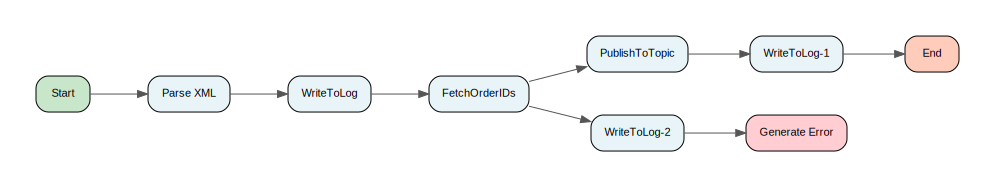

[↑ Back to Inventory](#process-inventory)

#### Process: TIL_OSM_Adapter/BusinessServices/ITIntegration/ApplicationIntegration/Routing/OSMRouter/Sub/MainProcess.process {: #tilosmadapterbusinessservicesitintegrationapplicationintegrationroutingosmroutersubmainprocessprocess }

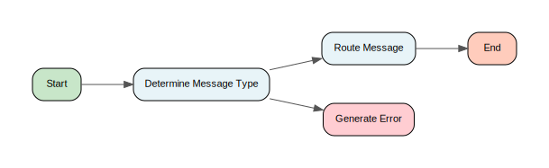

[↑ Back to Inventory](#process-inventory)

#### Process: TIL_OSM_Adapter/BusinessServices/ITIntegration/ApplicationIntegration/Routing/OSMtoTILRouter/Interface/OSM/CustomXML-ParseRequest.process {: #tilosmadapterbusinessservicesitintegrationapplicationintegrationroutingosmtotilrouterinterfaceosmcustomxmlparserequestprocess }

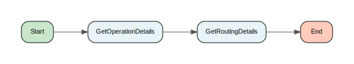

[↑ Back to Inventory](#process-inventory)

#### Process: TIL_OSM_Adapter/BusinessServices/ITIntegration/ApplicationIntegration/Routing/OSMtoTILRouter/Interface/OSM/GetOperationDetails.process {: #tilosmadapterbusinessservicesitintegrationapplicationintegrationroutingosmtotilrouterinterfaceosmgetoperationdetailsprocess }

[↑ Back to Inventory](#process-inventory)

#### Process: TIL_OSM_Adapter/BusinessServices/ITIntegration/ApplicationIntegration/Routing/OSMtoTILRouter/Interface/OSM/JMSXMLServiceRequestReply-Operation10.process {: #tilosmadapterbusinessservicesitintegrationapplicationintegrationroutingosmtotilrouterinterfaceosmjmsxmlservicerequestreplyoperation10process }

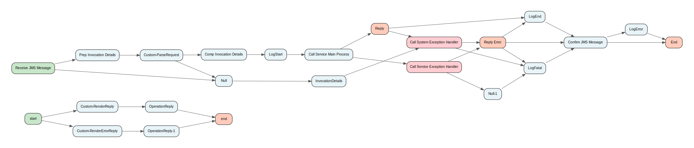

[↑ Back to Inventory](#process-inventory)

#### Process: TIL_OSM_Adapter/BusinessServices/ITIntegration/ApplicationIntegration/Routing/OSMtoTILRouter/Interface/OSM/JMSXMLServiceRequestReply-Operation1.process {: #tilosmadapterbusinessservicesitintegrationapplicationintegrationroutingosmtotilrouterinterfaceosmjmsxmlservicerequestreplyoperation1process }

[↑ Back to Inventory](#process-inventory)

#### Process: TIL_OSM_Adapter/BusinessServices/ITIntegration/ApplicationIntegration/Routing/OSMtoTILRouter/Interface/OSM/JMSXMLServiceRequestReply-Operation2.process {: #tilosmadapterbusinessservicesitintegrationapplicationintegrationroutingosmtotilrouterinterfaceosmjmsxmlservicerequestreplyoperation2process }

[↑ Back to Inventory](#process-inventory)

#### Process: TIL_OSM_Adapter/BusinessServices/ITIntegration/ApplicationIntegration/Routing/OSMtoTILRouter/Interface/OSM/JMSXMLServiceRequestReply-Operation3.process {: #tilosmadapterbusinessservicesitintegrationapplicationintegrationroutingosmtotilrouterinterfaceosmjmsxmlservicerequestreplyoperation3process }

[↑ Back to Inventory](#process-inventory)

#### Process: TIL_OSM_Adapter/BusinessServices/ITIntegration/ApplicationIntegration/Routing/OSMtoTILRouter/Interface/OSM/JMSXMLServiceRequestReply-Operation4.process {: #tilosmadapterbusinessservicesitintegrationapplicationintegrationroutingosmtotilrouterinterfaceosmjmsxmlservicerequestreplyoperation4process }

[↑ Back to Inventory](#process-inventory)

#### Process: TIL_OSM_Adapter/BusinessServices/ITIntegration/ApplicationIntegration/Routing/OSMtoTILRouter/Interface/OSM/JMSXMLServiceRequestReply-Operation5.process {: #tilosmadapterbusinessservicesitintegrationapplicationintegrationroutingosmtotilrouterinterfaceosmjmsxmlservicerequestreplyoperation5process }

[↑ Back to Inventory](#process-inventory)

#### Process: TIL_OSM_Adapter/BusinessServices/ITIntegration/ApplicationIntegration/Routing/OSMtoTILRouter/Interface/OSM/JMSXMLServiceRequestReply-Operation6.process {: #tilosmadapterbusinessservicesitintegrationapplicationintegrationroutingosmtotilrouterinterfaceosmjmsxmlservicerequestreplyoperation6process }

[↑ Back to Inventory](#process-inventory)

#### Process: TIL_OSM_Adapter/BusinessServices/ITIntegration/ApplicationIntegration/Routing/OSMtoTILRouter/Interface/OSM/JMSXMLServiceRequestReply-Operation7.process {: #tilosmadapterbusinessservicesitintegrationapplicationintegrationroutingosmtotilrouterinterfaceosmjmsxmlservicerequestreplyoperation7process }

[↑ Back to Inventory](#process-inventory)

#### Process: TIL_OSM_Adapter/BusinessServices/ITIntegration/ApplicationIntegration/Routing/OSMtoTILRouter/Interface/OSM/JMSXMLServiceRequestReply-Operation8.process {: #tilosmadapterbusinessservicesitintegrationapplicationintegrationroutingosmtotilrouterinterfaceosmjmsxmlservicerequestreplyoperation8process }

[↑ Back to Inventory](#process-inventory)

#### Process: TIL_OSM_Adapter/BusinessServices/ITIntegration/ApplicationIntegration/Routing/OSMtoTILRouter/Interface/OSM/JMSXMLServiceRequestReply-Operation9.process {: #tilosmadapterbusinessservicesitintegrationapplicationintegrationroutingosmtotilrouterinterfaceosmjmsxmlservicerequestreplyoperation9process }

[↑ Back to Inventory](#process-inventory)

#### Process: TIL_OSM_Adapter/BusinessServices/ITIntegration/ApplicationIntegration/Routing/OSMtoTILRouter/Interface/OSM/JMSXMLServiceRetry-Operation10.process {: #tilosmadapterbusinessservicesitintegrationapplicationintegrationroutingosmtotilrouterinterfaceosmjmsxmlserviceretryoperation10process }

[↑ Back to Inventory](#process-inventory)

#### Process: TIL_OSM_Adapter/BusinessServices/ITIntegration/ApplicationIntegration/Routing/OSMtoTILRouter/Interface/OSM/JMSXMLServiceRetry-Operation1.process {: #tilosmadapterbusinessservicesitintegrationapplicationintegrationroutingosmtotilrouterinterfaceosmjmsxmlserviceretryoperation1process }

[↑ Back to Inventory](#process-inventory)

#### Process: TIL_OSM_Adapter/BusinessServices/ITIntegration/ApplicationIntegration/Routing/OSMtoTILRouter/Interface/OSM/JMSXMLServiceRetry-Operation2.process {: #tilosmadapterbusinessservicesitintegrationapplicationintegrationroutingosmtotilrouterinterfaceosmjmsxmlserviceretryoperation2process }

[↑ Back to Inventory](#process-inventory)

#### Process: TIL_OSM_Adapter/BusinessServices/ITIntegration/ApplicationIntegration/Routing/OSMtoTILRouter/Interface/OSM/JMSXMLServiceRetry-Operation3.process {: #tilosmadapterbusinessservicesitintegrationapplicationintegrationroutingosmtotilrouterinterfaceosmjmsxmlserviceretryoperation3process }

[↑ Back to Inventory](#process-inventory)

#### Process: TIL_OSM_Adapter/BusinessServices/ITIntegration/ApplicationIntegration/Routing/OSMtoTILRouter/Interface/OSM/JMSXMLServiceRetry-Operation4.process {: #tilosmadapterbusinessservicesitintegrationapplicationintegrationroutingosmtotilrouterinterfaceosmjmsxmlserviceretryoperation4process }

[↑ Back to Inventory](#process-inventory)

#### Process: TIL_OSM_Adapter/BusinessServices/ITIntegration/ApplicationIntegration/Routing/OSMtoTILRouter/Interface/OSM/JMSXMLServiceRetry-Operation5.process {: #tilosmadapterbusinessservicesitintegrationapplicationintegrationroutingosmtotilrouterinterfaceosmjmsxmlserviceretryoperation5process }

[↑ Back to Inventory](#process-inventory)

#### Process: TIL_OSM_Adapter/BusinessServices/ITIntegration/ApplicationIntegration/Routing/OSMtoTILRouter/Interface/OSM/JMSXMLServiceRetry-Operation6.process {: #tilosmadapterbusinessservicesitintegrationapplicationintegrationroutingosmtotilrouterinterfaceosmjmsxmlserviceretryoperation6process }

[↑ Back to Inventory](#process-inventory)

#### Process: TIL_OSM_Adapter/BusinessServices/ITIntegration/ApplicationIntegration/Routing/OSMtoTILRouter/Interface/OSM/JMSXMLServiceRetry-Operation7.process {: #tilosmadapterbusinessservicesitintegrationapplicationintegrationroutingosmtotilrouterinterfaceosmjmsxmlserviceretryoperation7process }

[↑ Back to Inventory](#process-inventory)

#### Process: TIL_OSM_Adapter/BusinessServices/ITIntegration/ApplicationIntegration/Routing/OSMtoTILRouter/Interface/OSM/JMSXMLServiceRetry-Operation8.process {: #tilosmadapterbusinessservicesitintegrationapplicationintegrationroutingosmtotilrouterinterfaceosmjmsxmlserviceretryoperation8process }

[↑ Back to Inventory](#process-inventory)

#### Process: TIL_OSM_Adapter/BusinessServices/ITIntegration/ApplicationIntegration/Routing/OSMtoTILRouter/Interface/OSM/JMSXMLServiceRetry-Operation9.process {: #tilosmadapterbusinessservicesitintegrationapplicationintegrationroutingosmtotilrouterinterfaceosmjmsxmlserviceretryoperation9process }

[↑ Back to Inventory](#process-inventory)

#### Process: TIL_OSM_Adapter/BusinessServices/ITIntegration/ApplicationIntegration/Routing/OSMtoTILRouter/Interface/OSM/RenderErrorReply.process {: #tilosmadapterbusinessservicesitintegrationapplicationintegrationroutingosmtotilrouterinterfaceosmrendererrorreplyprocess }

[↑ Back to Inventory](#process-inventory)

#### Process: TIL_OSM_Adapter/BusinessServices/ITIntegration/ApplicationIntegration/Routing/OSMtoTILRouter/Interface/OSM/RenderReply.process {: #tilosmadapterbusinessservicesitintegrationapplicationintegrationroutingosmtotilrouterinterfaceosmrenderreplyprocess }

[↑ Back to Inventory](#process-inventory)

#### Process: TIL_OSM_Adapter/BusinessServices/ITIntegration/ApplicationIntegration/Routing/OSMtoTILRouter/Interface/OSM/TransformUsingXSLT.process {: #tilosmadapterbusinessservicesitintegrationapplicationintegrationroutingosmtotilrouterinterfaceosmtransformusingxsltprocess }

[↑ Back to Inventory](#process-inventory)

#### Process: TIL_OSM_Adapter/BusinessServices/ITIntegration/ApplicationIntegration/Routing/OSMtoTILRouter/Sub/GetRoutingDetails.process {: #tilosmadapterbusinessservicesitintegrationapplicationintegrationroutingosmtotilroutersubgetroutingdetailsprocess }

[↑ Back to Inventory](#process-inventory)

#### Process: TIL_OSM_Adapter/BusinessServices/ITIntegration/ApplicationIntegration/Routing/OSMtoTILRouter/Sub/MainProcess.process {: #tilosmadapterbusinessservicesitintegrationapplicationintegrationroutingosmtotilroutersubmainprocessprocess }

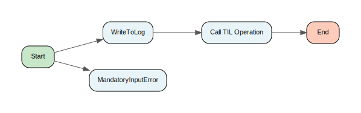

[↑ Back to Inventory](#process-inventory)

#### Process: TIL_OSM_Adapter/BusinessServices/ITIntegration/ApplicationIntegration/Routing/OSMtoTILRouter/Sub/OSMReplyClient.process {: #tilosmadapterbusinessservicesitintegrationapplicationintegrationroutingosmtotilroutersubosmreplyclientprocess }

[↑ Back to Inventory](#process-inventory)

#### Process: TIL_OSM_Adapter/BusinessServices/ITIntegration/ApplicationIntegration/Routing/OSMtoTILRouter/Sub/TILServiceClient.process {: #tilosmadapterbusinessservicesitintegrationapplicationintegrationroutingosmtotilroutersubtilserviceclientprocess }

[↑ Back to Inventory](#process-inventory)

#### Process: TIL_OSM_Adapter/BusinessServices/ITIntegration/ApplicationIntegration/Routing/TILtoOSMRouter/Interface/TIL/CustomXML-ParseRequest.process {: #tilosmadapterbusinessservicesitintegrationapplicationintegrationroutingtiltoosmrouterinterfacetilcustomxmlparserequestprocess }

[↑ Back to Inventory](#process-inventory)

#### Process: TIL_OSM_Adapter/BusinessServices/ITIntegration/ApplicationIntegration/Routing/TILtoOSMRouter/Interface/TIL/GetOperationName.process {: #tilosmadapterbusinessservicesitintegrationapplicationintegrationroutingtiltoosmrouterinterfacetilgetoperationnameprocess }

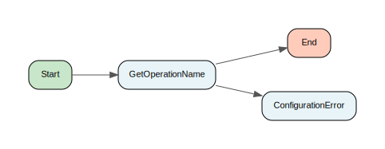

[↑ Back to Inventory](#process-inventory)

#### Process: TIL_OSM_Adapter/BusinessServices/ITIntegration/ApplicationIntegration/Routing/TILtoOSMRouter/Interface/TIL/JMSServiceRequestReply-Operation10.process {: #tilosmadapterbusinessservicesitintegrationapplicationintegrationroutingtiltoosmrouterinterfacetiljmsservicerequestreplyoperation10process }

[↑ Back to Inventory](#process-inventory)

#### Process: TIL_OSM_Adapter/BusinessServices/ITIntegration/ApplicationIntegration/Routing/TILtoOSMRouter/Interface/TIL/JMSServiceRequestReply-Operation1.process {: #tilosmadapterbusinessservicesitintegrationapplicationintegrationroutingtiltoosmrouterinterfacetiljmsservicerequestreplyoperation1process }

[↑ Back to Inventory](#process-inventory)

#### Process: TIL_OSM_Adapter/BusinessServices/ITIntegration/ApplicationIntegration/Routing/TILtoOSMRouter/Interface/TIL/JMSServiceRequestReply-Operation2.process {: #tilosmadapterbusinessservicesitintegrationapplicationintegrationroutingtiltoosmrouterinterfacetiljmsservicerequestreplyoperation2process }

[↑ Back to Inventory](#process-inventory)

#### Process: TIL_OSM_Adapter/BusinessServices/ITIntegration/ApplicationIntegration/Routing/TILtoOSMRouter/Interface/TIL/JMSServiceRequestReply-Operation3.process {: #tilosmadapterbusinessservicesitintegrationapplicationintegrationroutingtiltoosmrouterinterfacetiljmsservicerequestreplyoperation3process }

[↑ Back to Inventory](#process-inventory)

#### Process: TIL_OSM_Adapter/BusinessServices/ITIntegration/ApplicationIntegration/Routing/TILtoOSMRouter/Interface/TIL/JMSServiceRequestReply-Operation4.process {: #tilosmadapterbusinessservicesitintegrationapplicationintegrationroutingtiltoosmrouterinterfacetiljmsservicerequestreplyoperation4process }

[↑ Back to Inventory](#process-inventory)

#### Process: TIL_OSM_Adapter/BusinessServices/ITIntegration/ApplicationIntegration/Routing/TILtoOSMRouter/Interface/TIL/JMSServiceRequestReply-Operation5.process {: #tilosmadapterbusinessservicesitintegrationapplicationintegrationroutingtiltoosmrouterinterfacetiljmsservicerequestreplyoperation5process }

[↑ Back to Inventory](#process-inventory)

#### Process: TIL_OSM_Adapter/BusinessServices/ITIntegration/ApplicationIntegration/Routing/TILtoOSMRouter/Interface/TIL/JMSServiceRequestReply-Operation6.process {: #tilosmadapterbusinessservicesitintegrationapplicationintegrationroutingtiltoosmrouterinterfacetiljmsservicerequestreplyoperation6process }

[↑ Back to Inventory](#process-inventory)

#### Process: TIL_OSM_Adapter/BusinessServices/ITIntegration/ApplicationIntegration/Routing/TILtoOSMRouter/Interface/TIL/JMSServiceRequestReply-Operation7.process {: #tilosmadapterbusinessservicesitintegrationapplicationintegrationroutingtiltoosmrouterinterfacetiljmsservicerequestreplyoperation7process }

[↑ Back to Inventory](#process-inventory)

#### Process: TIL_OSM_Adapter/BusinessServices/ITIntegration/ApplicationIntegration/Routing/TILtoOSMRouter/Interface/TIL/JMSServiceRequestReply-Operation8.process {: #tilosmadapterbusinessservicesitintegrationapplicationintegrationroutingtiltoosmrouterinterfacetiljmsservicerequestreplyoperation8process }

[↑ Back to Inventory](#process-inventory)

#### Process: TIL_OSM_Adapter/BusinessServices/ITIntegration/ApplicationIntegration/Routing/TILtoOSMRouter/Interface/TIL/JMSServiceRequestReply-Operation9.process {: #tilosmadapterbusinessservicesitintegrationapplicationintegrationroutingtiltoosmrouterinterfacetiljmsservicerequestreplyoperation9process }

[↑ Back to Inventory](#process-inventory)

#### Process: TIL_OSM_Adapter/BusinessServices/ITIntegration/ApplicationIntegration/Routing/TILtoOSMRouter/Interface/TIL/JMSXMLServiceRetry-Operation10.process {: #tilosmadapterbusinessservicesitintegrationapplicationintegrationroutingtiltoosmrouterinterfacetiljmsxmlserviceretryoperation10process }

[↑ Back to Inventory](#process-inventory)

#### Process: TIL_OSM_Adapter/BusinessServices/ITIntegration/ApplicationIntegration/Routing/TILtoOSMRouter/Interface/TIL/JMSXMLServiceRetry-Operation1.process {: #tilosmadapterbusinessservicesitintegrationapplicationintegrationroutingtiltoosmrouterinterfacetiljmsxmlserviceretryoperation1process }

[↑ Back to Inventory](#process-inventory)

#### Process: TIL_OSM_Adapter/BusinessServices/ITIntegration/ApplicationIntegration/Routing/TILtoOSMRouter/Interface/TIL/JMSXMLServiceRetry-Operation2.process {: #tilosmadapterbusinessservicesitintegrationapplicationintegrationroutingtiltoosmrouterinterfacetiljmsxmlserviceretryoperation2process }

[↑ Back to Inventory](#process-inventory)

#### Process: TIL_OSM_Adapter/BusinessServices/ITIntegration/ApplicationIntegration/Routing/TILtoOSMRouter/Interface/TIL/JMSXMLServiceRetry-Operation3.process {: #tilosmadapterbusinessservicesitintegrationapplicationintegrationroutingtiltoosmrouterinterfacetiljmsxmlserviceretryoperation3process }

[↑ Back to Inventory](#process-inventory)

#### Process: TIL_OSM_Adapter/BusinessServices/ITIntegration/ApplicationIntegration/Routing/TILtoOSMRouter/Interface/TIL/JMSXMLServiceRetry-Operation4.process {: #tilosmadapterbusinessservicesitintegrationapplicationintegrationroutingtiltoosmrouterinterfacetiljmsxmlserviceretryoperation4process }

[↑ Back to Inventory](#process-inventory)

#### Process: TIL_OSM_Adapter/BusinessServices/ITIntegration/ApplicationIntegration/Routing/TILtoOSMRouter/Interface/TIL/JMSXMLServiceRetry-Operation5.process {: #tilosmadapterbusinessservicesitintegrationapplicationintegrationroutingtiltoosmrouterinterfacetiljmsxmlserviceretryoperation5process }

[↑ Back to Inventory](#process-inventory)

#### Process: TIL_OSM_Adapter/BusinessServices/ITIntegration/ApplicationIntegration/Routing/TILtoOSMRouter/Interface/TIL/JMSXMLServiceRetry-Operation6.process {: #tilosmadapterbusinessservicesitintegrationapplicationintegrationroutingtiltoosmrouterinterfacetiljmsxmlserviceretryoperation6process }

[↑ Back to Inventory](#process-inventory)

#### Process: TIL_OSM_Adapter/BusinessServices/ITIntegration/ApplicationIntegration/Routing/TILtoOSMRouter/Interface/TIL/JMSXMLServiceRetry-Operation7.process {: #tilosmadapterbusinessservicesitintegrationapplicationintegrationroutingtiltoosmrouterinterfacetiljmsxmlserviceretryoperation7process }

[↑ Back to Inventory](#process-inventory)

#### Process: TIL_OSM_Adapter/BusinessServices/ITIntegration/ApplicationIntegration/Routing/TILtoOSMRouter/Interface/TIL/JMSXMLServiceRetry-Operation8.process {: #tilosmadapterbusinessservicesitintegrationapplicationintegrationroutingtiltoosmrouterinterfacetiljmsxmlserviceretryoperation8process }

[↑ Back to Inventory](#process-inventory)

#### Process: TIL_OSM_Adapter/BusinessServices/ITIntegration/ApplicationIntegration/Routing/TILtoOSMRouter/Interface/TIL/JMSXMLServiceRetry-Operation9.process {: #tilosmadapterbusinessservicesitintegrationapplicationintegrationroutingtiltoosmrouterinterfacetiljmsxmlserviceretryoperation9process }

[↑ Back to Inventory](#process-inventory)

#### Process: TIL_OSM_Adapter/BusinessServices/ITIntegration/ApplicationIntegration/Routing/TILtoOSMRouter/Interface/TIL/RenderErrorReply.process {: #tilosmadapterbusinessservicesitintegrationapplicationintegrationroutingtiltoosmrouterinterfacetilrendererrorreplyprocess }

[↑ Back to Inventory](#process-inventory)

#### Process: TIL_OSM_Adapter/BusinessServices/ITIntegration/ApplicationIntegration/Routing/TILtoOSMRouter/Interface/TIL/RenderReply.process {: #tilosmadapterbusinessservicesitintegrationapplicationintegrationroutingtiltoosmrouterinterfacetilrenderreplyprocess }

[↑ Back to Inventory](#process-inventory)

#### Process: TIL_OSM_Adapter/BusinessServices/ITIntegration/ApplicationIntegration/Routing/TILtoOSMRouter/Sub/GetRoutingDetails.process {: #tilosmadapterbusinessservicesitintegrationapplicationintegrationroutingtiltoosmroutersubgetroutingdetailsprocess }

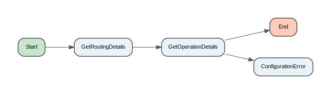

[↑ Back to Inventory](#process-inventory)

#### Process: TIL_OSM_Adapter/BusinessServices/ITIntegration/ApplicationIntegration/Routing/TILtoOSMRouter/Sub/MainProcess.process {: #tilosmadapterbusinessservicesitintegrationapplicationintegrationroutingtiltoosmroutersubmainprocessprocess }

[↑ Back to Inventory](#process-inventory)

#### Process: TIL_OSM_Adapter/ConnectivityServices/Common/Private/RenderBackEndError.process {: #tilosmadapterconnectivityservicescommonprivaterenderbackenderrorprocess }

[↑ Back to Inventory](#process-inventory)

#### Process: TIL_OSM_Adapter/ConnectivityServices/JMS/Private/InvokeOnTopic.process {: #tilosmadapterconnectivityservicesjmsprivateinvokeontopicprocess }

[↑ Back to Inventory](#process-inventory)

#### Process: TIL_OSM_Adapter/ConnectivityServices/JMS/Private/PrepareData.process {: #tilosmadapterconnectivityservicesjmsprivatepreparedataprocess }

[↑ Back to Inventory](#process-inventory)

#### Process: TIL_OSM_Adapter/ConnectivityServices/JMS/Private/PublishToTopic-Object.process {: #tilosmadapterconnectivityservicesjmsprivatepublishtotopicobjectprocess }

[↑ Back to Inventory](#process-inventory)

#### Process: TIL_OSM_Adapter/ConnectivityServices/JMS/Private/PublishToTopic.process {: #tilosmadapterconnectivityservicesjmsprivatepublishtotopicprocess }

[↑ Back to Inventory](#process-inventory)

#### Process: TIL_OSM_Adapter/ConnectivityServices/JMS/Public/InvokeOnTopic.process {: #tilosmadapterconnectivityservicesjmspublicinvokeontopicprocess }

[↑ Back to Inventory](#process-inventory)

#### Process: TIL_OSM_Adapter/ConnectivityServices/JMS/Public/PublishToTopic.process {: #tilosmadapterconnectivityservicesjmspublicpublishtotopicprocess }

[↑ Back to Inventory](#process-inventory)

#### Process: TIL_OSM_Adapter/ConnectivityServices/OSM/JMS/Private/PrepareData.process {: #tilosmadapterconnectivityservicesosmjmsprivatepreparedataprocess }

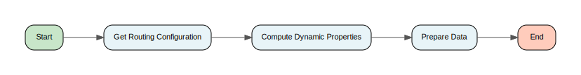

[↑ Back to Inventory](#process-inventory)

#### Process: TIL_OSM_Adapter/ConnectivityServices/OSM/JMS/Private/PublishToQueue-Object.process {: #tilosmadapterconnectivityservicesosmjmsprivatepublishtoqueueobjectprocess }

[↑ Back to Inventory](#process-inventory)

#### Process: TIL_OSM_Adapter/ConnectivityServices/OSM/JMS/Private/PublishToQueue.process {: #tilosmadapterconnectivityservicesosmjmsprivatepublishtoqueueprocess }

[↑ Back to Inventory](#process-inventory)

#### Process: TIL_OSM_Adapter/ConnectivityServices/OSM/JMS/Public/GetJMSQueueMessage.process {: #tilosmadapterconnectivityservicesosmjmspublicgetjmsqueuemessageprocess }

[↑ Back to Inventory](#process-inventory)

#### Process: TIL_OSM_Adapter/ConnectivityServices/OSM/JMS/Public/PublishToQueue.process {: #tilosmadapterconnectivityservicesosmjmspublicpublishtoqueueprocess }

[↑ Back to Inventory](#process-inventory)

#### Process: TIL_OSM_Adapter/ConnectivityServices/OSM/Private/LoadAllOSMErrorCodes.process {: #tilosmadapterconnectivityservicesosmprivateloadallosmerrorcodesprocess }

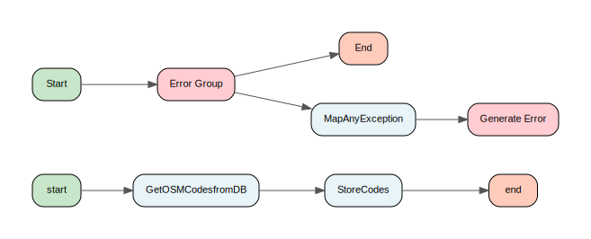

[↑ Back to Inventory](#process-inventory)

#### Process: TIL_OSM_Adapter/ConnectivityServices/OSM/Private/LoadOSMTILRoutingDetails.process {: #tilosmadapterconnectivityservicesosmprivateloadosmtilroutingdetailsprocess }

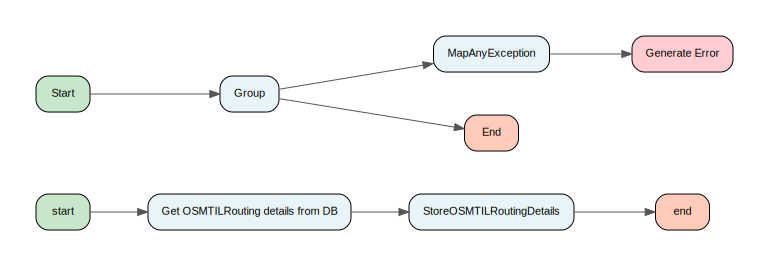

[↑ Back to Inventory](#process-inventory)

#### Process: TIL_OSM_Adapter/ConnectivityServices/OSM/Public/LoadAllOSMErrorCodes.process {: #tilosmadapterconnectivityservicesosmpublicloadallosmerrorcodesprocess }

[↑ Back to Inventory](#process-inventory)

#### Process: TIL_OSM_Adapter/ConnectivityServices/OSM/Public/LoadAllOSMTILRoutingDetails.process {: #tilosmadapterconnectivityservicesosmpublicloadallosmtilroutingdetailsprocess }

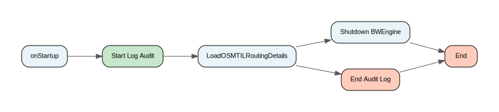

[↑ Back to Inventory](#process-inventory)

#### Process: TIL_OSM_Adapter/ConnectivityServices/OSM/Public/MapOSMException.process {: #tilosmadapterconnectivityservicesosmpublicmaposmexceptionprocess }

[↑ Back to Inventory](#process-inventory)

#### Process: TIL_OSM_Adapter/UtilityServices/ExceptionHandling/Filtering/CVV2Filter.process {: #tilosmadapterutilityservicesexceptionhandlingfilteringcvv2filterprocess }

[↑ Back to Inventory](#process-inventory)

#### Process: TIL_OSM_Adapter/UtilityServices/ExceptionHandling/Filtering/ExceptionSchemaFilter.process {: #tilosmadapterutilityservicesexceptionhandlingfilteringexceptionschemafilterprocess }

[↑ Back to Inventory](#process-inventory)

#### Process: TIL_OSM_Adapter/UtilityServices/ExceptionHandling/Filtering/Security/CVV2Filter.process {: #tilosmadapterutilityservicesexceptionhandlingfilteringsecuritycvv2filterprocess }

[↑ Back to Inventory](#process-inventory)

#### Process: TIL_OSM_Adapter/UtilityServices/ExceptionHandling/Filtering/ServiceExceptionFilter.process {: #tilosmadapterutilityservicesexceptionhandlingfilteringserviceexceptionfilterprocess }

[↑ Back to Inventory](#process-inventory)

#### Process: TIL_OSM_Adapter/UtilityServices/ExceptionHandling/Filtering/SpecialExceptions/GetSpecialExceptionList.process {: #tilosmadapterutilityservicesexceptionhandlingfilteringspecialexceptionsgetspecialexceptionlistprocess }

[↑ Back to Inventory](#process-inventory)

#### Process: TIL_OSM_Adapter/UtilityServices/ExceptionHandling/Filtering/SpecialExceptions/TraceSpecialException.process {: #tilosmadapterutilityservicesexceptionhandlingfilteringspecialexceptionstracespecialexceptionprocess }

[↑ Back to Inventory](#process-inventory)

#### Process: TIL_OSM_Adapter/UtilityServices/ExceptionHandling/Filtering/SystemExceptionFilter.process {: #tilosmadapterutilityservicesexceptionhandlingfilteringsystemexceptionfilterprocess }

[↑ Back to Inventory](#process-inventory)

#### Process: TIL_OSM_Adapter/UtilityServices/ExceptionHandling/Interface/ServiceExceptionHandler.process {: #tilosmadapterutilityservicesexceptionhandlinginterfaceserviceexceptionhandlerprocess }

[↑ Back to Inventory](#process-inventory)

#### Process: TIL_OSM_Adapter/UtilityServices/ExceptionHandling/Interface/SystemExceptionHandler.process {: #tilosmadapterutilityservicesexceptionhandlinginterfacesystemexceptionhandlerprocess }

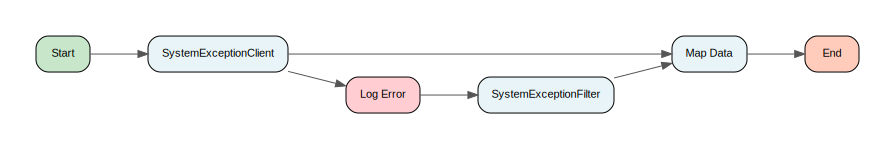

[↑ Back to Inventory](#process-inventory)

#### Process: TIL_OSM_Adapter/UtilityServices/ExceptionHandling/Private/MapException.process {: #tilosmadapterutilityservicesexceptionhandlingprivatemapexceptionprocess }

[↑ Back to Inventory](#process-inventory)

#### Process: TIL_OSM_Adapter/UtilityServices/ExceptionHandling/Public/MapAnyException.process {: #tilosmadapterutilityservicesexceptionhandlingpublicmapanyexceptionprocess }

[↑ Back to Inventory](#process-inventory)

#### Process: TIL_OSM_Adapter/UtilityServices/ExceptionHandling/ServiceExceptionHandler.process {: #tilosmadapterutilityservicesexceptionhandlingserviceexceptionhandlerprocess }

[↑ Back to Inventory](#process-inventory)

#### Process: TIL_OSM_Adapter/UtilityServices/ExceptionHandling/Shutdown BWEngine.process {: #tilosmadapterutilityservicesexceptionhandlingshutdownbwengineprocess }

[↑ Back to Inventory](#process-inventory)

#### Process: TIL_OSM_Adapter/UtilityServices/Interface/OperationReply.process {: #tilosmadapterutilityservicesinterfaceoperationreplyprocess }

[↑ Back to Inventory](#process-inventory)

#### Process: TIL_OSM_Adapter/UtilityServices/Interface/Private/PublishToRetryQueue.process {: #tilosmadapterutilityservicesinterfaceprivatepublishtoretryqueueprocess }

[↑ Back to Inventory](#process-inventory)

#### Process: TIL_OSM_Adapter/UtilityServices/Logging/LogEnd.process {: #tilosmadapterutilityserviceslogginglogendprocess }

[↑ Back to Inventory](#process-inventory)

#### Process: TIL_OSM_Adapter/UtilityServices/Logging/LogError.process {: #tilosmadapterutilityserviceslogginglogerrorprocess }

[↑ Back to Inventory](#process-inventory)

#### Process: TIL_OSM_Adapter/UtilityServices/Logging/LogFatal.process {: #tilosmadapterutilityserviceslogginglogfatalprocess }

[↑ Back to Inventory](#process-inventory)

#### Process: TIL_OSM_Adapter/UtilityServices/Logging/LogStart.process {: #tilosmadapterutilityserviceslogginglogstartprocess }

[↑ Back to Inventory](#process-inventory)

#### Process: TIL_OSM_Adapter/UtilityServices/Logging/Private/WriteToLog.process {: #tilosmadapterutilityservicesloggingprivatewritetologprocess }

[↑ Back to Inventory](#process-inventory)

#### Process: TIL_OSM_Adapter/UtilityServices/Logging/Public/CSAuditEnd.process {: #tilosmadapterutilityservicesloggingpubliccsauditendprocess }

[↑ Back to Inventory](#process-inventory)

#### Process: TIL_OSM_Adapter/UtilityServices/Logging/Public/CSAuditStart.process {: #tilosmadapterutilityservicesloggingpubliccsauditstartprocess }

[↑ Back to Inventory](#process-inventory)

#### Process: TIL_OSM_Adapter/UtilityServices/Logging/Public/WriteToLog.process {: #tilosmadapterutilityservicesloggingpublicwritetologprocess }

[↑ Back to Inventory](#process-inventory)

#### Process: TIL_OSM_Adapter/UtilityServices/Security/Tokens/Private/LoadExpiration.process {: #tilosmadapterutilityservicessecuritytokensprivateloadexpirationprocess }

[↑ Back to Inventory](#process-inventory)

#### Process: TIL_OSM_Adapter/UtilityServices/Security/Tokens/Private/LoadOperationValidation.process {: #tilosmadapterutilityservicessecuritytokensprivateloadoperationvalidationprocess }

[↑ Back to Inventory](#process-inventory)

#### Process: TIL_OSM_Adapter/UtilityServices/Security/Tokens/Private/LoadPartnerBIDMapping.process {: #tilosmadapterutilityservicessecuritytokensprivateloadpartnerbidmappingprocess }

[↑ Back to Inventory](#process-inventory)

#### Process: TIL_OSM_Adapter/UtilityServices/Security/Tokens/Public/LoadExpiration.process {: #tilosmadapterutilityservicessecuritytokenspublicloadexpirationprocess }

[↑ Back to Inventory](#process-inventory)

#### Process: TIL_OSM_Adapter/UtilityServices/Security/Tokens/Public/LoadOperationValidation.process {: #tilosmadapterutilityservicessecuritytokenspublicloadoperationvalidationprocess }

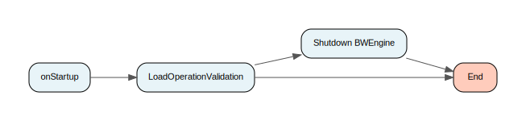

[↑ Back to Inventory](#process-inventory)

#### Process: TIL_OSM_Adapter/UtilityServices/Security/Tokens/Public/LoadPartnerBIDMapping.process {: #tilosmadapterutilityservicessecuritytokenspublicloadpartnerbidmappingprocess }

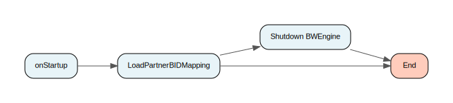

[↑ Back to Inventory](#process-inventory)

#### Process: TIL_OSM_Adapter/UtilityServices/Security/Tokens/Public/ReloadExpiration.process {: #tilosmadapterutilityservicessecuritytokenspublicreloadexpirationprocess }

[↑ Back to Inventory](#process-inventory)

#### Process: TIL_OSM_Adapter/UtilityServices/Security/Tokens/Public/ReloadOperationValidation.process {: #tilosmadapterutilityservicessecuritytokenspublicreloadoperationvalidationprocess }

[↑ Back to Inventory](#process-inventory)

#### Process: TIL_OSM_Adapter/UtilityServices/Security/Tokens/Public/ReloadPartnerBIDMapping.process {: #tilosmadapterutilityservicessecuritytokenspublicreloadpartnerbidmappingprocess }

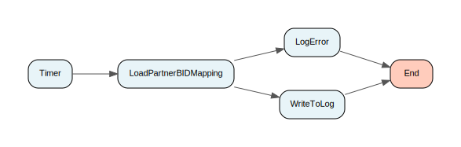

[↑ Back to Inventory](#process-inventory)

#### Process: TIL_OSM_Adapter/UtilityServices/VFLE/Client/AuditEventCapture/AuditEvent.process {: #tilosmadapterutilityservicesvfleclientauditeventcaptureauditeventprocess }

[↑ Back to Inventory](#process-inventory)

#### Process: TIL_OSM_Adapter/UtilityServices/VFLE/Client/AuditEventCapture/EmptyAuditCache.process {: #tilosmadapterutilityservicesvfleclientauditeventcaptureemptyauditcacheprocess }

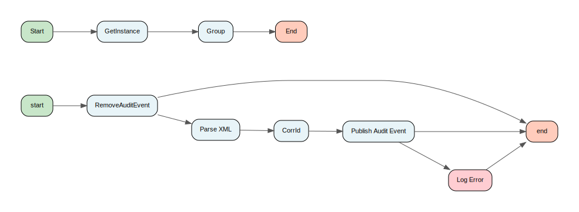

[↑ Back to Inventory](#process-inventory)

#### Process: TIL_OSM_Adapter/UtilityServices/VFLE/Client/AuditEventCapture/RemoveFromAuditCache.process {: #tilosmadapterutilityservicesvfleclientauditeventcaptureremovefromauditcacheprocess }

[↑ Back to Inventory](#process-inventory)

#### Process: TIL_OSM_Adapter/UtilityServices/VFLE/Client/AuditEventCapture/UpdateAuditCache.process {: #tilosmadapterutilityservicesvfleclientauditeventcaptureupdateauditcacheprocess }

[↑ Back to Inventory](#process-inventory)

#### Process: TIL_OSM_Adapter/UtilityServices/VFLE/Client/ExceptionCapture/CustomServiceExceptionHandlerInterface.process {: #tilosmadapterutilityservicesvfleclientexceptioncapturecustomserviceexceptionhandlerinterfaceprocess }

[↑ Back to Inventory](#process-inventory)

#### Process: TIL_OSM_Adapter/UtilityServices/VFLE/Client/ExceptionCapture/EmptyAuditErrorCache.process {: #tilosmadapterutilityservicesvfleclientexceptioncaptureemptyauditerrorcacheprocess }

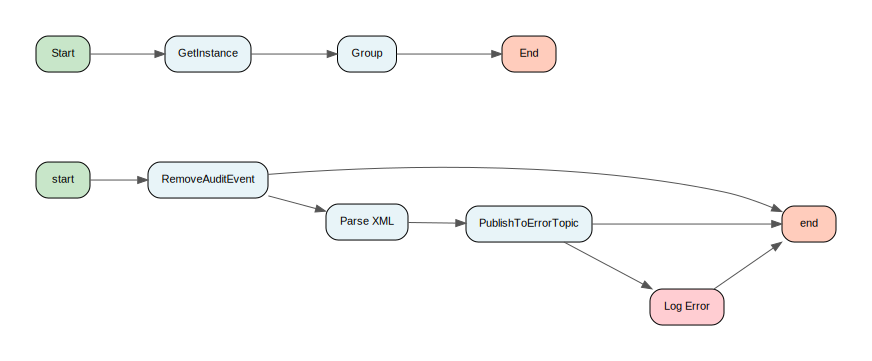

[↑ Back to Inventory](#process-inventory)

#### Process: TIL_OSM_Adapter/UtilityServices/VFLE/Client/ExceptionCapture/RemoveFromAuditErrorCache.process {: #tilosmadapterutilityservicesvfleclientexceptioncaptureremovefromauditerrorcacheprocess }

[↑ Back to Inventory](#process-inventory)

#### Process: TIL_OSM_Adapter/UtilityServices/VFLE/Client/ExceptionCapture/ServiceExceptionClient.process {: #tilosmadapterutilityservicesvfleclientexceptioncaptureserviceexceptionclientprocess }

[↑ Back to Inventory](#process-inventory)

#### Process: TIL_OSM_Adapter/UtilityServices/VFLE/Client/ExceptionCapture/SystemExceptionClient.process {: #tilosmadapterutilityservicesvfleclientexceptioncapturesystemexceptionclientprocess }

[↑ Back to Inventory](#process-inventory)

#### Process: TIL_OSM_Adapter/UtilityServices/VFLE/Client/ExceptionCapture/UpdateAuditErrorCache.process {: #tilosmadapterutilityservicesvfleclientexceptioncaptureupdateauditerrorcacheprocess }

[↑ Back to Inventory](#process-inventory)

#### Process: TIL_OSM_Adapter/UtilityServices/VFLE/Client/Public/ShutdownCleanUp.process {: #tilosmadapterutilityservicesvfleclientpublicshutdowncleanupprocess }

[↑ Back to Inventory](#process-inventory)

#### Process: TIL_OSM_Adapter/UtilityServices/VFLE/Client/Public/StartupInitialisation.process {: #tilosmadapterutilityservicesvfleclientpublicstartupinitialisationprocess }

[↑ Back to Inventory](#process-inventory)

## Global Variables
| Name | Value | Status |
| :--- | :--- | :--- |
| BW_GLOBAL_TRUSTED_CA_STORE | `file:////opt/tibco/vodafo&#x200B;ne/certificates` | ✅ OK |
| DirLedger | `.` | ✅ OK |
| DirTrace | `.` | ✅ OK |
| Env/AuditEvents/ConnectivityService/MIG_EnableAuditToDB | `true` | ✅ OK |
| Env/AuditEvents/ConnectivityService/MIG_EnableHeaderAudit | `false` | ✅ OK |
| Env/AuditEvents/ConnectivityService/MIG_EnableMessageAudit | `false` | ✅ OK |
| Env/AuditEvents/FrameworkService/MIG_EnableAuditToDB | `true` | ✅ OK |
| Env/AuditEvents/FrameworkService/MIG_EnableHeaderAudit | `true` | ✅ OK |
| Env/AuditEvents/FrameworkService/MIG_EnableMessageAudit | `true` | ✅ OK |
| Env/AuditEvents/GLB_CachePublishIntervalInMS | `10000` | ✅ OK |
| Env/AuditEvents/GLB_MaxMessages | `2000` | ✅ OK |
| Env/Certificates/BW/SOAP/MIG_Filename | `BW` | ✅ OK |
| Env/Certificates/ClientA/SOAP/MIG_Filename | `ClientA` | ✅ OK |
| Env/Certificates/ClientB/SOAP/MIG_Filename | `ClientB` | ✅ OK |
| Env/Encryption/Blowfish/MIG_CustomPadding | `0808080808080808` | ✅ OK |
| Env/Encryption/Blowfish/MIG_EncoderType | `Blowfish/ECB/NoPadding` | ✅ OK |
| Env/Encryption/Blowfish/MIG_Key | `#!O+7yiRbz5RDB8qNR6+8Y9lFv2NZy...` | ✅ OK |
| Env/Encryption/DES3/MIG_Init_Vector | `#!VGASEUX8kySdov3spfShbPg&#x200B;vqJ4UExie26gfPLqY451a+DLy&#x200B;+8KebZ1JuNkJw77+` | ✅ OK |
| Env/Encryption/DES3/MIG_Key | `#!KCEeyQQkJhJYZh4F2lKMl2gDZMux...` | ✅ OK |
| Env/Encryption/GLB_Debug | `false` | ✅ OK |
| Env/Encryption/GLB_KeyRefreshIntervalDays | `1...` | ✅ OK |
| Env/Encryption/GLB_KeyRefreshStartTime | `2009 AUG 31 06:31:00 GMT...` | ✅ OK |
| Env/Encryption/GLB_UseDatabase | `true` | ✅ OK |
| Env/Encryption/MIG_Roles | `TIL,ETU,RETAIL_DB` | ✅ OK |
| Env/Encryption/RSA/Keys/Composite/MIG_Modulus | `#!GQA1ukp+qREX7h6oslF/J4H8vwJ5...` | ✅ OK |
| Env/Encryption/RSA/Keys/Composite/MIG_PrivateExponent | `#!8TTcLatLk7ZnkZh9WQ6cz1uPbmM7...` | ✅ OK |
| Env/Encryption/RSA/Keys/Composite/MIG_PublicExponent | `#!VHh7PorYQQzSYxKxLapsaAsJPiV3...` | ✅ OK |
| Env/Encryption/RSA/Keys/Default/MIG_Private | `#!yS5WZc8kDwnTsyHZidMjbEYx755s...` | ✅ OK |
| Env/Encryption/RSA/Keys/Default/MIG_Public | `#!IzlaLkIiZzXMb0L4+abPdl5kLDl3...` | ✅ OK |
| Env/Encryption/RSA/Keys/PEM/MIG_Private | `#!wMuUJiLnitGvsz/gQ/7pmWynIHdk...` | ✅ OK |
| Env/Encryption/RSA/Keys/PEM/MIG_Public | `#!GzTMLVhFXNEeFGVtPtcqBAZOg1fx...` | ✅ OK |
| Env/Encryption/RSA/MIG_EncoderType | `RSA/ECB/PKCS1Padding` | ✅ OK |
| Env/Encryption/RSA/MIG_Modulus_Bits | `1024...` | ✅ OK |
| Env/Exceptions/Categories/GLB_Business | `BUSINESS` | ✅ OK |
| Env/Exceptions/Handling/MIG_ServerEnabled | `true` | ✅ OK |
| Env/Exceptions/MIG_CanShutdown | `true` | ✅ OK |
| Env/Exceptions/MIG_ExtendedResultStatus | `true` | ✅ OK |
| Env/Exceptions/Notification/MIG_ServiceOperationList | `Service:Operation` | ✅ OK |
| Env/Exceptions/SpecialExceptions/GLB_Filename | `/opt/tibco/vodafone/Speci&#x200B;alExceptions.xml` | ✅ OK |
| Env/HTTP/SOAP/MIG_Host | `localhost` | ✅ OK |
| Env/HTTP/SOAP/MIG_Port | `8888` | ✅ OK |
| Env/HTTP/XML/MIG_DefaultEncoding | `ISO8859_1` | ✅ OK |
| Env/HTTP/XML/MIG_Host | `localhost` | ✅ OK |
| Env/HTTP/XML/MIG_Port | `8082` | ✅ OK |
| Env/Identities/BW/MIG_SourceNames | `TIL,BW` | ✅ OK |
| Env/Identities/BW/SOAP/MIG_FileType | `JKS` | ✅ OK |
| Env/Identities/BW/SOAP/MIG_Password | `#!cqnFHIdA2NAbMPnLlO9ANSZ&#x200B;ckaRhJFb9z5omn8k5+FU=` | ✅ OK |
| Env/Identities/BW/SOAP/MIG_URL | `c:/cvsdir/TIL_SOURCE/thir&#x200B;d_party/SOAP/BW.jks` | ✅ OK |
| Env/Identities/ClientA/MIG_SourceNames | `ClientA` | ✅ OK |
| Env/Identities/ClientB/MIG_SourceNames | `ClientB` | ✅ OK |
| Env/JMS/AuditEvents/GLB_JMS_AuditEventsTopic | `AuditEvents` | ✅ OK |
| Env/JMS/Connections/ADBAdapter/GLB_QueueConnectionFactory | `MAPTILQueueConnectionFact&#x200B;ory` | ✅ OK |
| Env/JMS/Connections/ADBAdapter/GLB_TopicConnectionFactory | `MAPTILTopicConnectionFact&#x200B;ory` | ✅ OK |
| Env/JMS/Connections/ADBAdapter/MIG_JMSURL | `tcp://hscot07:8222,tcp://&#x200B;hscot07:8222` | ✅ OK |
| Env/JMS/Connections/ADBAdapter/MIG_Password | `#!cw4j+vG2iKCEfvjDYsB0PNG&#x200B;RKinz+TcT` | ✅ OK |
| Env/JMS/Connections/ADBAdapter/MIG_Username | `tiladb` | ✅ OK |
| Env/JMS/Connections/Audit/GLB_QueueConnectionFactory | `MAPTILQueueConnectionFact&#x200B;ory` | ✅ OK |
| Env/JMS/Connections/Audit/GLB_TopicConnectionFactory | `MAPTILTopicConnectionFact&#x200B;ory` | ✅ OK |
| Env/JMS/Connections/Audit/MIG_JMSURL | `tcp://tibtest5:8222,tcp:/&#x200B;/tibtest5:8222` | ✅ OK |
| Env/JMS/Connections/Audit/MIG_Password | `#!x4zLwr4hso3tBHqIFp4oTYf&#x200B;SBU1dX2uN` | ✅ OK |
| Env/JMS/Connections/Audit/MIG_Username | `tilbw` | ✅ OK |
| Env/JMS/Connections/BW/GLB_QueueConnectionFactory | `MAPTILQueueConnectionFact&#x200B;ory` | ✅ OK |
| Env/JMS/Connections/BW/GLB_TopicConnectionFactory | `MAPTILTopicConnectionFact&#x200B;ory` | ✅ OK |
| Env/JMS/Connections/BW/MIG_JMSURL | `tcp://localhost:7222` | ✅ OK |
| Env/JMS/Connections/BW/MIG_Password | `#!fHJbRSQG4vbgUaphAjXjUkZ&#x200B;BtVXA6/0p` | ✅ OK |
| Env/JMS/Connections/BW/MIG_Username | `tilbw` | ✅ OK |
| Env/JMS/Connections/ForwardJMSMessage/GLB_QueueConnectionFactory | `MAPTILQueueConnectionFact&#x200B;ory` | ✅ OK |
| Env/JMS/Connections/ForwardJMSMessage/GLB_TopicConnectionFactory | `MAPTILTopicConnectionFact&#x200B;ory` | ✅ OK |
| Env/JMS/Connections/ForwardJMSMessage/MIG_JMSURL | `tcp://auktltar.dc-dublin.&#x200B;de:7222,tcp://auktltar.dc&#x200B;-dublin.de:7222` | ✅ OK |
| Env/JMS/Connections/ForwardJMSMessage/MIG_Password | `#!RaiHj74fyKxr6iZiLJQjkRC&#x200B;WSh+4LVC5` | ✅ OK |
| Env/JMS/Connections/ForwardJMSMessage/MIG_Username | `tilbw` | ✅ OK |
| Env/JMS/Connections/TeradataAdapter/GLB_QueueConnectionFactory | `MAPTILQueueConnectionFact&#x200B;ory` | ✅ OK |
| Env/JMS/Connections/TeradataAdapter/GLB_TopicConnectionFactory | `MAPTILTopicConnectionFact&#x200B;ory` | ✅ OK |
| Env/JMS/Connections/TeradataAdapter/MIG_JMSURL | `tcp://hscot07:8222,tcp://&#x200B;hscot07:8222` | ✅ OK |
| Env/JMS/Connections/TeradataAdapter/MIG_Password | `#!tTKgr02zoBszu9Fr5osvEO6&#x200B;894d2ZjYVi3p7F/R6Q3g=` | ✅ OK |
| Env/JMS/Connections/TeradataAdapter/MIG_Username | `tiladtera` | ✅ OK |
| Env/JMS/ErrorHandling/GLB_JMS_ExceptionNotifyTopic | `Exception.NOTIFY` | ✅ OK |
| Env/JMS/ErrorHandling/GLB_JMS_InvalidMessageQueue | `InvalidMessage` | ✅ OK |
| Env/JMS/ErrorHandling/GLB_JMS_ServiceExceptionQueue | `ServiceException` | ✅ OK |
| Env/JMS/ErrorHandling/JMS_TIBCO_COMPRESS | `false` | ✅ OK |
| Env/JMS/ErrorHandling/JMS_TIBCO_PRESERVE_UNDELIVERED | `false` | ✅ OK |
| Env/JMS/ErrorHandling/MIG_EnableExceptionQueues | `true` | ✅ OK |
| Env/JMS/ErrorHandling/MIG_Expiration | `0` | ✅ OK |
| Env/JMS/Invocation/GLB_MaxValidationLoops | `300` | ✅ OK |
| Env/JMS/Invocation/MIG_FailureLogLevel | `WARN` | ✅ OK |
| Env/JMS/Invocation/MIG_SuccessLogLevel | `INFO` | ✅ OK |
| Env/JMS/Invocation/MIG_Timeout | `30` | ✅ OK |
| Env/JMS/JNDI/MIG_Password | `#!9Zy9ftmE+CFrETv3dKtXtRX&#x200B;qn1fg5auW` | ✅ OK |
| Env/JMS/JNDI/MIG_URL | `tibjmsnaming://localhost:&#x200B;7222` | ✅ OK |
| Env/JMS/JNDI/MIG_Username | `tilbw` | ✅ OK |
| Env/JMS/JSON/GLB_JMSPropertiesCheckEnabled | `true` | ✅ OK |
| Env/JMS/JSON/GLB_JMSSenderCheckEnabled | `true` | ✅ OK |
| Env/JMS/MIG_Jms_Dest_Prefix | `VOD.UK.DEV` | ✅ OK |
| Env/JMS/MIG_Jms_Dest_Prefix_IF | `VOD.UK.DEV.TILIF` | ✅ OK |
| Env/JMS/MIG_Jms_Dest_Prefix_Internal | `VOD.UK.DEV.TILINTERNAL` | ✅ OK |
| Env/JMS/MIG_ReplyToQueueByDefault | `true` | ✅ OK |
| Env/JMS/Properties/Publish/JMS_TIBCO_PRESERVE_UNDELIVERED | `true` | ✅ OK |
| Env/JMS/Properties/Publish/MIG_DeliveryMode | `PERSISTENT` | ✅ OK |
| Env/JMS/Properties/Publish/MIG_Expiration | `0` | ✅ OK |
| Env/JMS/SOAP/GLB_JMSPropertiesCheckEnabled | `true` | ✅ OK |
| Env/JMS/SOAP/GLB_JMSSenderCheckEnabled | `true` | ✅ OK |
| Env/JMS/SOAP/Headers/Header/GLB_CheckEnabled | `true` | ✅ OK |
| Env/JMS/SOAP/Headers/Header/MIG_DisabledOperations | `` | ✅ OK |
| Env/JMS/VFLE/GLB_DisableFilters | `false` | ✅ OK |
| Env/JMS/VFLE/GLB_JMS_Service_Element | `3` | ✅ OK |
| Env/JMS/VFLE/MIG_JMS_MessageCaptureTopicSpec | `MSGCPTR.DB` | ✅ OK |
| Env/LogRoles/MIG_EnableDebug | `false` | ✅ OK |
| Env/LogRoles/MIG_EnableErrorDebug | `false` | ✅ OK |
| Env/LogRoles/MIG_EnableInfo | `false` | ✅ OK |
| Env/LogRoles/MIG_TraceHTTPRequests | `true` | ✅ OK |
| Env/OSM/GLB_CSName | `OSM` | ✅ OK |
| Env/OSM/JMS/GLB_AutoGenerateClientID | `false` | ✅ OK |
| Env/OSM/JMS/GLB_JMS_PropertySeparator | `|` | ✅ OK |
| Env/OSM/JMS/GLB_JMS_PropertyValueSeparator | `~` | ✅ OK |
| Env/OSM/JMS/JNDI/GLB_QueueConnectionFactory | `weblogic/jms/ConnectionFa&#x200B;ctory` | ✅ OK |
| Env/OSM/JMS/JNDI/GLB_TopicConnectionFactory | `weblogic/jms/ConnectionFa&#x200B;ctory` | ✅ OK |
| Env/OSM/JMS/JNDI/MIG_JMSURL | `t3://10.78.221.42:7001` | ✅ OK |
| Env/OSM/JMS/JNDI/MIG_Password | `#!o4fp1uVy+vcgov9Z6D9MjZn&#x200B;A4quB7PVh4njWXant2AIgdpSh&#x200B;x+U/sA==` | ✅ OK |
| Env/OSM/JMS/JNDI/MIG_Username | `weblogic_til` | ✅ OK |
| Env/OSM/JMS/MIG_JMS_Dest_Prefix_OSM | `VOD.UK.DEV.OSM` | ✅ OK |
| Env/RDBMS/BusinessWorks/MIG_JDBCDriver | `tibcosoftwareinc.jdbc.ora&#x200B;cle.OracleDriver` | ✅ OK |
| Env/RDBMS/BusinessWorks/MIG_JDBCURL | `jdbc:tibcosoftwareinc:ora&#x200B;cle://hscot08:1528;SID=ED&#x200B;X4TST` | ✅ OK |
| Env/RDBMS/BusinessWorks/MIG_LoginTimeout | `30` | ✅ OK |
| Env/RDBMS/BusinessWorks/MIG_MaxConnections | `8` | ✅ OK |
| Env/RDBMS/BusinessWorks/MIG_Password | `#!ZTNIdCfi5I3pIicwZrOgmbx&#x200B;u515iLH/HElL8uDaoA14=` | ✅ OK |
| Env/RDBMS/BusinessWorks/MIG_Schema | `DEVBWCPT` | ✅ OK |
| Env/RDBMS/BusinessWorks/MIG_User | `DEVBWCPT` | ✅ OK |
| Env/RDBMS/Encryption/MIG_JDBCDriver | `tibcosoftwareinc.jdbc.ora&#x200B;cle.OracleDriver` | ✅ OK |
| Env/RDBMS/Encryption/MIG_JDBCURL | `jdbc:tibcosoftwareinc:ora&#x200B;cle://aukshocr.dc-dublin.&#x200B;de:33000;SID=TIBTST1` | ✅ OK |
| Env/RDBMS/Encryption/MIG_LoginTimeout | `30` | ✅ OK |
| Env/RDBMS/Encryption/MIG_MaxConnections | `8` | ✅ OK |
| Env/RDBMS/Encryption/MIG_MaxRows | `0` | ✅ OK |
| Env/RDBMS/Encryption/MIG_Password | `#!V6fT54owhkZHqSS5K1W9TlL&#x200B;l3AVPX845b16aamTY0hU=` | ✅ OK |
| Env/RDBMS/Encryption/MIG_Schema | `c4keys_usr_db01` | ✅ OK |
| Env/RDBMS/Encryption/MIG_Timeout | `30` | ✅ OK |
| Env/RDBMS/Encryption/MIG_User | `c4keys_usr_db01` | ✅ OK |
| Env/RDBMS/ReferenceData/MIG_JDBCDriver | `tibcosoftwareinc.jdbc.ora&#x200B;cle.OracleDriver` | ✅ OK |
| Env/RDBMS/ReferenceData/MIG_JDBCURL | `jdbc:tibcosoftwareinc:ora&#x200B;cle://aukshocr.dc-dublin.&#x200B;de:33000;SID=TIBTST1` | ✅ OK |
| Env/RDBMS/ReferenceData/MIG_LoginTimeout | `30` | ✅ OK |
| Env/RDBMS/ReferenceData/MIG_MaxConnections | `8` | ✅ OK |
| Env/RDBMS/ReferenceData/MIG_MaxRows | `0` | ✅ OK |
| Env/RDBMS/ReferenceData/MIG_Password | `#!mcy2rTN840CZYSA3tORKrzl&#x200B;QiEBrjlb9IsuIc2ELi0yWoYXV&#x200B;oilK/Q==` | ✅ OK |
| Env/RDBMS/ReferenceData/MIG_Timeout | `30` | ✅ OK |
| Env/RDBMS/ReferenceData/MIG_User | `MAP_OWN_DB01` | ✅ OK |
| Env/RDBMS/ReferenceData/Ping/MIG_RepeatMS | `30000` | ✅ OK |
| Env/RDBMS/VFLE/GLB_MaxRows | `100` | ✅ OK |
| Env/RDBMS/VFLE/MIG_JDBCDriver | `tibcosoftwareinc.jdbc.ora&#x200B;cle.OracleDriver` | ✅ OK |
| Env/RDBMS/VFLE/MIG_JDBCURL | `jdbc:tibcosoftwareinc:ora&#x200B;cle://hscot08:1528;SID=ED&#x200B;X4TST` | ✅ OK |
| Env/RDBMS/VFLE/MIG_LoginTimeout | `30` | ✅ OK |
| Env/RDBMS/VFLE/MIG_MaxConnections | `8` | ✅ OK |
| Env/RDBMS/VFLE/MIG_Password | `#!T5Nnk5frCJMPv8ulLMqvYGg&#x200B;Q9KbzRXURJMIRUH5OEHE=` | ✅ OK |
| Env/RDBMS/VFLE/MIG_Retries | `2` | ✅ OK |
| Env/RDBMS/VFLE/MIG_RetrySleepInMs | `1000` | ✅ OK |
| Env/RDBMS/VFLE/MIG_User | `VFLE_DEV` | ✅ OK |
| Env/ReferenceData/MIG_ARP_DSPAgreementRefreshIntervalDays | `86400000` | ✅ OK |
| Env/ReferenceData/MIG_ARP_DSPAgreementRefreshStartTime | `2014 JANUARY 28 06:00:00 &#x200B;GMT` | ✅ OK |
| Env/ReferenceData/MIG_AccountCategoryRefreshDays | `7` | ✅ OK |
| Env/ReferenceData/MIG_AccountTypesRefreshDays | `7` | ✅ OK |
| Env/ReferenceData/MIG_ActivityReasonsRefreshDays | `7` | ✅ OK |
| Env/ReferenceData/MIG_BANTrialRefreshDays | `7` | ✅ OK |
| Env/ReferenceData/MIG_BundleAndProductIDsRefreshIntervalDays | `1` | ✅ OK |
| Env/ReferenceData/MIG_BundleAndProductIDsRefreshStartTime | `2012 APRIL 26 06:31:00 GM&#x200B;T` | ✅ OK |
| Env/ReferenceData/MIG_CaseTextRefreshDays | `7` | ✅ OK |
| Env/ReferenceData/MIG_ChannelRefreshIntervalDays | `1` | ✅ OK |
| Env/ReferenceData/MIG_ChannelRefreshStartTime | `2012 APRIL 26 06:31:00 GM&#x200B;T` | ✅ OK |
| Env/ReferenceData/MIG_ContentPackRefreshDays | `7` | ✅ OK |
| Env/ReferenceData/MIG_CountryVatCodeRefreshDays | `7` | ✅ OK |
| Env/ReferenceData/MIG_DefaultRefreshDays | `1` | ✅ OK |
| Env/ReferenceData/MIG_DestinationCodesRefreshDays | `7` | ✅ OK |
| Env/ReferenceData/MIG_ExtrasPackValueRefreshDays | `7` | ✅ OK |
| Env/ReferenceData/MIG_IMSI_SPIDsRefreshIntervalDays | `86400000` | ✅ OK |
| Env/ReferenceData/MIG_IMSI_SPIDsRefreshStartTime | `2014 JANUARY 28 06:00:00 &#x200B;GMT` | ✅ OK |
| Env/ReferenceData/MIG_NetworkNameRefreshDays | `7` | ✅ OK |
| Env/ReferenceData/MIG_PBIDSPIDMapping_RefreshIntervalDays | `1` | ✅ OK |
| Env/ReferenceData/MIG_PBIDSPIDMapping_RefreshStartTime | `2014 JANUARY 28 06:00:00 &#x200B;GMT` | ✅ OK |
| Env/ReferenceData/MIG_Partner_SMS_TextsRefreshIntervalDays | `86400000` | ✅ OK |
| Env/ReferenceData/MIG_Partner_SMS_TextsRefreshStartTime | `2014 JANUARY 28 06:00:00 &#x200B;GMT` | ✅ OK |
| Env/ReferenceData/MIG_PublicHolidays_RefreshIntervalDays | `1` | ✅ OK |
| Env/ReferenceData/MIG_PublicHolidays_RefreshStartTime | `2014 JANUARY 28 06:00:00 &#x200B;GMT` | ✅ OK |
| Env/ReferenceData/MIG_ServiceProviderAuthRefreshDays | `7` | ✅ OK |
| Env/ReferenceData/MIG_TIL_ARP_InformationRefreshIntervalDays | `86400000` | ✅ OK |
| Env/ReferenceData/MIG_TIL_ARP_InformationRefreshStartTime | `2014 JANUARY 28 06:00:00 &#x200B;GMT` | ✅ OK |
| Env/ReferenceData/MIG_TIL_IdTransformPrefixRefreshIntervalDays | `86400000` | ✅ OK |
| Env/ReferenceData/MIG_TIL_IdTransformPrefixRefreshStartTime | `2015 MAY 12 06:00:00 GMT` | ✅ OK |
| Env/ReferenceData/MIG_TIL_Partner_InformationRefreshIntervalDays | `1` | ✅ OK |
| Env/ReferenceData/MIG_TIL_Partner_InformationRefreshStartTime | `2014 JANUARY 28 06:00:00 &#x200B;GMT` | ✅ OK |
| Env/ReferenceData/MIG_TariffRefreshDays | `7` | ✅ OK |
| Env/ReferenceData/MIG_TariffType_International | `INTL` | ✅ OK |
| Env/ReferenceData/MIG_TeamIDRefreshDays | `7` | ✅ OK |
| Env/ReferenceData/MIG_TeamIDTrialRefreshDays | `7` | ✅ OK |
| Env/ReferenceData/MIG_Transform_Identifier_serviceRefreshIntervalDays | `86400000` | ✅ OK |
| Env/ReferenceData/MIG_Transform_Identifier_serviceRefreshStartTime | `2015 MAY 12 06:00:00 GMT` | ✅ OK |
| Env/ReferenceData/MIG_VatCodeRefreshDays | `7` | ✅ OK |
| Env/Security/Obfuscation/MIG_ElementNames | `CVV2,Csc,CVV,CSC,CreateSe&#x200B;rviceRequest:Description,&#x200B;SecurityCode,SubmiteShopO&#x200B;rder:value,` | ✅ OK |
| Env/Security/Tokens/AllCodes/GLB_KeyRefreshIntervalDays | `1...` | ✅ OK |
| Env/Security/Tokens/AllCodes/GLB_KeyRefreshStartTime | `2009 AUG 31 06:31:00 GMT...` | ✅ OK |
| Env/Security/Tokens/Defaults/GLB_CustomerPartyExpirationDuration | `1...` | ✅ OK |
| Env/Security/Tokens/Defaults/GLB_CustomerPartyExpirationUnits | `hr...` | ✅ OK |
| Env/Security/Tokens/Defaults/GLB_CustomerPartyTokenType | `CustomerParty...` | ✅ OK |
| Env/Security/Tokens/Defaults/GLB_ExpirationDuration | `30...` | ✅ OK |
| Env/Security/Tokens/Defaults/GLB_ExpirationUnits | `days...` | ✅ OK |
| Env/Security/Tokens/Defaults/GLB_IntegrationPartnerName | `Vodafone...` | ✅ OK |
| Env/Security/Tokens/Defaults/GLB_RequestType | `http://docs.oasis-open.org/ws-...` | ✅ OK |
| Env/Security/Tokens/Defaults/GLB_TokenType | `Organisation...` | ✅ OK |
| Env/Security/Tokens/Defaults/GLB_Version | `2.0...` | ✅ OK |
| Env/Security/Tokens/Expiration/GLB_CheckEnabled | `true...` | ✅ OK |
| Env/Security/Tokens/GLB_CheckEnabled | `true...` | ✅ OK |
| Env/Security/Tokens/Signature/GLB_CacheID | `til.tokens...` | ✅ OK |
| Env/Security/Tokens/Signature/MIG_Keystore | `/opt/tibco/vodafone/certificat...` | ✅ OK |
| Env/Security/Tokens/Signature/MIG_KeystorePassword | `...` | ✅ OK |
| Env/Security/Tokens/Signature/MIG_PrivateKeyAlias | `bw...` | ✅ OK |
| Env/Security/Tokens/Signature/MIG_PublicKeyAlias | `bw...` | ✅ OK |
| Env/Security/Tokens/Signature/MIG_UsePartnerIdentity | `false...` | ✅ OK |
| Env/Security/Tokens/Validation/GLB_CheckEnabled | `true...` | ✅ OK |
| Env/Security/Tokens/Validation/GLB_RevokedVersions | `...` | ✅ OK |
| Env/Security/Tokens/Validation/MIG_Timeout | `30...` | ✅ OK |
| Env/TCP/MIG_Host | `localhost` | ✅ OK |
| Env/TCP/MIG_Port | `8110` | ✅ OK |
| Env/TCP/MIG_Timeout | `10` | ✅ OK |
| GLB_TILVersion | `TIL-Build24` | ✅ OK |
| HawkEnabled | `false` | ✅ OK |
| JmsProviderUrl | `tcp://localhost:7222` | ✅ OK |
| JmsSslProviderUrl | `ssl://localhost:7243` | ✅ OK |
| Processes/GITA1/GITA2/GITA3/CRM6/Operation-NoReply/CRM6/MIG_MaxRetries | `3` | ✅ OK |
| Processes/GITA1/GITA2/GITA3/CRM6/Operation-NoReply/CRM6/MIG_RetryDelayMS | `100` | ✅ OK |
| Processes/GITA1/GITA2/GITA3/CRM6/Operation/CRM6/MIG_MaxRetries | `3` | ✅ OK |
| Processes/GITA1/GITA2/GITA3/CRM6/Operation/CRM6/MIG_RetryDelayMS | `100` | ✅ OK |
| Processes/GITA1/GITA2/GITA3/GMS/Sync/GMS/MIG_Timeout | `30` | ✅ OK |
| Processes/GITA1/GITA2/GITA3/Gemini/Read-Version3/MIG_Timeout | `300` | ✅ OK |
| Processes/GITA1/GITA2/GITA3/Gemini/Write-NoReply/MIG_Timeout | `300` | ✅ OK |
| Processes/GITA1/GITA2/GITA3/Gemini/Write-Version2/MIG_Timeout | `300` | ✅ OK |
| Processes/GITA1/GITA2/GITA3/Operation-File/TriggerSystem/BatchFile/MIG_ErrorFolder | `c:/temp/Operation-File/er&#x200B;ror` | ✅ OK |
| Processes/GITA1/GITA2/GITA3/Operation-File/TriggerSystem/BatchFile/MIG_Filename | `c:/temp/Operation-File/*.&#x200B;csv` | ✅ OK |
| Processes/GITA1/GITA2/GITA3/Operation-File/TriggerSystem/BatchFile/MIG_PollingInterval | `30` | ✅ OK |
| Processes/GITA1/GITA2/GITA3/Operation-File/TriggerSystem/BatchFile/MIG_SuccessFolder | `c:/temp/Operation-File/su&#x200B;ccess` | ✅ OK |
| Processes/GITA1/GITA2/GITA3/Operation-File/TriggerSystem/BatchFile/MIG_WarningFolder | `c:/temp/Operation-File/wa&#x200B;rning` | ✅ OK |
| Processes/GITA1/GITA2/GITA3/Operation-HTTP/HTTPXML/MIG_Host | `localhost` | ✅ OK |
| Processes/GITA1/GITA2/GITA3/Operation-HTTP/HTTPXML/MIG_Port | `8081` | ✅ OK |
| Processes/GITA1/GITA2/GITA3/Operation-HTTP/TriggerSystem/HTTPServer/MIG_Host | `localhost` | ✅ OK |
| Processes/GITA1/GITA2/GITA3/Operation-HTTP/TriggerSystem/HTTPServer/MIG_Port | `9999` | ✅ OK |
| Processes/GITA1/GITA2/GITA3/Operation-HTTPSOAP/HTTPSOAP/MIG_Host | `localhost` | ✅ OK |
| Processes/GITA1/GITA2/GITA3/Operation-HTTPSOAP/HTTPSOAP/MIG_Port | `8081` | ✅ OK |
| Processes/GITA1/GITA2/GITA3/Operation-NoReply/Scheduled/JMSRequest/MIG_RepeatMS | `60000` | ✅ OK |
| Processes/GITA1/GITA2/GITA3/Operation-NoReply/Scheduled/JMSRequest/MIG_Schedules | `08:00-18:00` | ✅ OK |
| Processes/GITA1/GITA2/GITA3/Operation-TIMER/TIMER/MIG_RepeatMS | `0` | ✅ OK |
| Processes/GITA1/GITA2/GITA3/Operation-TIMER/TIMER/MIG_StartUnixTime | `0` | ✅ OK |
| Processes/GITA1/GITA2/GITA3/Operation-Update/Retry/JMSRequest/MIG_BatchSize | `10` | ✅ OK |
| Processes/GITA1/GITA2/GITA3/Operation-Update/Retry/JMSRequest/MIG_ErrorCodes | `` | ✅ OK |
| Processes/GITA1/GITA2/GITA3/Operation-Update/Retry/JMSRequest/MIG_MaxRetries | `10` | ✅ OK |
| Processes/GITA1/GITA2/GITA3/Operation-Update/Retry/JMSRequest/MIG_NoReply | `true` | ✅ OK |
| Processes/GITA1/GITA2/GITA3/Operation-Update/Retry/JMSRequest/MIG_RepeatMS | `60000` | ✅ OK |
| Processes/GITA1/GITA2/GITA3/Operation-Update/Retry/JMSRequest/MIG_RetryDelayMS | `3600000` | ✅ OK |
| Processes/GITA1/GITA2/GITA3/Operation-Update/Retry/JMSRequest/MIG_Timeout | `10` | ✅ OK |
| Processes/GITA1/GITA2/GITA3/Operation-Update/Scheduled/JMSRequest/MIG_RepeatMS | `60000` | ✅ OK |
| Processes/GITA1/GITA2/GITA3/Operation-Update/Scheduled/JMSRequest/MIG_Schedules | `08:00-18:00` | ✅ OK |
| Processes/ITIntegration/ApplicationIntegration/Routing/OSMRouter/GLB_OSMAmmendOrderSuffixChar | `L,B` | ✅ OK |
| Processes/ITIntegration/ApplicationIntegration/Routing/OSMRouter/GLB_Routes | `|BusinessEventNotificatio&#x200B;n=BENMessageRouter|` | ✅ OK |
| Processes/ITIntegration/ApplicationIntegration/Routing/OSMRouter/GLB_TILLegacyQueue | `Notify.SOAP.CUST.OrdCapVa&#x200B;l.CommercialOrderValidati&#x200B;on.BusinessEventNotificat&#x200B;ion.FixedLineOrderNotific&#x200B;ation.OSM.2.Legacy` | ✅ OK |
| Processes/ITIntegration/ApplicationIntegration/Routing/OSMRouter/GLB_TILQueue | `Notify.SOAP.CUST.OrdCapVa&#x200B;l.CommercialOrderValidati&#x200B;on.BusinessEventNotificat&#x200B;ion.FixedLineOrderNotific&#x200B;ation.OSM.2` | ✅ OK |
| Processes/ITIntegration/ApplicationIntegration/Routing/OSMRouter/MIG_PivotOrderID | `|APL-1000000000232831|BMR&#x200B;-0|CPW-1000000000232831|C&#x200B;TT-1000000000232831|EDM-1&#x200B;000000000232831|FMW-10000&#x200B;00000232831|IVR-100000000&#x200B;0232831|OPD-1000000000232&#x200B;831|PAS-1000000000232831|&#x200B;PNT-1000000000232831|SBL-&#x200B;1000000000232831|UC4-1000&#x200B;000000232831|WCP-10000000&#x200B;00232831|WEB-999999999999&#x200B;9999|WIN-1000000000232831&#x200B;|` | ✅ OK |
| Processes/ITIntegration/ApplicationIntegration/Routing/OSMtoTILRouter/GLB_FlowType_Notify | `Notify` | ✅ OK |
| Processes/ITIntegration/ApplicationIntegration/Routing/OSMtoTILRouter/GLB_FlowType_Service | `Request` | ✅ OK |
| Processes/ITIntegration/ApplicationIntegration/Routing/OSMtoTILRouter/GLB_Origin_OSM | `OSM` | ✅ OK |
| Processes/ITIntegration/ApplicationIntegration/Routing/OSMtoTILRouter/GLB_Origin_TIL | `TIL` | ✅ OK |
| Processes/ITIntegration/ApplicationIntegration/Routing/OSMtoTILRouter/MIG_ErrorXSLTPath | `/opt/tibco/lnktestROOT/ln&#x200B;ktest1/tibco/vodafone/xsl&#x200B;t/OSMtoTILRouter/` | ✅ OK |
| Processes/ITIntegration/ApplicationIntegration/Routing/OSMtoTILRouter/MIG_RequestXSLTPath | `NotUsed` | ✅ OK |
| Processes/ITIntegration/ApplicationIntegration/Routing/OSMtoTILRouter/MIG_ResponseXSLTPath | `NotUsed` | ✅ OK |
| Processes/ITIntegration/ApplicationIntegration/Routing/OSMtoTILRouter/MIG_TimeOut | `30` | ✅ OK |
| Processes/ITIntegration/ApplicationIntegration/Routing/OSMtoTILRouter/Operation1/GLB_OperationName | `CreateFixedLineOrder` | ✅ OK |
| Processes/ITIntegration/ApplicationIntegration/Routing/OSMtoTILRouter/Operation1/JMS/MaxSessions | `1` | ✅ OK |
| Processes/ITIntegration/ApplicationIntegration/Routing/OSMtoTILRouter/Operation1/MIG_OSMRequestQueue | `newco.jms.osm.osm_to_til.&#x200B;CreateFixedLineOrder_req` | ✅ OK |
| Processes/ITIntegration/ApplicationIntegration/Routing/OSMtoTILRouter/Operation1/MIG_RetryQueue | `Retry.SOAP.PROV.OrdFulCoo&#x200B;rd.CommercialOrderManagem&#x200B;ent.CreateFixedLineOrder.&#x200B;OSM.1` | ✅ OK |
| Processes/ITIntegration/ApplicationIntegration/Routing/OSMtoTILRouter/Operation10/GLB_OperationName | `NotifyCustomer ` | ✅ OK |
| Processes/ITIntegration/ApplicationIntegration/Routing/OSMtoTILRouter/Operation10/JMS/MaxSessions | `1` | ✅ OK |
| Processes/ITIntegration/ApplicationIntegration/Routing/OSMtoTILRouter/Operation10/MIG_OSMRequestQueue | `newco.jms.osm.osm_to_til.&#x200B;NotifyCustomer_req` | ✅ OK |
| Processes/ITIntegration/ApplicationIntegration/Routing/OSMtoTILRouter/Operation10/MIG_RetryQueue | `Retry.SOAP.CUST.CustProfM&#x200B;gt.CustomerPersonalInform&#x200B;ationManagement.NotifyCus&#x200B;tomer.OSM.2` | ✅ OK |
| Processes/ITIntegration/ApplicationIntegration/Routing/OSMtoTILRouter/Operation2/GLB_OperationName | `PurchaseContentSubscripti&#x200B;on` | ✅ OK |
| Processes/ITIntegration/ApplicationIntegration/Routing/OSMtoTILRouter/Operation2/JMS/MaxSessions | `1` | ✅ OK |
| Processes/ITIntegration/ApplicationIntegration/Routing/OSMtoTILRouter/Operation2/MIG_OSMRequestQueue | `newco.jms.osm.osm_to_til.&#x200B;PurchaseContentSubscripti&#x200B;on_req` | ✅ OK |
| Processes/ITIntegration/ApplicationIntegration/Routing/OSMtoTILRouter/Operation2/MIG_RetryQueue | `Retry.SOAP.PROV.SubMgt.Su&#x200B;bscriptionLifecycleManage&#x200B;ment.PurchaseContentSubsc&#x200B;ription.OSM.2` | ✅ OK |
| Processes/ITIntegration/ApplicationIntegration/Routing/OSMtoTILRouter/Operation3/GLB_OperationName | `UpdateFixedLineOrder` | ✅ OK |
| Processes/ITIntegration/ApplicationIntegration/Routing/OSMtoTILRouter/Operation3/JMS/MaxSessions | `1` | ✅ OK |
| Processes/ITIntegration/ApplicationIntegration/Routing/OSMtoTILRouter/Operation3/MIG_OSMRequestQueue | `newco.jms.osm.osm_to_til.&#x200B;UpdateFixedLineOrder_req` | ✅ OK |
| Processes/ITIntegration/ApplicationIntegration/Routing/OSMtoTILRouter/Operation3/MIG_RetryQueue | `Retry.SOAP.PROV.OrdFulCoo&#x200B;rd.CommercialOrderManagem&#x200B;ent.UpdateFixedLineOrder.&#x200B;OSM.1` | ✅ OK |
| Processes/ITIntegration/ApplicationIntegration/Routing/OSMtoTILRouter/Operation4/GLB_OperationName | `ProvisionTechnicalService&#x200B;` | ✅ OK |
| Processes/ITIntegration/ApplicationIntegration/Routing/OSMtoTILRouter/Operation4/JMS/MaxSessions | `1` | ✅ OK |
| Processes/ITIntegration/ApplicationIntegration/Routing/OSMtoTILRouter/Operation4/MIG_OSMRequestQueue | `newco.jms.osm.osm_to_til.&#x200B;ProvisionTechnicalService&#x200B;_req` | ✅ OK |
| Processes/ITIntegration/ApplicationIntegration/Routing/OSMtoTILRouter/Operation4/MIG_RetryQueue | `Retry.SOAP.PROV.OrdFulCoo&#x200B;rd.CommercialOrderExecuti&#x200B;onManagement.ProvisionTec&#x200B;hnicalService.OSM.1` | ✅ OK |
| Processes/ITIntegration/ApplicationIntegration/Routing/OSMtoTILRouter/Operation5/GLB_OperationName | `InitalShipping` | ✅ OK |
| Processes/ITIntegration/ApplicationIntegration/Routing/OSMtoTILRouter/Operation5/JMS/MaxSessions | `1` | ✅ OK |
| Processes/ITIntegration/ApplicationIntegration/Routing/OSMtoTILRouter/Operation5/MIG_OSMRequestQueue | `newco.jms.osm.osm_to_til.&#x200B;InitiateShipping_req` | ✅ OK |
| Processes/ITIntegration/ApplicationIntegration/Routing/OSMtoTILRouter/Operation5/MIG_RetryQueue | `NOTUSED` | ✅ OK |
| Processes/ITIntegration/ApplicationIntegration/Routing/OSMtoTILRouter/Operation6/GLB_OperationName | `CompletShipping` | ✅ OK |
| Processes/ITIntegration/ApplicationIntegration/Routing/OSMtoTILRouter/Operation6/JMS/MaxSessions | `1` | ✅ OK |
| Processes/ITIntegration/ApplicationIntegration/Routing/OSMtoTILRouter/Operation6/MIG_OSMRequestQueue | `newco.jms.osm.osm_to_til.&#x200B;CompleteShipping_req` | ✅ OK |
| Processes/ITIntegration/ApplicationIntegration/Routing/OSMtoTILRouter/Operation6/MIG_RetryQueue | `NOTUSED` | ✅ OK |
| Processes/ITIntegration/ApplicationIntegration/Routing/OSMtoTILRouter/Operation7/GLB_OperationName | `NOTUSED` | ✅ OK |
| Processes/ITIntegration/ApplicationIntegration/Routing/OSMtoTILRouter/Operation7/JMS/MaxSessions | `1` | ✅ OK |
| Processes/ITIntegration/ApplicationIntegration/Routing/OSMtoTILRouter/Operation7/MIG_OSMRequestQueue | `newco.jms.osm.osm_to_til.&#x200B;PurchaseContentSubscripti&#x200B;on_req` | ✅ OK |
| Processes/ITIntegration/ApplicationIntegration/Routing/OSMtoTILRouter/Operation7/MIG_RetryQueue | `NOTUSED` | ✅ OK |
| Processes/ITIntegration/ApplicationIntegration/Routing/OSMtoTILRouter/Operation8/GLB_OperationName | `NOTUSED` | ✅ OK |
| Processes/ITIntegration/ApplicationIntegration/Routing/OSMtoTILRouter/Operation8/JMS/MaxSessions | `1` | ✅ OK |
| Processes/ITIntegration/ApplicationIntegration/Routing/OSMtoTILRouter/Operation8/MIG_OSMRequestQueue | `newco.jms.osm.osm_to_til.&#x200B;PurchaseContentSubscripti&#x200B;on_req` | ✅ OK |
| Processes/ITIntegration/ApplicationIntegration/Routing/OSMtoTILRouter/Operation8/MIG_RetryQueue | `NOTUSED` | ✅ OK |
| Processes/ITIntegration/ApplicationIntegration/Routing/OSMtoTILRouter/Operation9/GLB_OperationName | `NOTUSED` | ✅ OK |
| Processes/ITIntegration/ApplicationIntegration/Routing/OSMtoTILRouter/Operation9/JMS/MaxSessions | `1` | ✅ OK |
| Processes/ITIntegration/ApplicationIntegration/Routing/OSMtoTILRouter/Operation9/MIG_OSMRequestQueue | `newco.jms.osm.osm_to_til.&#x200B;PurchaseContentSubscripti&#x200B;on_req` | ✅ OK |
| Processes/ITIntegration/ApplicationIntegration/Routing/OSMtoTILRouter/Operation9/MIG_RetryQueue | `NOTUSED` | ✅ OK |
| Processes/ITIntegration/ApplicationIntegration/Routing/OSMtoTILRouter/Retry/JMSRequest/MIG_BatchSize | `10` | ✅ OK |
| Processes/ITIntegration/ApplicationIntegration/Routing/OSMtoTILRouter/Retry/JMSRequest/MIG_ErrorCodes | `500` | ✅ OK |
| Processes/ITIntegration/ApplicationIntegration/Routing/OSMtoTILRouter/Retry/JMSRequest/MIG_MaxRetries | `3` | ✅ OK |
| Processes/ITIntegration/ApplicationIntegration/Routing/OSMtoTILRouter/Retry/JMSRequest/MIG_NoReply | `false` | ✅ OK |
| Processes/ITIntegration/ApplicationIntegration/Routing/OSMtoTILRouter/Retry/JMSRequest/MIG_RepeatMS | `120000` | ✅ OK |
| Processes/ITIntegration/ApplicationIntegration/Routing/OSMtoTILRouter/Retry/JMSRequest/MIG_RetryDelayMS | `30000,120000,300000` | ✅ OK |
| Processes/ITIntegration/ApplicationIntegration/Routing/OSMtoTILRouter/Retry/JMSRequest/MIG_Timeout | `5` | ✅ OK |
| Processes/ITIntegration/ApplicationIntegration/Routing/TILtoOSMRouter/GLB_Origin_TIL | `TIL` | ✅ OK |
| Processes/ITIntegration/ApplicationIntegration/Routing/TILtoOSMRouter/MIG_TimeOut | `30` | ✅ OK |
| Processes/ITIntegration/ApplicationIntegration/Routing/TILtoOSMRouter/MIG_UndeliveredQueue | `Notify.SOAP.ITIN.AppInt.R&#x200B;outing.TILtoOSMRouter.Und&#x200B;elivered.OSM.1` | ✅ OK |
| Processes/ITIntegration/ApplicationIntegration/Routing/TILtoOSMRouter/MIG_XSLTFilePath | `NotUsed` | ✅ OK |
| Processes/ITIntegration/ApplicationIntegration/Routing/TILtoOSMRouter/Operation1/GLB_FlowType | `Request` | ✅ OK |
| Processes/ITIntegration/ApplicationIntegration/Routing/TILtoOSMRouter/Operation1/GLB_OperationName | `FixedLineOrderNotificatio&#x200B;n` | ✅ OK |
| Processes/ITIntegration/ApplicationIntegration/Routing/TILtoOSMRouter/Operation1/JMS/GLB_ResponseTimeout | `12` | ✅ OK |
| Processes/ITIntegration/ApplicationIntegration/Routing/TILtoOSMRouter/Operation1/JMS/MIG_MaxSessions | `1` | ✅ OK |
| Processes/ITIntegration/ApplicationIntegration/Routing/TILtoOSMRouter/Operation1/MIG_RetryQueue | `Retry.SOAP.CUST.OrdCapVal&#x200B;.CommercialOrderValidatio&#x200B;n.BusinessEventNotificati&#x200B;on.FixedLineOrderNotifica&#x200B;tion.OSM.2` | ✅ OK |
| Processes/ITIntegration/ApplicationIntegration/Routing/TILtoOSMRouter/Operation1/MIG_TILRouterQueue | `Notify.SOAP.CUST.OrdCapVa&#x200B;l.CommercialOrderValidati&#x200B;on.BusinessEventNotificat&#x200B;ion.FixedLineOrderNotific&#x200B;ation.OSM.2` | ✅ OK |
| Processes/ITIntegration/ApplicationIntegration/Routing/TILtoOSMRouter/Operation1/Retry/JMSRequest/MIG_BatchSize | `10` | ✅ OK |
| Processes/ITIntegration/ApplicationIntegration/Routing/TILtoOSMRouter/Operation1/Retry/JMSRequest/MIG_ErrorCodes | `999` | ✅ OK |
| Processes/ITIntegration/ApplicationIntegration/Routing/TILtoOSMRouter/Operation1/Retry/JMSRequest/MIG_MaxRetries | `4` | ✅ OK |
| Processes/ITIntegration/ApplicationIntegration/Routing/TILtoOSMRouter/Operation1/Retry/JMSRequest/MIG_NoReply | `false` | ✅ OK |
| Processes/ITIntegration/ApplicationIntegration/Routing/TILtoOSMRouter/Operation1/Retry/JMSRequest/MIG_RepeatMS | `120000` | ✅ OK |
| Processes/ITIntegration/ApplicationIntegration/Routing/TILtoOSMRouter/Operation1/Retry/JMSRequest/MIG_RetryDelayMS | `5000,120000,300000,360000&#x200B;0` | ✅ OK |
| Processes/ITIntegration/ApplicationIntegration/Routing/TILtoOSMRouter/Operation1/Retry/JMSRequest/MIG_Timeout | `5` | ✅ OK |
| Processes/ITIntegration/ApplicationIntegration/Routing/TILtoOSMRouter/Operation10/GLB_FlowType | `Notify` | ✅ OK |
| Processes/ITIntegration/ApplicationIntegration/Routing/TILtoOSMRouter/Operation10/GLB_OperationName | `LoanEvent` | ✅ OK |
| Processes/ITIntegration/ApplicationIntegration/Routing/TILtoOSMRouter/Operation10/JMS/GLB_ResponseTimeout | `12` | ✅ OK |
| Processes/ITIntegration/ApplicationIntegration/Routing/TILtoOSMRouter/Operation10/JMS/MIG_MaxSessions | `1` | ✅ OK |
| Processes/ITIntegration/ApplicationIntegration/Routing/TILtoOSMRouter/Operation10/MIG_RetryQueue | `Retry.SOAP.BILL.BalMgt.De&#x200B;bitCreditManagement.LoanE&#x200B;vent.OSM.2` | ✅ OK |
| Processes/ITIntegration/ApplicationIntegration/Routing/TILtoOSMRouter/Operation10/MIG_TILRouterQueue | `Notify.SOAP.BILL.BalMgt.D&#x200B;ebitCreditManagement.Loan&#x200B;Event.OSM.2` | ✅ OK |
| Processes/ITIntegration/ApplicationIntegration/Routing/TILtoOSMRouter/Operation10/Retry/JMSRequest/MIG_BatchSize | `10` | ✅ OK |
| Processes/ITIntegration/ApplicationIntegration/Routing/TILtoOSMRouter/Operation10/Retry/JMSRequest/MIG_ErrorCodes | `500` | ✅ OK |
| Processes/ITIntegration/ApplicationIntegration/Routing/TILtoOSMRouter/Operation10/Retry/JMSRequest/MIG_MaxRetries | `4` | ✅ OK |
| Processes/ITIntegration/ApplicationIntegration/Routing/TILtoOSMRouter/Operation10/Retry/JMSRequest/MIG_NoReply | `false` | ✅ OK |
| Processes/ITIntegration/ApplicationIntegration/Routing/TILtoOSMRouter/Operation10/Retry/JMSRequest/MIG_RepeatMS | `120000` | ✅ OK |
| Processes/ITIntegration/ApplicationIntegration/Routing/TILtoOSMRouter/Operation10/Retry/JMSRequest/MIG_RetryDelayMS | `60000,300000,1800000,7200&#x200B;000,14400000,28800000,864&#x200B;00000` | ✅ OK |
| Processes/ITIntegration/ApplicationIntegration/Routing/TILtoOSMRouter/Operation10/Retry/JMSRequest/MIG_Timeout | `5` | ✅ OK |
| Processes/ITIntegration/ApplicationIntegration/Routing/TILtoOSMRouter/Operation2/GLB_FlowType | `Notify` | ✅ OK |
| Processes/ITIntegration/ApplicationIntegration/Routing/TILtoOSMRouter/Operation2/GLB_OperationName | `FULFILMENTORDERNOTIFICATI&#x200B;ON` | ✅ OK |
| Processes/ITIntegration/ApplicationIntegration/Routing/TILtoOSMRouter/Operation2/JMS/GLB_ResponseTimeout | `12` | ✅ OK |
| Processes/ITIntegration/ApplicationIntegration/Routing/TILtoOSMRouter/Operation2/JMS/MIG_MaxSessions | `1` | ✅ OK |
| Processes/ITIntegration/ApplicationIntegration/Routing/TILtoOSMRouter/Operation2/MIG_RetryQueue | `NOTUSED` | ✅ OK |
| Processes/ITIntegration/ApplicationIntegration/Routing/TILtoOSMRouter/Operation2/MIG_TILRouterQueue | `Notify.SOAP.ITIN.AppInt.R&#x200B;outing.BusinessEventNotif&#x200B;ication.FulfilmentOrderNo&#x200B;tification.InitiateShippi&#x200B;ng.OSM.2` | ✅ OK |
| Processes/ITIntegration/ApplicationIntegration/Routing/TILtoOSMRouter/Operation2/Retry/JMSRequest/MIG_BatchSize | `10` | ✅ OK |
| Processes/ITIntegration/ApplicationIntegration/Routing/TILtoOSMRouter/Operation2/Retry/JMSRequest/MIG_ErrorCodes | `500` | ✅ OK |
| Processes/ITIntegration/ApplicationIntegration/Routing/TILtoOSMRouter/Operation2/Retry/JMSRequest/MIG_MaxRetries | `4` | ✅ OK |
| Processes/ITIntegration/ApplicationIntegration/Routing/TILtoOSMRouter/Operation2/Retry/JMSRequest/MIG_NoReply | `false` | ✅ OK |
| Processes/ITIntegration/ApplicationIntegration/Routing/TILtoOSMRouter/Operation2/Retry/JMSRequest/MIG_RepeatMS | `120000` | ✅ OK |
| Processes/ITIntegration/ApplicationIntegration/Routing/TILtoOSMRouter/Operation2/Retry/JMSRequest/MIG_RetryDelayMS | `60000,300000,1800000,7200&#x200B;000,14400000,28800000,864&#x200B;00000` | ✅ OK |
| Processes/ITIntegration/ApplicationIntegration/Routing/TILtoOSMRouter/Operation2/Retry/JMSRequest/MIG_Timeout | `5` | ✅ OK |
| Processes/ITIntegration/ApplicationIntegration/Routing/TILtoOSMRouter/Operation3/GLB_FlowType | `Notify` | ✅ OK |
| Processes/ITIntegration/ApplicationIntegration/Routing/TILtoOSMRouter/Operation3/GLB_OperationName | `FULFILMENTORDERNOTIFICATI&#x200B;ON` | ✅ OK |
| Processes/ITIntegration/ApplicationIntegration/Routing/TILtoOSMRouter/Operation3/JMS/GLB_ResponseTimeout | `12` | ✅ OK |
| Processes/ITIntegration/ApplicationIntegration/Routing/TILtoOSMRouter/Operation3/JMS/MIG_MaxSessions | `1` | ✅ OK |
| Processes/ITIntegration/ApplicationIntegration/Routing/TILtoOSMRouter/Operation3/MIG_RetryQueue | `NOTUSED` | ✅ OK |
| Processes/ITIntegration/ApplicationIntegration/Routing/TILtoOSMRouter/Operation3/MIG_TILRouterQueue | `Notify.SOAP.ITIN.AppInt.R&#x200B;outing.BusinessEventNotif&#x200B;ication.FulfilmentOrderNo&#x200B;tification.CompleteShippi&#x200B;ng.OSM.2` | ✅ OK |
| Processes/ITIntegration/ApplicationIntegration/Routing/TILtoOSMRouter/Operation3/Retry/JMSRequest/MIG_BatchSize | `10` | ✅ OK |
| Processes/ITIntegration/ApplicationIntegration/Routing/TILtoOSMRouter/Operation3/Retry/JMSRequest/MIG_ErrorCodes | `500` | ✅ OK |
| Processes/ITIntegration/ApplicationIntegration/Routing/TILtoOSMRouter/Operation3/Retry/JMSRequest/MIG_MaxRetries | `4` | ✅ OK |
| Processes/ITIntegration/ApplicationIntegration/Routing/TILtoOSMRouter/Operation3/Retry/JMSRequest/MIG_NoReply | `false` | ✅ OK |
| Processes/ITIntegration/ApplicationIntegration/Routing/TILtoOSMRouter/Operation3/Retry/JMSRequest/MIG_RepeatMS | `120000` | ✅ OK |
| Processes/ITIntegration/ApplicationIntegration/Routing/TILtoOSMRouter/Operation3/Retry/JMSRequest/MIG_RetryDelayMS | `60000,300000,1800000,7200&#x200B;000,14400000,28800000,864&#x200B;00000` | ✅ OK |
| Processes/ITIntegration/ApplicationIntegration/Routing/TILtoOSMRouter/Operation3/Retry/JMSRequest/MIG_Timeout | `5` | ✅ OK |
| Processes/ITIntegration/ApplicationIntegration/Routing/TILtoOSMRouter/Operation4/GLB_FlowType | `Notify` | ✅ OK |
| Processes/ITIntegration/ApplicationIntegration/Routing/TILtoOSMRouter/Operation4/GLB_OperationName | `NOTUSED` | ✅ OK |
| Processes/ITIntegration/ApplicationIntegration/Routing/TILtoOSMRouter/Operation4/JMS/GLB_ResponseTimeout | `12` | ✅ OK |
| Processes/ITIntegration/ApplicationIntegration/Routing/TILtoOSMRouter/Operation4/JMS/MIG_MaxSessions | `1` | ✅ OK |
| Processes/ITIntegration/ApplicationIntegration/Routing/TILtoOSMRouter/Operation4/MIG_RetryQueue | `NOTUSED` | ✅ OK |
| Processes/ITIntegration/ApplicationIntegration/Routing/TILtoOSMRouter/Operation4/MIG_TILRouterQueue | `NOTUSED` | ✅ OK |
| Processes/ITIntegration/ApplicationIntegration/Routing/TILtoOSMRouter/Operation4/Retry/JMSRequest/MIG_BatchSize | `10` | ✅ OK |
| Processes/ITIntegration/ApplicationIntegration/Routing/TILtoOSMRouter/Operation4/Retry/JMSRequest/MIG_ErrorCodes | `500` | ✅ OK |
| Processes/ITIntegration/ApplicationIntegration/Routing/TILtoOSMRouter/Operation4/Retry/JMSRequest/MIG_MaxRetries | `4` | ✅ OK |
| Processes/ITIntegration/ApplicationIntegration/Routing/TILtoOSMRouter/Operation4/Retry/JMSRequest/MIG_NoReply | `false` | ✅ OK |
| Processes/ITIntegration/ApplicationIntegration/Routing/TILtoOSMRouter/Operation4/Retry/JMSRequest/MIG_RepeatMS | `120000` | ✅ OK |
| Processes/ITIntegration/ApplicationIntegration/Routing/TILtoOSMRouter/Operation4/Retry/JMSRequest/MIG_RetryDelayMS | `60000,300000,1800000,7200&#x200B;000,14400000,28800000,864&#x200B;00000` | ✅ OK |
| Processes/ITIntegration/ApplicationIntegration/Routing/TILtoOSMRouter/Operation4/Retry/JMSRequest/MIG_Timeout | `5` | ✅ OK |
| Processes/ITIntegration/ApplicationIntegration/Routing/TILtoOSMRouter/Operation5/GLB_FlowType | `Notify` | ✅ OK |
| Processes/ITIntegration/ApplicationIntegration/Routing/TILtoOSMRouter/Operation5/GLB_OperationName | `FixedLineOrderNotificatio&#x200B;n` | ✅ OK |
| Processes/ITIntegration/ApplicationIntegration/Routing/TILtoOSMRouter/Operation5/JMS/GLB_ResponseTimeout | `12` | ✅ OK |
| Processes/ITIntegration/ApplicationIntegration/Routing/TILtoOSMRouter/Operation5/JMS/MIG_MaxSessions | `1` | ✅ OK |
| Processes/ITIntegration/ApplicationIntegration/Routing/TILtoOSMRouter/Operation5/MIG_RetryQueue | `NOTUSED` | ✅ OK |
| Processes/ITIntegration/ApplicationIntegration/Routing/TILtoOSMRouter/Operation5/MIG_TILRouterQueue | `NOTUSED` | ✅ OK |
| Processes/ITIntegration/ApplicationIntegration/Routing/TILtoOSMRouter/Operation5/Retry/JMSRequest/MIG_BatchSize | `10` | ✅ OK |
| Processes/ITIntegration/ApplicationIntegration/Routing/TILtoOSMRouter/Operation5/Retry/JMSRequest/MIG_ErrorCodes | `500` | ✅ OK |
| Processes/ITIntegration/ApplicationIntegration/Routing/TILtoOSMRouter/Operation5/Retry/JMSRequest/MIG_MaxRetries | `4` | ✅ OK |
| Processes/ITIntegration/ApplicationIntegration/Routing/TILtoOSMRouter/Operation5/Retry/JMSRequest/MIG_NoReply | `false` | ✅ OK |
| Processes/ITIntegration/ApplicationIntegration/Routing/TILtoOSMRouter/Operation5/Retry/JMSRequest/MIG_RepeatMS | `120000` | ✅ OK |
| Processes/ITIntegration/ApplicationIntegration/Routing/TILtoOSMRouter/Operation5/Retry/JMSRequest/MIG_RetryDelayMS | `60000,300000,1800000,7200&#x200B;000,14400000,28800000,864&#x200B;00000` | ✅ OK |
| Processes/ITIntegration/ApplicationIntegration/Routing/TILtoOSMRouter/Operation5/Retry/JMSRequest/MIG_Timeout | `5` | ✅ OK |
| Processes/ITIntegration/ApplicationIntegration/Routing/TILtoOSMRouter/Operation6/GLB_FlowType | `Notify` | ✅ OK |
| Processes/ITIntegration/ApplicationIntegration/Routing/TILtoOSMRouter/Operation6/GLB_OperationName | `FixedLineOrderNotificatio&#x200B;n` | ✅ OK |
| Processes/ITIntegration/ApplicationIntegration/Routing/TILtoOSMRouter/Operation6/JMS/GLB_ResponseTimeout | `12` | ✅ OK |
| Processes/ITIntegration/ApplicationIntegration/Routing/TILtoOSMRouter/Operation6/JMS/MIG_MaxSessions | `1` | ✅ OK |
| Processes/ITIntegration/ApplicationIntegration/Routing/TILtoOSMRouter/Operation6/MIG_RetryQueue | `NOTUSED` | ✅ OK |
| Processes/ITIntegration/ApplicationIntegration/Routing/TILtoOSMRouter/Operation6/MIG_TILRouterQueue | `NOTUSED` | ✅ OK |
| Processes/ITIntegration/ApplicationIntegration/Routing/TILtoOSMRouter/Operation6/Retry/JMSRequest/MIG_BatchSize | `10` | ✅ OK |
| Processes/ITIntegration/ApplicationIntegration/Routing/TILtoOSMRouter/Operation6/Retry/JMSRequest/MIG_ErrorCodes | `500` | ✅ OK |
| Processes/ITIntegration/ApplicationIntegration/Routing/TILtoOSMRouter/Operation6/Retry/JMSRequest/MIG_MaxRetries | `4` | ✅ OK |
| Processes/ITIntegration/ApplicationIntegration/Routing/TILtoOSMRouter/Operation6/Retry/JMSRequest/MIG_NoReply | `false` | ✅ OK |
| Processes/ITIntegration/ApplicationIntegration/Routing/TILtoOSMRouter/Operation6/Retry/JMSRequest/MIG_RepeatMS | `120000` | ✅ OK |
| Processes/ITIntegration/ApplicationIntegration/Routing/TILtoOSMRouter/Operation6/Retry/JMSRequest/MIG_RetryDelayMS | `60000,300000,1800000,7200&#x200B;000,14400000,28800000,864&#x200B;00000` | ✅ OK |
| Processes/ITIntegration/ApplicationIntegration/Routing/TILtoOSMRouter/Operation6/Retry/JMSRequest/MIG_Timeout | `5` | ✅ OK |
| Processes/ITIntegration/ApplicationIntegration/Routing/TILtoOSMRouter/Operation7/GLB_FlowType | `Notify` | ✅ OK |
| Processes/ITIntegration/ApplicationIntegration/Routing/TILtoOSMRouter/Operation7/GLB_OperationName | `FixedLineOrderNotificatio&#x200B;n` | ✅ OK |
| Processes/ITIntegration/ApplicationIntegration/Routing/TILtoOSMRouter/Operation7/JMS/GLB_ResponseTimeout | `12` | ✅ OK |
| Processes/ITIntegration/ApplicationIntegration/Routing/TILtoOSMRouter/Operation7/JMS/MIG_MaxSessions | `1` | ✅ OK |
| Processes/ITIntegration/ApplicationIntegration/Routing/TILtoOSMRouter/Operation7/MIG_RetryQueue | `NOTUSED` | ✅ OK |
| Processes/ITIntegration/ApplicationIntegration/Routing/TILtoOSMRouter/Operation7/MIG_TILRouterQueue | `NOTUSED` | ✅ OK |
| Processes/ITIntegration/ApplicationIntegration/Routing/TILtoOSMRouter/Operation7/Retry/JMSRequest/MIG_BatchSize | `10` | ✅ OK |
| Processes/ITIntegration/ApplicationIntegration/Routing/TILtoOSMRouter/Operation7/Retry/JMSRequest/MIG_ErrorCodes | `500` | ✅ OK |
| Processes/ITIntegration/ApplicationIntegration/Routing/TILtoOSMRouter/Operation7/Retry/JMSRequest/MIG_MaxRetries | `4` | ✅ OK |
| Processes/ITIntegration/ApplicationIntegration/Routing/TILtoOSMRouter/Operation7/Retry/JMSRequest/MIG_NoReply | `false` | ✅ OK |
| Processes/ITIntegration/ApplicationIntegration/Routing/TILtoOSMRouter/Operation7/Retry/JMSRequest/MIG_RepeatMS | `120000` | ✅ OK |
| Processes/ITIntegration/ApplicationIntegration/Routing/TILtoOSMRouter/Operation7/Retry/JMSRequest/MIG_RetryDelayMS | `60000,300000,1800000,7200&#x200B;000,14400000,28800000,864&#x200B;00000` | ✅ OK |
| Processes/ITIntegration/ApplicationIntegration/Routing/TILtoOSMRouter/Operation7/Retry/JMSRequest/MIG_Timeout | `5` | ✅ OK |
| Processes/ITIntegration/ApplicationIntegration/Routing/TILtoOSMRouter/Operation8/GLB_FlowType | `Notify` | ✅ OK |
| Processes/ITIntegration/ApplicationIntegration/Routing/TILtoOSMRouter/Operation8/GLB_OperationName | `FixedLineOrderNotificatio&#x200B;n` | ✅ OK |
| Processes/ITIntegration/ApplicationIntegration/Routing/TILtoOSMRouter/Operation8/JMS/GLB_ResponseTimeout | `12` | ✅ OK |
| Processes/ITIntegration/ApplicationIntegration/Routing/TILtoOSMRouter/Operation8/JMS/MIG_MaxSessions | `1` | ✅ OK |
| Processes/ITIntegration/ApplicationIntegration/Routing/TILtoOSMRouter/Operation8/MIG_RetryQueue | `NOTUSED` | ✅ OK |
| Processes/ITIntegration/ApplicationIntegration/Routing/TILtoOSMRouter/Operation8/MIG_TILRouterQueue | `NOTUSED` | ✅ OK |
| Processes/ITIntegration/ApplicationIntegration/Routing/TILtoOSMRouter/Operation8/Retry/JMSRequest/MIG_BatchSize | `10` | ✅ OK |
| Processes/ITIntegration/ApplicationIntegration/Routing/TILtoOSMRouter/Operation8/Retry/JMSRequest/MIG_ErrorCodes | `500` | ✅ OK |
| Processes/ITIntegration/ApplicationIntegration/Routing/TILtoOSMRouter/Operation8/Retry/JMSRequest/MIG_MaxRetries | `4` | ✅ OK |
| Processes/ITIntegration/ApplicationIntegration/Routing/TILtoOSMRouter/Operation8/Retry/JMSRequest/MIG_NoReply | `false` | ✅ OK |
| Processes/ITIntegration/ApplicationIntegration/Routing/TILtoOSMRouter/Operation8/Retry/JMSRequest/MIG_RepeatMS | `120000` | ✅ OK |
| Processes/ITIntegration/ApplicationIntegration/Routing/TILtoOSMRouter/Operation8/Retry/JMSRequest/MIG_RetryDelayMS | `60000,300000,1800000,7200&#x200B;000,14400000,28800000,864&#x200B;00000` | ✅ OK |
| Processes/ITIntegration/ApplicationIntegration/Routing/TILtoOSMRouter/Operation8/Retry/JMSRequest/MIG_Timeout | `5` | ✅ OK |
| Processes/ITIntegration/ApplicationIntegration/Routing/TILtoOSMRouter/Operation9/GLB_FlowType | `Notify` | ✅ OK |
| Processes/ITIntegration/ApplicationIntegration/Routing/TILtoOSMRouter/Operation9/GLB_OperationName | `FixedLineOrderNotificatio&#x200B;n` | ✅ OK |
| Processes/ITIntegration/ApplicationIntegration/Routing/TILtoOSMRouter/Operation9/JMS/GLB_ResponseTimeout | `12` | ✅ OK |
| Processes/ITIntegration/ApplicationIntegration/Routing/TILtoOSMRouter/Operation9/JMS/MIG_MaxSessions | `1` | ✅ OK |
| Processes/ITIntegration/ApplicationIntegration/Routing/TILtoOSMRouter/Operation9/MIG_RetryQueue | `NOTUSED` | ✅ OK |
| Processes/ITIntegration/ApplicationIntegration/Routing/TILtoOSMRouter/Operation9/MIG_TILRouterQueue | `NOTUSED` | ✅ OK |
| Processes/ITIntegration/ApplicationIntegration/Routing/TILtoOSMRouter/Operation9/Retry/JMSRequest/MIG_BatchSize | `10` | ✅ OK |
| Processes/ITIntegration/ApplicationIntegration/Routing/TILtoOSMRouter/Operation9/Retry/JMSRequest/MIG_ErrorCodes | `500` | ✅ OK |
| Processes/ITIntegration/ApplicationIntegration/Routing/TILtoOSMRouter/Operation9/Retry/JMSRequest/MIG_MaxRetries | `4` | ✅ OK |
| Processes/ITIntegration/ApplicationIntegration/Routing/TILtoOSMRouter/Operation9/Retry/JMSRequest/MIG_NoReply | `false` | ✅ OK |
| Processes/ITIntegration/ApplicationIntegration/Routing/TILtoOSMRouter/Operation9/Retry/JMSRequest/MIG_RepeatMS | `120000` | ✅ OK |
| Processes/ITIntegration/ApplicationIntegration/Routing/TILtoOSMRouter/Operation9/Retry/JMSRequest/MIG_RetryDelayMS | `60000,300000,1800000,7200&#x200B;000,14400000,28800000,864&#x200B;00000` | ✅ OK |
| Processes/ITIntegration/ApplicationIntegration/Routing/TILtoOSMRouter/Operation9/Retry/JMSRequest/MIG_Timeout | `5` | ✅ OK |
| Processes/ITIntegration/ApplicationIntegration/Routing/TILtoOSMRouter/Retry/JMSRequest/MIG_BatchSize | `10` | ✅ OK |
| Processes/ITIntegration/ApplicationIntegration/Routing/TILtoOSMRouter/Retry/JMSRequest/MIG_ErrorCodes | `500` | ✅ OK |
| Processes/ITIntegration/ApplicationIntegration/Routing/TILtoOSMRouter/Retry/JMSRequest/MIG_MaxRetries | `4` | ✅ OK |
| Processes/ITIntegration/ApplicationIntegration/Routing/TILtoOSMRouter/Retry/JMSRequest/MIG_NoReply | `false` | ✅ OK |
| Processes/ITIntegration/ApplicationIntegration/Routing/TILtoOSMRouter/Retry/JMSRequest/MIG_RepeatMS | `120000` | ✅ OK |
| Processes/ITIntegration/ApplicationIntegration/Routing/TILtoOSMRouter/Retry/JMSRequest/MIG_RetryDelayMS | `5000,120000,300000,360000&#x200B;0` | ✅ OK |
| Processes/ITIntegration/ApplicationIntegration/Routing/TILtoOSMRouter/Retry/JMSRequest/MIG_Timeout | `5` | ✅ OK |
| Processes/MIG_Timeout | `300` | ✅ OK |
| Processes/Retry/JMSRequest/MIG_ErrorCodes | `400-499` | ✅ OK |
| RemoteRvDaemon | `` | ✅ OK |
| RvDaemon | `tcp:7500` | ✅ OK |
| RvNetwork | `` | ✅ OK |
| RvService | `7500` | ✅ OK |
| RvaHost | `localhost` | ✅ OK |
| RvaPort | `7600` | ✅ OK |
| TIBHawkDaemon | `tcp:7474` | ✅ OK |
| TIBHawkNetwork | `` | ✅ OK |
| TIBHawkService | `7474` | ✅ OK |
| Testing/MIG_DefaultSleepMS | `0` | ✅ OK |
| Testing/StubModeFlag | `Sub` | ✅ OK |
| Testing/StubXMLRoot | `c:\cvsdir\TIL\BusinessSer&#x200B;vices\` | ✅ OK |
| Trace.Task.* | `false` | ✅ OK |
| EnableMemorySavingMode | `false` | ✅ OK |
| bw.engine.enableJobRecovery | `false` | ✅ OK |
| bw.engine.autoCheckpointRestart | `true` | ✅ OK |
| bw.engine.jobstats.enable | `false` | ✅ OK |
| log.file.encoding | `` | ✅ OK |
| bw.engine.emaEnabled | `false` | ✅ OK |
| bw.container.service | `` | ✅ OK |
| bw.container.service.rmi.port | `9995` | ✅ OK |
| bw.platform.services.retreiveresources.Enabled | `false` | ✅ OK |
| bw.platform.services.retreiveresources.Hostname | `localhost` | ✅ OK |
| bw.platform.services.retreiveresources.Httpport | `8010` | ✅ OK |
| bw.platform.services.retreiveresources.defaultEncoding | `ISO8859_1` | ✅ OK |
| bw.platform.services.retreiveresources.enableLookups | `false` | ✅ OK |
| bw.platform.services.retreiveresources.isSecure | `false` | ✅ OK |
| bw.platform.services.retreiveresources.identity | `/Identity_HTTPConnection.&#x200B;id` | ✅ OK |
| bw.log4j.configuration | `` | ✅ OK |
