# Shared Archive.sar

## Visual Flow Diagrams
#### Process: GetBusinessResources.2

#### Process: SOAPService.2

#### Process: Service.2

#### Process: AuthenticateFPin2

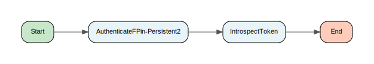

#### Process: TokenIntrospect

#### Process: AuthenticateFPinPersistent2

#### Process: MainProcess.2

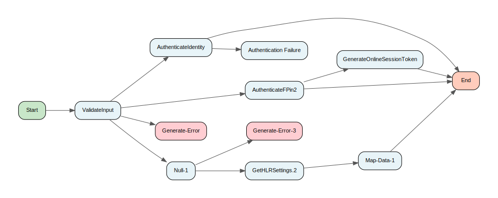

#### Process: ServiceLegacy

#### Process: GetBusinessResources

#### Process: SOAPServiceLegacy

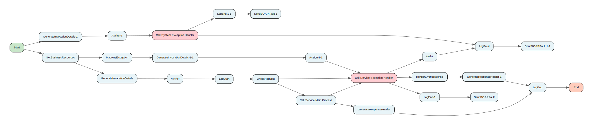

#### Process: GetBusinessResourcesLegacy

#### Process: Service

#### Process: SOAPService

#### Process: MainProcess

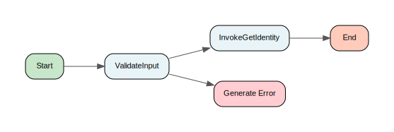

#### Process: MainProcessLegacy

#### Process: ParseSOAPResponse.2

#### Process: JMSSOAPClient.2

#### Process: JMSXMLClient

#### Process: ParseResponse

#### Process: DecryptFields

#### Process: DES3

#### Process: GetKey

#### Process: DecryptField

#### Process: ParseSOAPResponse

#### Process: JMSSOAPClient

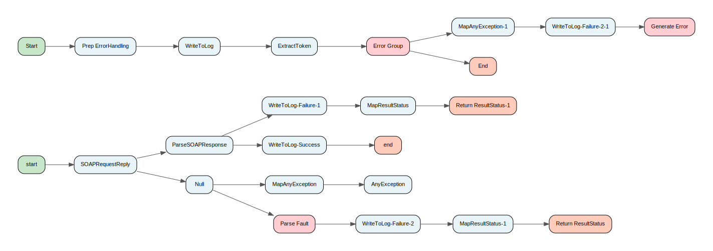

#### Process: GenerateResponseHeader

#### Process: GenerateInvocationDetails

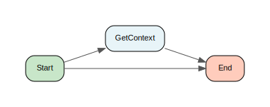

#### Process: CheckRequest

#### Process: PublishToRetryQueue

#### Process: GetSpecialExceptionList

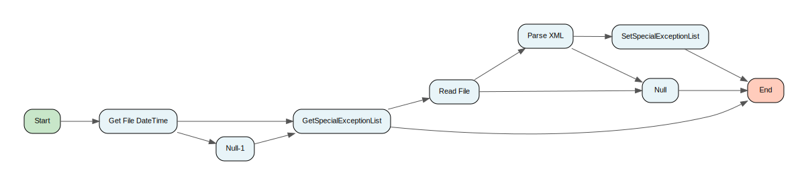

#### Process: TraceSpecialException

#### Process: SystemExceptionFilter

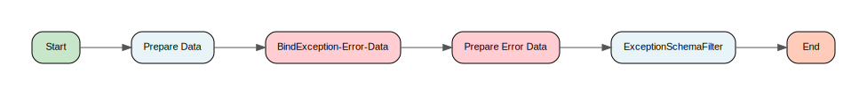

#### Process: CVV2Filter

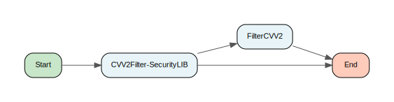

#### Process: ExceptionSchemaFilter

#### Process: CVV2Filter

#### Process: ServiceExceptionFilter

#### Process: MapAnyException

#### Process: MapLegacyException

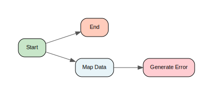

#### Process: MapException

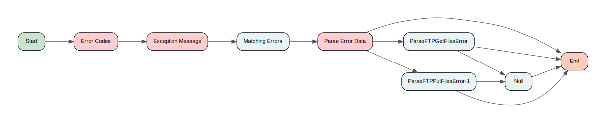

#### Process: MapResultStatus

#### Process: ServiceExceptionHandler

#### Process: SystemExceptionHandler

#### Process: WriteToLog

#### Process: CSAuditEnd

#### Process: CSAuditStart

#### Process: WriteToLog

#### Process: LogFatal

#### Process: LogStart

#### Process: LogEnd

#### Process: ValidateResource

#### Process: ExtractToken

#### Process: RequestRequiresToken

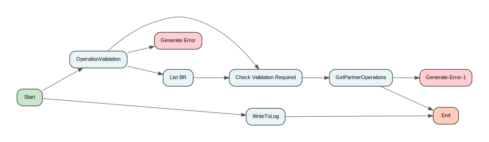

#### Process: CheckRequest

#### Process: ExtractSAMLToken

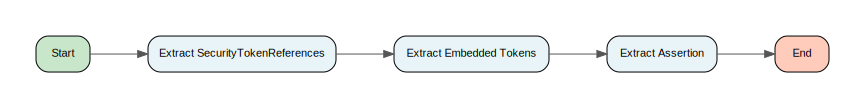

#### Process: ExtractOAuthToken

#### Process: ValidateResourceTemplate

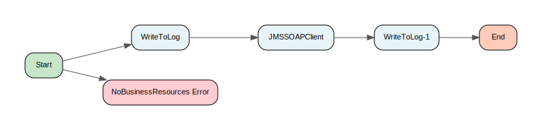

#### Process: UpdateAuditErrorCache

#### Process: SystemExceptionClient

#### Process: ServiceExceptionClient

#### Process: CustomServiceExceptionHandlerInterface

#### Process: AuditEvent

#### Process: UpdateAuditCache

#### Process: MapOIMException

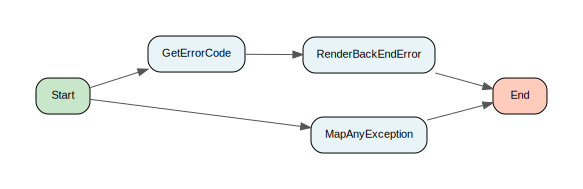

#### Process: GetIdentity

#### Process: MapOAMException

#### Process: GenerateOnlineSessionToken

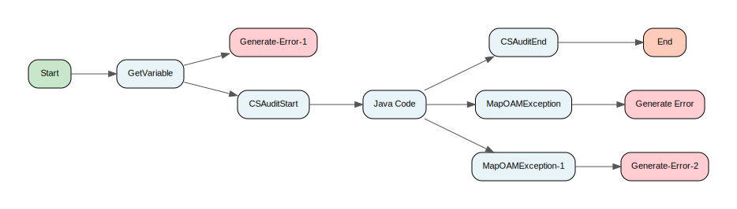

#### Process: AuthenticateIdentity

#### Process: PublishToTopic

#### Process: InvokeOnTopic

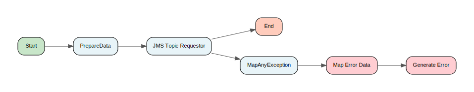

#### Process: PrepareData

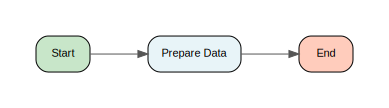

#### Process: PublishToTopic-Object

#### Process: InvokeOnTopic

#### Process: PublishToTopic

#### Process: InvokeOAGApi

#### Process: MapOAGException

#### Process: RenderBackEndError

